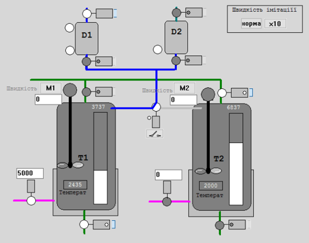

# Ємність з одним входом і одним виходом та підігрівом (smTankT)

## Короткий опис та призначення

Функціональний блок який імітує роботу датчиків рівня та температури для ємності з одним входом і одним виходом та подачею теплоносія в сорочку, яка в імітаційній моделі установки використовується як танки T1 та T2 (рис.1). 



рис.1. Зображення імітованої установки для перевірки роботи блоків PACFramework. 

На вході блока входять значення вхідної та вихідної витрат (в м3/с), витрата та температура теплоагента, температура вхідної речовини,  на виході формується значення рівня `L` в метрах, температура на виході `T` та додактові параметри - об'єм `V` та зосереджене значення температури в кожусі `Ta`. 

Детальний опис принципів імітації можна почитати [за цим посиланням](4_4_simul.md) 

## Реалізація в IEC-61131 

### ST 

```pascal
FUNCTION_BLOCK "smTankT"
   VAR_INPUT 
      INIT : Bool;   // команда ініціалізації (задання початкових умов)
      Fin : Real;   // вхідна витрата рідини, м3/с
      Fout : Real;   // вихідна витрата рідини, м3/с
      Fa : Real;   // витрата теплоагента, м3/с
      Tin : Real;   // вхідна температура, град C
      Tain : Real;   // температура теплоагента, град C
   END_VAR

   VAR_OUTPUT 
      L : Real;   // рівень рідини в ємності, м
      V : Real;   // об'єм рідини в ємності, м3
      T : Real;   // температура рідини в ємності, град С
      Ta : Real;   // температура теплоагента в кожусі, град С
   END_VAR

   VAR 
      K1 : Real;   // коефіцієнт 
      K2 : Real;   // коефіцієнт 
      Vold : Real;   // об'єм на попередньому кроці, м3
      S : Real;   // ефективна поверхня теплообміну кожуха з ємністю, м2/с
      d_t : Real := 0.1;   // періодичність виклику, с
      Vmax : Real := 10.0;   // об'єм ємності, м3
      Sv : Real := 1.0;   // поперечний переріз ємності, м2 
      V0 : Real := 0.0;   // початк. обєм рідини  в ємності, м3
      T0 : Real := 20.0;   // початк. темпеаратура рідини в ємності, м3
      Ta0 : Real := 20.0;   // початк. температура теплоносія в кожусі, град С
      Sa : Real := 10.0;   // повна поверхня теплообміну кожуха, м2
      C : Real := 4.19;   // теплоємність рідини, кДж/(кг*К)
      Ca : Real;   // теплоємність теплоносія, кДж/(кг*К)
      k : Real := 2.0;   // коефіцієнт теплопередачі, кВт/(м2*градС)
      ro : Real := 1000.0;   // густина рідини, кг*м3
      roa : Real := 1000.0;   // густина теплоносія, кг*м3
      Va : Real := 1.0;   // об'єм кожуха, м3
      La : Real := 1.0;   // висота кожуха, м
   END_VAR


BEGIN
	IF INIT THEN
	    V := V0; T := T0; Ta := Ta0;
	END_IF;
	(*-------розрахунок обєму*)
	Vold := V;
	V := V + d_t * (Fin - Fout);
	IF V < 0.0 THEN V := 0.0; END_IF;
	IF V > Vmax THEN V := Vmax; END_IF;
	L := V / Sv;
	(*--------розрахунок температур*)
	IF L > La THEN
	    S := (L / La) * Sa;
	ELSE
	    S := Sa;
	END_IF;
	K1 := k * S / (ro * C);
	K2 := k * S / (roa * Ca);
	IF V > Vmax / 1000.0 THEN (*обєм відмінний від нуля*)
	    IF V < Vmax THEN (*ємність не повна*)
	        T := T * (Vold / V) + (d_t / V) * (Fin * Tin + K1 * (Ta - T) - Fout * T);
	    ELSE (*ємність повна*)
	        T := T + (d_t / Vmax) * K1 * (Ta - T);
	    END_IF;
	    Ta := Ta + (d_t / Va) * (Fa * (Tain - Ta) - K2 * (Ta - T));
	ELSE (*порожня ємінсть*)
	    T := Tin;
	    Ta := Ta + (d_t / Va) * (Fa * (Tain - Ta));
	END_IF;
END_FUNCTION_BLOCK
```

