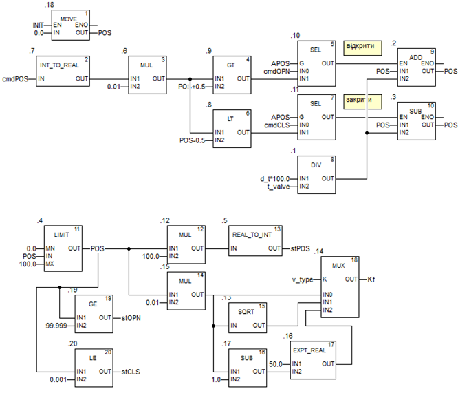

# Клапан/заслінка (smValve)

## Короткий опис та призначення

Функціональний блок який імітує роботу виконавчих механізмів (рис.1). 


рис.1. Зображення імітованої установки для перевірки роботи блоків PACFramework. 

На вході блока входять дискретні команди `cmdOPN` (відкрити) `cmdCLS` (закрити) та `cmdPOS`  - аналогове завдання для позиціонеру. Якщо параметр `APOS=TRUE` то використовується  `cmdPOS` , у іншому випадку - `cmdOPN` та `cmdCLS`. На виході клапану формується значення `Kf` - ступеню відкритості (від 0 до 1),  сигналізаторів положення `stOPN` та `stCLS` та значення позиціонеру  `stPOS` (0-10000). Для правильної роботи імітатора клапану необхідно задати його час повного ходу в секундах  `t_valve`    

Детальний опис принципів імітації можна почитати [за цим посиланням](4_4_simul.md) 

## Реалізація в IEC-61131 

### ST 

```pascal
FUNCTION_BLOCK "smValve"
   VAR_INPUT 
      INIT : Bool;   // ініціалізація
      cmdOPN : Bool;   // команда відкривати/більше
      cmdCLS : Bool;   // команда закривати/менше
      cmdPOS : Int;   // задане значення позиціонеру 0-10000
   END_VAR

   VAR_OUTPUT 
      stOPN : Bool;   // клапан відкритий
      stCLS : Bool;   // клапан закритий
      stPOS : Int;   // положення штока/заслінки 0-10000
      Kf : Real;   // коефіцієнт витрати від 0 до 1
   END_VAR

   VAR 
      POS : Real;   // положення штока/заслінки 0-100%
      d_t : Real := 0.1;   // періодичність виклику
      t_valve : Real := 10.0;   // час повного відкриття клапану/заслінки (с)
      APOS : Bool;   // TRUE - клапан з позиціонером, управління аналогове
      v_type : Int;   // хар-ка, 0- лінійна, 1-швидкого відкриття, 2-рівнопроцентна
   END_VAR

   VAR_TEMP 
      cmdPOSr : Real;
      dposr : Real;
   END_VAR

BEGIN
	IF INIT THEN POS := 0; END_IF;
	cmdPOSr := INT_TO_REAL(cmdPOS) * 0.01;
	dposr := d_t * 100.0 / t_valve;
	IF APOS THEN //аналогове керування
	    IF cmdPOSr > POS + 0.5 THEN
	        POS := POS + dposr;
	    ELSIF cmdPOSr < POS - 0.5 THEN
	        POS := POS - dposr;
	    END_IF;
	ELSE    
	    IF cmdOPN THEN
	        POS := POS + dposr;
	    ELSIF cmdCLS THEN
	        POS := POS - dposr;
	    END_IF;
	END_IF;
	IF POS > 100.0 THEN
	    POS := 100.0;
	ELSIF POS<0.0 THEN
	    POS := 0.0;
	END_IF;
	stOPN := POS > 99.999;
	stCLS := POS < 0.001;
	stPOS := REAL_TO_INT(POS * 100.0);
	CASE v_type OF
	    0:
	        Kf := POS * 0.01;
	    1:
	        Kf := SQRT(POS * 0.01);
	    ELSE:
	        Kf := POS * 0.01;
	END_CASE;
END_FUNCTION_BLOCK
```

### FBD/CFC 


