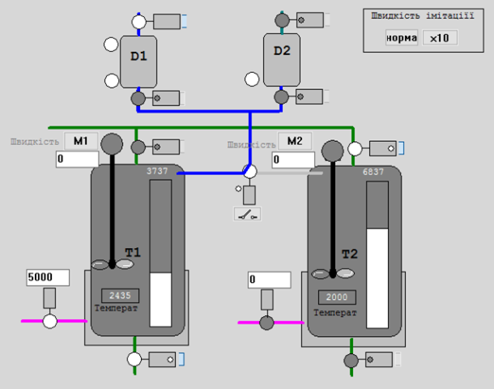
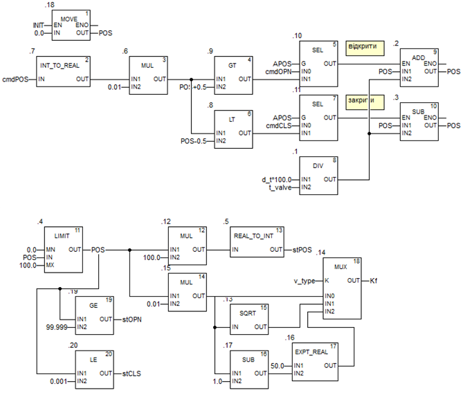

# Valve/Damper (smValve)

## Brief Description and Purpose

A function block that simulates the operation of actuators (Fig. 1).



Fig. 1. Image of the simulated installation for testing PACFramework blocks.

The block receives as inputs the discrete commands `cmdOPN` (open), `cmdCLS` (close), and `cmdPOS` – an analog setpoint for the positioner. If the parameter `APOS=TRUE`, `cmdPOS` is used; otherwise, `cmdOPN` and `cmdCLS` are used.

The block outputs the value `Kf` indicating the degree of opening (from 0 to 1), the position indicators `stOPN` and `stCLS`, and the positioner value `stPOS` (0–10000). For the valve simulator to operate correctly, it is necessary to set its full travel time in seconds using the parameter `t_valve`.

A detailed description of the simulation principles can be found at [this link](4_4_simul_EN.md) .

## Implementation in IEC-61131

### ST

```pascal
FUNCTION_BLOCK "smValve"

   VAR_INPUT 
      INIT : Bool;        // initialization
      cmdOPN : Bool;      // open/increase command
      cmdCLS : Bool;      // close/decrease command
      cmdPOS : Int;       // setpoint value for the positioner 0–10000
   END_VAR

   VAR_OUTPUT 
      stOPN : Bool;       // valve open
      stCLS : Bool;       // valve closed
      stPOS : Int;        // stem/damper position 0–10000
      Kf : Real;          // flow coefficient from 0 to 1
   END_VAR

   VAR 
      POS : Real;         // stem/damper position 0–100%
      d_t : Real := 0.1;             // call period
      t_valve : Real := 10.0;        // full travel time for valve/damper (s)
      APOS : Bool;                   // TRUE – valve with positioner, analog control
      v_type : Int;                  // characteristic: 0–linear, 1–quick opening, 2–equal percentage
   END_VAR

   VAR_TEMP 
      cmdPOSr : Real;
      dposr : Real;
   END_VAR

BEGIN
    IF INIT THEN POS := 0; END_IF;
    cmdPOSr := INT_TO_REAL(cmdPOS) * 0.01;
    dposr := d_t * 100.0 / t_valve;
    IF APOS THEN // analog control
        IF cmdPOSr > POS + 0.5 THEN
            POS := POS + dposr;
        ELSIF cmdPOSr < POS - 0.5 THEN
            POS := POS - dposr;
        END_IF;
    ELSE    
        IF cmdOPN THEN
            POS := POS + dposr;
        ELSIF cmdCLS THEN
            POS := POS - dposr;
        END_IF;
    END_IF;
    IF POS > 100.0 THEN
        POS := 100.0;
    ELSIF POS < 0.0 THEN
        POS := 0.0;
    END_IF;
    stOPN := POS > 99.999;
    stCLS := POS < 0.001;
    stPOS := REAL_TO_INT(POS * 100.0);
    CASE v_type OF
        0:
            Kf := POS * 0.01;
        1:
            Kf := SQRT(POS * 0.01);
        ELSE
            Kf := POS * 0.01;
    END_CASE;
END_FUNCTION_BLOCK
```

### FBD/CFC 


