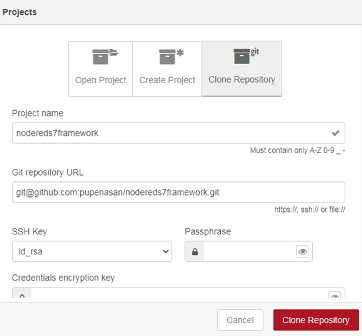
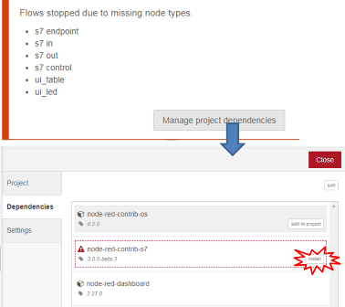

# PAC Framework IoT Gateway 

**PAC Framework IoT Gateway** - це проект виконавчої системи, розроблений в середовищі Node-RED, призначений для роботи сумісно з ПЛК, що базується на PAC Framework, задля виконання наступних функцій:

- забезпечення людино-машинного інтерфейсу з використанням WEB для налагодження системи керування, що виконана на PAC Framework
- функції IoT-шлюзу: збір, обробка, локальне збереження даних, взаємодія з хмарними застосунками та сховищами    

PAC Framework IoT Gateway може функціонувати на будь якому апаратному забезпеченні, де може бути розгорнутий Node-RED. Передбачається мультиагентність - взаємодія шлюзів між собою.   

Остання версія проекту Node-RED знаходиться в [репозиторії](https://github.com/pupenasan/PACFrameworkIoTGateway). 

## Послідовність розгортання системи на робочій станції розробки

- поставити Node-RED, у [цій методичці](https://github.com/pupenasan/ProgIngContrSystems/blob/master/%D0%9B%D0%B0%D0%B1%D0%BE%D1%80/lab1NodeRED.md) показано як
- поставити Git і активувати опцію проектів [у цій методичці](https://github.com/pupenasan/ProgIngContrSystems/blob/master/%D0%9B%D0%B0%D0%B1%D0%BE%D1%80/lab3Git.md) вказано як
- створити проект як клон `git@github.com:pupenasan/PACFrameworkIoTGateway.git`

- встановити необхідні компоненти

- 

## Послідовність розгортання системи на виконавчій системі

- to-do

