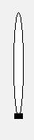

# Адаптація Meters до AI_VAR 

## Оригінальна версія Meter

У Citect SA **Meters** (вимірювачі) забезпечують графічне та числове відображення показань приладу. Опис їх роботи описаний в [довідці](file:///C:/Program%20Files%20(x86)/AVEVA%20Plant%20SCADA/Bin/Help/SCADA%20Help/Content/ASM_Meters.htm). Графічне представлення дозволяє візуально порівнювати PV з контрольними значеннями, такими як межі тривоги та/або налаштовані користувачем опорні значення (наприклад, «трекер» або оптимальний діапазон). Багато вимірювачів мають варіації, які дозволяють також використовувати їх для представлення регулятору. Ці варіації включають додаткові елементи, такі як вихід (OP) та індикатор зворотного зв’язку (FB).

### Equipment

Згідно довідки Meters пов’язані з обладнанням і вимагають означення таких елементів: 

| Елемент     | Опис                                                         | Тип     | IODevice |
| ----------- | ------------------------------------------------------------ | ------- | -------- |
| FB          | індикатор зворотного зв'язку (Feedback Indicator)            | REAL    | PLC      |
| OP          | вихідне значення (Output)                                    | REAL    | PLC      |
| PV          | плинне значення (Process Variable)                           | REAL    | PLC      |
| PVTarget    | плинне значення для Target meters                            | REAL    | PLC      |
| SP          | уставка                                                      | REAL    | PLC      |
| ORDsp       | відображати діапазон оптимального значення (Optimal Range Display) | DIGITAL | Internal |
| ORLow       | нижнє значення оптимального діапазону                        | REAL    | Internal |
| ORHigh      | верхнє значення оптимального діапазону                       | REAL    | Internal |
| PR          | практичний діапазон для вимірювачів відхилень Deviation Meter | REAL    | Internal |
| PRLow       | нижнє значення практичного діапазону (Practical Range)       | REAL    | Internal |
| PRHigh      | верхнє значення практичного діапазону                        | REAL    | Internal |
| PVTrack     | значення PV для стеження (Tracker)                           | REAL    | Internal |
| OPTrack     | значення OP для стеження                                     | REAL    | Internal |
| TrackDsp    | відображати трекер                                           | DIGITAL | Internal |
| FullScale   | команда на відображення індикації повного діапазону ("вусики"), кнопка `FS` на лицьовій панелі | DIGITAL | Internal |
| EqStatus    | значення для [індикатору статусу](cm_common.md) визначається функцією | INT     | Cicode   |
| RunStatus   | значення для [Індикатор стану роботи обладнання](cm_common.md) | INT     | Internal |
| CtrlMode    | код що показує режим регулятору: 0 – Auto (A); 1 – Manual (M); 2 – Cascade (C); 3 – Local (L); 4 – Special control (computer symbol) | INT     | Internal |
| CtrlModeDef | режим регулятору за замовченням (без відображення): 0 – Auto (A); 1 – Manual (M); 2 – Cascade (C); 3 – Local (L); 4 – Special control (computer symbol) | INT     | Internal |
| Timer       | заданий час таймеру, що показує як давно було виміряне значення | INT     | PLC      |
| TimerExp    | скоро прийде час відбору проби (для [індикатору статусу](cm_common.md)) | DIGITAL | PLC      |
| Offscale    | значення за межами масштабу (для [індикатору статусу](cm_common.md)) | DIGITAL | PLC      |
| Offspec     | невідповідність лаб. даним Off-spec lab data  (для [індикатору статусу](cm_common.md)) | DIGITAL | PLC      |
| Tracking    | режим стеження регулятору (для [індикатору статусу](cm_common.md)) | DIGITAL | PLC      |
| OOS         | Out of service якось впливає на [Індикатор стану роботи обладнання](cm_common.md) | DIGITAL | PLC      |
| OOSDisable  | заборона зміни OOS впливає на [Індикатор стану роботи обладнання](cm_common.md)) | DIGITAL | PLC      |
| Sim         | режим імітації (для [індикатору статусу](cm_common.md))      | DIGITAL | PLC      |
| Calib       | режим калібрування (для [індикатору статусу](cm_common.md))  | DIGITAL | PLC      |
| Init        | режим ініціалізування регулятору (для [індикатору статусу](cm_common.md)) | DIGITAL | PLC      |
| Dev         | deviation??? (для [індикатору статусу](cm_common.md))        | DIGITAL | PLC      |
| Clamped     | Clamped??? (для [індикатору статусу](cm_common.md))          | DIGITAL | PLC      |
| ManCMD      | Команда переключення в ручний                                | DIGITAL | PLC      |
| AutoCMD     | Команда переключення в автомат                               | DIGITAL | PLC      |
| CasCMD      | Команда переключення в каскад                                | DIGITAL | PLC      |

### Композитні джини

Об’єкти вимірювача, доступні в бібліотеці Situational Awareness, включають:

- Analyzer
- Deviation
- Dual Level
- Flow
- Level
- Miscellaneous
- Pressure
- Target
- Temperature

Для більшості вимірювачів передбачено кілька орієнтацій, щоб надати розробникам сторінок гнучкість у тому, як викладена графіка.

**Дзеркально** 

    

**Горизонтально**

    

**Горизонтально + дзеркально**

    

#### Загальні елементи

На малюнку нижче показаний приклад елементів, з яких складається метр.

    

##### Графічний символ вимірювача та PV

Значення PV береться з `EquipmentName.PV` або `EquipmentName.PVTarget` для Target meters. Зовнішній вигляд символу вимірювача та PV повідомляє операторам, який тип показань відображається (витрата чи  температура чи тиск тощо). Наприклад, витратоміри представлені як базова форма «палиці» з чорною крапкою що показує PV. Вимірювача температури нагадує термометр. Рівнеміри нагадують (тонку) посудину з заливкою, яка піднімається і опускається, щоб відобразити рівень, і так далі. Символи та PV для кожного типу вимірювачів показано на наступному рисунку.

| Analyzer Meter                              | Deviation Meter                              | Flow Meter                       | Level Meter                              | Misc Meter                              | Pressure Meter                       | Target Meter                              | Temperature Meter                |
| ------------------------------------------- | -------------------------------------------- | -------------------------------- | ---------------------------------------- | --------------------------------------- | ------------------------------------ | ----------------------------------------- | -------------------------------- |
|  |  |  |  |  |  |  |  |

Інженерні одиниці беруться з поля `eng units`  тега елементу `EquipmentName.PV` (eng units field).

Числовий PV забезпечує текстове представлення показань приладу. Це надає операторам точні значення, коли це необхідно.

##### Індикатори діапазону

Кожен вимірювач дозволяє встановити «нормальний» робочий діапазон («практичний» діапазон). Під час більшості робочих ситуацій повний діапазон вимірювача набагато більше, ніж фактична область інтересу. Встановивши нормальний робочий діапазон, ви можете побачити значущі зміни в PV, дивлячись на вимірювач. Елементи `EquipmentName.PRHigh` та `EquipmentName.PRLow` задають верхню та нижню межу практичного діапазону.  Пункт `EquipmentName.PR` застосовний до вимірювачів відхилень. PRHigh і PRLow не застосовуються до цих вимірювачів (Deviation Meter).

Якщо PV виходить за межі нормального робочого діапазону, шкала вимірювача автоматично зміниться, щоб відобразити весь діапазон приладу. Щоб розрізнити вимірювач, який показує весь діапазон, у верхній та нижній частині нього з’являються додаткові прапорці, а колір лінії символу вимірювача змінюється з сірого на чорний, як у прикладі нижче:

    

Значення меж можна виставити при старті функцією Cicode.  

##### Межі тривог

На символі вимірювача  з’являються індикатори ліміту тривоги, щоб показати розташування будь-яких налаштованих меж тривоги. Це дозволяє операторам бачити, коли PV наближається до межі тривоги. Чотири типи меж тривоги відображаються різними символами.

| Символ межі                              | Тип межі тривоги      |
| ---------------------------------------- | --------------------- |
|          | High high alarm limit |
|     | High alarm limit      |
|    | Low alarm limit       |
|  | Low Low alarm limit   |

Індикатор ліміту тривоги не з’явиться, якщо відповідне обмеження тривоги не налаштовано для приладу або якщо межа виходить за межі діапазону, показаного вимірювачем. 

Дані композитні джини та передні панелі, які відображають вимірювачі, підтримують два режими відображення меж:

- Межі тегів аналогової тривоги (за замовчуванням): одна аналогова тривога, що означує всі межі. У цьому випадку об’єкти вимірювача автоматично отримають значення HighHigh, High, Low і LowLow з відповідного аналогового  `EquipmentName.PV` тега тривоги.
- Межі тривоги на основі тегів ПЛК: окремі теги вводу/виводу для означення кожної межі; може бути означено до 14 меж, але існуючий об’єкт Meter підтримує відображення лише 4 меж. 

Якщо необхідно змінити спосіб відображення меж за замовченням треба встановити параметр в значення `[SA_Library.Meter]UseDefaultPLCLimits=TRUE`, який буде вказувати що значення тривоги беруться з елементів обладнання. При цьому перелік імен елементів буде братися з іншого параметру `[SA_Library.Meter]PLCLimitNames`, де назви елементів наводяться через кому, наприклад: 

Мітки для кожного елементу задаються параметром `[SA_Library.Meter]PLCLimitLabels`, наприклад:

Послідовність назв і кількість повинні співпадати для параметрів PLCLimitNames і PLCLimitLabels.

Перелік та послідовність відображення міток за замовченням визначається параметром `[SA_Library.Meter]DefaultPLCLimits`, де переліком цифр від 0 до `n` означується послідовність відображення лімітів. Можна змінити поведінку цього параметру для конкретного обладнання додавши параметр `PLCLimits` в Equipment Runtime Parameters, та вказавши які межі необхідно відображати .  Наприклад, якщо потрібні тільки H та HH, то це матиме вигляд.                        

                    

Значення -1 вказується для тих меж, які не потрібно відображати. Якщо відображення межі повинно залежати від змінної ПЛК, в полі `IsTag` треба виставити TRUE, а в полі `Value` відповідне значення тега, який вказує на цей перелік меж. 

##### Відображувальне ім'я/Nickname

Відображуване ім’я/псевдонім показує назву вимірювача (за замовчуванням) або, якщо введено користувачем, «відображаючу назву». Псевдонім зазвичай використовується, щоб допомогти ідентифікувати показання (наприклад, «Температура масла» замість «TI1001»). Поле вміщує до 79 символів.

    

##### Прямокутник оптимального діапазону

Оператор може візуально виділити прямокутником оптимальний за певних умов діапазон вимірювальної величини. Для цього він задає нижню (`EquipmentName.ORLow`) та верхню (`EquipmentName.ORHigh`) оптимальну межу та може включати/відключати відображення оптимального значення зміною `EquipmentName.ORDsp`.

Значення меж можна виставити при старті функцією Cicode.  

    

**Tracker**

Connects to: `EquipmentName.PVTrack`, `EquipmentName.OPTrack`, `EquipmentName.TrackDsp`.

Трекер - це конкретне задане оператором значення , яке він хоче відмітити на шкалі для того щоб відслідковувати зміни відносно нього. Для PV це значення `EquipmentName.PVTrack`, для OP (вихід) це `EquipmentName.OPTrack`, для керування відображенням треку використовується елемент `EquipmentName.TrackDsp`. 

    

####  Індикатори регуляторів (Control Meters)

Коли необхідно відображати показання з регулятору, окрім описаних вище елементів на панелях відображаються додаткові:

    

**Setpoint Indicator** - уставка, яка показує положення заданого значення регулятору `EquipmentName.SP`

**Output Indicator** - вихід з регулятору в діапазоні 0-100% `EquipmentName.OP`

**Feedback Indicator** - зворотній зв'язок від ВМ `EquipmentName.FB`

**Mode Indicator** - символ режиму роботи регулятору `EquipmentName.CtrlMode`: 0 – Auto (A); 1 – Manual (M); 2 – Cascade (C); 3 – Local (L); 4 – Special control (computer symbol). Якщо `EquipmentName.CtrlMode` дорівнює значенню режиму за замовчуванням `EquipmentName.CtrlModeDef`, то він не відображається. Щоб символ регулятору відображався в усіх режимах можна видалити елемент `CtrlModeDef` з шаблону обладнання.

    

#### Спеціальні елементи

**Differential Indicator** - для відображення диференційних показань використовується символ дельта (Δ). Це виставляється опцією в налаштуваннях композитного джина (Display Differential Indicator) 

    

**Descriptor** - додаткова інформація про тип показання, наприклад для аналізаторів O2” для вмісту кисню, “SG” для густини, «Vis» для в’язкості, «Trq» для крутного моменту тощо. Можна вказати в налаштуваннях композитного джина для вимірювачів типу Miscellaneous, Deviation та Analyzer.

    

**Clock Timer** -  інтегрований з вимірювальними приладами Analyzer, показує різницю між останньою відміткою часу та уставкою `EquipmentName.Timer`. Його можна використовувати в тих випадках, коли аналізатор показує показання що отримуються відбором проб.  Для цих типів показань таймер показує, як давно значення було оновлено, що допомагає операторам зрозуміти, наскільки свіже значення. Якщо зчитування відбувається безперервно, таймер не відображається. 

Додатково може використовуватися біт-елемент `EquipmentName.TimerEXP` для сигналізування що час скоро завершиться (відповідне використання індикатору статусу).  

    

#### Тренди

В налаштуваннях композитного джина можна відобразити тренд, виставивши опцію `Display Trend` та вибравши тип тренду Trend Type.

Тип **Trend Tail** показує тільки лінію графіку PV на тренді. 

​                            

Тип **Full Trend** окрім плинного значення PV показує значення меж тривог, задане значення SP та значення трекеру. Також в налаштуваннях задається глибина відображення.

​                            

### Асоційовані лицьові панелі

**Analog Indicator**

**Analog Controller**

   

## Адаптація PACFramework 

Існуючий тип `Meter` адаптується до `MeterPFW`

### Перелік елементів типу обладнання MeterPFW (адаптація AIVAR_HMI)

| Елемент     | Опис                                                         | Тип     | IODevice | Примітка                                                     |
| ----------- | ------------------------------------------------------------ | ------- | -------- | ------------------------------------------------------------ |
| STA         | біти стану                                                   | INT     | PLC      | AIVAR_HMI.STA                                                |
| VALPRCSTA2  | значення у % від шкали вимірювання (0-10000) + додаткові біти статусу | INT     | PLC      | AIVAR_HMI.VALPRCSTA2                                         |
| FB          | індикатор зворотного зв'язку (Feedback Indicator)            | REAL    | PLC      | ?                                                            |
| OP          | вихідне значення (Output)                                    | REAL    | PLC      | ?                                                            |
| PV          | плинне значення (Process Variable)                           | REAL    | PLC      | AIVAR_HMI.VAL                                                |
| PVTarget    | плинне значення для Target meters                            | REAL    | PLC      | ?                                                            |
| SP          | уставка                                                      | REAL    | PLC      | ?                                                            |
| ORDsp       | відображати діапазон оптимального значення (Optimal Range Display) | DIGITAL | Internal | без змін                                                     |
| ORLow       | нижнє значення оптимального діапазону                        | REAL    | Internal | без змін                                                     |
| ORHigh      | верхнє значення оптимального діапазону                       | REAL    | Internal | без змін                                                     |
| PR          | практичний діапазон для вимірювачів відхилень Deviation Meter | REAL    | Internal | без змін                                                     |
| PRLow       | нижнє значення практичного діапазону (Practical Range)       | REAL    | Internal | без змін                                                     |
| PRHigh      | верхнє значення практичного діапазону                        | REAL    | Internal | без змін                                                     |
| PVTrack     | значення PV для стеження (Tracker)                           | REAL    | Internal | без змін                                                     |
| OPTrack     | значення OP для стеження                                     | REAL    | Internal | без змін                                                     |
| TrackDsp    | відображати трекер                                           | DIGITAL | Internal | без змін                                                     |
| FullScale   | відображення індикації повного діапазону ("вусики")          | DIGITAL | Internal | без змін                                                     |
| EqStatus    | значення для [індикатору статусу](cm_common.md) визначається функцією | INT     | Cicode   | без змін                                                     |
| RunStatus   | значення для [Індикатор стану роботи обладнання](cm_common.md) | INT     | Internal | без змін                                                     |
| CtrlMode    | код що показує режим регулятору: 0 – Auto (A); 1 – Manual (M); 2 – Cascade (C); 3 – Local (L); 4 – Special control (computer symbol) | INT     | Cicode   | IODevice змінено на Cicode,                                  |
| CtrlModeDef | режим регулятору за замовченням (без відображення): 0 – Auto (A); 1 – Manual (M); 2 – Cascade (C); 3 – Local (L); 4 – Special control (computer symbol) | INT     | Cicode   | ?                                                            |
| Timer       | заданий час таймеру, що показує як давно було виміряне значення | INT     | Internal | IODevice змінено на Internal, не використовується в базовій версії PACFramework |
| TimerExp    | скоро прийде час відбору проби (для [індикатору статусу](cm_common.md)) | DIGITAL | Internal | IODevice змінено на Internal, не використовується в базовій версії PACFramework |
| Offscale    | значення за межами масштабу (для [індикатору статусу](cm_common.md)) | DIGITAL | PLC      |                                                              |
| Offspec     | невідповідність лаб. даним Off-spec lab data  (для [індикатору статусу](cm_common.md)) | DIGITAL | Internal | IODevice змінено на Internal, не використовується в базовій версії PACFramework |
| Tracking    | режим стеження регулятору (для [індикатору статусу](cm_common.md)) | DIGITAL | PLC      | ?                                                            |
| OOS         | Out of service якось??? впливає на [Індикатор стану роботи обладнання](cm_common.md) | DIGITAL | PLC      |                                                              |
| OOSDisable  | Out of service disable якось??? впливає на [Індикатор стану роботи обладнання](cm_common.md)) | DIGITAL | PLC      |                                                              |
| Sim         | режим імітації (для [індикатору статусу](cm_common.md))      | DIGITAL | PLC      |                                                              |
| Calib       | режим калібрування (для [індикатору статусу](cm_common.md))  | DIGITAL | PLC      |                                                              |
| Init        | режим ініціалізування регулятору (для [індикатору статусу](cm_common.md)) | DIGITAL | PLC      |                                                              |
| Dev         | deviation??? (для [індикатору статусу](cm_common.md))        | DIGITAL | PLC      |                                                              |
| Clamped     | Clamped??? (для [індикатору статусу](cm_common.md))          | DIGITAL | PLC      |                                                              |
| ManCMD      | Команда переключення в ручний                                | DIGITAL | Internal | IODevice змінено на Internal,                                |
| AutoCMD     | Команда переключення в автомат                               | DIGITAL | Internal |                                                              |
| CasCMD      | Команда переключення в каскад                                | DIGITAL | Internal |                                                              |
|             |                                                              |         |          |                                                              |