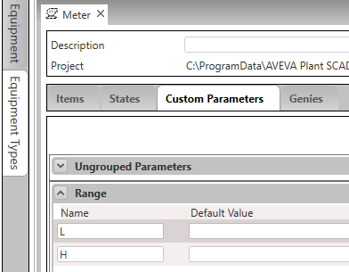

# Загальні властивості та налаштування Citect SA   

Бібліотечні компоненти в Citect SA представлені через композитні джини, обладнання (Equipment) відповідних типів та різноманітних налаштувань.

## Загальні елементи об'єктів в оригінальному Citect SA Starter Project  

Опис загальних елементів об'єктів SA наведений в [довідковій системі](file:///C:/Program%20Files%20(x86)/AVEVA%20Plant%20SCADA/Bin/Help/SCADA%20Help/Content/ASM_Common_Object_Elements.htm). Об’єкти в бібліотеці Situational Awareness поділяють набір властивостей і поведінки, які є спільними для об’єктів.

            

До них входять:

- Alarm indicator (Індикатор тривоги) 

- Status indicator (Індикатор статусу) 
- Output bar (стовпчик вихідного значення)
- Equipment Running State Indicators (індикатори стану роботи обладнання)

Будь-які винятки з властивостей зазначаються в описах окремих об’єктів.

### Використання індикатору тривоги

Індикатори тривоги складаються з рамки та прапорця, які з’являються навколо екстенту групи об’єктів або Джина. 

            

**Alarm border** - рамка тривоги коли вона виникає

**Alarm flag** - прапорець тривоги надає додаткову інформацію про тривогу кольором, формою, кодом, які можуть вказувати пріоритет тривоги або тип тривоги. У наведеному нижче прикладі показано коди форми, кольору та прапорців, які використовуються для позначення аварійних тривог, тривог високого та низького пріоритету в проекті, створеному на основі проекту Situational Awareness Starter Project. 

​            

Можна налаштувати власні прапорці та кольори тривог для різних пріоритетів.  


Прапорець тривоги можна розташувати в різних місцях навколо межі тривоги об’єкта. 


### Використання індикатору статусу 

Індикатор статусу використовується для представлення різних умов, не пов’язаних з тривогою, таких як ненормальна якість даних або стан системи керування. 

            

Індикатор стану є окремим джином і використовується для представлення різних станів об’єкта. Цей стан означується значенням елементу обладнання `EquipmentName.EqStatus` в цілому форматі. Символи індикаторів стану можна знайти в проекті `SA_Library` у бібліотеці, яка називається `sa_status_indicator`. Значення індикаторів стану наведені нижче. 

|                          Символ                          | Стан                                                     | Значення |
| :------------------------------------------------------: | -------------------------------------------------------- | :------: |
|         | Погані дані                                              |    2     |
|         | Невизначені дані або недійсний стан автоматизації        |    1     |
|          | Режим імітації - примусове приведення значення до точки. |    4     |
|               | За межами масштабу                                       |    12    |
|            | Заблоковано                                              |    6     |
|     | Байпас блокування                                        |    5     |
|                 | Пауза                                                    |    19    |
|             | Поганий зв'язок між IO Server та Client                  |    13    |
|               | Стеження (Tracking)                                      |    20    |
|               | Clamped (скріплений)                                     |    21    |
|          | Невідповідні лабораторні дані.                           |    7     |
|            | Технічне обслуговування.                                 |    8     |
|          | Повідомлення.                                            |    9     |
|       | Необхідно перезавантажити машину.                        |    11    |
|  | Ручне ініціалізування регулятору or index car.           |    3     |
|           | Таймер скоро закінчиться                                 |    10    |
|         | Calibrate mode. Used to calibrate instruments.           |    16    |
|           | Bad Communication between Gateway and PLC.               |    14    |
|              | Deviation                                                |    15    |
|              | Reminder to call outside personnel                       |    17    |

Таким чином в один момент часу тільки один індикатор може відображатися. У сценаріях, де кілька станів можуть бути активними одночасно, є порядок пріоритету щодо того, який індикатор буде відображатися. Наприклад, PID-регулятор, який перебуває в режимі ініціалізації, але також має імітований PV, відображатиме індикатор «S», навіть якщо також була активна умова блокування. Наступна діаграма показує порядок пріоритетності:

     

Індикатори стану можна налаштувати для більшості об’єктів бібліотеки, за винятком NumericInput і TextInput. Вище надані приклади лише для приводів, вимірювачів та клапанів.

Ви можете налаштувати обладнання для використання індикаторів стану одним із двох способів:

1) Безпосередньою зміною `EqStatus` 
1) Використовуючи функцію як елемент Cicode-драйверу. У шаблоні предбачено спеціальне поле `EqStatusFunc` в параметрах Equipment Editor, у якому для кожного обладнання можна вказати свою функцію, яка буде повертати необхідне числове значення.  


Початковий проект `SA_Style_1_MultiRes` містить приклад (`Indicators.ci`) того, як налаштувати обладнання за допомогою зразкових функцій для виклику одного з індикаторів. Варіанти функцій індикатора стану обладнання були передбачені лише для вимірювачів, клапанів і приводів.

### Стовпчик вихідного значення Output (OP) Bar 

Output (OP) Bar забезпечує візуальне представлення поточного виходу обладнання. Її можна використовувати з кількома типами об’єктів (регуляторами, приводами зі змінною швидкістю та регулюючими клапанами). Інформація, що відображається стовпчиком OP, може бути представлена у вигляді двох значень:

- Output (Вихід) — значення, встановлене для виходу, який є елементом `EquipmentName.OP`
- Actual output (Фактичний вихід) — поточне вихідне значення, яке вказується індикатором положення (також званим індикатором зворотного зв'язку), який є елементом `EquipmentName.FB`.

Вихід представлений стовпчиком OP, а фактичний вихід представлений індикатором зворотного зв'язку.

            


Зовнішній прямокутник представляє весь діапазон виводу, від низького значення шкали (параметр обєкта `L`) до високого значення шкали (параметр об'єкта `H`) наприклад, 0-100%).



Для представлення значення OP використовуються наступні кольори:

- Білий колір означає 0% (або найменше значення шкали)
- Чорний означає 100% (або високе значення шкали)
- Сірий відображає всі вихідні значення між ними.

     

У разі клапанів ВМ клапана залишиться сірим, але стовпчик OP зміниться на чорний, коли OP досягне 100%.

Індикатор FB — це невеликий заповнений трикутник, який використовується для показу:

- Фактичний вихід (для регуляторів)
- Швидкість (для приводів зі змінною швидкістю)
- Позиція (для клапанів).

Якщо ця інформація недоступна з системи керування, індикатор FB не відображається.

Індикатор зворотного зчитування відображає такі кольори:

- Білий на 0% (або мінімум)
- Чорний на 100% (або максимум)
- Сірий для всіх значень між ними.

     

У діалоговому вікні «Presentation Options» для вимірювачів, приводів і клапанів можна вказати стовпчик OP, але поведінка однакова у всіх випадках. Наведені нижче приклади демонструють позиціонування OP-стовпчика на контрольному вимірювачі, регулюючому клапані та насосі VSD.

            


### Індикатор стану роботи обладнання 

Equipment Running State Indicators – це компактний індикатор, який можна використовувати для представлення різноманітних станів приводних об’єктів та деяких типів клапанів. Ці стани можуть включати стан роботи, напрямок, блокування, тривогу тощо. Стан роботи обладнання відображається як елемент `EquipmentName.RunStatus` . Можна використовувати індикатор стану роботи для одного обладнання або групи до п'ятьох обладнань.   

            

Можна представити групу до п’яти насосів, використовуючи один символ насоса та чотири індикатори робочого стану обладнання.

     

При використанні із символом, що представляє групу приводів, індикатор стану роботи обладнання відображатиме виникнення будь-яких тривог на окремому приводі в групі. Стан тривоги позначається рамкою всередині індикатора стану роботи обладнання, завдяки чому статус привода залишається видимим. Стан тривоги для основного об’єкта буде відображати тривогу найвищого пріоритету на будь-якому з окремих приводів.

     

Якщо доступний простір на екрані обмежений, можна використовувати компактні приводи. Замість відображення квадратного поля індикатора робочого стану обладнання під символом, круглий індикатор стану роботи обладнання розміщується всередині символу.

     

Індикатор стану роботи обладнання не має межі навколо нього. Якщо командний та фактичний стани збігаються, коло індикатора стану роботи обладнання зливається із заливкою символу.

Для клапанів символи індикатора стану роботи обладнання відображаються в символі ВМ клапана замість окремого поля.

     

Відображаються наступні символи в залежності від значення `EquipmentName.RunStatus` 

| Equipment Running State | Symbol                                                       | Description                                                  |
| ----------------------- | :----------------------------------------------------------- | ------------------------------------------------------------ |
| 0                       |                       | Default                                                      |
| 1                       |                      | Mnemonic                                                     |
| 2                       |                  | Mnemonic Out of Service - set manually                       |
| 3                       |                  | Out To Maintenance / Out Of Service / LOTO (Unavailable)     |
| 4                       |       | Off / Closed and Selected Out of Service by upstream equipment |
| 5                       |                   | Off / Stopped and available (Drives) Fully closed (Valves)   |
| 6                       |         | Drive running as standby drive in a duty standby arrangement |
| 7                       |         | Running Forward (Single Speed Drive)  Running Forward Slow Speed (Dual Speed Drive) Valve Open (MOV) Valve stopped midway (complex MOV) |
| 8                       |         | Running Reverse (Single Speed Drive) Running Reverse Slow Speed (Dual Speed Drive) |
| 9                       |       | Running Forward at Full Speed (Dual Speed Drives) Valve Fully Open |
| 10                      |       | Running reverse at Full Speed (Dual Speed Drives)            |
| 11                      |            | Interlock bypassed and off/stopped/closed                    |
| 12                      |                 | Interlocked and off/stopped/closed                           |
| 13                      |         | Interlock bypassed and on/running/open                       |
| 14                      |                  | Interlocked and on/running/open                              |
| 15                      |  | Running Forward at Full Speed (Dual Speed Drives) with an Interlock Bypass Active. |
| 16                      |          | Fully Open and Interlocked (Fail Open Valves).               |
| 17                      |            | State changing from Stopped to Running (Single speed Drive) 	State changing from Stopped to Running Slow (Dual speed Drive) 	Valve requested to open but still at closed limit |
| 18                      |               | State changing from Running Slow to Running Fast (Dual Speed Drive) 	Valve requested to open and has left the closed limit |
| 19                      |            | State changing from Running to Stopped (Single Speed Drive) 	State changing from Running Slow to Stopped (Dual Speed Drive) 	Valve requested to close and has left the open limit |
| 20                      |               | State changing from Running Fast to Running Slow (Dual Speed Drive) 	Valve requested to close but still at open limit |
| 21                      |                 | Startup Warning Siren                                        |
| 22                      |         | Interlocked by a sequence and not running                    |
| 23                      |         | On / Open and Out to Maintenance / Out of Service            |
| 24                      |          | Off / Closed and Selected Out of Service by upstream equipment |

`EquipmentName.OOS` і `EquipmentName.OOSDisabled` — це цифрові теги, які означують значення стану обладнання.

### Індикатор режиму та команди переключення режиму

Усі композитні джини передбачають індикатор режиму та команди керування режимом. Нижче наведено кілька прикладів (вимірювач з регулятором, клапан та насос) які відображають індикатор режиму у вигляді літери.  


Перелік можливих режимів залежить від типу обладнання. У будь кому випадку за режим відповідає елемент `EquipmentName.CtrlMode`, в якому очікуються наступні значення з відповідним символом:

- 0 – Auto (A); 
- 1 – Manual (M); 
- 2 – Cascade (C); 
- 3 – Local (L); 
- 4 – Special control (computer symbol) 

 Значення `EquipmentName.CtrlModeDef` вміщує значення за замовченням. Якщо  `EquipmentName.CtrlMode=EquipmentName.CtrlModeDef` значок режиму не відображатиметься.

Переключення режиму відбувається через відповідну лицьову панель (`Faceplate`), наприклад таку:

 

Лицьові панелі розроблені з можливістю керування режимом. Для цього використовуються відповідні елементи обладнання типу DIGITAL: `ManCMD`, `AutoCMD`, `CasCMD`. Коли команда виставляється в 1, загорається кружечок на відповідній кнопці. Темний колір кнопки вказує на активність конкретного режиму. 

### Команди керування

Окрім команд переключення режиму, обладнання що відповідає за виконавчі механізми містить також команди керування. Перелік команд залежить від типу обладнання. У будь якому випадку вони очікуються на відповідних лицьових панелях через кнопки. Кнопка змінює значення команди і підсвічує відповідний стан.  На рисунку показаний приклад лицьової панелі для керування насосом.


## Оригінальні параметри обладнання Citect SA

Параметри обладнання використовуються для його налаштування. Перелік залежить від типу обладнання. 

| Параметр                    | Опис                                                         |      |
| --------------------------- | ------------------------------------------------------------ | ---- |
| InternalIODevice            | Назва внутрішнього пристрою                                  |      |
| CicodeIODevice              | Назва Cicode пристрою                                        |      |
| EqStatusFunc                | Назва функції Cicode, необхідної для оцінки значення індикатора стану. |      |
| CtrlMode                    | режиму керування                                             |      |
| CtrlModeDef                 | режим керування за замовченням                               |      |
| Range: L, H                 | нижня (Eng Zero) та верхня (Eng Full) межа для тега          |      |
| Alarm Limits:  L, LL, H, HH | межі для аналогової тривоги                                  |      |
| Feeder Gate: L, H           | межі для висоти воріт (тільки для Feeder Gate)               |      |
| WindSpeedRange: L, H        | межі для швидкості вірту (тільки для Wind Compass)           |      |
| SwitchPosition:??           | межі для (тільки для Handswitch Selector)                    |      |


## Механізми адресації змінних тегів в Citect прийняті в PACframework при роботі з драйвером Modbus 

Структури даних в об'єктах PACframework можуть мати багато полів. Для задавання значень адрес в обладнанні Citect для Modbus (зрештою і для інших драйверів з чсиловою адресацією) це вимагає рутинної роботи щодо їх заповнення в екземплярах. Тому в PACframework прийнято для кожного обладнання задавати тільки початкову адресу, інші вказуються як зміщенні в означенні типу. Це робиться через XML-файл з означенням параметрів обладнання типу `calculator`. У секції `input` XML-файлу для типу обладнання в Citect вказуються усі варіанти зміщення в адресі, починаючи з 0-го і до n (AD0..ADn). При цьому початкова адреса задаватиметься в `equipment.custom1`. Таким чином `AD0` буде числом що вказує на 0-ве зміщення відносно заданого в  `equipment.custom1`, а  `ADn` на адресу  `equipment.custom1+m`.      

```xml
<input name="equipment" file="equip.dbf" desc="Equipment Database">
    ...
    <calculator name="AD0">{equipment.custom1}+0</calculator>
    <calculator name="AD1">{equipment.custom1}+1</calculator>
    <calculator name="AD2">{equipment.custom1}+2</calculator>
   ...
</input>    
```

Приклад використання цих параметрів обладнання при означенні адрес показаний на рисунку нижче. Частина адреси задається як символи а інша - як значення параметру з урахуванням зміщення `AD0` - `ADn`


## Параметр ID для обладнання що представляють обєкти класів PACframework 

Кожен об'єкт класу PACframework що доступний в Citect реалізується через механізм обладнання (Equipment). Для самоідентифікування об'єктів класів, обладнання включають ідентифікатор ID як параметр обладнання, який треба вказати при створенні екземпляру. За необхідності можна також включати CLSID.

   

## Елементи обєктів Citect як конфігураційні параметри об'єктів PACframework 

Згідно концепції PACframework конфігураційні параметри не передаються з PLC в SCADA/HMI постійно, а тільки за необхідності налаштування. Таким чином обмін конфігураційними параметрами відбувається через буфер. Детально про це можна прочитати [тут](../../base/1_3_equip.md). У той же час ряд об'єктів Citect SA передбачають відображення та архівування в трендах цих параметрів. Для збереження подібного функціоналу виникає необхідність у передачі деяких конфігураційних даних з PLC на Citect, а і відповідно і змни відповідних CM_HMI, що у свою чергу приводить до значного збільшення зовнішніх тегів вводу/виводу (здороження ліцензії) та навантаження на мережний трафік. Ми пропонуємо альтернативне рішення, яке передбачає збереження повного функціоналу Citect SA без особливо збільшення кількості тегів вводу виводу. У даному розділі описані ці механізми.

По-перше, джерелом даних для усіх тегів елементів обладнання, що є конфігураційними є пристрою вводу/виводу типу драйверу Internal або Cicode. Надалі в тексті для простоти вони називатимуться **внутрішними змінними тегами**.  Для того, щоб ці дані оновлювали свої значення з ПЛК передбачені два мехінізми:

- при записі даних з буферу в CM_CFG вони також пишуться у внутрішні змінні теги Citect
- внутрішні змінні теги оновлюються в фоновому режимі з використанням описаного нижче алгоритму 

Механізм фонового оновлення базується на пероідичній зміні в ПЛК спеціально виділеного для цього буферу параметрів `PARASTOHMI`. Структура включає в себе наступні поля типу INT/UINT:

- ID - ідентифікатор об'єкту для якого передаються параметри  
- CLSID - ідентифікатор класу до якого відноситься об'єкт
- K - коефійієнт масштабування параметрів
- I - селектор-номер об'єкту для якого передаються параметри
- INTS[4..11] - масив з 8-ми INT (за необхідності може бути збільшено) що включає в себе параметри що передаються.    


Структура має передаватися цілісно, щоб поля були консистентними. Враховуючи відсутність в Citect можливостей опису структур в Citect вона передається єдиними масивом, тому в ній використовуються тільки поля INT/UINT з враховунням цих обмежень. Для роботи зі структурою в Citect створюється спеціальний тип Equipment `PARASHMI` який включає ряд елементів що потребуються для роботи зі структурою.  Серед них є елемент AR, який приймає усі поля як єдиний масив, на прикладі показаний як %MW140[12]. Усі ніші поля розписані нижче в цьому розділі.

Алгоритм оновлення в ПЛК працює наступним чином. З певною періодичністю (у прикладі 600 мс), в буфер відправляються конфігураційні параметри певного об'єкту (у прикладі нижче `AIVARFN.VARBUFOUT`). З кожним спрацюванням таймеру вибраний об'єкт змінюється, для цього використовується індексна змінна яка передається на SCADA/HMI як поле ``PARASHMI.I`. У структуру записуються `ID` та `CLSID` вибраного об'єкту. Враховуючи що параметри типу REAL передаються як INT, для них вибирається коефіцієнт масштабування який передається як `PARASTOHMI.K`.         

```c
AIVARFN.VARBUFIN.CLSID := 16#1030;
if int_to_uint(PARASTOHMI.I)>=AIVARFN.IDMAX then PARASTOHMI.I:=0; end_if; (*максимальна кількість AIVAR*) 
 
if (PLC.TQMS - PFWV.writepara_prevtime)>600 then
	PFWV.writepara_prevtime := PLC.TQMS;
	PARASTOHMI.ID := AIVARFN.VARBUFOUT.ID;
	PARASTOHMI.CLSID := AIVARFN.VARBUFOUT.CLSID;
	tmpreal := abs(AIVARFN.VARBUFOUT.HIENG-AIVARFN.VARBUFOUT.LOENG);
	if tmpreal>=10000.0 then PARASTOHMI.K:=1;
		elsif tmpreal>=1000.0 then PARASTOHMI.K:=10;
		elsif tmpreal>=100.0 then PARASTOHMI.K:=100;
		elsif tmpreal>=10.0 then PARASTOHMI.K:=1000;
		else PARASTOHMI.K:=10000;
	end_if;
	PARASTOHMI.INTS[4] := PFWV.AIVAR_TMP.PRM;
	PARASTOHMI.INTS[5] := real_to_int(AIVARFN.VARBUFOUT.LOENG*int_to_real(PARASTOHMI.K));
	PARASTOHMI.INTS[6] := real_to_int(AIVARFN.VARBUFOUT.HIENG*int_to_real(PARASTOHMI.K));
	PARASTOHMI.INTS[7] := real_to_int(AIVARFN.VARBUFOUT.LOSP*int_to_real(PARASTOHMI.K));
	PARASTOHMI.INTS[8] := real_to_int(AIVARFN.VARBUFOUT.HISP*int_to_real(PARASTOHMI.K));
	PARASTOHMI.INTS[9] := real_to_int(AIVARFN.VARBUFOUT.LOLOSP*int_to_real(PARASTOHMI.K));
	PARASTOHMI.INTS[10] := real_to_int(AIVARFN.VARBUFOUT.HIHISP*int_to_real(PARASTOHMI.K));
	PARASTOHMI.INTS[11] := uint_to_int(AIVARFN.VARBUFOUT.ID);
	PARASTOHMI.I := PARASTOHMI.I + 1;
	AIVARFN.VARBUFIN.ID := int_to_uint(PARASTOHMI.I) + AIVARFN.IDMIN;
	AIVARFN.VARBUFIN.CMD := 16#100;
	
end_if;
```

З боку Citect обробка буферу відбувається за допомогою функції  `getparas`.  Обладнання `PARASHMI` містить поля - внутрішні теги, які відповідають за кожен параметр кожного об'єкту. Таким чином кожен параметр є масивом, індекс якого співпадає з `ID`. Максимальний індекс масиву (кількість об'єктів +1) задається в параметрах обладнання.   


Cicode-функція записує параметри в елемент масиву відповідно до `ID` та `CLSID`, який приходить в перших двох елементах масиву. У наведеноми нижче прикладі в буфері приходять тільки об'єкти одного класу, тому усі параметри стосуються тільки об'єкту AIVAR.      

```c
INT FUNCTION getparas () 
	INT ID = PARASHMI[0]
	PARASHMI_ID = PARASHMI[0];
	PARASHMI_CLSID[ID] = PARASHMI[1];		
	PARASHMI_K[ID] = PARASHMI[2];
	INT K = PARASHMI_K[ID];
	PARASHMI_PRM[ID] = PARASHMI[4]
	PARASHMI_LOENG[ID] = PARASHMI[5]/K;
	PARASHMI_HIENG[ID] = PARASHMI[6]/K;
	PARASHMI_LOSP[ID] = PARASHMI[7]/K;
	PARASHMI_HISP[ID] = PARASHMI[8]/K;
	PARASHMI_LOLOSP[ID] = PARASHMI[9]/K;
	PARASHMI_HIHISP[ID] = PARASHMI[10]/K;							
	PARASHMI_IDDBL[ID] = PARASHMI[11];	
	IF PARASHMI_I.q = "Good" THEN 
		PARASHMI_IPREV = PARASHMI_I;
	END	
	RETURN PARASHMI[3];
END
```

Для контролю за консистентністю ID записується також в останній елемент буферу `PARASHMI[11]` невідповідність (нерівність) контролюється в тривозі. 


Якщо фіксуються такі тривоги варто переглянути даний алгоритм. Наразі тести показали що змінні зчитуються усім масивом. 

Також в `PARASHMI_IPREV` фіксується селектор-номер, за яким контролюється пропущені номери для фіксації в журналі тривог. При нормальній роботі тривоги можуть зявлятися але несистематично, що свідчить про перевищені швидкості оновлення за шивдкість обробки в Citect. Якщо тривоги зявлятимуться часто (кілька раз за хвилину) варто збільшити періодичність зміни в ПЛК. 


Виклик Cicode функції `getparas` ініціюється наступним чином. Елемент AR (див исунок вище) асоційований з тривогою типу Advanced Alarm, який потребує значення елементу `PARASHMI_I`. Тривоги обробляються з періодичністю, заданою в параметрі Citect `[ALARM]ScanTime`. Таким чином, сервер тривог буде підписуватися на змінний тег `PARASHMI_I` , як і на інші змінні теги з вказаною періодичністю. Змінний тег `PARASHMI_I` є Cicode-тегом, який при обробці буде викликати функцію `getparas`. Такм чином періодичність обробки функції `getparas` задається параметром періоду скану обробки `[ALARM]ScanTime`.    

  

Кожен об'єкт (обладнання) "забирає" свої параметри за відомим йому індексом. Для цього, кожне обладнання має параметр ID, який налаштований на конкретний індекс.     


У типі обладнання означені елементи з прив'язкою до тега типу Cicode, що посилається на конкретний параметр за індексом. Наприклад тег з суфіксом `_HISP` посилається на відповідний тег `PARASHMI_HISP[ID]`.  


## Статуси та тривоги PACframework в Citect SA 

Концепція PACframework передбачає що в один момент часу для одного обладнання можуть бути активними кілька тривог і кілька статусів. У той же час, як описано вище, композитні джини в Citect SA показують:

- один індикатор тривоги відповідно до пріоритету
- один індикатор статусу
- один індикатор стану роботи обладнання

Крім того не всі статуси передбачені в PACframework існують в Citect SA і навпаки. Щодо цього питання розробники можуть адаптувати PACframework для повної відповідності до Citect SA, добавивши/замінивши необхідні статуси в слові STA у відповідному обладнанні, або навпаки модифікувати композитні джини. У даних методичних рекомендаціях використовуються тільки ті статуси, які є і в PACframework і в Citect SA.

Кожен тип обладнання, що підтримує композитний джин повинен містити елемент стану STA, який відповідає за однойменне поле в структурі CM_HMI. 

  

Для усіх бітів STA у відповідному обладнанні Citect SA означуються однойменні елементи з тегом типу Cicode. Якщо з цим бітом пов'язана тривога, також означується тривога типу Advanced Alarm. Наприклад для тривоги типу LOLO.


Біти статусу, які використовуються в Citect SA і є в PACframework налаштовуються в типі аналогічним чином, як теги Cicode. Перелік цих бітів вказано в конкретному розділів методичних рекомендацій.

**Увага! Якщо з жодним бітом статусу не пов'язана тривога, значення STA в Citect не буде змінюватися!** Це пов'язано з тим, що в Citect працює механізм підписування, який обновляє на сервері змінні тільки у тому випадку, якщо на них хтось підписався. Якщо STA не використовується ні в Trend ні в ALarm, то вона оновлюватиметься тільки при задіянні на HMI. Тому важливо задіяти змінну STA в тегу Alarm, навіть якщо там немає бітів тривог.   

## Команди PACframework в Citect SA 

У PACframework команди реалізуються через слово `CMD`, кожне значення якого відповідає за певну команду. У Citect SA кожна команда є окремою змінною типу DIGITAL. Для приведення команд  Citect SA до  PACframework необхідно:

- усі змінні тегів елементів обладнання що відповідають командам Citect SA зробити внутрішніми тегами

- написати Cicode-функції для обробки команд:

  - PFW_MODECMD
  - PFW_CTRLCMD

- в обладнанні зробити поля для змінних тегів типу Cicode з викликом відповідних функцій:  

  - CMDMODE - для обробки команд переключення режимів (керування та інших сервісних команд)

  - CMDCTRL - для обробки команд керування

Нижче наведені функції Cicode. Функції перевіряють значення команд, і у випадку 1, записують в CMD відповідний код PACframework та змінюють значення змінної команди в 0. Враховуючи що функції  `TagWrite` є блокуючими для їх використання в серверному процесі створюється задача `TaskNew` де вони викликаються.   

```c
INT FUNCTION PFW_MODECMD (STRING tagprefix, INT ManCMD, INT AutoCMD, INT CasCMD, 
		INT OOSCmd, INT MaintCmd, INT LocalCmd, INT RemCmd)
	INT hTask;
	INT CMD = 0;
	STRING tagname = ""; 
	IF ManCMD=1 THEN CMD=0x301; tagname = tagprefix + "_ManCMD"; END;
	IF AutoCMD=1 THEN CMD=0x302; tagname = tagprefix + "_AutoCMD"; END;
	IF CasCMD=1 THEN CMD=0x000; tagname = tagprefix + "_CasCMD"; END;
	IF OOSCmd=1 THEN CMD=0x000; tagname = tagprefix + "_OOSCmd"; END;
	IF MaintCmd=1 THEN CMD=0x000; tagname = tagprefix + "_MaintCmd"; END;
	IF LocalCmd=1 THEN CMD=0x000; tagname = tagprefix + "_LocalCmd"; END;
	IF RemCmd=1 THEN CMD=0x000; tagname = tagprefix + "_RemCmd"; END;
	IF CMD<>0 AND tagname<>"" THEN
		hTask = TaskNew("asyncTagWrite","^"" + tagname + "^",0",0);
		hTask = TaskNew("asyncTagWrite","^"" + tagprefix + "_CMD^"," + IntToStr (CMD),0);							
	END
	RETURN 0
END
```

```c
INT FUNCTION PFW_CTRLCMD (STRING tagprefix, INT OpenCmd, INT CloseCmd, INT StartCmd, INT StopCmd, INT FwdCmd, INT RevCmd)
	INT hTask;
	INT CMD = 0;
	STRING tagname = ""; 
	IF OpenCmd=1 THEN CMD=0x001; tagname = tagprefix + "_OpenCmd"; END;
	IF CloseCmd=1 THEN CMD=0x002; tagname = tagprefix + "_CloseCmd"; END;
	IF StartCmd=1 THEN CMD=0x011; tagname = tagprefix + "_StartCmd"; END;
	IF StopCmd=1 THEN CMD=0x012; tagname = tagprefix + "_StopCmd"; END;
	IF FwdCmd=1 THEN CMD=0x011; tagname = tagprefix + "_FwdCmd"; END;
	IF RevCmd=1 THEN CMD=0x013; tagname = tagprefix + "_RevCmd"; END;
	IF CMD<>0 AND tagname<>"" THEN
		hTask = TaskNew("asyncTagWrite","^"" + tagname + "^",0",0);
		hTask = TaskNew("asyncTagWrite","^"" + tagprefix + "_CMD^"," + IntToStr (CMD),0);							
	END
	RETURN 0
END

```

```c
//tag write from server process
FUNCTION asyncTagWrite (STRING tagname, INT value)
	TagWrite (tagname, value);	
	INT hTask=TaskHnd();
	TaskKill(hTask);
END
```

При виклику функцій в змінних Cicode вказуються відповідні теги команд Citect SA, або якщо вони відсутні, передаються нулі, наприклад:

  

## Загальна послідовність підготовки проекту Citect SA до PACframework  

1) Створити проект на базі початкового проекту Citect SA
2) Створити шаблон `PARASTOHMI` та код для фонового оновлення конфігураційних параметрів, як це написано вище.    
3) Скопіювати усі необхідні типи та перейменувати їх, наприклад з добавленням суфікса PFW.
4) При використанні драйверів з числовою адресацією у секції `input` шаблону XML добавити параметри `ADx` типу Calculator, як це описано вище.
5) У шаблонах типу обладнання добавити параметр `ID` та інші параметри що описані далі в цих методичних рекомендаціях.
6) У шаблонах типу обладнання добавити елементи `STA`, та біти `STA` відповідно до типу, описаних далі в цих рекомендаціях. 
6) У шаблонах типу обладнання добавити елементи `CMD` (зв'язаний з PLC), якщо той передбачений структурою обладнання, `CMDMODE` (Cicode) для керування режимом, `CMDCTRL` (Cicode) якщо обладнання передбачає керування та біти `STA` відповідно до типу, описаних далі в цих рекомендаціях. 

