# Приводні об'єкти

## Оригінальна версія Drive

Об'єкти приводу, доступні в бібліотеці Situational Awareness, класифікуються на такі групи:

- drive
- belt
- mining

Всі вони схожі за своїми елементами і функціоналом. Символ обладнання (див. нижче) є єдиним елементом, унікальним для кожного типу приводу. На зображенні нижче показано елементи, які складають основний об’єкт приводу.

            

### Equipment

Згідно довідки Valves пов’язані з обладнанням типу `VALVE` і вимагають означення таких елементів: 

| Елемент     | Опис                                                         | Тип     | IODevice |
| ----------- | ------------------------------------------------------------ | ------- | -------- |
| FB          | індикатор зворотного зв'язку (Feedback Indicator)            | REAL    | PLC      |
| OP          | вихідне значення (Output)                                    | REAL    | PLC      |
| PV          | вимірювальне значення (вбудований вимірювач в привод)        | REAL    | PLC      |
| PVTrack     | значення PV для стеження (Tracker)                           | REAL    | INTERNAL |
| OPTrack     | значення OP для стеження                                     | REAL    | INTERNAL |
| CtrlMode    | код що показує режим ВМ: 0 – Auto (A); 1 – Manual (M); 2 – Cascade (C); 3 – Local (L); 4 – Special control (computer symbol) | INT     | INTERNAL |
| CtrlModeDef | режим ВМ за замовченням (без відображення): 0 – Auto (A); 1 – Manual (M); 2 – Cascade (C); 3 – Local (L); 4 – Special control (computer symbol) | INT     | INTERNAL |
| Running     | стан робота                                                  | DIGITAL | PLC      |
| Stopped     | стан зупин                                                   | DIGITAL | PLC      |
| Fwd         | стан роботи в прямому напряму                                | DIGITAL | PLC      |
| Rev         | стан роботи в реверсному напряму                             | DIGITAL | PLC      |
| Maint       | режим обслуговування                                         | DIGITAL | PLC      |
| EqStatus    | значення для [індикатору статусу](cm_common.md) визначається функцією | INT     | Cicode   |
| RunStatus   | значення для [Індикатор стану роботи обладнання](cm_common.md) | INT     | INTERNAL |
| PRHigh      | верхнє значення практичного діапазону вимірювача             | REAL    | INTERNAL |
| PRLow       | нижнє значення практичного діапазону вимірювача              | REAL    | INTERNAL |
| TrackDsp    | відображати трекер                                           | DIGITAL | INTERNAL |
| FullScale   | відображення індикації повного діапазону ("вусики")          | DIGITAL | INTERNAL |
| ORHigh      | верхнє значення оптимального діапазону                       | REAL    | INTERNAL |
| ORLow       | нижнє значення оптимального діапазону                        | REAL    | INTERNAL |
| OOS         | Out of service якось впливає на [Індикатор стану роботи обладнання](cm_common.md) | DIGITAL | PLC      |
| OOSDisable  | заборона зміни OOS впливає на [Індикатор стану роботи обладнання](cm_common.md)) | DIGITAL | PLC      |
| AutoCmd     | команда переведення в автоматичний режим                     | DIGITAL | PLC      |
| ManCmd      | команда переведення в ручний режим                           | DIGITAL | PLC      |
| StartCmd    | команда запуску, доступна в ручному режимі                   | DIGITAL | PLC      |
| StopCmd     | команда зупину, доступна в ручному режимі                    | DIGITAL | PLC      |
| OOSCmd      | команда на Out of service                                    | DIGITAL | PLC      |
| MaintCmd    | команда на обслуговування, доступна тільки коли привод в стопі | DIGITAL | PLC      |
| LocalCmd    |                                                              | DIGITAL | PLC      |
| RemCmd      |                                                              | DIGITAL | PLC      |
| FwdCmd      | команда запуску в прямому напряму, доступна в ручному режимі | DIGITAL | PLC      |
| RevCmd      | команда запуску в реверсному напряму, доступна в ручному режимі | DIGITAL | PLC      |
| CasCmd      | команда переключення в каскад                                | DIGITAL | PLC      |
| Sim         | режим імітації (для [індикатору статусу](cm_common.md))      | DIGITAL | PLC      |
| Calib       | режим калібрування (для [індикатору статусу](cm_common.md))  | DIGITAL | PLC      |
| RestartReq  |                                                              | DIGITAL | PLC      |
| TimerExp    | скоро прийде час відбору проби (для [індикатору статусу](cm_common.md)) | DIGITAL | PLC      |
|             |                                                              |         |          |
|             |                                                              |         |          |

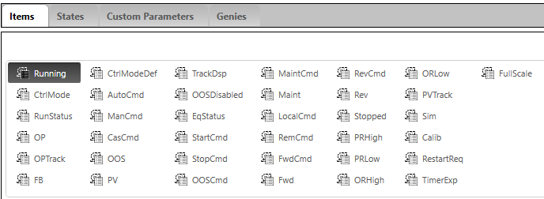

### Композитні джини

#### Загальні елементи

Темна заливка вказує на статус роботи привода `running` (`EquipmentName.Running`), біла - `stopped` (`EquipmentName.Stopped`).

​        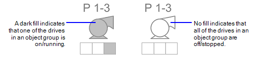    

Деякі символи обладнання доступні у варіантах, які вказують на певний напрямок.

Об’єкт приводу містить вбудований вимірювач (**PV**) для відображення ключового аналогового значення поруч із символом приводу `EquipmentName.PV`. Для активації його відображення необхідно виставити опцію `Display Meter` при налаштуванні композитного джина. Цей елемент можна використати тільки для композитного джина з одним приводом. Усі інші елементи що стосуються `PV` в `Meter` мають аналогічне призначення в цьому композитному джині. 

​        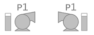    

**Mode Indicator** - односимвольний код, який показує режим роботи клапана (`EquipmentName.CtrlMode`, `EquipmentName.CtrlModeDef`). 

​            

Індикатор режиму доступний також для відображення групи приводів.

​            

Для композитних джинів що відображають ПЧ (variable speed drive VSD), він також включає кілька елементів: OP, OPTrack.

            

#### Drive Objects

Композитний джин Drive надає доступні варіанти відображення:

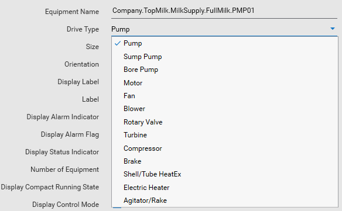

**Pump (насос)**   

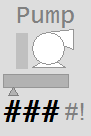

**Sump Pump (зливний насос)**

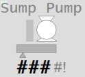

**Bore Pump (буровий насос)**

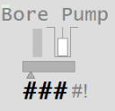

**Motor (двигун)**

**Fan (вентилятор)**

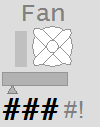

**Blower (повітродувка)**

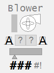

**Rotary Valve (поворотний клапан)**

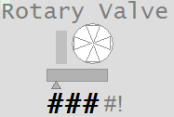

**Turbine (турбіна)**

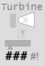

**Compressor (компресор)**

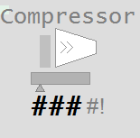

**Brake (гальма)**

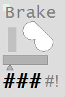

**Shell and Tube Heat Exchanger**

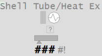

**Agitator/Rake (Мішалка/граблі)**

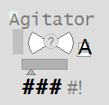

**Electric Heater (електронагрівач)**

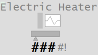

### Асоційовані лицьові панелі

**Одиночне або групове зображення приводів Direct Online (DOL) Drive**

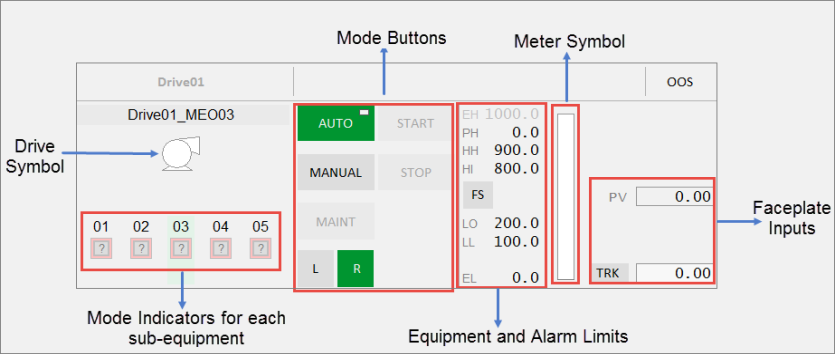            

**Single and Multiple VSD Drive - Single Direction**

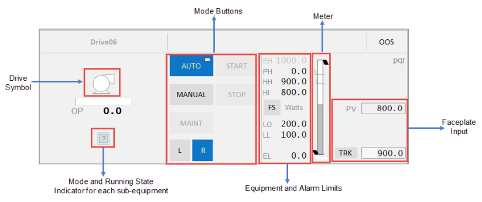

**Single DOL Drive with Forward/Reverse Capability**

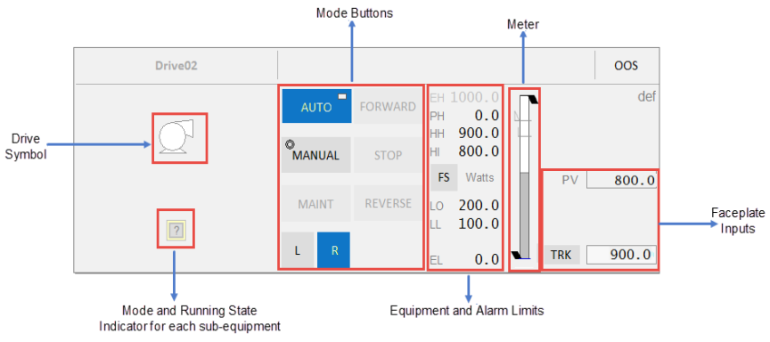

**Single VSD Drive with Forward/Reverse Capability**

