# Адаптація Valve до CM типів VLV 

## Оригінальна версія Valve 

У Citect SA для клапанів та заслінок існує спеціальний тип Equpmnet Valve 

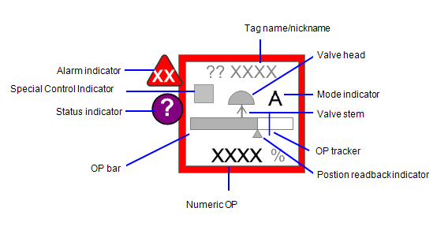

### Equipment

Згідно довідки Valves пов’язані з обладнанням типу `VALVE` і вимагають означення таких елементів: 

| Елемент     | Опис                                                         | Тип     | IODevice |
| ----------- | ------------------------------------------------------------ | ------- | -------- |
| FB          | індикатор зворотного зв'язку (Feedback Indicator)            | REAL    | PLC      |
| OP          | вихідне значення (Output)                                    | REAL    | PLC      |
| OPTrack     | значення OP для стеження                                     | REAL    | INTERNAL |
| TrackDsp    | відображати трекер                                           | DIGITAL | INTERNAL |
| CtrlMode    | код що показує режим ВМ: 0 – Auto (A); 1 – Manual (M); 2 – Cascade (C); 3 – Local (L); 4 – Special control (computer symbol) | INT     | INTERNAL |
| CtrlModeDef | режим ВМ за замовченням (без відображення): 0 – Auto (A); 1 – Manual (M); 2 – Cascade (C); 3 – Local (L); 4 – Special control (computer symbol) | INT     | INTERNAL |
| Open        | стан відкрито                                                | DIGITAL | PLC      |
| Closed      | стан зкрито                                                  | DIGITAL | PLC      |
| Opening     | стан відкривається                                           | DIGITAL | PLC      |
| Closing     | стан закривається                                            | DIGITAL | PLC      |
| Stopped     | стан зупинено                                                | DIGITAL | PLC      |
| EqStatus    | значення для [індикатору статусу](cm_common.md) визначається функцією | INT     | Cicode   |
| RunStatus   | значення для [Індикатор стану роботи обладнання](cm_common.md) | INT     | INTERNAL |
| Pos         |                                                              | INT     | PLC      |
| OOS         | Out of service якось впливає на [Індикатор стану роботи обладнання](cm_common.md) | DIGITAL | PLC      |
| OOSDisable  | заборона зміни OOS впливає на [Індикатор стану роботи обладнання](cm_common.md)) | DIGITAL | PLC      |
| OpenCmd     |                                                              | DIGITAL | PLC      |
| CloseCmd    |                                                              | DIGITAL | PLC      |
| StopCmd     |                                                              | DIGITAL | PLC      |
| AutoCmd     |                                                              | DIGITAL | PLC      |
| ManCmd      |                                                              | DIGITAL | PLC      |
| Sim         | режим імітації (для [індикатору статусу](cm_common.md))      | DIGITAL | PLC      |
| Calib       | режим калібрування (для [індикатору статусу](cm_common.md))  | DIGITAL | PLC      |

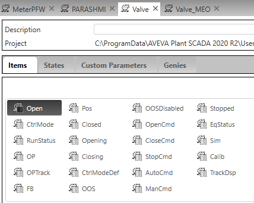

### Композитні джини

Об’єкти вимірювача, до

Об’єкти Valve, які доступні в бібліотеці Situational Awareness, включають:

- Control Valve    
- Damper    
- Block Valve    
- Hand Valve    

#### Загальні елементи

**OP Bar** - для регулюючих клапанів та інших клапанів, які можуть бути відкриті на 0-100%, ця смуга показує вихід на ВМ клапана `EquipmentName.OP`.  Відображення можна приховати через параметри налаштування композитного джина `Display Output Bar` Також це значення показується у вигляді числа. Відображення можна приховати через параметри налаштування композитного джина `Display Value`

Для двопозиційних клапанів (відкритих/закритих) смуга OP використовується для розрізнення між відкритими, відкривається/закривається та закритими (якщо доступно). Під час відкриття (`Opening=1`) або закриття (`Closing=1`) смуга відображається із заливкою на половині смуги.

Зауважте, що панель OP не стає чорною, коли клапан повністю відкритий.

| State                          | OP Bar                                  | Приклад (Block Valve)                    |
| ------------------------------ | --------------------------------------- | ---------------------------------------- |
| Повністю закритий              |  | 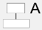 |
| Відкривається або закривається |    | 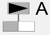   |
| Повністю відкритий             |    | 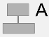   |

Символ зворотного звязку (**Readback**) показує фактичне положення клапана (0-100%) що приходить як `EquipmentName.FB`		

**OP Tracker** показує положення трекеру, який висталвяється користувачем для клапану `EquipmentName.OPTracker`. 

**Mode Indicator** - односимвольний код, який показує режим роботи клапана (`EquipmentName.CtrlMode`, `EquipmentName.CtrlModeDef`). 

**Шток клапана (Valve Stem)** - використовується для відображення нормального стану клапану (дії при зникненні живлення) аналогічно як це робиться на схемі автоматизації (не відкрився, не закрився або в останньому полоежні):

        

Це налаштовується при конфігуруванні композтного джина:

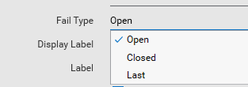

Зображення приводу ВМ (**Valve Head**) залежить від сконфігурованого типу (Valve Type).

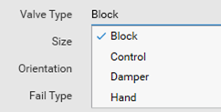

Для регулюючих клапанів (Control Valve і Damper) ступінь відкритості клапану і заслінок `EquipmentName.POS` також впливає на колір заповнення. При повному закритті заливка біла, при частковому - сіра, а при повному відкритті — чорна. Якщо доступний Readback (FB), заповнення приводу ВМ вказує на позицію `EquipmentName.FB` інакше на `EquipmentName.POS`. 

| Стан               | Control Valve                                | Damper                                       |
| ------------------ | -------------------------------------------- | -------------------------------------------- |
| Повністю закритий  |  |  |
| Частково відкритий |    |    |
| Повністю відкритий |    |    |

Для MOV/EOV і запірних клапанів (Block) колір заповнення головки клапана відповідає тій же схемі однак в якості джерела стану використовуються `EquipmentName.Open` , `EquipmentName.Closed`, `EquipmentName.Opening`, `EquipmentName.Closing`. Крім того на зображенні приводу ВМ також трикутником показується симвл перехідного стану, тобто коли клапан відкривається або закривається.

Залишається питання щодо кінцевих положень і команд на відкриття....

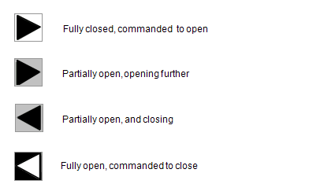        

Спеціальний індикатор керування (Special Control Indicator) може використовуватися для вказівки будь-якого з двох спеціальних станів: місцеве керування з поля (ручне) і керування з компютера. Для клапанів, які перебувають під звичайним керуванням через систему SCADA, символ не відображається.

| State              | Appearance                                     |                                                              |
| ------------------ | ---------------------------------------------- | ------------------------------------------------------------ |
| Normal             | 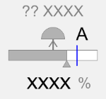     | Клапан нормально керується через систему керування (символ не показано) |
| Handswitch control | 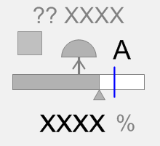 | Індикатор ручного перемикача з’являється, коли клапаном керують з поля за допомогою місцевого ручного перемикача. |

### Асоційовані лицьові панелі

**Simple Valve**

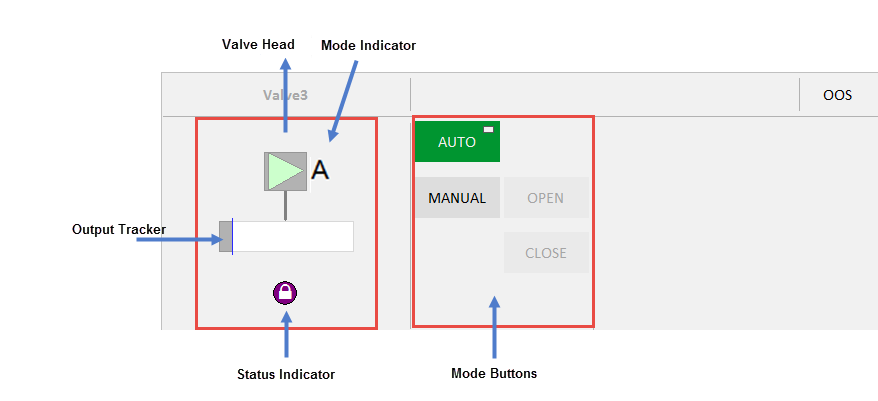   

**Complex Valve**

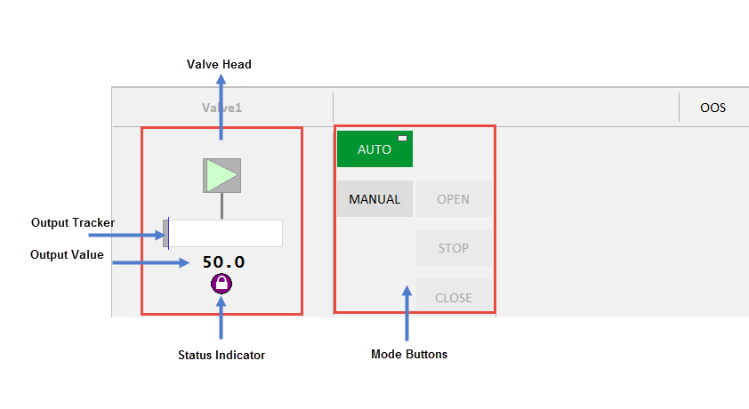

## Адаптація PACFramework 

Існуючий тип `Valve` адаптується до таких типів PACFramework:

- `VLVD_HMI` - відкрити/закрити
- `VLVA_HMI` - регулючий аналоговий
- `VLVS_HMI` - регулюючий з керуванням типу більше/менше з позиціонуванням

### Перелік елементів типу обладнання VLVD_HMI

| Елемент     | Опис                                                         | Тип     | IODevice | Примітка                                             |
| ----------- | ------------------------------------------------------------ | ------- | -------- | ---------------------------------------------------- |
| STA         | біти стану                                                   | INT     | PLC      | VLVD_HMI.STA                                         |
| CMD         | команда керування                                            | INT     | PLC      | VLVD_HMI.CMD                                         |
| ALM         | біти тривог                                                  | INT     | PLC      | VLVD_HMI.ALM                                         |
| POS         | позиція ВМ (0-10000)                                         | INT     | PLC      | VLVD_HMI.POS                                         |
| CMDCTRL     | для обробки команд керування                                 |         |          | ADVANCED ALARM з викликом функції PFW_CTRLCMD(...)   |
| CMDMODE     | для обробки команд переключення режимів (керування та інших сервісних команд) |         |          | ADVANCED ALARM з викликом функції PFW_MODECMD(...)   |
| FB          | індикатор зворотного зв'язку (Feedback Indicator)            | REAL    | Cicode   | VLVD_HMI.POS                                         |
| OP          | вихідне значення (Output)                                    | REAL    | Cicode   | VLVD_HMI.POS                                         |
| OPTrack     | значення OP для стеження                                     | REAL    | INTERNAL | без змін                                             |
| TrackDsp    | відображати трекер                                           | DIGITAL | INTERNAL | без змін                                             |
| CtrlMode    | код що показує режим ВМ: 0 – Auto (A); 1 – Manual (M); 2 – Cascade (C); 3 – Local (L); 4 – Special control (computer symbol) | INT     | Cicode   | PFW_getctrlmode ({equipment.TAGPREFIX}_STA)          |
| CtrlModeDef | режим ВМ за замовченням (без відображення): 0 – Auto (A); 1 – Manual (M); 2 – Cascade (C); 3 – Local (L); 4 – Special control (computer symbol) | INT     | INTERNAL | без змін                                             |
| Open        | стан відкрито                                                | DIGITAL | PLC      | PFW_getstabit ({equipment.TAGPREFIX}_STA, "Open")    |
| Closed      | стан зкрито                                                  | DIGITAL | Cicode   | PFW_getstabit ({equipment.TAGPREFIX}_STA, "Closed")  |
| Opening     | стан відкривається                                           | DIGITAL | Cicode   | PFW_getstabit ({equipment.TAGPREFIX}_STA, "Opening") |
| Closing     | стан закривається                                            | DIGITAL | Cicode   | PFW_getstabit ({equipment.TAGPREFIX}_STA, "Closing") |
| Stopped     | стан зупинено                                                | DIGITAL | Cicode   | PFW_getstabit ({equipment.TAGPREFIX}_STA, "Stopped") |
| EqStatus    | значення для [індикатору статусу](cm_common.md) визначається функцією | INT     | Cicode   | без змін                                             |
| RunStatus   | значення для [Індикатор стану роботи обладнання](cm_common.md) | INT     | INTERNAL | без змін                                             |
| OOS         | Out of service якось впливає на [Індикатор стану роботи обладнання](cm_common.md) | DIGITAL | INTERNAL | поки INTERNAL (до реалізації)                        |
| OOSDisable  | заборона зміни OOS впливає на [Індикатор стану роботи обладнання](cm_common.md)) | DIGITAL | PLC      | поки INTERNAL (до реалізації)                        |
| OpenCmd     |                                                              | DIGITAL | INTERNAL | обробляється в CMDCTRL                               |
| CloseCmd    |                                                              | DIGITAL | INTERNAL | обробляється в CMDCTRL                               |
| StopCmd     |                                                              | DIGITAL | INTERNAL | обробляється в CMDCTRL                               |
| AutoCmd     |                                                              | DIGITAL | INTERNAL | обробляється в CMDMODE                               |
| ManCmd      |                                                              | DIGITAL | INTERNAL | обробляється в CMDMODE                               |
| Sim         | режим імітації (для [індикатору статусу](cm_common.md))      | DIGITAL | Cicode   | PFW_getstabit ({equipment.TAGPREFIX}_STA, "Sim")     |
| Calib       | режим калібрування (для [індикатору статусу](cm_common.md))  | DIGITAL | INTERNAL | поки INTERNAL (до реалізації)                        |

### Перелік елементів типу обладнання VLVA_HMI

| Елемент     | Опис                                                         | Тип     | IODevice | Примітка                                             |
| ----------- | ------------------------------------------------------------ | ------- | -------- | ---------------------------------------------------- |
| STA         | біти стану                                                   | INT     | PLC      | VLVA_HMI.STA                                         |
| CMD         | команда керування                                            | INT     | PLC      | VLVA_HMI.CMD                                         |
| ALM         | біти тривог                                                  | INT     | PLC      | VLVA_HMI.ALM                                         |
| POS         | позиція ВМ (0-10000)                                         | INT     | PLC      | VLVA_HMI.POS                                         |
| OP          | позиція ВМ (0-100%) - ЗАДАНЕ ЗНАЧЕННЯ                        | REAL    | PLC      | назва тега VLVA_HMI_CPOS                             |
| CMDCTRL     | для обробки команд керування                                 |         |          | ADVANCED ALARM з викликом функції PFW_CTRLCMD(...)   |
| CMDMODE     | для обробки команд переключення режимів (керування та інших сервісних команд) |         |          | ADVANCED ALARM з викликом функції PFW_MODECMD(...)   |
| FB          | індикатор зворотного зв'язку (Feedback Indicator)            | REAL    | Cicode   | VLVA_HMI.POS                                         |
| OPTrack     | значення OP для стеження                                     | REAL    | INTERNAL | без змін                                             |
| TrackDsp    | відображати трекер                                           | DIGITAL | INTERNAL | без змін                                             |
| CtrlMode    | код що показує режим ВМ: 0 – Auto (A); 1 – Manual (M); 2 – Cascade (C); 3 – Local (L); 4 – Special control (computer symbol) | INT     | Cicode   | PFW_getctrlmode ({equipment.TAGPREFIX}_STA)          |
| CtrlModeDef | режим ВМ за замовченням (без відображення): 0 – Auto (A); 1 – Manual (M); 2 – Cascade (C); 3 – Local (L); 4 – Special control (computer symbol) | INT     | INTERNAL | без змін                                             |
| Open        | стан відкрито                                                | DIGITAL | PLC      | PFW_getstabit ({equipment.TAGPREFIX}_STA, "Open")    |
| Closed      | стан зкрито                                                  | DIGITAL | Cicode   | PFW_getstabit ({equipment.TAGPREFIX}_STA, "Closed")  |
| Opening     | стан відкривається                                           | DIGITAL | Cicode   | PFW_getstabit ({equipment.TAGPREFIX}_STA, "Opening") |
| Closing     | стан закривається                                            | DIGITAL | Cicode   | PFW_getstabit ({equipment.TAGPREFIX}_STA, "Closing") |
| Stopped     | стан зупинено                                                | DIGITAL | Cicode   | PFW_getstabit ({equipment.TAGPREFIX}_STA, "Stopped") |
| EqStatus    | значення для [індикатору статусу](cm_common.md) визначається функцією | INT     | Cicode   | без змін                                             |
| RunStatus   | значення для [Індикатор стану роботи обладнання](cm_common.md) | INT     | INTERNAL | без змін                                             |
| OOS         | Out of service якось впливає на [Індикатор стану роботи обладнання](cm_common.md) | DIGITAL | INTERNAL | поки INTERNAL (до реалізації)                        |
| OOSDisable  | заборона зміни OOS впливає на [Індикатор стану роботи обладнання](cm_common.md)) | DIGITAL | PLC      | поки INTERNAL (до реалізації)                        |
| OpenCmd     |                                                              | DIGITAL | INTERNAL | обробляється в CMDCTRL                               |
| CloseCmd    |                                                              | DIGITAL | INTERNAL | обробляється в CMDCTRL                               |
| StopCmd     |                                                              | DIGITAL | INTERNAL | обробляється в CMDCTRL                               |
| AutoCmd     |                                                              | DIGITAL | INTERNAL | обробляється в CMDMODE                               |
| ManCmd      |                                                              | DIGITAL | INTERNAL | обробляється в CMDMODE                               |
| Sim         | режим імітації (для [індикатору статусу](cm_common.md))      | DIGITAL | Cicode   | PFW_getstabit ({equipment.TAGPREFIX}_STA, "Sim")     |
| Calib       | режим калібрування (для [індикатору статусу](cm_common.md))  | DIGITAL | INTERNAL | поки INTERNAL (до реалізації)                        |

## Композитний джин ValvePFW 

Оригінальна палітра кольорів CitectSA передбачає темні відтінки для активного стану  та світі для пасивного. Для протилежної палітри кольорів та для інших модифікацій оригніальний композитний джин Valve змінено в ValvePFW.

Усі використаня джини та символи перенесені у одноіменні бібліотеки з суфіксом PFW включеного проекту SA_LibraryPFW. 

