# Послідовність розгортання SA_LibraryPFW ручним способом

## Передмова

Нижче наведена послідовність розгортання проекту без використанням утиліти PACFramework Tools. 

Дані методичні рекомендації варто використовувати як рекомендовану процедуру розгортання. Необхідно розуміти, що використовувана бібліотека змінюватиметься в процесі виправлення помилок або добавленні нових компонентів. Також може змінюватися проект для прикладу в ПЛК та і самі рекомендації. Актуальна версія завжди лежить на репозиторії.

## 1. Створення базової частини

### Завантаження проекту PLC

- [ ] Завантажте готовий демонстраційний проект для Unity PRO/Control Expert [pacexample.xef](https://raw.githubusercontent.com/pupenasan/PACFramework/master/platforms/unitypro/pacexample.xef) 

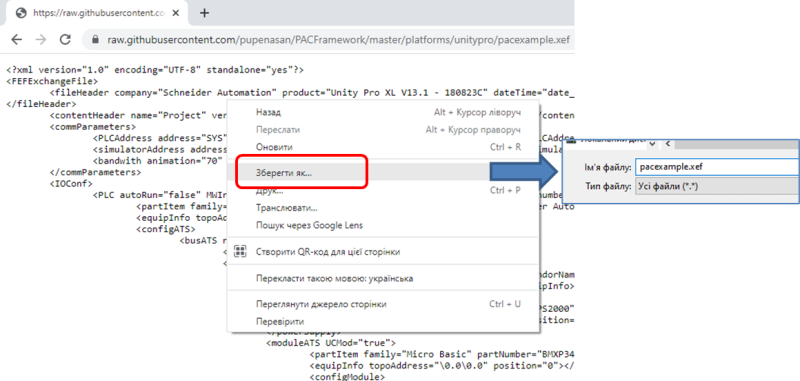    

рис.1.

- [ ] Запустіть Unity PRO/Control Expert, скомпілюйте проект і завантажте в ПЛК або імітатор і запустіть на виконання.

### Створення проекту на базі SA

- [ ] Запустіть Plant SCADA
- [ ] Створіть новий проект на базі стартового проекту `SA_Style1` з назвою `ExamplePFW`
- [ ] Створіть одного користувача, наприклад `Admin` з правами (на базі ролі) адміністратора
- [ ] Створіть новий I/O Device, з яким буде відбуватися зв'язок. Даний приклад розроблений з урахуванням драйверу Modbus TCP/IP. Надайте ім'я пристрою `PLC1`
- [ ] Скомпілюйте проект, щоб перевірити що немає помилок
- [ ] Зробіть бекап проекту.

**Увага, з метою уникнення втрати даних, робіть резервну копію перед виконанням кожного пункту!**

### Включення SA_LibraryPFW

- [ ] Завантажте останню версію `SA_LibraryPFW`, який містить усі необхідні скрипти та бібліотечні елементи, та відновіть в робочий простір Citect. Остання версія доступна в репозиторії за [цим посиланням](https://github.com/pupenasan/PACFramework/raw/master/platforms/citectsa/SA_LibraryPFW.ctz)  
- [ ] Відновіть проект (Restore) в `Plant SCADA Studio`
- [ ] Включіть проект `SA_LibraryPFW` у свій власний

**Увага! Даний проект не буде компілюватися, якщо після цього пункту не зробити мінімальні дії щодо створення Equipments.**

### Створення базових Equipment для кожного PLC

Є загальні проектні Equipment, які потребуються для кожного PLC, що підключений до проектів PACFramework. У цьому пункті необхідно створити ці об'єкти. У всіх Equipment PACFramework для задавання початкової адреси використовується поле `Custom1`, де вказується зміщення в області `%MW`, наприклад 50 значить, що перше поле у відповідній структурній змінній починається з `%MW50`.  

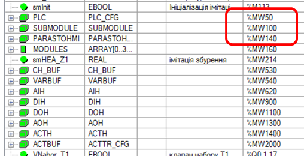

рис.2.

- [ ] Відкрийте Equipment Editor
- [ ] Створіть обладнання з іменем `Plant` без вказівки типу. Це обладнання буде верхньорівневим для всього проекту.
- [ ] В середині `Plant` створіть Equipment `PLC1`, після чого в  `PLC1` створіть `PARASTOHMI`, властивості для яких записані в таблиці нижче та заповніть для них поля Custom1: 

| Equipment Name | Equipment Type | I/O Device | Tag Prefix      | Custom1 |
| -------------- | -------------- | ---------- | --------------- | ------- |
| PLC1           | PLC            | PLC1       | PLC1            | 50      |
| PARASTOHMI     | PARASTOHMI     | PLC1       | PLC1_PARASTOHMI | 140     |

**Увага! Tag Prefix для `PARASTOHMI` повинен завжди формуватися за шаблоном:**  

```
<I/O Device Name>_PARASTOHMI
```

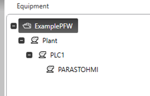

рис.3.

- [ ] Для PARASTOHMI змініть параметр ID_MAX на максимальне значення ID для технологічних змінних AIVAR. У нашому випадку максимальне значення ID=8, тому саме його вписуємо сюди.

- [ ] Збережіть Equipment
- [ ] Зробіть `Update Equipment`
- [ ] Зробіть компілювання проекту, помилок не повинно бути

## 2. Розгортання LVL0

У цьому пункті необхідно розгорнути Equipment та сторінки для діагностики нижнього рівня. 

### Створення Equipment

Для LVL0 потрібно створити по одному Equipment на кожний ПЛК для CH_BUF та SUBMODULE а також Equipment для кожного MODULE. 

- [ ] В середині `Plant.PLC1` створіть наступні Equipments, які записані в таблиці нижче та заповніть для них поля Custom1. Для всіх Equipment I/O `Device = PLC1`

| Equipment Name | Equipment Type | I/O Device | Tag Prefix     | Custom1 | Display Name  |
| -------------- | -------------- | ---------- | -------------- | ------- | ------------- |
| CH_BUF         | CH_BUF         | PLC1       | PLC1_CHBUF     | 530     |               |
| SUBMODULE      | SUBMODULE      | PLC1       | PLC1_SUBMODULE | 100     |               |
| MODULE0        | MODULE         | PLC1       | PLC1_MODULE0   | 160     | R0_DDM3202K_1 |
| MODULE1        | MODULE         | PLC1       | PLC1_MODULE1   | 168     | R0_AMM0600_2  |
| MODULE2        | MODULE         | PLC1       | PLC1_MODULE2   | 176     | R0_DDM3202K_3 |
| MODULE3        | MODULE         | PLC1       | PLC1_MODULE3   | 184     | R0_AMM0600_4  |

Адреси взяті з рис.3 та рис.4.

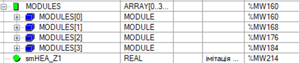

рис.4

- [ ] Зробіть компілювання проекту

### Створення сторінки PLC Maps

- [ ] Створіть сторінку з іменем `plcmaps` на базі шаблону `pagecontent`. При виборі шаблону вибирайте розмір екрану HD1080. 
- [ ]  Розмістіть в правому верхньому кутку джин `SUBMODULE_CHS` з бібліотеки `PACFramework`. У якості замінника `SUBMODULE` виставте `PLC1_SUBMODULE` 
- [ ] Розмістіть під ним джин `CH_BUF` з бібліотеки `PACFramework`.  У якості замінника `CH_BUF` виставте `PLC1_CHBUF`, а замінник для `VARBUF` поки залиште порожнім, так як змінна для неї ще не створена. Наступні попередження щодо цього необхідно буде ігнорувати.
- [ ] Розмістіть 4-ри джини `MODULE` з бібліотеки `PACFramework`, які будуть відображати стан модулів на шассі, заповніть їх замінники, як показано в таблиці нижче 

| Moddescr | modname | module       | SUBMODULE      |
| -------- | ------- | ------------ | -------------- |
| DDM3202K | R0.1    | PLC1_MODULE0 | PLC1_SUBMODULE |
| AMM0600  | R0.2    | PLC1_MODULE1 | PLC1_SUBMODULE |
| DDM3202K | R0.3    | PLC1_MODULE2 | PLC1_SUBMODULE |
| AMM0600  | R0.4    | PLC1_MODULE3 | PLC1_SUBMODULE |

Загальний вигляд сторінки матиме вигляд:

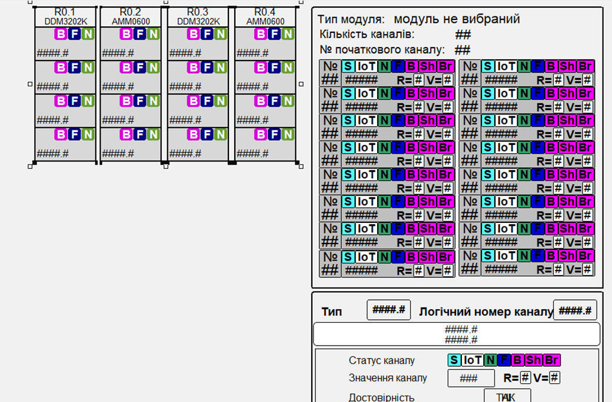

рис.5.

- [ ] У лівому верхньому кутку, ліворуч від першого джина модуля розмістіть джин `PLC_Status` з бібліотеки `PACFramework`.  Замінник `PLC` прив'яжіть до  `PLC1` 
- [ ] Збережіть сторінку.

### Добавлення пункту меню

- [ ]  У Plant SCADA Studio в розділі `Visualisation -> Menu Configuration` добавте рядок що вказує на пункт меню виклику сторінки.

| Page       | Level1 | Level2 | Level3  | Menu Command                | Target Page |      |
| ---------- | ------ | ------ | ------- | --------------------------- | ----------- | ---- |
| Navigation | Plant  | debug  | plcmaps | Navigation_ShowTargetPage() | plcmaps     |      |

- [ ] Зробіть компілювання. Під час компілювання повинне з'явитися одне попередження.  

### Тестування сторінки PLC Maps

- [ ] Запустіть майстер налаштування комп'ютера (Setup Wizard) в режимі `Custom Setup`. У вікні `Screen Setup` виберіть потрібне розширення та назву первинного завантажуваного контексту `plant`

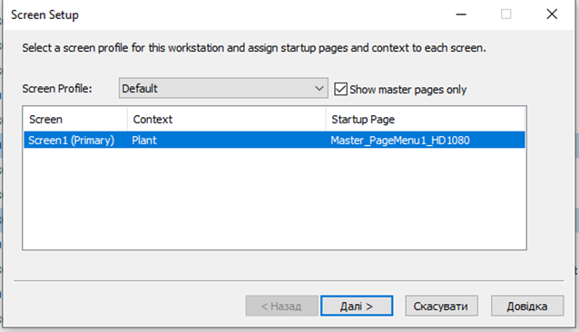

рис.6.

- [ ] Запустіть середовище виконання. Відкрийте сторінку `plcmaps`
- [ ] Перевірте роботу функцій нижнього рівня, зокрема:
- проаналізуйте відображення каналів на карту ПЛК
- функції форсування
- роботу тривог
- відображення загальної статусної інформації

Зверніть увагу, що функцію визначення прив'язки змінних до конкретних каналів можна буде визначити тільки після реалізації на SCADA LVL2! 

## 3. Розгортання LVL1 

У цьому пункті необхідно розгорнути Equipment та сторінки для діагностики рівня технологічних змінних. 

### Створення Equipment для VAR_BUF

Для LVL1 потрібно створити по одному Equipment на кожний ПЛК для VAR_BUF а також Equipment для кожної технологічної змінної.

- [ ] В середині `Plant.PLC1` створіть Equipment типу `VAR_BUF` з наступними налаштуваннями:

| Equipment Name | Equipment Type | I/O Device | Tag Prefix  | Custom1 | Display Name |
| -------------- | -------------- | ---------- | ----------- | ------- | ------------ |
| VARBUF         | VARBUF         | PLC1       | PLC1_VARBUF | 540     |              |

### Означення ієрархії Equipment 

Надалі необхідно визначитися з ієрархією устатковання (Equipment). В проектах SA ієрархія має значення, так як композитні джини прив'язуються до елементів обладнання. У той же час, звичайні джини в PACFramework орієнтуються на зв'язки по тегам, тому для них ієрархія не має значення.

Пропонується наступна ієрархія (рис.7 - рис.13):

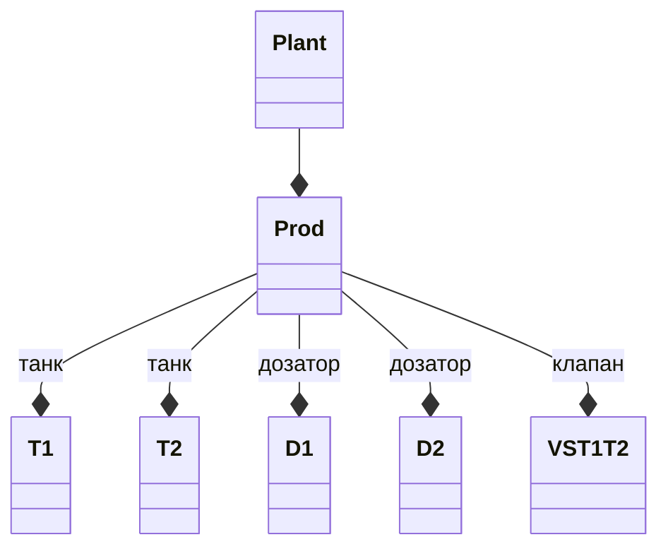

рис.7. Верхній рівень ієрархії обладнання

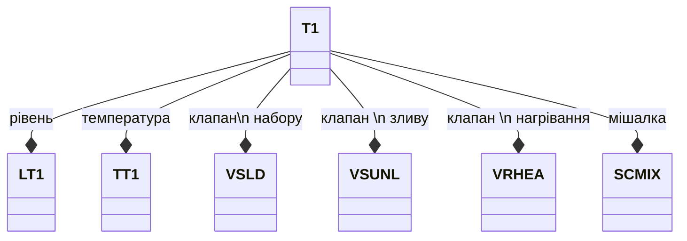

рис.8. Танк Т1 (Т2 аналогічний)

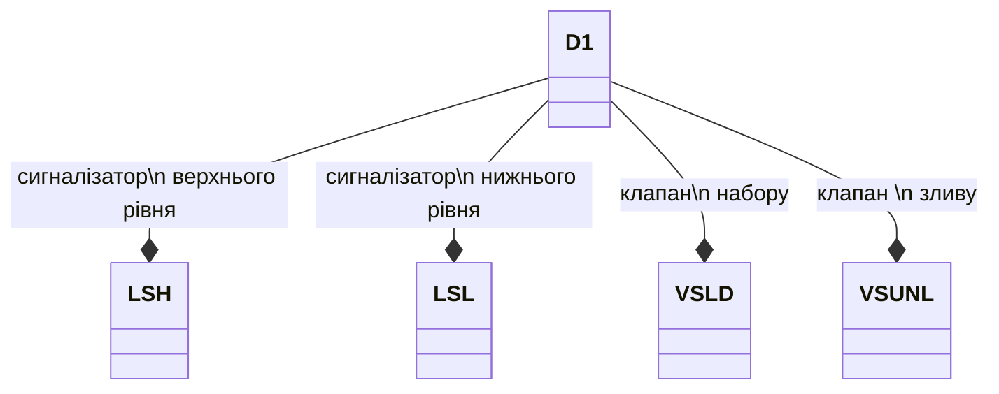

рис.9. Дозатор D1 (D2 аналогічний)

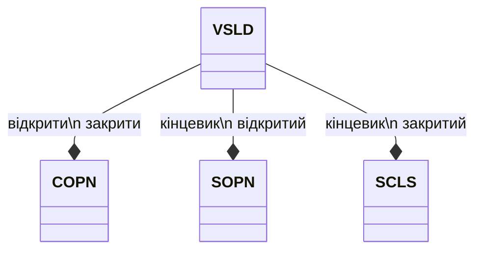

рис.10. Клапан T1.VSLD (T2.VSLD, T1.VSUNL, T2.VSUNL,  Prod.VST1T2 аналогічні) 

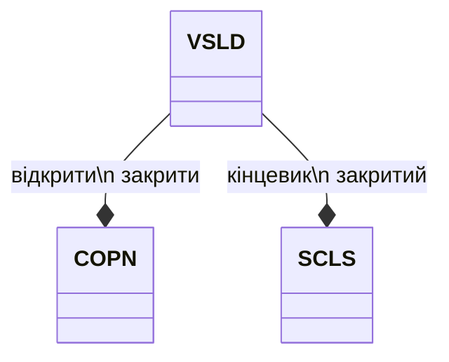

рис.11. Клапан D1.VSLD (D2.VSLD, D1.VSUNL, D2.VSUNL аналогічні) 

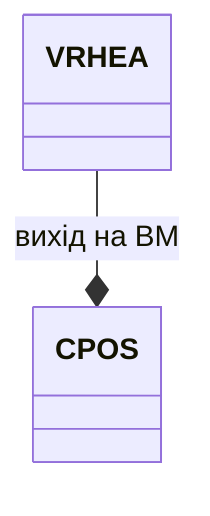

рис.12. Клапан T1.VRHEA (T2.VRHEA аналогічний) 

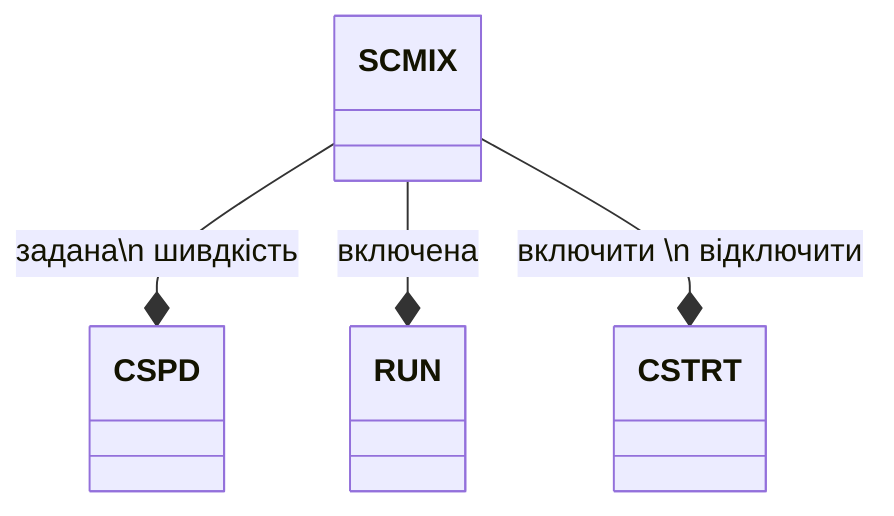

рис.13. Мішалка T1.SCMIX (T2.SCMIX аналогічна) 

- [ ] Створіть верхні рівні ієрархії (до LVL1 не включно). Для цього в Equipment Editor створіть такі Equipment без означення типу:

- `Prod` під рівнем `Plant`
- `T1`, `T2`, `D1`, `D2` 

Загальний вигляд буде наступним:

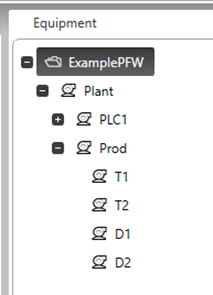

рис.14.

### Створення Equipment рівня LVL1 

Згідно PACFramework технологічні змінні є Equipment конкретного типу. Для їх розташування в ієрархії потрібно б було розгорнути LVL2, але на даному моменті їх розміщення немає принципової різниці. Тому наразі вони будуть розміщуватися в межах вищих рівнів, але назва буде відповідати назві в PLC. Пізніше назву Equipment можна буде змінити на більш зручну з точки зору експлуатації, тоді як назва тегів буде залишатися такою ж.

Для заповнення тегів ми рекомендуємо користуватися табличним а не графічним редактором Equipment. Ми підготовили вже табличний варіант для імпорту в таблицю.

- [ ] Завантажте собі на ПК варіант імпорту [в форматі CSV](https://github.com/pupenasan/PACFramework/blob/master/platforms/citectsa/exmpl_eqlvl1.csv)
- [ ] Відкрийте його за допомогою табличного редактору типу Excel

- [ ] Проаналізуйте зміст колонок

Наведена таблиця формувалася за допомогою Excel, шляхом часткового переносу даних з masterdata.xlsx, який використовувався при формуванні змінних для ПЛК. При ручному розгортанні це досить зручний підхід. Прокоментуємо деякі з колонок (рис.15).

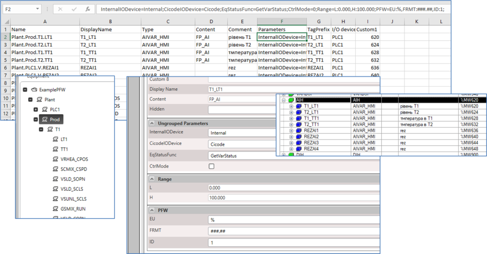

рис.15.

- `Name` містить ієрархічне ім'я Equipment
- `Type` вказує на тип Equipment:
  - AIVAR_HMI
  - DIVAR_HMI
  - DOVAR_HMI
  - AOVAR_HMI  
- `Content` вказує що при попаданні об'єкту в контекст буде завантажуватися сторінка FP_AI
- `Parameters` містить текстовий рядок що містить в собі усі значення параметрів. У PACFramework для всіх об'єктів обов'язковим є параметр `ID` з групи `PFW`, який вказує на ідентифікатор технологічної змінною. Також там є інші налаштування, наприклад одиниці вимірювання та масштаб. На рисунку показано як виглядить вікно налаштування параметрів для `AIVAR_HMI` 
- `Custopm1` як і для інших Equipment є початковою адресою в області `%MW`. Нижче на рисунку показані адреси для всіх змінних для розуміння. 

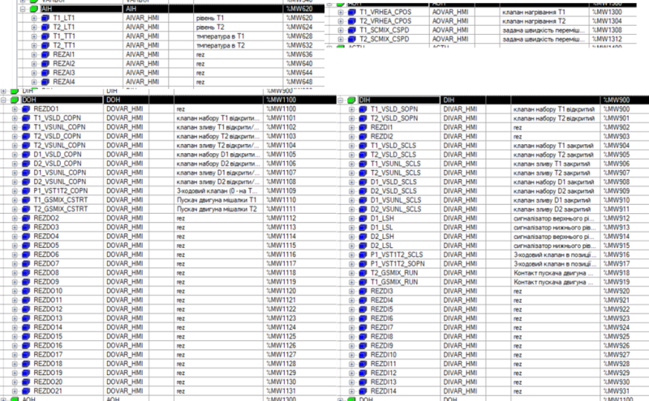

рис.16.

- [ ] Відкрийте табличний редактор Equipment
- [ ] Для того щоб зручніше було копіювати залиште в табличному вигляді тільки ті колонки, які наведені в таблиці а також розмістіть їх у потрібному порядку. 
- [ ] Скопіюйте у таблицю усі рядки (крім першого). Збережіть таблицю.
- [ ] Відкрийте графічний Equipment Editor. Ви повинні побачити готову ієрархічну модель Equipment.

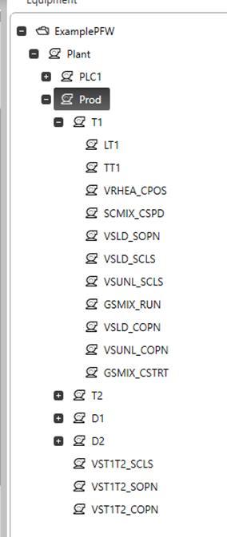

рис. 

- [ ] Відкрийте якийсь об'єкт типу AIVARHMI, подивіться на параметри Range, PFW та Ungroup.
- [ ] Зробіть Update Equipment.
- [ ] Подивіться які створилися теги: Variables, Alarms, Trend 

### Створення Cicode функції PFW_getparasPLCx

Один проект Plant SCADA може мати підключень до кількох PLC. Враховуючи необхідність фонового обміну конфігураційних даних для кожного PLC для них необхідно зробити по одній функції фонового обміну. У цьому пункті необхідно написати власну функцію такого обміну.

- [ ] Відкрийте Cicode Editor
- [ ] Створіть новий файл Cicode, збережіть його під іменем `PFW_byPLC.ci`
- [ ] Відкрийте з бібліотеки `SA_LibraryPFW` файл `PFW_base.ci`, знайдіть функцію `PFW_getparasPLCx ()` яка закоментована в проекті.
- [ ] Скопіюйте всю функцію в новостворений файл
- [ ] Замініть в скопійованій частині усі `PLCx` на `PLC1`, так як це ім'я `I/O Device`. У подальшому за необхідності для кожного ПЛК треба створювати окрему функцію зі своїм `I/O Device`

```pascal
INT FUNCTION PFW_getparasPLC1 () 
	INT ID = PLC1_PARASTOHMI[0]
	PLC1_PARASTOHMI_ID = PLC1_PARASTOHMI[0];
	PLC1_PARASTOHMI_CLSID[ID] = PLC1_PARASTOHMI[1];		
	PLC1_PARASTOHMI_K[ID] = PLC1_PARASTOHMI[2];
	INT K = PLC1_PARASTOHMI_K[ID];
	PLC1_PARASTOHMI_PRM[ID] = PLC1_PARASTOHMI[4]
	PLC1_PARASTOHMI_LOENG[ID] = PLC1_PARASTOHMI[5]/K;
	PLC1_PARASTOHMI_HIENG[ID] = PLC1_PARASTOHMI[6]/K;
	PLC1_PARASTOHMI_LOSP[ID] = PLC1_PARASTOHMI[7]/K;
	PLC1_PARASTOHMI_HISP[ID] = PLC1_PARASTOHMI[8]/K;
	PLC1_PARASTOHMI_LOLOSP[ID] = PLC1_PARASTOHMI[9]/K;
	PLC1_PARASTOHMI_HIHISP[ID] = PLC1_PARASTOHMI[10]/K;							
	PLC1_PARASTOHMI_IDDBL[ID] = PLC1_PARASTOHMI[11];	
	IF PLC1_PARASTOHMI_I.q = "Good" THEN 
		PLC1_PARASTOHMI_IPREV = PLC1_PARASTOHMI_I;
	END	
	RETURN PLC1_PARASTOHMI[3];
END
```

- [ ] Збережіть файл   `PFW_byPLC.ci`

- [ ] Зробіть компіляцію, поки повинно залишитися тільки одне попередження, яке було раніше. 

### Зміна сторінки PLC Maps

- [ ] Враховуючи, що змінна `PLC1_VARBUF` створена, вставте її назву в джині `CH_BUF` замість замінника на сторінці PLC Maps.
- [ ] Збережіть сторінку. Зробіть компілювання. Тепер не повинно бути ніяких попереджень.

### Створення сторінки та пункту меню для AIVAR

У даному пункті необхідно створити сторінку в якій будуть налагоджуватися технологічні змінні типу AIVAR

- [ ] Створіть сторінку з іменем `AIVAR` на базі шаблону `pagecontent`. При виборі шаблону вибирайте розмір екрану HD1080.  
- [ ] Розмістіть в правому верхньому кутку джин `AIVAR_BUF` з бібліотеки `PACFramework`. У якості замінника `VARBUF` виставте `PLC1_VARBUF` 
- [ ] Розмістіть ліворуч від джина буферу 8 джинів `AIVAR_HMI` з бібліотеки `PACFramework`, які будуть відображати стан технологічної змінної, заповніть їх замінники на, відповідно:

| Tag    |
| ------ |
| T1_LT1 |
| T2_LT1 |
| T1_TT1 |
| T2_TT1 |
| REZAI1 |
| REZAI2 |
| REZAI3 |
| REZAI4 |

- [ ] У лівому верхньому кутку, ліворуч від першого джина модуля розмістіть джин `PLC_Status` з бібліотеки `PACFramework`.  Замінник `PLC` прив'яжіть до  `PLC1` 
- [ ] Збережіть сторінку. 
- [ ] У Plant SCADA Studio в розділі `Visualisation -> Menu Configuration` добавте рядок що вказує на пункт меню виклику сторінки AIVAR.

| Page       | Level1 | Level2 | Level3 | Menu Command                | Target Page |      |
| ---------- | ------ | ------ | ------ | --------------------------- | ----------- | ---- |
| Navigation | Plant  | debug  | AIVAR  | Navigation_ShowTargetPage() | AIVAR       |      |

- [ ] Скомпілюйте проект. Ніяких помилок та попереджень не повинно бути.

### Адаптація Meters до AI_VAR

Хоч діагностичні PACFramework не залежні від типу проекту Citect, для користування функціональністю шаблонів на базі типу SA, необхідно робити певну адаптацію. Зокрема це стосується композитних джинів  Meters, на які відображаються `AIVAR_HMI`. Детальний опис цієї адаптації наведений за [цим посиланням](cm_aivar.md). Там зокрема написано, що якщо відображення меж тривог повинно залежати від змінної ПЛК (так це зроблено в PACFramework), то в Equipment Runtime Parameters в полі `IsTag` треба виставити TRUE, а в полі `Value` відповідне значення тега, який вказує на цей перелік меж. Відповідно це необхідно зробити для всіх `AIVAR_HMI`.

- [ ] Перейдіть в Equipment -> Runtime Parameters і заповніть поля відповідно до наведеного в таблиці нижче.

| Equipment           | Name      | Value            | Is Tag |
| ------------------- | --------- | ---------------- | ------ |
| Plant.Prod.T1.LT1   | PLCLimits | T1_LT1_PLCLimits | TRUE   |
| Plant.Prod.T2.LT1   | PLCLimits | T2_LT1_PLCLimits | TRUE   |
| Plant.Prod.T1.TT1   | PLCLimits | T1_TT1_PLCLimits | TRUE   |
| Plant.Prod.T2.TT1   | PLCLimits | T2_TT1_PLCLimits | TRUE   |
| Plant.PLC1.V.REZAI1 | PLCLimits | REZAI1_PLCLimits | TRUE   |
| Plant.PLC1.V.REZAI2 | PLCLimits | REZAI2_PLCLimits | TRUE   |
| Plant.PLC1.V.REZAI3 | PLCLimits | REZAI3_PLCLimits | TRUE   |
| Plant.PLC1.V.REZAI4 | PLCLimits | REZAI4_PLCLimits | TRUE   |

- [ ] Збережіть зміни.
- [ ] Скомпілюйте проект. Ніяких помилок та попереджень не повинно бути.

### Тестування сторінки AIVAR

- [ ] Запустіть середовище виконання. Відкрийте сторінку `AIVAR`
- [ ] Перевірте роботу функцій AIVAR
- [ ] Відкрийте сторінку `plcmaps`, перевірте роботу функціональності відображення прив'язаної до каналу змінної.

### Модифікування сторінки FP_AI

Сторінка фейсплейту `FP_AI` відображає Equipment який попадає в контекст. Для аналогових вхідних змінних зручно зробити так, щоб там відображалися тренди.  

- [ ] У Graphic Builder відкрийте сторінку `FP_AI`. 
- [ ] Вставте джин `pv_156` із бібліотеки  `sa_compo_pfw`, розмістіть ліворуч, вирівняйте інші елементи щоб вони не перекривалися. Виставте наступні замінники:

| Назва замінника | Значення            |
| --------------- | ------------------- |
| Equipment       | `?__EquipmentName?` |
| Span            | `00:30:00`          |

- [ ] Збережіть сторінку і зробіть компілювання проекту.
- [ ] Запустіть проект на виконання і перевірте роботу тренду.

### Створення сторінки, пункту меню та перевірка DIVAR

- [ ] Створіть сторінку `DIVAR` на базі шаблону `pagecontent`. При виборі шаблону вибирайте розмір екрану HD1080.  
- [ ] Розмістіть в правому верхньому кутку джин `DIVAR_BUF` з бібліотеки `PACFramework`. У якості замінника `VARBUF` виставте `PLC1_VARBUF` 
- [ ] Розмістіть ліворуч від джина буферу 32 джина `DIVAR_HMI` з бібліотеки `PACFramework`, які будуть відображати стан технологічної змінної, заповніть їх замінники на, відповідно:

| Tag            |
| -------------- |
| T1_VSLD_SOPN   |
| T2_VSLD_SOPN   |
| D1_VSUNL_SCLS  |
| D2_VSUNL_SCLS  |
| D1_LSH         |
| D1_LSL         |
| D2_LSH         |
| D2_LSL         |
| T1_VSLD_SCLS   |
| T2_VSLD_SCLS   |
| T1_VSUNL_SCLS  |
| T2_VSUNL_SCLS  |
| D1_VSLD_SCLS   |
| D2_VSLD_SCLS   |
| P1_VST1T2_SCLS |
| P1_VST1T2_SOPN |
| T1_GSMIX_RUN   |
| T2_GSMIX_RUN   |
| REZDI1         |
| REZDI2         |
| REZDI3         |
| REZDI4         |
| REZDI5         |
| REZDI6         |
| REZDI7         |
| REZDI8         |
| REZDI9         |
| REZDI10        |
| REZDI11        |
| REZDI12        |
| REZDI13        |
| REZDI14        |

- [ ] У лівому верхньому кутку, ліворуч від першого джина модуля розмістіть джин `PLC_Status` з бібліотеки `PACFramework`.  Замінник `PLC` прив'яжіть до  `PLC1` 
- [ ] Збережіть сторінку. 
- [ ] У Plant SCADA Studio в розділі `Visualisation -> Menu Configuration` добавте рядок що вказує на пункт меню виклику сторінки DIVAR.

| Page       | Level1 | Level2 | Level3 | Menu Command                | Target Page |      |
| ---------- | ------ | ------ | ------ | --------------------------- | ----------- | ---- |
| Navigation | Plant  | debug  | DIVAR  | Navigation_ShowTargetPage() | DIVAR       |      |

- [ ] Скомпілюйте проект. Ніяких помилок та попереджень не повинно бути.
- [ ] Запустіть на виконання. Перевірте основну функціональність DIVAR.

### Створення сторінки, пункту меню та перевірка DOVAR

- [ ] Створіть сторінку `DOVAR` на базі шаблону `pagecontent`. При виборі шаблону вибирайте розмір екрану HD1080.  
- [ ] Розмістіть в правому верхньому кутку джин `DOVAR_BUF` з бібліотеки `PACFramework`. У якості замінника `VARBUF` виставте `PLC1_VARBUF` 
- [ ] Розмістіть ліворуч від джина буферу 32 джина `DOVAR_HMI` з бібліотеки `PACFramework`, які будуть відображати стан технологічної змінної, заповніть їх замінники на, відповідно:

| Tag            |
| -------------- |
| D1_VSLD_COPN   |
| D1_VSUNL_COPN  |
| D2_VSLD_COPN   |
| D2_VSUNL_COPN  |
| P1_VST1T2_COPN |
| T1_GSMIX_CSTRT |
| T1_VSLD_COPN   |
| REZDO1         |
| T1_VSUNL_COPN  |
| T2_GSMIX_CSTRT |
| T2_VSLD_COPN   |
| T2_VSUNL_COPN  |
| REZDO2         |
| REZDO3         |
| REZDO4         |
| REZDO5         |
| REZDO6         |
| REZDO7         |
| REZDO8         |
| REZDO9         |
| REZDO10        |
| REZDO11        |
| REZDO12        |
| REZDO13        |
| REZDO14        |
| REZDO15        |
| REZDO16        |
| REZDO17        |
| REZDO18        |
| REZDO19        |
| REZDO20        |
| REZDO21        |

- [ ] У лівому верхньому кутку, ліворуч від першого джина модуля розмістіть джин `PLC_Status` з бібліотеки `PACFramework`.  Замінник `PLC` прив'яжіть до  `PLC1` 
- [ ] Збережіть сторінку. 
- [ ] У Plant SCADA Studio в розділі `Visualisation -> Menu Configuration` добавте рядок що вказує на пункт меню виклику сторінки DIVAR.

| Page       | Level1 | Level2 | Level3 | Menu Command                | Target Page |      |
| ---------- | ------ | ------ | ------ | --------------------------- | ----------- | ---- |
| Navigation | Plant  | debug  | DOVAR  | Navigation_ShowTargetPage() | DOVAR       |      |

- [ ] Скомпілюйте проект. Ніяких помилок та попереджень не повинно бути.
- [ ] Запустіть на виконання. Перевірте основну функціональність DOVAR.

### Створення сторінки, пункту меню та перевірка AOVAR

- [ ] Створіть сторінку `AOVAR` на базі шаблону `pagecontent`. При виборі шаблону вибирайте розмір екрану HD1080.  
- [ ] Розмістіть в правому верхньому кутку джин `AOVAR_BUF` з бібліотеки `PACFramework`. У якості замінника `VARBUF` виставте `PLC1_VARBUF` 
- [ ] Розмістіть ліворуч від джина буферу 4 джина `AOVAR_HMI` з бібліотеки `PACFramework`, які будуть відображати стан технологічної змінної, заповніть їх замінники на, відповідно:

| Tag           |
| ------------- |
| T1_SCMIX_CSPD |
| T1_VRHEA_CPOS |
| T2_SCMIX_CSPD |
| T2_VRHEA_CPOS |

- [ ] У лівому верхньому кутку, ліворуч від першого джина модуля розмістіть джин `PLC_Status` з бібліотеки `PACFramework`.  Замінник `PLC` прив'яжіть до  `PLC1` 
- [ ] Збережіть сторінку. 
- [ ] У Plant SCADA Studio в розділі `Visualisation -> Menu Configuration` добавте рядок що вказує на пункт меню виклику сторінки DIVAR.

| Page       | Level1 | Level2 | Level3 | Menu Command                | Target Page |      |
| ---------- | ------ | ------ | ------ | --------------------------- | ----------- | ---- |
| Navigation | Plant  | debug  | AOVAR  | Navigation_ShowTargetPage() | AOVAR       |      |

- [ ] Скомпілюйте проект. Ніяких помилок та попереджень не повинно бути.
- [ ] Запустіть на виконання. Перевірте основну функціональність AOVAR.

## 4. Розгортання LVL2

У цьому пункті необхідно розгорнути Equipment та сторінки для діагностики рівня виконавчих механізмів. 

### Створення Equipment для ACTBUF

Для LVL2 потрібно створити по одному Equipment на кожний ПЛК для ACTBUF а також Equipment для кожного виконавчого механізму.

- [ ] У Equipment Editor в середині `Plant.PLC1` створіть Equipment типу `VAR_BUF` з наступними налаштуваннями:

| Equipment Name | Equipment Type | I/O Device | Tag Prefix  | Custom1 | Display Name |
| -------------- | -------------- | ---------- | ----------- | ------- | ------------ |
| ACTBUF         | ACTTR_CFG      | PLC1       | PLC1_ACTBUF | 2000    |              |

- [ ] Збережіть зміни.

### Створення Equipment для ACTH

- [ ] Відкрийте табличний редактор
- [ ] Добавте наступні Equipment

| Equipment Name       | Display Name | Type     | Content | Comment                           | Param | Tag Prefix | I/O Device | Custom1 |      |
| -------------------- | ------------ | -------- | ------- | --------------------------------- | ----- | ---------- | ---------- | ------- | ---- |
| Plant.Prod.T1.VRHEA  | T1_VRHEA     | VLVA_HMI | FP_VLVA | клапан нагрівання T1              |       | T1_VRHEA   | PLC1       | 1400    |      |
| Plant.Prod.T2.VRHEA  | T2_VRHEA     | VLVA_HMI | FP_VLVA | клапан нагрівання T2              |       | T2_VRHEA   | PLC1       | 1406    |      |
| Plant.Prod.T1.SCMIX  | T1_SCMIX     | DRV_HMI  | FP_DRV  | задана швидкість перемішування Т1 |       | T1_SCMIX   | PLC1       | 1412    |      |
| Plant.Prod.T2.SCMIX  | T2_SCMIX     | DRV_HMI  | FP_DRV  | задана швидкість перемішування Т2 |       | T2_SCMIX   | PLC1       | 1418    |      |
| Plant.Prod.T1.VSLD   | T1_VSLD      | VLVD_HMI | FP_VLVD | клапан набору Т1 відкрити/закрити |       | T1_VSLD    | PLC1       | 1424    |      |
| Plant.Prod.T2.VSLD   | T2_VSLD      | VLVD_HMI | FP_VLVD | клапан набору Т2 відкрити/закрити |       | T2_VSLD    | PLC1       | 1428    |      |
| Plant.Prod.T1.VSUNL  | T1_VSUNL     | VLVD_HMI | FP_VLVD | клапан зливу Т1 відкрити/закрити  |       | T1_VSUNL   | PLC1       | 1432    |      |
| Plant.Prod.T2.VSUNL  | T2_VSUNL     | VLVD_HMI | FP_VLVD | клапан зливу T2 відкрити/закрити  |       | T2_VSUNL   | PLC1       | 1436    |      |
| Plant.Prod.D1.VSLD   | D1_VSLD      | VLVD_HMI | FP_VLVD | клапан набору D1 відкрити/закрити |       | D1_VSLD    | PLC1       | 1440    |      |
| Plant.Prod.D2.VSLD   | D2_VSLD      | VLVD_HMI | FP_VLVD | клапан набору D2 відкрити/закрити |       | D2_VSLD    | PLC1       | 1444    |      |
| Plant.Prod.D1.VSUNL  | D1_VSUNL     | VLVD_HMI | FP_VLVD | клапан зливу D1 відкрити/закрити  |       | D1_VSUNL   | PLC1       | 1448    |      |
| Plant.Prod.D2.VSUNL  | D2_VSUNL     | VLVD_HMI | FP_VLVD | клапан зливу D2 відкрити/закрити  |       | D2_VSUNL   | PLC1       | 1452    |      |
| Plant.Prod.P1.VST1T2 | P1_VST1T2    | VLVD_HMI | FP_VLVD | 3-ходовий клапан                  |       | P1_VST1T2  | PLC1       | 1456    |      |

- [ ] Збережіть зміни.
- [ ] Відкрийте Equipment Editor.

- [ ]  для кожного Equipment в закладці параметрів `PFW` налаштуйте ID та інші параметри, відповідно до таблиці:

| Equipment           | ID    | AIpref |
| ------------------- | ----- | ------ |
| Plant.Prod.T1.VRHEA | 20001 |        |
| Plant.Prod.T2.VRHEA | 20002 |        |
| Plant.Prod.T1.SCMIX | 30001 | REZAI1 |
| Plant.Prod.T2.SCMIX | 30002 | REZAI1 |
| Plant.Prod.T1.VSLD  | 10001 |        |
| Plant.Prod.T2.VSLD  | 10003 |        |
| Plant.Prod.T1.VSUNL | 10002 |        |
| Plant.Prod.T2.VSUNL | 10004 |        |
| Plant.Prod.D1.VSLD  | 10005 |        |
| Plant.Prod.D2.VSLD  | 10006 |        |
| Plant.Prod.D1.VSUNL | 10007 |        |
| Plant.Prod.D2.VSUNL | 10008 |        |
| Plant.Prod.VST1T2   | 10009 |        |

AIpref використовується для відображення значення аналогової змінної, наприклад струму двигуна. У нашому випадку це не потребується тому вказується змінна з резервних аналогових.

### Створення фейсплейтів для ВМ

- [ ] відкрийте наперед заготовлені сторінки фейсплейтів з проекту `SA_LibraryPFW` і перезбережіть їх у своєму проекті під наступними іменами:

| Назва в SA_LibraryPFW | Назва у власному проекті |
| --------------------- | ------------------------ |
| `FP_DRVTMP_HD1080`    | `FP_DRV_HD1080`          |
| `FP_VLVATMP_HD1080`   | `FP_VLVA_HD1080`         |
| `FP_VLVDTMP_HD1080`   | `FP_VLVD_HD1080`         |

Вони будуть використовуватися для відображення фейсплейтів ВМ, які попадають в контекст.

**Увага! У PACFramework використовуються інверсні кольори стану ВМ відносно до прийнятих в SA. Якщо Ви плануєте використовувати оригінальні кольори SA змініть фейсплейти та джини для ВМ!**


### Створення сторінки для VLVD

- [ ] Створіть сторінку `VLVD` на базі шаблону `pagecontent`. При виборі шаблону вибирайте розмір екрану HD1080.  
- [ ] Розмістіть в правому верхньому кутку джин `VLVD_BUF` з бібліотеки `PLC1_ACTBUF`. У якості замінника `ACTBUF` виставте `PLC1_ACTBUF` 
- [ ] Розмістіть ліворуч від джина буферу 9 джинів `VLVD_HMI` з бібліотеки `PACFramework`, які будуть відображати стан технологічної змінної, заповніть їх замінники на, відповідно:

| ACT       |
| --------- |
| T1_VSLD   |
| T2_VSLD   |
| T1_VSUNL  |
| T2_VSUNL  |
| D1_VSLD   |
| D2_VSLD   |
| D1_VSUNL  |
| D2_VSUNL  |
| P1_VST1T2 |

- [ ] У лівому верхньому кутку, ліворуч від першого джина модуля розмістіть джин `PLC_Status` з бібліотеки `PACFramework`.  Замінник `PLC` прив'яжіть до  `PLC1` 
- [ ] Збережіть сторінку. 
- [ ] У Plant SCADA Studio в розділі `Visualisation -> Menu Configuration` добавте рядок що вказує на пункт меню виклику сторінки VLVD.

| Page       | Level1 | Level2 | Level3 | Menu Command                | Target Page |      |
| ---------- | ------ | ------ | ------ | --------------------------- | ----------- | ---- |
| Navigation | Plant  | debug  | VLVD   | Navigation_ShowTargetPage() | VLVD        |      |

- [ ] Скомпілюйте проект. Ніяких помилок та попереджень не повинно бути.
- [ ] Запустіть на виконання. Перевірте основну функціональність.

### Створення сторінки для VLVA

- [ ] Створіть сторінку `VLVA` на базі шаблону `pagecontent`. При виборі шаблону вибирайте розмір екрану HD1080.  
- [ ] Розмістіть в правому верхньому кутку джин `VLVA_BUF` з бібліотеки `PLC1_ACTBUF`. У якості замінника `ACTBUF` виставте `PLC1_ACTBUF` 
- [ ] Розмістіть ліворуч від джина буферу 2 джини `VLVA_HMI` з бібліотеки `PACFramework`, які будуть відображати стан технологічної змінної, заповніть їх замінники на, відповідно:

| ACT      |
| -------- |
| T1_VRHEA |
| T2_VRHEA |

- [ ] У лівому верхньому кутку, ліворуч від першого джина модуля розмістіть джин `PLC_Status` з бібліотеки `PACFramework`.  Замінник `PLC` прив'яжіть до  `PLC1` 
- [ ] Збережіть сторінку. 
- [ ] У Plant SCADA Studio в розділі `Visualisation -> Menu Configuration` добавте рядок що вказує на пункт меню виклику сторінки VLVA.

| Page       | Level1 | Level2 | Level3 | Menu Command                | Target Page |      |
| ---------- | ------ | ------ | ------ | --------------------------- | ----------- | ---- |
| Navigation | Plant  | debug  | VLVA   | Navigation_ShowTargetPage() | VLVA        |      |

- [ ] Скомпілюйте проект. Ніяких помилок та попереджень не повинно бути.
- [ ] Запустіть на виконання. Перевірте основну функціональність.

### Створення сторінки для DRV

- [ ] Створіть сторінку `DRV` на базі шаблону `pagecontent`. При виборі шаблону вибирайте розмір екрану HD1080.  
- [ ] Розмістіть в правому верхньому кутку джин `DRV_BUF` з бібліотеки `PLC1_ACTBUF`. У якості замінника `ACTBUF` виставте `PLC1_ACTBUF` 
- [ ] Розмістіть ліворуч від джина буферу 2 джини `DRV_HMI` з бібліотеки `PACFramework`, які будуть відображати стан технологічної змінної, заповніть їх замінники на, відповідно:

| ACT      |
| -------- |
| T1_SCMIX |
| T2_SCMIX |

- [ ] У лівому верхньому кутку, ліворуч від першого джина модуля розмістіть джин `PLC_Status` з бібліотеки `PACFramework`.  Замінник `PLC` прив'яжіть до  `PLC1` 
- [ ] Збережіть сторінку. 
- [ ] У Plant SCADA Studio в розділі `Visualisation -> Menu Configuration` добавте рядок що вказує на пункт меню виклику сторінки DRV.

| Page       | Level1 | Level2 | Level3 | Menu Command                | Target Page |      |
| ---------- | ------ | ------ | ------ | --------------------------- | ----------- | ---- |
| Navigation | Plant  | debug  | DRV    | Navigation_ShowTargetPage() | DRV         |      |

- [ ] Скомпілюйте проект. Ніяких помилок та попереджень не повинно бути.
- [ ] Запустіть на виконання. Перевірте основну функціональність.

