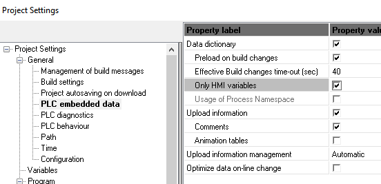

# Послідовність розгортання SA_LibraryPFW з використанням PACFramework Tools

Дані методичні рекомендації варто використовувати як рекомендовану процедуру розгортання. Необхідно розуміти, що використовувана бібліотека змінюватиметься в процесі виправлення помилок або добавленні нових компонентів. Також може змінюватися проект для прикладу в ПЛК та і самі рекомендації. Актуальна версія завжди лежить на репозиторії.

Опис утиліт розгортання знаходиться за [наступним посиланням](https://github.com/pupenasan/pacframework-tools/blob/main/citect.md).

## 1. Створення проекту на базі SA

- [ ] Запустіть Plant SCADA та створіть новий проект на базі стартового проекту SA, наприклад з назвою `ExamplePFW_depl`
- [ ] Створіть одного користувача з правами (на базі ролі) адміністратора

**Увага, з метою уникнення втрати даних, робіть резервну копію перед виконанням кожного пункту!**

### Для Modbus TCP/IP

- [ ] Створіть необхідні I/O Device, з яким буде відбуватися зв'язок, які використовуються в проекті

- PLC1 Modbus TCP/IP
- PLC2 Modbus TCP/IP

- [ ] Скомпілюйте проект, щоб перевірити що немає помилок
- [ ] Зробіть бекап проекту.

### Для OFS OPC

- [ ] Налаштуйте проект Unity PRO/Control Expert на використання Data Dictionary 



- [ ] Налаштуйте теги що мають бути доступні в Unity PRO/Control Expert, як теги HMI, після чого скомпілюйте проект, зокрема необхідно виставити властивість для таких змінних:
  - PLC
  - SUBMODULE
  - PARASTOHMI
  - MODULES
  - CH_BUF
  - VARBUF
  - AIH
  - DIH
  - DOH
  - AOH
  - ACTH
  - ACTBUF
- [ ]  Налаштуйте OFS через OFS Configuration Tool, зокрема:
  - створіть I/O Device та виставте опцію PLC Embedet data "Using Data dictionary" 

- [ ] Перевірте доступ OFS до об'єктів завантаженого проекту в ПЛК за допомого OFS Client 

- [ ] Створіть необхідні I/O Device, з яким буде відбуватися зв'язок, які використовуються в проекті

- PLC1 - OFS OPC з відповідним посиланням на Alias 
- PLC2 - OFS OPC

- [ ] Скомпілюйте проект, щоб перевірити що немає помилок
- [ ] Зробіть бекап проекту.

## 2. Завантаження та встановлення PACFramework Tools

Каркас НЕ передбачає обов'язкове використання утиліт розгортання (PACFramework tools), але це значно пришвидшує розробку. Тому в даній роботі передбачається використання автоматичних утиліт розгортання [pacframework-tools](https://github.com/pupenasan/pacframework-tools).

- [ ] Встановіть утиліти, як це описано в [репозиторії](https://github.com/pupenasan/pacframework-tools), скористайтеся рекомендованим скриптом
- [ ] Перейдіть до створеної директорії в домашній папці, створіть там директорію з іменем `source`
- [ ] Відкрийте файл налаштування `config.ini` перевірте і виправте налаштування і збережіть файл. Нижче наведений приклад розділу  citecttools

```ini
[citecttools]
plcsourcepath = C:\Users\user\pacframeworktools\source; місце для xlst 
pathresult = C:\Users\user\pacframeworktools\result ; місце для проміжних файлів 
pathlog = C:\Users\user\pacframeworktools\log
pathmasterdbf = C:\ProgramData\AVEVA Plant SCADA 2020 R2\User
ctprojectname = ExamplePFW_depl
pfwincludename = SA_LibraryPFW
;iodevicename = PLC1, PLC2; ; перелік IODeviceName
cntelemetspergenie = dicnt:8,docnt:8,aicnt:4,aocnt:4 ;кількість елементів на кожен джин
cntactspergenie = 7; кількість ВМ на кожен джин
fpcontentforequipments = {"AIVAR_HMI":"FP_AI", "":""};{"eqtype":"FP"}
eqspacenaming = hierarchical; розбиття на Equipment за _
```

- [ ] У файлі `config.ini`  необхідно також вказати налаштування для кожного iodevice в залежності від типу файлу імпорту 

### Для xef

```ini
; для кожного ПЛК свій підрозділ
[citecttools.plc1]
xeffile = plc1 ; plc1.xef
iodevicename = PLC1 ;IODeviceName
EQprefix = Cell1

[citecttools.plc2]
xeffile = plc2 ; plc2.xef
iodevicename = PLC2
EQprefix = Cell2
```

### Для zef

```ini
; для кожного ПЛК свій підрозділ
[citecttools.plc1]
zeffile = plc1 ; plc1.zef
iodevicename = PLC1 ;IODeviceName
EQprefix = Cell1

[citecttools.plc2]
zeffile = plc2 ; plc2.zef
iodevicename = PLC2
EQprefix = Cell2
```


## 3. Формування вихідних даних для PACFramework Tools

Для розгортання проекту необхідно в ресурсну директорію помістити файли експортів проектів ПЛК. Нижче розглядається тільки проекти експорту з Unity PRO (Control Expert). Щодо інших варіантів платформ, уточнюйте у розробників або читайте відповідні розділи репозиторію.

- [ ] Відкрийте перший проект Unity PRO (Control Expert) і зробіть експорт проекту в папку що вказана в ini-файлі як `plcsourcepath` та іменем, що вказаний в налаштуваннях  `config.ini`  (див вище). Підтримуються формати експорту `.xef` та `.zef` , наприклад `plc1.xef`
- [ ] повторіть те саме з іншими проектами, наприклад з іменем  `plc2.xef`

## 4. Включення SA_LibraryPFW

- [ ] Завантажте останню версію `SA_LibraryPFW`, який містить усі необхідні скрипти та бібліотечні елементи, та відновіть в робочий простір Citect 
- [ ] Включіть проект `SA_LibraryPFW` у свій власний

**Увага! Даний проект не буде компілюватися, якщо після цього пункту не зробити мінімальні дії щодо створення Equipments.**

## 5. Формування Equipment

Є дві групи утиліти PACFramework Tools для роботи з Citect SA:

- робота з базою даних проекту
- робота з графікою

Ці утиліти запускаються окремо, так як виконують різного роду діяльність і часто потребують діяльності розробника. 

- [ ] Запустіть утиліту формування Equipment:

```bash
node index citectcreateeqip
```

- [ ] Подивіться в консолі утиліти журнал помилок (починаються з `ERR:`,  `WRN:`), якщо помилок немає, перейдіть до наступного пункту
- [ ] Відкрийте Equipment Editor. Зверніть увагу як розмістился Equipment. Після формування об'єкти можна розмістити у відповідному місці ієрархії пізніше. У демонстраційному проекті це робити не обов'язково.

## 6. Генерування тегів

- [ ]  В Citect зробіть `Update Equipment`
- [ ] Зробіть компілювання проекту. Якщо помилок немає переходьте до наступного пункту.

## 7. Генерування джинів для HMI

- [ ] Запустіть утиліту формування Genie для налагодження:

```bash
node index citectcreatehmi
```

Утиліта може працювати кілька хвилин, процес формування джинів можна проконтролювати відкривши Graphics Builder. Утиліта буде створювати джини зі згрупованих та привязаних джинів для всіх обєктів PFW, для всіх ПЛК. Також в аргументі можна вказати назву плк.

- [ ] Дочекайтеся повідомлення про формування джинів. Не повинно бути ніяких повідомлень, окрім результату формування джинів формату:

```
Genie AIVAR1 saved
```

Враховуючи, що у випадку змін необхідно змінювати тільки частину сторінок налагодження каркасу, окрім команди `citectcreatehmi` є також наступні команди:

- `node index citectcreatevarhmi` - карта змінних 
- `node index citectcreateplcmaphmi` - карта каналів ПЛК
- `node index citectcreateacthmi` - конфігурування виконавчих механізмів

## 8. Створення сторінок HMI

- [ ] Створіть кілька сторінок для розміщення джинів. Рекомендується за наступним форматом (PLCx - назва PLC):
  - [ ] PLCx_AIVAR1 ...PLCx_AIVARn - сторінки для налагодження AIVAR 
  - [ ] PLCx_DIVAR1 ...PLCx_DIVARn - сторінки для налагодження DIVAR 
  - [ ] PLCx_AOVAR1 ...PLCx_AOVARn - сторінки для налагодження AOVAR 
  - [ ] PLCx_DOVAR1 ...PLCx_DOVARn - сторінки для налагодження AOVAR 
  - [ ] PLCx_PLCMAPs...PLCx_PLCMAPs - сторінки для налагодження каналів
  - [ ] Кілька сторінок для налагодження ВМ

- [ ] Розмістіть на сторінках створені джини та джин буферу відповідного типу. Буфери прив'яжуть до відповідних змінних. Принцип створення сторінок наведений в [прикладі ручного розгортання](deployex1.md)  

| Сторінка     | Створений джин |      |
| ------------ | -------------- | ---- |
| PLCx_PLCMAPs | PLCx_Rn        |      |
| PLCx_AIVAR   | PLCx_AIVARn    |      |
| PLCx_DIVAR   | PLCx_DIVARn    |      |
| PLCx_DOVAR   | PLCx_DOVARn    |      |
| PLCx_AOVAR   | PLCx_AOVARn    |      |


- [ ] У розділі Citect Visualization->Menu Configuration створіть пункти меню Navigation 

## 9. Запуск проекту

- [ ] Скомпілюйте проект
- [ ] Запустіть проект на виконання, при першому запуску налаштуйте майстер 

## Послідовність зміни проекту на базі SA_LibraryPFW з використанням PACFramework Tools

Нижче наведена послідовність повторного розгортання проекту з використанням безкоштовної утиліти PACFramework Tools за умови що проект вже розгортався.

- [ ] Відкрийте Unity PRO (Control Expert) і зробіть експорт проекту в папку що вказана в ini-файлі як `plcsourcepath` та відповідним іменем, що вказані в конфігурації
- [ ] Запустіть утиліту формування Equipment (**УВАГА! Існуючі Equipment, які були видалені в проекті ПЛК з Citect не видаляються!**):

- Усіх Equipment, якщо потрібно змінити все:

```bash
node index citectcreateeqip
```

- Потрібні Equipment, які необхідно змінити, у цьому випадку запустіть ті утиліти, які потрібноз списку:
  - `citectcreatevareqip` - для технологічних змінних
  - `citectcreatemoduleeqip` - для карти каналів ПЛК
  - `citectcreateacteqip` - для ВМ

- [ ] В Citect зробіть `Update Equipment`.
- [ ] Видаліть непотрібні (старі) Equipment, якщо їх не планується задіювати в проекті 
- [ ] Зробіть компілювання проекту. Якщо помилок немає переходьте до наступного пункту.

- [ ] Запустіть утиліту формування Genie для налагодження для вибраного Вами варіанту:

- Якщо треба обновити усі джини для PACFramework:

```bash
node index citectcreatehmi
```

- Якщо треба обновити тільки вибрані джини для PACFramework:

- `citectcreatevarhmi` - для налагодження технологічних змінних
- `citectcreateplcmaphmi` - для налагодження карти ПЛК
- `citectcreateacthmi` - для налагодження ВМ

- [ ] В редакторі графіки запустіть оновлення усіх сторінок
- [ ] Скомпілюйте проект

## Короткі замітки 

Коротко для зміни проекту:

1) PFWTools

```bash
node index citectcreateeqip
```

2) Update Equipment (зняти опцію інкрементального оновлення)
3) PFWTools

```bash
node index citectcreatehmi
```

4) Update Pages

