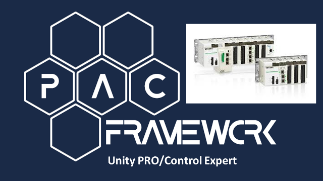

# Реалізація в Uinity PRO/Control Expert

Дана частина репозиторію призначена для опису особливостей реалізації в Uinity PRO/Control Expert та містить бібліотечні елементи.

## Бібліотечні елементи

До стандартних бібліотечних елементів відносяться наступні файли та їх зміст: 

- [plcfn.xdb](plcfn.xdb) -  експортний варіант типу функціонального блоку `PLCFN`, включає також тип `PLC_CFG`
- [chfns.xsy](chfns.xsy) - експортний варіант функціональних блоків `CHAIFN`, `CHAOFN`, `CHDIFN`, `CHDOFN` та однойменних типів
- [module.xdd](module.xdd) - DDT тип `MODULE`  
- [submodule.xdd](submodule.xdd) - DDT тип `SUBMODULE`
- [moduls.xst](moduls.xst) - експортний варіант SR секції `MODULS` 
- [varfns.xsy](varfns.xsy) - екземпляри і типи функціональних блоків `AIVARFN`, `AOVARFN`, `DIVARFN`, `DOVARFN`
- [actfns.xsy](actfns.xsy) - експортний варіант кількох функціональних блоків стандартних ВМ типу `VLVAFN`, `VLVDFN`, та `DRVFN` та однойменних типів

- [plc.xcr](plc.xcr) - експортний варіант операторського екрану з відображенням статусних бітів
- [moduls.xcr](moduls.xcr) - експортний варіант операторського екрану-шаблону для PLCMAPS 
-  [aivar.xcr](aivar.xcr), [divar.xcr](divar.xcr), [aovar.xcr](aovar.xcr), [dovar.xcr](dovar.xcr)  
-  [vlvd.xcr](vlvd.xcr), [vlva.xcr](vlva.xcr), [drv.xcr](drv.xcr) 

При зміні (виявленні багу або модифікації) ці файли необхідно оновлювати. 

## Додаткові елементи, що не є частиною каркасу  

- [sim_wthout_framework.xef](sim_wthout_framework.xef) - експортний варіант проекту з імітацією установки але без розгорнутого каркасу  

## Опис бібліотечних елементів

- [plc](plc.md)
- [cm0](cm_0.md)
- [cm1](cm_1.md)
- [cm2](cm_2.md)

## Завантаження базової бібліотеки PACFramework

Тут описані дії, які потрібні для розгортання бібліотеки PACFramework для нового проекту  

- [ ] Створіть проект в Uinity PRO/Control Expert

- [ ] Імпортуйте в `TASK->MAST->Logic` файл [lib.xst](lib.xst)

- [ ] адаптуйте проект під свої потреби

## Приклади розгортання PACFramework

Нижче наведено кілька варіантів прикладів розгортання PACFramework на імітаційній установці.

1) [Приклад](deployex1.md) розгортання демо-проекту з імітатором та PACFramework tools. Даний приклад рекомендується для швидкого розгортання демо-проекту. Це не є готовим проектом, а показує усі кроки, які необхідно виконати розробнику ПЗ для ПЛК при наявності майстерданих у форматі Excel.

2) [Навчальний приклад](deployex2.md) розгортання проекту. Тут розглядається приклад поступового розгортання проекту в Uinity PRO/Control Expert, який рекомендується робити для кращого розуміння роботи каркасу.

Готовий проект після розгортання доступний [за посиланням](pacexample.xef)     

