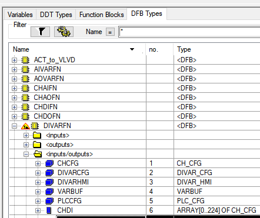
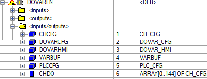
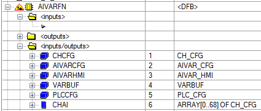
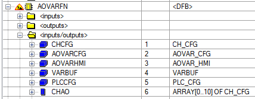

# Приклад розгортання демо-проекту з імітатором та PFwTools

Тут описані дії, які потрібні для розгортання базового проекту PACFramework на прикладі демо-проекту з використанням  PACFramework Tools (PFwTools).  

Даний приклад рекомендується для швидкого розгортання демо-проекту або свого проекту. Це не є готовим проектом, а показує усі кроки, які необхідно виконати розробнику ПЗ для ПЛК при наявності майстерданих у форматі Excel.

## 1. Створення проекту з імітацією установки

### Створення власного проекту

Цей пункт передбачає створення власного проекту.

- [ ] Створіть власний проект у середовищі Unity PRO/Control Expert
- [ ] Зробіть конфігурування апаратної частини (це можна зробити і на пізніших стадіях) 

### Використання демонастраційного проекту

Цей пункт передбачає створення проекту на базі демонстраційного.  

- [ ] Завантажте файл `sim_wthout_framework.xef` за [цим посиланням](sim_wthout_framework.xef) та створіть на базі них проект Unity PRO або Control Expert
- [ ] Перейдіть в режим імітації ПЛК: `PLC -> Simulation Mode`
- [ ] Зробіть компіляцію проекту `Build -> Rebuild All Project`.
- [ ] Збережіть проект у форматі STU з іменем напрриклад `pacexample_depl.stu` на диску для наступного його використання.
- [ ] З'єднайтеся з імітатором ПЛК: `PLC->Connect`. У результаті повинен запуститися імітатор ПЛК.
- [ ] Завантажте проект в імітатор ПЛК: `PLC->Transfer Project to PLC`
- [ ] Запустіть на виконання програму в імітаторі: `PLC->RUN`. 
- [ ] Проект включає операторський екран UNITY PRO для відображення/керування відділеннями (рис). Перевірте роботу установки в ручному режимі. Детальніше про роботу установки описано в [іншому файлі](simul_descr). 


рис.1.

## 2. Завантаження базової бібліотеки PACFramework

- [ ] Перейдіть в режим офлайн, якщо Ви знаходетеся в режимі онлайн
- [ ] Імпортуйте в `TASK->MAST->Logic` файл [lib.xst](lib.xst)

Для точного підрахунку лічильників часу передбачається використання FAST задачі. Враховуючи що ця задача може використовуватися для власних цілей, секція для підрахунку повинна бути створена розробником самостійно.

- [ ] Створіть задачу FAST та секцію в ній, наприклад з назвою `RT`.


Рис.2. Створення задачі FAST

- [ ] Запишіть в секцію код, який буде інкрементувати лічильник `PLC.TQMS` на значення, рівне  часу задачі FAST.

```
PLC.TQMS := PLC.TQMS + 5;
```

- [ ] Зробіть компіляцію і завантажте проект в імітатор ПЛК. Запустіть на виконання.
- [ ] Помістіть змінну PLC в анімаційну таблицю.
- [ ] Проконтролюйте що `PLC.TQ` змінюється раз в секунду, а `PLC.TQMS` показує мілісекунди.

- [ ] Скомпілюйте проект. Якщо проект компілюється перейдіть до виконання наступного пункту.

- [ ] Збережіть проект на диску. 

## 3. Завантаження PACFramework tools

Каркас НЕ передбачає обов'язкове використання утиліт розгортання (PACFramework tools), але це значно пришвидшує розробку. Тому в даному способі передбачається використання автоматичних утиліт розгортання [pacframework-tools](https://github.com/pupenasan/pacframework-tools) (надалі PFwTools).

- [ ] Встановіть утиліти, як це описано в [репозиторії](https://github.com/pupenasan/pacframework-tools), скористайтеся рекомендованим скриптом
- [ ] Перейдіть до створеної директорії в домашній папці, створіть там директорію з іменем `source`
- [ ] Відкрийте файл налаштування `config.ini` перевірте чи посилається параметр `pathsource` розділу `[exceltools]` на вказану папку, а `pathxlsfile` на файл  `masterdata.xlsx` якщо ні - виправте і збережіть файлі `config.ini` :

```ini
[exceltools]
pathsource = C:\Users\user\pacframeworktools\source
pathresult = C:\Users\user\pacframeworktools\result
pathlog = C:\Users\user\pacframeworktools\log
pathxlsfile = masterdata.xlsx
```

## 4. Майстердані masterdata.xlsx

Для конфігурування даних для розгортання можна скористатися електронною таблицею з майстерданими, у майбутніх версіях PFwTools передбачаються і інші варіанти. Для PFwTools  для цього використовується `masterdata.xlsx`, який означується за певним  форматом.  

### Використання власного проекту

- [ ] Завантажте файл [masterdata.xlsx](https://docs.google.com/spreadsheets/d/1GvttNOH74X2o9y0fh_qxQCHhfdFszx7m/edit?usp=sharing&ouid=111751208742846482260&rtpof=true&sd=true) в папку `source` яку ви створили в попередньому пункті
- [ ] Ознайомтеся зі змістом, скориставшись допомогою за [цим посиланням](https://github.com/pupenasan/pacframework-tools/blob/main/masterdataxls.md)
- [ ] Змініть masterdata.xlsx відповідно до Ваших завдань

### Використання демонстраційного проекту

- [ ] Завантажте файл [masterdata.xlsx](https://docs.google.com/spreadsheets/d/1GvttNOH74X2o9y0fh_qxQCHhfdFszx7m/edit?usp=sharing&ouid=111751208742846482260&rtpof=true&sd=true) в папку `source` яку ви створили в попередньому пункті
- [ ] Відкрийте його для перегляду (якщо немає Excel на комп'ютері - подивіться в онлайні через браузер на гугл-диску)
- [ ] Ознайомтеся зі змістом, скориставшись допомогою за [цим посиланням](https://github.com/pupenasan/pacframework-tools/blob/main/masterdataxls.md)
- [ ] Зверніть увагу, що на зкаладці `other` розміщуються початкові адреси змінних, які повинні бути доступні для HMI. 

## 5. Генерування файлів для бази рівня PACFramework для проекту

- [ ] Для демонстрайного проекту можна використовувати операторські екрнаи в Unity PRO. Однак для рельних проектів велкий обсяг даних не дозволяє використовувати великі операторські екрани Unity PRO. Якщо Ви хочете егенрувати екрани в демонстраційному проекті, то скопіюйте в папку `source` наступні файли для оператрських екранів з репозиторію:
  - [aivar.xcr](aivar.xcr)
  - [aovar.xcr](aovar.xcr)
  - [divar.xcr](divar.xcr)
  - [dovar.xcr](dovar.xcr)
  - [vlva.xcr](vlva.xcr)
  - [vlvd.xcr](vlvd.xcr)
  - [moduls.xcr](moduls.xcr)

- [ ] Запустіть командний рядок, якщо він не запущений
- [ ] У командному рядку перейдіть в папку з розгорнутим застосунком pacframework-tools, наприклад  

```
cd C:\pacfwtools
```

- [ ] Викличте команду генерування усіх файлів імпорту з майстерданих

```bash
node C:\pacfwtools\node_modules\pacframework-tools\index seuncreateall
```

- [ ] У консолі повинно вивести ряд повідомлень про створення змінних та секцій а також інших компонентів. 
- [ ] Почитайте повідомлення, подивіться чи немає там помилок. Зверніть увау на повідмлення що виділені префіксами:
  -  `ERR` - критична помилка, за якою програма працюватиме некоректно
  -  `WRN` - некритична помилка, далі робота можлива, якщо помилка не є критичною для користувача 
  - `ATTENTION` - не є помилкою, повідомлення щоб користувач звернув увагу, що його треба зробити

- [ ] Зверніть увагу на наступне повідомлення:

```
08:29:10.30 ATTENTION: Масив в параметрах функціях виклику повинен бути розмірів:
08:29:10.31 DI/NDI:224 DO/NDO:144 AI/NAI:68 AO/NAO:10
```

Це вказує на необхідність заданні в проекті масивів відповідного розміру. Зверніть увагу на ці значення в наступному пункті. 

- [ ] Подивіться на зміст папки `tounitypro` в папці з розгорнутим застосунком pacframework-tools. Там повинні зявитися наступні файли, які формуютья pacframework-tools за майстерданими з Excel:
- `xst` - згенеровані файли для імпорту секцій та змінних
- `xcr` - файли для імпорту операторських екранів (якщо використовуються)


## 6. Перше імпортування генерованого проекту єдиним файлом

Є два способи імрпортування: єдиним файлом, або почергово. У цьому пункті пропонується перший варіант.

- [ ] У Unity PRO/Control Expert перейдіть в режим офлайн, якщо до цього були в онлайні. 
- [ ] За необхідності змініть розмірність масивів для  `xxVAR_FN` відповідно до вказаних у повідомленні в попередньому пункті. Наприклад, якщо повідомлення містить текст `DI/NDI:224 DO/NDO:144 AI/NAI:68 AO/NAO:10`, то масиви мають бути наступного формату:

   







- [ ] Імпортуйте в розділ MAST->Logic проекту з папки `tounitypro` файл  `mainPFW.xst`. Погодьтеся на всі зміни (ReplaceALL) та натисніть `Ok` 

  Увага! Для великих проектів імпорт може зайняти кілька хвилин. 


- [ ] За необхідності імпортуйте усі згенеровані файли операторських екранів
- [ ] Скомпілюйте проект. У результаті може бути кілька варіантів помилок, зокрема:
  - [ ] якщо випадає помилка типу `Topological address index is not valid` - у конфігуруванні CPU PLC змініть кількість виділених `%MW` до 3000. 
  - [ ] якщо випадає помилка типу `data types do not match ('CHAI:ARRAY[0..8] OF CH_CFG'<->'CHNAI:ARRAY[0..32] OF CH_CFG')` необхідно змінити розмірність масивів у функціональних блоках `xxVAR_FN` відповідно до тих, що вказані в повідомленні утиліти `seuncreateall`

- [ ] Якщо в проекті є критичні помилки імпорту:
  - [ ] проаналізуйте та визначіть причини помилок
  - [ ] закрийте проект без його збереження
  - [ ] перейдіть до пункту 4 для зміни майстерданих і заново повторіть усі наступні за ним пункти
- [ ] Якщо проект імпортувався успішно, зробіть повне компілювання проекту. Це може зайняти тривалий час. 

## 7. Внесення змін в існуючий проект через майстер дані

Внесення змін в проект передбачає таку послідовність:

- [ ] зміни в майстер даних
- [ ] повторний запуск генерування файлів (п.5)
- [ ] імпортування з заміною тільки тих частин, що змінюється

### Зміна опису тегів

- [ ] достатньо завантажити типи `VARS`, `*_VRAS`

todo

## 8. Імпортування генерованих файлів в проект почергово 

Інколи важливо мати необхідність імпорту деяких генерованих файлів для окремих секцій. У цьому варіанті імпорту показана необхідна послідовність імпорту окремих файлів підпрограм та змінних.    

Необхідно послідовно імпортувати вказані файли. Послідовність має значення, так як деякі змінні імпортуються з першими файлами. Кожний раз при пропозиції співпадіння необхідно замінювати існуючі змінні та структури

- [ ] У Unity PRO/Control Expert перейдіть в режим офлайн, якщо до цього були в онлайні. 
- [ ] Імпортуйте `dichs.xst` , потім `dochs.xst`, `aichs.xst`, `aochs.xst` зі сформованими програми для опитування каналів


- [ ] Імпортуйте `plcmaps.xst` яка мепить канали на модулі
- [ ] Імпортуйте `divars.xst` ,  `aivars.xst` , `dioars.xst`,  `aovars.xst` 


- [ ] Імпортуйте `actrs.xst` та `resolution.xst`
- [ ] Імпортуйте всі згенеровані файли операторських екранів
- [ ] Скомпілюйте проект. У результаті може бути кілька варіантів помилок:
  - [ ] якщо випадає помилка типу `Topological address index is not valid` - у конфігуруванні CPU PLC змініть кількість виділених `%MW` до 3000. 
  - [ ] якщо випадає помилка типу `data types do not match ('CHAI:ARRAY[0..8] OF CH_CFG'<->'CHNAI:ARRAY[0..32] OF CH_CFG')` необхідно змінити розмірність масивів у функціональних блоках `xxVAR_FN` відповідно до тих, що вказані в повідомленні утиліти `seuncreateall`

## 9. Ручна правка

У файлі імпорта що генерує PACFramework знаходиться тільки змінна (проектно-залежна) інформація. Інша частина залишається без змін. Тому змінні, що є однаковими для всіх проектів не змінюються в процесі імпорту. Для цих змінних необхідно вручну виставити адреси, для можливості адресації з боку SCADA/HMI.

- [ ] Виставте наступні адреси для змінних:

| Змінна     | Адреса |
| ---------- | ------ |
| PLC        | %MW50  |
| SUBMODULE  | %MW100 |
| PARASTOHMI | %MW140 |

- [ ] Скомпілюйте проект. 

## 10. Перевірка роботи

- [ ] Завантажте в імітатор та запустіть на виконання.

- [ ] Використовуючи операторські екрани перевірте роботу CM різного рівня.