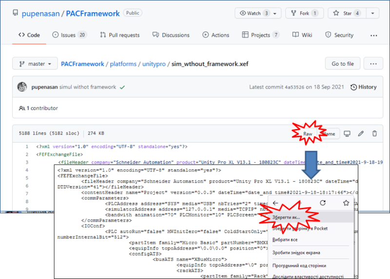

# Приклад розгортання демо-проекту з імітатором та без утиліт автоматизації розгортання

Даний приклад незавершений. 

Тут розглядається приклад поступового розгортання проекту в Uinity PRO/Control Expert, який рекомендується робити для кращого розуміння роботи каркасу.  

У прикладі використовується ПЗ [Unity PRO](https://schneider-electric.app.box.com/s/lgd27nur1rin1hs4x822g8lr6tlr2y82/folder/50504496333) , аналогічно можна використовувати [Control Expert](https://schneider-electric.app.box.com/s/lgd27nur1rin1hs4x822g8lr6tlr2y82/folder/101662336138). За наведеними посиланнями знаходяться пробні версії з ключом активації на 60 діб. Після завершення терміну дане ПЗ більше не буде запускатися навіть після перевстановлення. Тому рекомендується встановлювати його на віртуальну машину. Мінімальна версія потрібного UnityPro_XL_V11 у цій роботі  використовується [Unity PRO 13.1](https://schneider-electric.app.box.com/s/lgd27nur1rin1hs4x822g8lr6tlr2y82/folder/71210166883)

## 1. Підготовка програми імітації об'єкту

Для швидшої розробки навчального проекту пропонується використовувати заздалегідь підготовлений проект з імітацією установки приготування продукту в ємностях (надалі **установка приготування**). Детально про імітаційну установку описано [за цим посиланням](simul_descr.md)

- [ ] Завантажте на диск файл `sim_wthout_framework.xef` за [цим посиланням](https://github.com/pupenasan/PACFramework/blob/master/platforms/unitypro/sim_wthout_framework.xef)

Рис.1. Завантаження проекту імітатора з репозиторію

- [ ] Запустіть на виконання середовище UNITY PRO. 
- [ ] Використовуючи меню `File->Open` та вказавши формат `Unity PRO Application Exchange`, відкрийте проект  `sim_wthout_framework.xef` . 
- [ ] Перейдіть в режим імітації ПЛК: `PLC -> Simulation Mode`
- [ ] Зробіть компіляцію проекту `Build -> Rebuild All Project`.
- [ ] Збережіть проект у форматі STU на диску для наступного його використання.
- [ ] З'єднайтеся з імітатором ПЛК: `PLC->Connect`. У результаті повинен запуститися імітатор ПЛК.
- [ ] Завантажте проект в імітатор ПЛК: `PLC->Transfer Project to PLC`
- [ ] Запустіть на виконання програму в імітаторі: `PLC->RUN`. 

Рис.2. Зовнішній вигляд програми вікна керування 

## 2. Завантаження базової бібліотеки PACFramework

- [ ] Перейдіть в режим офлайн.
- [ ] Імпортуйте в `TASK->MAST->Logic` файл [lib.xst](lib.xst)
- [ ] Скомпілюйте проект. Якщо проект компілюється перейдіть до виконання наступного пункту.

## 3. Ознайомлення зі змістом бібліотеки

Бібліотека містить `mainPFW` та підпрограми `SR` які формують структуру типової програми на базі каркасу. Перегляньте які підпрограми та бібліотечні функціональні блоки є в проекті. 

## 4. Тестування PLCFN

