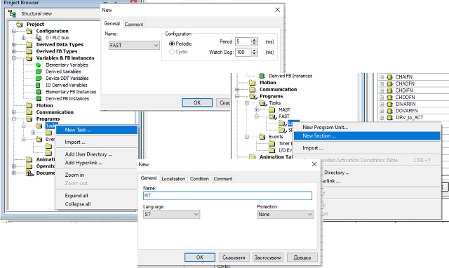

# Приклад розгортання демо-проекту з імітатором та без утиліт автоматизації розгортання

Тут розглядається приклад поступового розгортання проекту в Uinity PRO/Control Expert, який рекомендується робити для кращого розуміння роботи каркасу.  

У прикладі використовується ПЗ [Unity PRO](https://schneider-electric.app.box.com/s/lgd27nur1rin1hs4x822g8lr6tlr2y82/folder/50504496333) , аналогічно можна використовувати [Control Expert](https://schneider-electric.app.box.com/s/lgd27nur1rin1hs4x822g8lr6tlr2y82/folder/101662336138). За наведеними посиланнями знаходяться пробні версії з ключом активації на 60 діб. Після завершення терміну дане ПЗ більше не буде запускатися навіть після перевстановлення. Тому рекомендується встановлювати його на віртуальну машину. Мінімальна версія потрібного UnityPro_XL_V11 у цій роботі  використовується [Unity PRO 13.1](https://schneider-electric.app.box.com/s/lgd27nur1rin1hs4x822g8lr6tlr2y82/folder/71210166883)

## 1. Підготовка програми імітації об'єкту

Для швидшої розробки навчального проекту пропонується використовувати заздалегідь підготовлений проект з імітацією установки приготування продукту в ємностях (надалі **установка приготування**). Детально про імітаційну установку описано [за цим посиланням](simul_descr.md)

- [ ] Завантажте на диск файл `sim_wthout_framework.xef` за [цим посиланням](https://github.com/pupenasan/PACFramework/blob/master/platforms/unitypro/sim_wthout_framework.xef)


Рис.1. Завантаження проекту імітатора з репозиторію

- [ ] Запустіть на виконання середовище UNITY PRO. 
- [ ] Використовуючи меню `File->Open` та вказавши формат `Unity PRO Application Exchange`, відкрийте проект  `sim_wthout_framework.xef` . 
- [ ] Перейдіть в режим імітації ПЛК: `PLC -> Simulation Mode`
- [ ] Зробіть компіляцію проекту `Build -> Rebuild All Project`.
- [ ] Збережіть проект у форматі STU на диску для наступного його використання.
- [ ] З'єднайтеся з імітатором ПЛК: `PLC->Connect`. У результаті повинен запуститися імітатор ПЛК.
- [ ] Завантажте проект в імітатор ПЛК: `PLC->Transfer Project to PLC`
- [ ] Запустіть на виконання програму в імітаторі: `PLC->RUN`. 


Рис.2. Зовнішній вигляд програми вікна керування 

## 2. Завантаження базової бібліотеки PACFramework

- [ ] Завантажте останню версію бібліотеки [lib.xst](https://github.com/pupenasan/PACFramework/blob/master/platforms/unitypro/lib.xst), аналогічно як ви робили в попередньому пункті
- [ ] Перейдіть в режим офлайн.
- [ ] Імпортуйте в `TASK->MAST->Logic` файл [lib.xst](lib.xst)
- [ ] Скомпілюйте проект. Якщо проект компілюється збережіть його і перейдіть до виконання наступного пункту.

## 3. Ознайомлення зі змістом бібліотеки

Бібліотека містить `mainPFW` та підпрограми `SR` які формують структуру типової програми на базі каркасу. 

- [ ] Перегляньте які підпрограми та бібліотечні функціональні блоки є в проекті.
- [ ] Перегляньте `mainPFW`
- [ ] Ознайомтеся з типами та екземплярами даних бібліотеки 

## 4. Добавлення та перевірка роботи лічильника реального часу PLCFN

Для точного підрахунку лічильників часу передбачається використання FAST задачі. Враховуючи що ця задача може використовуватися для власних цілей, секція для підрахунку повинна бути створена розробником самостійно.

- [ ] Створіть задачу FAST та секцію в ній, наприклад з назвою `RT`.



Рис.3. Створення задачі FAST

- [ ] Запишіть в секцію код, який буде інкрементувати лічильник `PLC.TQMS` на значення, рівне  часу задачі FAST.

```
PLC.TQMS := PLC.TQMS + 5;
```

- [ ] Зробіть компіляцію і завантажте проект в імітатор ПЛК. Запустіть на виконання.
- [ ] Помістіть змінну PLC в анімаційну таблицю.
- [ ] Проконтролюйте що `PLC.TQ` змінюється раз в секунду, а `PLC.TQMS` показує мілісекунди.

## 5. Розгортання каналів

- [ ] ознайомтеся з апаратною конфігурацією та визначте кількість фізичних входів/виходів які використовуються в тестовому проекті.

В тестовому проекті використовується наступні модулі, які представлені в апаратній конфігурації PLC_1 (Рис.4) і вміщують наступну кількість входів/виходів: 32 дискретних входів, 32 дискретні виходи, 8 аналогових входів та 4 аналогових виходів.


Рис.4. Апаратна конфігурація ПЛК в тестовому проекті.

### Налаштування кількості каналів

У експортному варіанті бібліотеки вже реалізовано певна кількість необхідних змінних, проте необхідно налаштувати їх деякі поля, а також налаштувати розмірність масивів. Конфігураційні змінні представлені у вигляді масивів з назвою відповідно до класу CHDI, CHDO, CHAI, CHAO, розмірність масиву від 0 до кількості каналів класу.  Для передачі на людино-машинний інтерфейс HMI змінні каналів представлені у вигляді масивів з назвою відповідно до класу CHDI_HMI, CHDO_HMI, CHAI_HMI, CHAO_HMI, розмірність масиву від 0 до кількості каналів класу.

- [ ] Налаштуйте змінні-масиви для забезпечення роботи каналів з конфігураційними параметрами CFG та передачі на людино-машинний інтерфейс HMI (Рис. 5.)
  - CHDI - Array[0..32] of CH_CFG, 
  - CHDO - Array[0..32] of CH_CFG, 
  - CHAI - Array[0..8] of CH_CFG, 
  - CHAO - Array[0..8] of CH_CFG
  - CHDI_HMI - Array[0..32] of CH_HMI, 
  - CHDO_HMI - Array[0..32] of CH_HMI, 
  - CHAI_HMI - Array[0..8] of CH_HMI, 
  - CHAO_HMI - Array[0..8] of CH_HMI


Рис.5. Налаштування розмірності масиву каналів

Для коректної обробки фізичних каналів необхідно означити їх кількість в структурі PLCCFG. За дану інформацію відповідають наступні змінні `PLCCFG.DICNT`, `PLCCFG.DOCNT`, `PLCCFG.AICNT` та `PLCCFG.AOCNT`. Ініціалізація цих змінних відбувається в SR секції  `A_plcmaps` , яка викликається 1 раз при старті контролера і призначена для ініціалізації фізичних каналів, модулів ПЛК і т.д. 

- [ ] Відкрийте секцію `A_plcmaps` та за необхідності змініть значення змінних на необхідні(Рис.6.).


Рис.6. Налаштування ініціалізації змінних кількості фізичних каналів ПЛК.

- [ ] Для того щоб змінні обновилися необхідно зупинити та запустити ПЛК.

### Дискретні вхідні канали ПЛК

- [ ] Відкрийте SR обробки дискретних входів `A_dichs` та проаналізуйте код фрагменту програми. 

Він складається з 2-х частин (рис.7). У першій виставляється ID та CLSID за замовченням у тому випадку, якщо він не означений для конкретної змінної каналу. У 2-й обробляється по одному каналу з кожної змінної. 


Рис.7. Обробка дискретних вхідних каналів ПЛК.

- [ ] Змініть секцію так, щоб оброблялися усі дискретні канали.

```pascal
(*для кожного каналу виклик ФБ з вказівкою змінної каналу*)
CHDIFN (RAW := %i0.1.0,  CHCFG := CHDI[1],  CHHMI := CHDI_HMI[1],  PLCCFG := PLC, CHBUF := CH_BUF);
CHDIFN (RAW := %i0.1.1,  CHCFG := CHDI[2],  CHHMI := CHDI_HMI[2],  PLCCFG := PLC, CHBUF := CH_BUF);
CHDIFN (RAW := %i0.1.2,  CHCFG := CHDI[3],  CHHMI := CHDI_HMI[3],  PLCCFG := PLC, CHBUF := CH_BUF);
CHDIFN (RAW := %i0.1.3,  CHCFG := CHDI[4],  CHHMI := CHDI_HMI[4],  PLCCFG := PLC, CHBUF := CH_BUF);
CHDIFN (RAW := %i0.1.4,  CHCFG := CHDI[5],  CHHMI := CHDI_HMI[5],  PLCCFG := PLC, CHBUF := CH_BUF);
CHDIFN (RAW := %i0.1.5,  CHCFG := CHDI[6],  CHHMI := CHDI_HMI[6],  PLCCFG := PLC, CHBUF := CH_BUF);
CHDIFN (RAW := %i0.1.6,  CHCFG := CHDI[7],  CHHMI := CHDI_HMI[7],  PLCCFG := PLC, CHBUF := CH_BUF);
CHDIFN (RAW := %i0.1.7,  CHCFG := CHDI[8],  CHHMI := CHDI_HMI[8],  PLCCFG := PLC, CHBUF := CH_BUF);
CHDIFN (RAW := %i0.1.8,  CHCFG := CHDI[9],  CHHMI := CHDI_HMI[9],  PLCCFG := PLC, CHBUF := CH_BUF);
CHDIFN (RAW := %i0.1.9,  CHCFG := CHDI[10],  CHHMI := CHDI_HMI[10],  PLCCFG := PLC, CHBUF := CH_BUF);
CHDIFN (RAW := %i0.1.10,  CHCFG := CHDI[11],  CHHMI := CHDI_HMI[11],  PLCCFG := PLC, CHBUF := CH_BUF);
CHDIFN (RAW := %i0.1.11,  CHCFG := CHDI[12],  CHHMI := CHDI_HMI[12],  PLCCFG := PLC, CHBUF := CH_BUF);
CHDIFN (RAW := %i0.1.12,  CHCFG := CHDI[13],  CHHMI := CHDI_HMI[13],  PLCCFG := PLC, CHBUF := CH_BUF);
CHDIFN (RAW := %i0.1.13,  CHCFG := CHDI[14],  CHHMI := CHDI_HMI[14],  PLCCFG := PLC, CHBUF := CH_BUF);
CHDIFN (RAW := %i0.1.14,  CHCFG := CHDI[15],  CHHMI := CHDI_HMI[15],  PLCCFG := PLC, CHBUF := CH_BUF);
CHDIFN (RAW := %i0.1.15,  CHCFG := CHDI[16],  CHHMI := CHDI_HMI[16],  PLCCFG := PLC, CHBUF := CH_BUF);

CHDIFN (RAW := %i0.3.0,  CHCFG := CHDI[17],  CHHMI := CHDI_HMI[17],  PLCCFG := PLC, CHBUF := CH_BUF);
CHDIFN (RAW := %i0.3.1,  CHCFG := CHDI[18],  CHHMI := CHDI_HMI[18],  PLCCFG := PLC, CHBUF := CH_BUF);
CHDIFN (RAW := %i0.3.2,  CHCFG := CHDI[19],  CHHMI := CHDI_HMI[19],  PLCCFG := PLC, CHBUF := CH_BUF);
CHDIFN (RAW := %i0.3.3,  CHCFG := CHDI[20],  CHHMI := CHDI_HMI[20],  PLCCFG := PLC, CHBUF := CH_BUF);
CHDIFN (RAW := %i0.3.4,  CHCFG := CHDI[21],  CHHMI := CHDI_HMI[21],  PLCCFG := PLC, CHBUF := CH_BUF);
CHDIFN (RAW := %i0.3.5,  CHCFG := CHDI[22],  CHHMI := CHDI_HMI[22],  PLCCFG := PLC, CHBUF := CH_BUF);
CHDIFN (RAW := %i0.3.6,  CHCFG := CHDI[23],  CHHMI := CHDI_HMI[23],  PLCCFG := PLC, CHBUF := CH_BUF);
CHDIFN (RAW := %i0.3.7,  CHCFG := CHDI[24],  CHHMI := CHDI_HMI[24],  PLCCFG := PLC, CHBUF := CH_BUF);
CHDIFN (RAW := %i0.3.8,  CHCFG := CHDI[25],  CHHMI := CHDI_HMI[25],  PLCCFG := PLC, CHBUF := CH_BUF);
CHDIFN (RAW := %i0.3.9,  CHCFG := CHDI[26],  CHHMI := CHDI_HMI[26],  PLCCFG := PLC, CHBUF := CH_BUF);
CHDIFN (RAW := %i0.3.10,  CHCFG := CHDI[27],  CHHMI := CHDI_HMI[27],  PLCCFG := PLC, CHBUF := CH_BUF);
CHDIFN (RAW := %i0.3.11,  CHCFG := CHDI[28],  CHHMI := CHDI_HMI[28],  PLCCFG := PLC, CHBUF := CH_BUF);
CHDIFN (RAW := %i0.3.12,  CHCFG := CHDI[29],  CHHMI := CHDI_HMI[29],  PLCCFG := PLC, CHBUF := CH_BUF);
CHDIFN (RAW := %i0.3.13,  CHCFG := CHDI[30],  CHHMI := CHDI_HMI[30],  PLCCFG := PLC, CHBUF := CH_BUF);
CHDIFN (RAW := %i0.3.14,  CHCFG := CHDI[31],  CHHMI := CHDI_HMI[31],  PLCCFG := PLC, CHBUF := CH_BUF);
CHDIFN (RAW := %i0.3.15,  CHCFG := CHDI[32],  CHHMI := CHDI_HMI[32],  PLCCFG := PLC, CHBUF := CH_BUF);
```

- [ ] Скомпілюйте проект і завантажте зміни в імітатор ПЛК. Проаналізуйте які з дискретних входів в стані логічної одиниці, а які в нулі. Виберіть по одній змінній  CHDI в таблицю анімації. 


Рис.8. Перевірка роботи каналів

- [ ] Проаналізуйте стан полів змінних. За бажанням зробіть тестування певних функцій, наприклад форсування.

### Дискретні вихідні канали ПЛК

- [ ] За аналогією з DICH в SR `Do_chs`  налаштуйте обробку вихідних каналів ПЛК 

```pascal
(*для кожного каналу виклик ФБ з вказівкою змінної каналу*)
CHDOFN (CHCFG := CHDO[1],  CHHMI := CHDO_HMI[1],  PLCCFG := PLC, CHBUF := CH_BUF, RAW => %Q0.1.16);
CHDOFN (CHCFG := CHDO[2],  CHHMI := CHDO_HMI[2],  PLCCFG := PLC, CHBUF := CH_BUF, RAW => %Q0.1.17);
CHDOFN (CHCFG := CHDO[3],  CHHMI := CHDO_HMI[3],  PLCCFG := PLC, CHBUF := CH_BUF, RAW => %Q0.1.18);
CHDOFN (CHCFG := CHDO[4],  CHHMI := CHDO_HMI[4],  PLCCFG := PLC, CHBUF := CH_BUF, RAW => %Q0.1.19);
CHDOFN (CHCFG := CHDO[5],  CHHMI := CHDO_HMI[5],  PLCCFG := PLC, CHBUF := CH_BUF, RAW => %Q0.1.20);
CHDOFN (CHCFG := CHDO[6],  CHHMI := CHDO_HMI[6],  PLCCFG := PLC, CHBUF := CH_BUF, RAW => %Q0.1.21);
CHDOFN (CHCFG := CHDO[7],  CHHMI := CHDO_HMI[7],  PLCCFG := PLC, CHBUF := CH_BUF, RAW => %Q0.1.22);
CHDOFN (CHCFG := CHDO[8],  CHHMI := CHDO_HMI[8],  PLCCFG := PLC, CHBUF := CH_BUF, RAW => %Q0.1.23);
CHDOFN (CHCFG := CHDO[9],  CHHMI := CHDO_HMI[9],  PLCCFG := PLC, CHBUF := CH_BUF, RAW => %Q0.1.24);
CHDOFN (CHCFG := CHDO[10],  CHHMI := CHDO_HMI[10],  PLCCFG := PLC, CHBUF := CH_BUF, RAW => %Q0.1.25);
CHDOFN (CHCFG := CHDO[11],  CHHMI := CHDO_HMI[11],  PLCCFG := PLC, CHBUF := CH_BUF, RAW => %Q0.1.26);
CHDOFN (CHCFG := CHDO[12],  CHHMI := CHDO_HMI[12],  PLCCFG := PLC, CHBUF := CH_BUF, RAW => %Q0.1.27);
CHDOFN (CHCFG := CHDO[13],  CHHMI := CHDO_HMI[13],  PLCCFG := PLC, CHBUF := CH_BUF, RAW => %Q0.1.28);
CHDOFN (CHCFG := CHDO[14],  CHHMI := CHDO_HMI[14],  PLCCFG := PLC, CHBUF := CH_BUF, RAW => %Q0.1.29);
CHDOFN (CHCFG := CHDO[15],  CHHMI := CHDO_HMI[15],  PLCCFG := PLC, CHBUF := CH_BUF, RAW => %Q0.1.30);
CHDOFN (CHCFG := CHDO[16],  CHHMI := CHDO_HMI[16],  PLCCFG := PLC, CHBUF := CH_BUF, RAW => %Q0.1.31);

CHDOFN (CHCFG := CHDO[17],  CHHMI := CHDO_HMI[18],  PLCCFG := PLC, CHBUF := CH_BUF, RAW => %Q0.3.16);
CHDOFN (CHCFG := CHDO[18],  CHHMI := CHDO_HMI[18],  PLCCFG := PLC, CHBUF := CH_BUF, RAW => %Q0.3.17);
CHDOFN (CHCFG := CHDO[19],  CHHMI := CHDO_HMI[19],  PLCCFG := PLC, CHBUF := CH_BUF, RAW => %Q0.3.18);
CHDOFN (CHCFG := CHDO[20],  CHHMI := CHDO_HMI[20],  PLCCFG := PLC, CHBUF := CH_BUF, RAW => %Q0.3.19);
CHDOFN (CHCFG := CHDO[21],  CHHMI := CHDO_HMI[21],  PLCCFG := PLC, CHBUF := CH_BUF, RAW => %Q0.3.20);
CHDOFN (CHCFG := CHDO[22],  CHHMI := CHDO_HMI[22],  PLCCFG := PLC, CHBUF := CH_BUF, RAW => %Q0.3.21);
CHDOFN (CHCFG := CHDO[23],  CHHMI := CHDO_HMI[23],  PLCCFG := PLC, CHBUF := CH_BUF, RAW => %Q0.3.22);
CHDOFN (CHCFG := CHDO[24],  CHHMI := CHDO_HMI[24],  PLCCFG := PLC, CHBUF := CH_BUF, RAW => %Q0.3.23);
CHDOFN (CHCFG := CHDO[25],  CHHMI := CHDO_HMI[25],  PLCCFG := PLC, CHBUF := CH_BUF, RAW => %Q0.3.24);
CHDOFN (CHCFG := CHDO[26],  CHHMI := CHDO_HMI[26],  PLCCFG := PLC, CHBUF := CH_BUF, RAW => %Q0.3.25);
CHDOFN (CHCFG := CHDO[27],  CHHMI := CHDO_HMI[27],  PLCCFG := PLC, CHBUF := CH_BUF, RAW => %Q0.3.26);
CHDOFN (CHCFG := CHDO[28],  CHHMI := CHDO_HMI[28],  PLCCFG := PLC, CHBUF := CH_BUF, RAW => %Q0.3.27);
CHDOFN (CHCFG := CHDO[29],  CHHMI := CHDO_HMI[29],  PLCCFG := PLC, CHBUF := CH_BUF, RAW => %Q0.3.28);
CHDOFN (CHCFG := CHDO[30],  CHHMI := CHDO_HMI[30],  PLCCFG := PLC, CHBUF := CH_BUF, RAW => %Q0.3.29);
CHDOFN (CHCFG := CHDO[31],  CHHMI := CHDO_HMI[31],  PLCCFG := PLC, CHBUF := CH_BUF, RAW => %Q0.3.30);
CHDOFN (CHCFG := CHDO[32],  CHHMI := CHDO_HMI[32],  PLCCFG := PLC, CHBUF := CH_BUF, RAW => %Q0.3.31);
```

- [ ] Добавте `CHDO[1]` та `CHDO[2]` в таблицю анімації. Зверніть увагу, що `CHDO[1]` вже прив'язана а `CHDO[2]` - ні. Змініть `CHDO[2].STA_VALB` в 1, та проконтролюйте зміни. За бажанням зробіть тестування певних функцій, наприклад форсування.

### Аналогові вхідні канали ПЛК

- [ ] За аналогією з DICH в SR `Ai_chs`  налаштуйте обробку вихідних каналів ПЛК та перевірте їх роботу 

```pascal
(*для кожного каналу виклик ФБ з вказівкою змінної каналу*)
CHAIFN (RAWINT := %IW0.2.0, CHCFG := CHAI[1], CHHMI := CHAI_HMI[1], PLCCFG := PLC, CHBUF := CH_BUF);
CHAIFN (RAWINT := %IW0.2.1, CHCFG := CHAI[2], CHHMI := CHAI_HMI[2], PLCCFG := PLC, CHBUF := CH_BUF);
CHAIFN (RAWINT := %IW0.2.2, CHCFG := CHAI[3], CHHMI := CHAI_HMI[3], PLCCFG := PLC, CHBUF := CH_BUF);
CHAIFN (RAWINT := %IW0.2.3, CHCFG := CHAI[4], CHHMI := CHAI_HMI[4], PLCCFG := PLC, CHBUF := CH_BUF);

CHAIFN (RAWINT := %IW0.4.0, CHCFG := CHAI[5], CHHMI := CHAI_HMI[5], PLCCFG := PLC, CHBUF := CH_BUF);
CHAIFN (RAWINT := %IW0.4.1, CHCFG := CHAI[6], CHHMI := CHAI_HMI[6], PLCCFG := PLC, CHBUF := CH_BUF);
CHAIFN (RAWINT := %IW0.4.2, CHCFG := CHAI[7], CHHMI := CHAI_HMI[7], PLCCFG := PLC, CHBUF := CH_BUF);
CHAIFN (RAWINT := %IW0.4.3, CHCFG := CHAI[8], CHHMI := CHAI_HMI[8], PLCCFG := PLC, CHBUF := CH_BUF);
```


### Аналогові вихідні канали ПЛК

- [ ] За аналогією з DICH в SR `Ao_chs`  налаштуйте обробку вихідних каналів ПЛК та перевірте їх роботу  

```pascal
(*для кожного каналу виклик ФБ з вказівкою змінної каналу*)
CHAOFN (CHCFG := CHAO[1], CHHMI := CHAO_HMI[1], PLCCFG := PLC, CHBUF := CH_BUF, RAWINT => %QW0.2.4);
CHAOFN (CHCFG := CHAO[2], CHHMI := CHAO_HMI[2], PLCCFG := PLC, CHBUF := CH_BUF, RAWINT => %QW0.2.5);

CHAOFN (CHCFG := CHAO[3], CHHMI := CHAO_HMI[3], PLCCFG := PLC, CHBUF := CH_BUF, RAWINT => %QW0.4.4);
CHAOFN (CHCFG := CHAO[4], CHHMI := CHAO_HMI[4], PLCCFG := PLC, CHBUF := CH_BUF, RAWINT => %QW0.4.5);
```

### Тестова перевірка

Даний пункт виконується за бажанням.

- [ ] У таблицю анімацій внесіть наступні змінні
  - CHDI[19] та CHDO_HMI[19] (стан мішалки)
  - CHDO[11] та CHDO_HMI[11] (запуск мішалки)
  - CHDO[2] та CHDO_HMI[2] (відкриття клапану набору в танк 1)
  - CHAI[1] та CHAI_HMI[1] (рівень в танку 1)
  - CHAI[3] та CHAI_HMI[3] (температура в танку 1)
  - CHAO[1] та CHAO_HMI[1] (клапана нагріву)

- [ ] Використовуючи їх забезпечте включення мішалки, набір танку та нагрівання. За необхідності форсуйте змінну, якщо вона прив'язана до LVL1.   

## 6. Створення карти каналів

### Визначення модулів 

- [ ] ознайомтеся з апаратною конфігурацією та визначте кількість модулів які використовуються в проекті


Рис.4. Апаратна конфігурація ПЛК в тестовому проекті.

В тестовому проекті використовується наступні модулі, які представлені в апаратній конфігурації:

- 1 та 3 посадочне місце – модулі дискретних входів/виходів (16 DI + 16 DO)
- 2 та 4 посадочне місце – модулі аналогових входів/виходів (4 AI + 2 AO)

### Cтворення змінних для модулів

У експортному варіанті бібліотеки вже реалізовано мінімальна кількість необхідних змінних, проте необхідно налаштувати їх деякі поля, а також налаштувати розмірність масивів. 

Змінні, які відповідають за обробку модулів представлені масивом `MODULES`, розмірність масиву від 0 до кількості модулів мінус 1. В результаті налаштування відповідно до тестового проекту отримаємо масив наступної розмірності: `MODULES - Array[0..3] of MODULE`. 

- [ ] Змініть розмірність масиву `MODULES` на необхідну, якщо вона відрізняється 

Змінна обробки підмодулів `SUBMODULE` вже створено і вона не потребує додаткової конфігурації.

### Ініціалізація змінних MODULES в функції PLCMAPS

Підпрограма `A_plcmaps` потрібна для ініціалізації `MODULES` за необхідності програмним шляхом, і викликається при старті.  

Для коректної обробки модулів необхідно означити їх кількість в структурі `PLC`. За дану інформацію відповідають наступні змінні `PLC.MODULSCNT`. 

Також для кожного модуля та підмодуля необхідно вказати тип `MODULES.TYPE1`, кількість каналів `MODULES.CHCNTS` та номер початкового каналу `MODULES.STRTNMB`. 

- [ ] Змініть код  `A_plcmaps` якщо це необхідно. Для тестового проекту функція `A_plcmaps` матиме наступний вигляд.

```pascal
(*кількість каналів та модулів*)
PLC.DICNT := 32;
PLC.DOCNT := 32;
PLC.AICNT := 8;
PLC.AOCNT := 4;
PLC.MODULSCNT := 4;

(*завантажити в буфер підмодуль 0 модуля 0*)
MODULES[0].STA.11 := true;
(*0.1-DDM3202K*)
(*типи 1- DICH, 2- DOCH, 3- AICH, 4 – AOCH, 5 - COM*)
MODULES[0].TYPE1 := 16#1200; (*DI+DO*)
(*кількість каналів на кожен Submodule, комбінація в 16-ковому форматі 
- 1 (16#XYZQ) X - для першого субмодуля*)
MODULES[0].CHCNTS := 16#ff00;(*16 + 16*)
MODULES[0].STRTNMB[0] := 1;(*DI*)
MODULES[0].STRTNMB[1] := 1;(*DO*)
MODULES[0].STRTNMB[2] := 0;
MODULES[0].STRTNMB[3] := 0;

(*0.2-AMM0600*)
MODULES[1].TYPE1 := 16#3400;(*AI + AO*) 
MODULES[1].CHCNTS := 16#3100;(*16 + 16*)
MODULES[1].STRTNMB[0] := 1;(*AI*)
MODULES[1].STRTNMB[1] := 1;(*AO*)
MODULES[1].STRTNMB[2] := 0;
MODULES[1].STRTNMB[3] := 0;

(*0.3-DDM3202K*)
MODULES[2].TYPE1 := 16#1200; 
MODULES[2].CHCNTS := 16#ff00;
MODULES[2].STRTNMB[0] := 17;
MODULES[2].STRTNMB[1] := 17;
MODULES[2].STRTNMB[2] := 0;
MODULES[2].STRTNMB[3] := 0;

(*0.4-AMM0600*)
MODULES[3].TYPE1 := 16#3400; 
MODULES[3].CHCNTS := 16#3100;
MODULES[3].STRTNMB[0] := 5;
MODULES[3].STRTNMB[1] := 3;
MODULES[3].STRTNMB[2] := 0;
MODULES[3].STRTNMB[3] := 0;
```

- [ ] Для того, щоб зміни вступили в силу, зупиніть а потім запустіть ПЛК.

### Перевірка роботи карти каналів

- [ ] внесіть в таблицю анімації наступні змінні:
  - MODULES
  - MODULES[1].STA.11
  - SUBMODULE
  - CH_BUF
  - CHAI
- [ ] переведіть змінну MODULES[1].STA.11 в 1 для завантаження інформації першого модуля в SUBMODULE
- [ ] перегляньте вміст змінної SUBMODULE. Значення даного масиву повинно бути ідентичне значенням перших 4 каналів масиву дискретних входів CHAI[1]-CHAI[4].

- [ ] За бажанням зробіть тести роботи, як описані [тут](https://github.com/pupenasan/PACFramework/blob/master/cm/2_moduls.md)  

## 7. Розгортання рівня технологічних змінних

У експортному варіанті бібліотеки вже реалізовано мінімальна кількість необхідних змінних. Для рівня технологічних змінних створено по одній змінній кожного класу і реалізовано обробку цієї змінної. Конфігураційні змінні  знаходяться в структурній змінній VARS, а HMI змінні в DIH, AIH, DOH, AOH. Рекомендується створювати резервні змінні для обробки вільних каналів з метою швидкого та зручного перейменування в ході пуско-налагоджувальних робіт при появі нових сигналів.

### Завантаження masterdata.xlsx та ознайомлення зі структурою

Для конфігурування даних багато інтеграторів використовують табличні редактори типу Excel. Назвемо це проектними даними або ще майстерданими за якими відбувається конфігурування. Варіант такої конфігурації представлений в  [masterdata.xlsx](https://docs.google.com/spreadsheets/d/1GvttNOH74X2o9y0fh_qxQCHhfdFszx7m/edit?usp=sharing&ouid=111751208742846482260&rtpof=true&sd=true), який означується за певним  форматом.  Він також використовується для автоматичного розгортання утилітами `pacframework-tools` , але в даному способі таблиця буде використовуватися тільки для представлення завдання.

- [ ] Завантажте файл [masterdata.xlsx](https://docs.google.com/spreadsheets/d/1GvttNOH74X2o9y0fh_qxQCHhfdFszx7m/edit?usp=sharing&ouid=111751208742846482260&rtpof=true&sd=true) 
- [ ] Відкрийте його для перегляду (якщо немає Excel на комп'ютері - подивіться в онлайні через браузер на гугл-диску)
- [ ] За бажанням деталей ознайомтеся зі змістом, скориставшись допомогою за  [цим посиланням](https://github.com/pupenasan/pacframework-tools/blob/main/masredataxls.md)

### Створення змінних в VAR (CFG)

Є механізми автоматизації процесу переносу даних в проект Unity PRO, але тут вони не розглядаються. Натомість ви можете завантажити готовий тип та імпортувати його в проект. Тому пропонується два способи:

**Спосіб 1 (імпорт)**

- [ ] від'єднайтеся від ПЛК
- [ ] за [цим посиланням](https://github.com/pupenasan/PACFramework/tree/master/platforms/unitypro/vars.ddt) завантажте експортний варіант `vars.ddt`

- [ ] імпортуйте його в проект заміною старого


рис.9.

**Спосіб 2 (створення вручну)**

- [ ] Відкрийте DDT Type `VAR` і означте там поля відповідно до назв вкладки  `tags` в `masterdata.xlsx`
- [ ] Впишіть коментарі для полів 

### Створення змінних HMI

- [ ] Аналогічні дії зробіть для типів AIH, DIH, AOH, DOH відповідно для змінних HMI. Для 1-го способу файли можна знайти за наступними посиаланнями:

- [AIH](https://github.com/pupenasan/PACFramework/tree/master/platforms/unitypro/aih.ddt) 
- [DIH](https://github.com/pupenasan/PACFramework/tree/master/platforms/unitypro/dih.ddt) 
- [AOH](https://github.com/pupenasan/PACFramework/tree/master/platforms/unitypro/aih.ddt) 
- [DOH](https://github.com/pupenasan/PACFramework/tree/master/platforms/unitypro/aih.ddt) 

- [ ] Зробіть компіляцію проекту.

###  Створення коду ініціалізації змінних 

Для нормальної обробки технологічних змінних необхідно провести їх ініціалізацію. Необхідно надати змінній унікальний ідентифікатор ID, логічний номер каналу CHID (для зв’язку з рівнем фізичних каналів) та логічний номер каналу по замовчуванню CHIDDF. Дані параметри можна задати як стартові значення для відповідних змінних, або/та ініціалізувати їх програмно в SR ініціалізації `A_initvars`. 

- [ ] додайте в SR  `A_initvars` фрагмент програми для ініціалізації дискретних вхідних змінних

```pascal
VARS.T1_LT1.ID:=1; VARS.T1_LT1.CHID:=1; VARS.T1_LT1.CHIDDF:=1;
VARS.T2_LT1.ID:=2; VARS.T2_LT1.CHID:=2; VARS.T2_LT1.CHIDDF:=2;
VARS.T1_TT1.ID:=3; VARS.T1_TT1.CHID:=3; VARS.T1_TT1.CHIDDF:=3;
VARS.T2_TT1.ID:=4; VARS.T2_TT1.CHID:=4; VARS.T2_TT1.CHIDDF:=4;
VARS.REZAI1.ID:=5; VARS.REZAI1.CHID:=0; VARS.REZAI1.CHIDDF:=0;
VARS.REZAI2.ID:=6; VARS.REZAI2.CHID:=0; VARS.REZAI2.CHIDDF:=0;
VARS.REZAI3.ID:=7; VARS.REZAI3.CHID:=0; VARS.REZAI3.CHIDDF:=0;
VARS.REZAI4.ID:=8; VARS.REZAI4.CHID:=0; VARS.REZAI4.CHIDDF:=0;
VARS.T1_VRHEA_CPOS.ID:=5001; VARS.T1_VRHEA_CPOS.CHID:=1; VARS.T1_VRHEA_CPOS.CHIDDF:=1;
VARS.T2_VRHEA_CPOS.ID:=5002; VARS.T2_VRHEA_CPOS.CHID:=2; VARS.T2_VRHEA_CPOS.CHIDDF:=2;
VARS.T1_SCMIX_CSPD.ID:=5003; VARS.T1_SCMIX_CSPD.CHID:=3; VARS.T1_SCMIX_CSPD.CHIDDF:=3;
VARS.T2_SCMIX_CSPD.ID:=5004; VARS.T2_SCMIX_CSPD.CHID:=4; VARS.T2_SCMIX_CSPD.CHIDDF:=4;
VARS.T1_VSLD_SOPN.ID:=10001; VARS.T1_VSLD_SOPN.CHID:=1; VARS.T1_VSLD_SOPN.CHIDDF:=1;
VARS.T2_VSLD_SOPN.ID:=10002; VARS.T2_VSLD_SOPN.CHID:=2; VARS.T2_VSLD_SOPN.CHIDDF:=2;
VARS.D1_VSUNL_SCLS.ID:=10003; VARS.D1_VSUNL_SCLS.CHID:=11; VARS.D1_VSUNL_SCLS.CHIDDF:=11;
VARS.D2_VSUNL_SCLS.ID:=10004; VARS.D2_VSUNL_SCLS.CHID:=12; VARS.D2_VSUNL_SCLS.CHIDDF:=12;
VARS.D1_LSH.ID:=10005; VARS.D1_LSH.CHID:=13; VARS.D1_LSH.CHIDDF:=13;
VARS.D1_LSL.ID:=10006; VARS.D1_LSL.CHID:=14; VARS.D1_LSL.CHIDDF:=14;
VARS.D2_LSH.ID:=10007; VARS.D2_LSH.CHID:=15; VARS.D2_LSH.CHIDDF:=15;
VARS.D2_LSL.ID:=10008; VARS.D2_LSL.CHID:=16; VARS.D2_LSL.CHIDDF:=16;
VARS.T1_VSLD_SCLS.ID:=10009; VARS.T1_VSLD_SCLS.CHID:=5; VARS.T1_VSLD_SCLS.CHIDDF:=5;
VARS.T2_VSLD_SCLS.ID:=10010; VARS.T2_VSLD_SCLS.CHID:=6; VARS.T2_VSLD_SCLS.CHIDDF:=6;
VARS.T1_VSUNL_SCLS.ID:=10011; VARS.T1_VSUNL_SCLS.CHID:=7; VARS.T1_VSUNL_SCLS.CHIDDF:=7;
VARS.T2_VSUNL_SCLS.ID:=10012; VARS.T2_VSUNL_SCLS.CHID:=8; VARS.T2_VSUNL_SCLS.CHIDDF:=8;
VARS.D1_VSLD_SCLS.ID:=10013; VARS.D1_VSLD_SCLS.CHID:=9; VARS.D1_VSLD_SCLS.CHIDDF:=9;
VARS.D2_VSLD_SCLS.ID:=10014; VARS.D2_VSLD_SCLS.CHID:=10; VARS.D2_VSLD_SCLS.CHIDDF:=10;
VARS.P1_VST1T2_SCLS.ID:=10015; VARS.P1_VST1T2_SCLS.CHID:=17; VARS.P1_VST1T2_SCLS.CHIDDF:=17;
VARS.P1_VST1T2_SOPN.ID:=10016; VARS.P1_VST1T2_SOPN.CHID:=18; VARS.P1_VST1T2_SOPN.CHIDDF:=18;
VARS.T1_GSMIX_RUN.ID:=10017; VARS.T1_GSMIX_RUN.CHID:=19; VARS.T1_GSMIX_RUN.CHIDDF:=19;
VARS.T2_GSMIX_RUN.ID:=10018; VARS.T2_GSMIX_RUN.CHID:=20; VARS.T2_GSMIX_RUN.CHIDDF:=20;
VARS.REZDI1.ID:=10019; VARS.REZDI1.CHID:=0; VARS.REZDI1.CHIDDF:=0;
VARS.REZDI2.ID:=10020; VARS.REZDI2.CHID:=0; VARS.REZDI2.CHIDDF:=0;
VARS.REZDI3.ID:=10021; VARS.REZDI3.CHID:=0; VARS.REZDI3.CHIDDF:=0;
VARS.REZDI4.ID:=10022; VARS.REZDI4.CHID:=0; VARS.REZDI4.CHIDDF:=0;
VARS.REZDI5.ID:=10023; VARS.REZDI5.CHID:=0; VARS.REZDI5.CHIDDF:=0;
VARS.REZDI6.ID:=10024; VARS.REZDI6.CHID:=0; VARS.REZDI6.CHIDDF:=0;
VARS.REZDI7.ID:=10025; VARS.REZDI7.CHID:=0; VARS.REZDI7.CHIDDF:=0;
VARS.REZDI8.ID:=10026; VARS.REZDI8.CHID:=0; VARS.REZDI8.CHIDDF:=0;
VARS.REZDI9.ID:=10027; VARS.REZDI9.CHID:=0; VARS.REZDI9.CHIDDF:=0;
VARS.REZDI10.ID:=10028; VARS.REZDI10.CHID:=0; VARS.REZDI10.CHIDDF:=0;
VARS.REZDI11.ID:=10029; VARS.REZDI11.CHID:=0; VARS.REZDI11.CHIDDF:=0;
VARS.REZDI12.ID:=10030; VARS.REZDI12.CHID:=0; VARS.REZDI12.CHIDDF:=0;
VARS.REZDI13.ID:=10031; VARS.REZDI13.CHID:=0; VARS.REZDI13.CHIDDF:=0;
VARS.REZDI14.ID:=10032; VARS.REZDI14.CHID:=0; VARS.REZDI14.CHIDDF:=0;
VARS.T1_VSLD_COPN.ID:=20001; VARS.T1_VSLD_COPN.CHID:=2; VARS.T1_VSLD_COPN.CHIDDF:=2;
VARS.T1_VSUNL_COPN.ID:=20002; VARS.T1_VSUNL_COPN.CHID:=3; VARS.T1_VSUNL_COPN.CHIDDF:=3;
VARS.T2_VSLD_COPN.ID:=20003; VARS.T2_VSLD_COPN.CHID:=4; VARS.T2_VSLD_COPN.CHIDDF:=4;
VARS.T2_VSUNL_COPN.ID:=20004; VARS.T2_VSUNL_COPN.CHID:=5; VARS.T2_VSUNL_COPN.CHIDDF:=5;
VARS.D1_VSLD_COPN.ID:=20005; VARS.D1_VSLD_COPN.CHID:=6; VARS.D1_VSLD_COPN.CHIDDF:=6;
VARS.D2_VSLD_COPN.ID:=20006; VARS.D2_VSLD_COPN.CHID:=7; VARS.D2_VSLD_COPN.CHIDDF:=7;
VARS.D1_VSUNL_COPN.ID:=20007; VARS.D1_VSUNL_COPN.CHID:=8; VARS.D1_VSUNL_COPN.CHIDDF:=8;
VARS.D2_VSUNL_COPN.ID:=20008; VARS.D2_VSUNL_COPN.CHID:=9; VARS.D2_VSUNL_COPN.CHIDDF:=9;
VARS.P1_VST1T2_COPN.ID:=20009; VARS.P1_VST1T2_COPN.CHID:=10; VARS.P1_VST1T2_COPN.CHIDDF:=10;
VARS.T1_GSMIX_CSTRT.ID:=20010; VARS.T1_GSMIX_CSTRT.CHID:=11; VARS.T1_GSMIX_CSTRT.CHIDDF:=11;
VARS.T2_GSMIX_CSTRT.ID:=20011; VARS.T2_GSMIX_CSTRT.CHID:=12; VARS.T2_GSMIX_CSTRT.CHIDDF:=12;
VARS.REZDO1.ID:=20012; VARS.REZDO1.CHID:=0; VARS.REZDO1.CHIDDF:=0;
VARS.REZDO2.ID:=20013; VARS.REZDO2.CHID:=0; VARS.REZDO2.CHIDDF:=0;
VARS.REZDO3.ID:=20014; VARS.REZDO3.CHID:=0; VARS.REZDO3.CHIDDF:=0;
VARS.REZDO4.ID:=20015; VARS.REZDO4.CHID:=0; VARS.REZDO4.CHIDDF:=0;
VARS.REZDO5.ID:=20016; VARS.REZDO5.CHID:=0; VARS.REZDO5.CHIDDF:=0;
VARS.REZDO6.ID:=20017; VARS.REZDO6.CHID:=0; VARS.REZDO6.CHIDDF:=0;
VARS.REZDO7.ID:=20018; VARS.REZDO7.CHID:=0; VARS.REZDO7.CHIDDF:=0;
VARS.REZDO8.ID:=20019; VARS.REZDO8.CHID:=0; VARS.REZDO8.CHIDDF:=0;
VARS.REZDO9.ID:=20020; VARS.REZDO9.CHID:=0; VARS.REZDO9.CHIDDF:=0;
VARS.REZDO10.ID:=20021; VARS.REZDO10.CHID:=0; VARS.REZDO10.CHIDDF:=0;
VARS.REZDO11.ID:=20022; VARS.REZDO11.CHID:=0; VARS.REZDO11.CHIDDF:=0;
VARS.REZDO12.ID:=20023; VARS.REZDO12.CHID:=0; VARS.REZDO12.CHIDDF:=0;
VARS.REZDO13.ID:=20024; VARS.REZDO13.CHID:=0; VARS.REZDO13.CHIDDF:=0;
VARS.REZDO14.ID:=20025; VARS.REZDO14.CHID:=0; VARS.REZDO14.CHIDDF:=0;
VARS.REZDO15.ID:=20026; VARS.REZDO15.CHID:=0; VARS.REZDO15.CHIDDF:=0;
VARS.REZDO16.ID:=20027; VARS.REZDO16.CHID:=0; VARS.REZDO16.CHIDDF:=0;
VARS.REZDO17.ID:=20028; VARS.REZDO17.CHID:=0; VARS.REZDO17.CHIDDF:=0;
VARS.REZDO18.ID:=20029; VARS.REZDO18.CHID:=0; VARS.REZDO18.CHIDDF:=0;
VARS.REZDO19.ID:=20030; VARS.REZDO19.CHID:=0; VARS.REZDO19.CHIDDF:=0;
VARS.REZDO20.ID:=20031; VARS.REZDO20.CHID:=0; VARS.REZDO20.CHIDDF:=0;
VARS.REZDO21.ID:=20032; VARS.REZDO21.CHID:=0; VARS.REZDO21.CHIDDF:=0;
```

###  Створення програми обробки змінних

- [ ] знайомтесь з ФБ обробки дискретних вхідних змінних DIVARFN та додайте в функцію `A_divars` фрагмент програми для обробки дискретних вхідних змінних функцією ФБ.

```pascal
(* Ця секція згенерована автоматично PACFramework Tools 28.04.2022, 15:20:11*)
DIVARFN(CHCFG := CHDI[VARS.T1_VSLD_SOPN.CHID], DIVARCFG := VARS.T1_VSLD_SOPN, DIVARHMI := DIH.T1_VSLD_SOPN, VARBUF := VARBUF, PLCCFG := PLC, CHDI := CHDI); (*клапан набору Т1 відкритий*) 
DIVARFN(CHCFG := CHDI[VARS.T2_VSLD_SOPN.CHID], DIVARCFG := VARS.T2_VSLD_SOPN, DIVARHMI := DIH.T2_VSLD_SOPN, VARBUF := VARBUF, PLCCFG := PLC, CHDI := CHDI); (*клапан набору Т2 відкритий*) 
DIVARFN(CHCFG := CHDI[VARS.D1_VSUNL_SCLS.CHID], DIVARCFG := VARS.D1_VSUNL_SCLS, DIVARHMI := DIH.D1_VSUNL_SCLS, VARBUF := VARBUF, PLCCFG := PLC, CHDI := CHDI); (*клапан зливу D1 закритий*) 
DIVARFN(CHCFG := CHDI[VARS.D2_VSUNL_SCLS.CHID], DIVARCFG := VARS.D2_VSUNL_SCLS, DIVARHMI := DIH.D2_VSUNL_SCLS, VARBUF := VARBUF, PLCCFG := PLC, CHDI := CHDI); (*клапан зливу D2 закритий*) 
DIVARFN(CHCFG := CHDI[VARS.D1_LSH.CHID], DIVARCFG := VARS.D1_LSH, DIVARHMI := DIH.D1_LSH, VARBUF := VARBUF, PLCCFG := PLC, CHDI := CHDI); (*сигналізатор верхнього рівня D1*) 
DIVARFN(CHCFG := CHDI[VARS.D1_LSL.CHID], DIVARCFG := VARS.D1_LSL, DIVARHMI := DIH.D1_LSL, VARBUF := VARBUF, PLCCFG := PLC, CHDI := CHDI); (*сигналізатор нижнього рівня D1*) 
DIVARFN(CHCFG := CHDI[VARS.D2_LSH.CHID], DIVARCFG := VARS.D2_LSH, DIVARHMI := DIH.D2_LSH, VARBUF := VARBUF, PLCCFG := PLC, CHDI := CHDI); (*сигналізатор верхнього рівня D2*) 
DIVARFN(CHCFG := CHDI[VARS.D2_LSL.CHID], DIVARCFG := VARS.D2_LSL, DIVARHMI := DIH.D2_LSL, VARBUF := VARBUF, PLCCFG := PLC, CHDI := CHDI); (*сигналізатор нижнього рівня D2*) 
DIVARFN(CHCFG := CHDI[VARS.T1_VSLD_SCLS.CHID], DIVARCFG := VARS.T1_VSLD_SCLS, DIVARHMI := DIH.T1_VSLD_SCLS, VARBUF := VARBUF, PLCCFG := PLC, CHDI := CHDI); (*клапан набору Т1 закритий*) 
DIVARFN(CHCFG := CHDI[VARS.T2_VSLD_SCLS.CHID], DIVARCFG := VARS.T2_VSLD_SCLS, DIVARHMI := DIH.T2_VSLD_SCLS, VARBUF := VARBUF, PLCCFG := PLC, CHDI := CHDI); (*клапан набору Т2 закритий*) 
DIVARFN(CHCFG := CHDI[VARS.T1_VSUNL_SCLS.CHID], DIVARCFG := VARS.T1_VSUNL_SCLS, DIVARHMI := DIH.T1_VSUNL_SCLS, VARBUF := VARBUF, PLCCFG := PLC, CHDI := CHDI); (*клапан зливу Т1 закритий*) 
DIVARFN(CHCFG := CHDI[VARS.T2_VSUNL_SCLS.CHID], DIVARCFG := VARS.T2_VSUNL_SCLS, DIVARHMI := DIH.T2_VSUNL_SCLS, VARBUF := VARBUF, PLCCFG := PLC, CHDI := CHDI); (*клапан зливу T2 закритий*) 
DIVARFN(CHCFG := CHDI[VARS.D1_VSLD_SCLS.CHID], DIVARCFG := VARS.D1_VSLD_SCLS, DIVARHMI := DIH.D1_VSLD_SCLS, VARBUF := VARBUF, PLCCFG := PLC, CHDI := CHDI); (*клапан набору D1 закритий*) 
DIVARFN(CHCFG := CHDI[VARS.D2_VSLD_SCLS.CHID], DIVARCFG := VARS.D2_VSLD_SCLS, DIVARHMI := DIH.D2_VSLD_SCLS, VARBUF := VARBUF, PLCCFG := PLC, CHDI := CHDI); (*клапан набору D2 закритий*) 
DIVARFN(CHCFG := CHDI[VARS.P1_VST1T2_SCLS.CHID], DIVARCFG := VARS.P1_VST1T2_SCLS, DIVARHMI := DIH.P1_VST1T2_SCLS, VARBUF := VARBUF, PLCCFG := PLC, CHDI := CHDI); (*3-ходовий клапан в позиції T1*) 
DIVARFN(CHCFG := CHDI[VARS.P1_VST1T2_SOPN.CHID], DIVARCFG := VARS.P1_VST1T2_SOPN, DIVARHMI := DIH.P1_VST1T2_SOPN, VARBUF := VARBUF, PLCCFG := PLC, CHDI := CHDI); (*3-ходовий клапан в позиції T2 *) 
DIVARFN(CHCFG := CHDI[VARS.T1_GSMIX_RUN.CHID], DIVARCFG := VARS.T1_GSMIX_RUN, DIVARHMI := DIH.T1_GSMIX_RUN, VARBUF := VARBUF, PLCCFG := PLC, CHDI := CHDI); (*Контакт пускача двигуна мішалки Т2*) 
DIVARFN(CHCFG := CHDI[VARS.T2_GSMIX_RUN.CHID], DIVARCFG := VARS.T2_GSMIX_RUN, DIVARHMI := DIH.T2_GSMIX_RUN, VARBUF := VARBUF, PLCCFG := PLC, CHDI := CHDI); (*Контакт пускача двигуна мішалки Т1*) 
DIVARFN(CHCFG := CHDI[VARS.REZDI1.CHID], DIVARCFG := VARS.REZDI1, DIVARHMI := DIH.REZDI1, VARBUF := VARBUF, PLCCFG := PLC, CHDI := CHDI); (*rez*) 
DIVARFN(CHCFG := CHDI[VARS.REZDI2.CHID], DIVARCFG := VARS.REZDI2, DIVARHMI := DIH.REZDI2, VARBUF := VARBUF, PLCCFG := PLC, CHDI := CHDI); (*rez*) 
DIVARFN(CHCFG := CHDI[VARS.REZDI3.CHID], DIVARCFG := VARS.REZDI3, DIVARHMI := DIH.REZDI3, VARBUF := VARBUF, PLCCFG := PLC, CHDI := CHDI); (*rez*) 
DIVARFN(CHCFG := CHDI[VARS.REZDI4.CHID], DIVARCFG := VARS.REZDI4, DIVARHMI := DIH.REZDI4, VARBUF := VARBUF, PLCCFG := PLC, CHDI := CHDI); (*rez*) 
DIVARFN(CHCFG := CHDI[VARS.REZDI5.CHID], DIVARCFG := VARS.REZDI5, DIVARHMI := DIH.REZDI5, VARBUF := VARBUF, PLCCFG := PLC, CHDI := CHDI); (*rez*) 
DIVARFN(CHCFG := CHDI[VARS.REZDI6.CHID], DIVARCFG := VARS.REZDI6, DIVARHMI := DIH.REZDI6, VARBUF := VARBUF, PLCCFG := PLC, CHDI := CHDI); (*rez*) 
DIVARFN(CHCFG := CHDI[VARS.REZDI7.CHID], DIVARCFG := VARS.REZDI7, DIVARHMI := DIH.REZDI7, VARBUF := VARBUF, PLCCFG := PLC, CHDI := CHDI); (*rez*) 
DIVARFN(CHCFG := CHDI[VARS.REZDI8.CHID], DIVARCFG := VARS.REZDI8, DIVARHMI := DIH.REZDI8, VARBUF := VARBUF, PLCCFG := PLC, CHDI := CHDI); (*rez*) 
DIVARFN(CHCFG := CHDI[VARS.REZDI9.CHID], DIVARCFG := VARS.REZDI9, DIVARHMI := DIH.REZDI9, VARBUF := VARBUF, PLCCFG := PLC, CHDI := CHDI); (*rez*) 
DIVARFN(CHCFG := CHDI[VARS.REZDI10.CHID], DIVARCFG := VARS.REZDI10, DIVARHMI := DIH.REZDI10, VARBUF := VARBUF, PLCCFG := PLC, CHDI := CHDI); (*rez*) 
DIVARFN(CHCFG := CHDI[VARS.REZDI11.CHID], DIVARCFG := VARS.REZDI11, DIVARHMI := DIH.REZDI11, VARBUF := VARBUF, PLCCFG := PLC, CHDI := CHDI); (*rez*) 
DIVARFN(CHCFG := CHDI[VARS.REZDI12.CHID], DIVARCFG := VARS.REZDI12, DIVARHMI := DIH.REZDI12, VARBUF := VARBUF, PLCCFG := PLC, CHDI := CHDI); (*rez*) 
DIVARFN(CHCFG := CHDI[VARS.REZDI13.CHID], DIVARCFG := VARS.REZDI13, DIVARHMI := DIH.REZDI13, VARBUF := VARBUF, PLCCFG := PLC, CHDI := CHDI); (*rez*) 
DIVARFN(CHCFG := CHDI[VARS.REZDI14.CHID], DIVARCFG := VARS.REZDI14, DIVARHMI := DIH.REZDI14, VARBUF := VARBUF, PLCCFG := PLC, CHDI := CHDI); (*rez*)
```

- [ ] ознайомтесь з ФБ обробки дискретних вихідних змінних DOVARFN та додайте в функцію `A_dovars` фрагмент програми для обробки дискретних вихідних змінних функцією ФБ.

```pascal
DOVARFN(CHCFG := CHDO[VARS.T1_VSLD_COPN.CHID], DOVARCFG := VARS.T1_VSLD_COPN, DOVARHMI := DOH.T1_VSLD_COPN, VARBUF := VARBUF, PLCCFG := PLC, CHDO := CHDO); (*клапан набору Т1 відкрити/закрити*) 
DOVARFN(CHCFG := CHDO[VARS.T1_VSUNL_COPN.CHID], DOVARCFG := VARS.T1_VSUNL_COPN, DOVARHMI := DOH.T1_VSUNL_COPN, VARBUF := VARBUF, PLCCFG := PLC, CHDO := CHDO); (*клапан зливу Т1 відкрити/закрити*) 
DOVARFN(CHCFG := CHDO[VARS.T2_VSLD_COPN.CHID], DOVARCFG := VARS.T2_VSLD_COPN, DOVARHMI := DOH.T2_VSLD_COPN, VARBUF := VARBUF, PLCCFG := PLC, CHDO := CHDO); (*клапан набору Т2 відкрити/закрити*) 
DOVARFN(CHCFG := CHDO[VARS.T2_VSUNL_COPN.CHID], DOVARCFG := VARS.T2_VSUNL_COPN, DOVARHMI := DOH.T2_VSUNL_COPN, VARBUF := VARBUF, PLCCFG := PLC, CHDO := CHDO); (*клапан зливу T2 відкрити/закрити*) 
DOVARFN(CHCFG := CHDO[VARS.D1_VSLD_COPN.CHID], DOVARCFG := VARS.D1_VSLD_COPN, DOVARHMI := DOH.D1_VSLD_COPN, VARBUF := VARBUF, PLCCFG := PLC, CHDO := CHDO); (*клапан набору D1 відкрити/закрити*) 
DOVARFN(CHCFG := CHDO[VARS.D2_VSLD_COPN.CHID], DOVARCFG := VARS.D2_VSLD_COPN, DOVARHMI := DOH.D2_VSLD_COPN, VARBUF := VARBUF, PLCCFG := PLC, CHDO := CHDO); (*клапан набору D2 відкрити/закрити*) 
DOVARFN(CHCFG := CHDO[VARS.D1_VSUNL_COPN.CHID], DOVARCFG := VARS.D1_VSUNL_COPN, DOVARHMI := DOH.D1_VSUNL_COPN, VARBUF := VARBUF, PLCCFG := PLC, CHDO := CHDO); (*клапан зливу D1 відкрити/закрити*) 
DOVARFN(CHCFG := CHDO[VARS.D2_VSUNL_COPN.CHID], DOVARCFG := VARS.D2_VSUNL_COPN, DOVARHMI := DOH.D2_VSUNL_COPN, VARBUF := VARBUF, PLCCFG := PLC, CHDO := CHDO); (*клапан зливу D2 відкрити/закрити*) 
DOVARFN(CHCFG := CHDO[VARS.P1_VST1T2_COPN.CHID], DOVARCFG := VARS.P1_VST1T2_COPN, DOVARHMI := DOH.P1_VST1T2_COPN, VARBUF := VARBUF, PLCCFG := PLC, CHDO := CHDO); (*3-ходовий клапан (0 - на T1, 1 - на T2)*) 
DOVARFN(CHCFG := CHDO[VARS.T1_GSMIX_CSTRT.CHID], DOVARCFG := VARS.T1_GSMIX_CSTRT, DOVARHMI := DOH.T1_GSMIX_CSTRT, VARBUF := VARBUF, PLCCFG := PLC, CHDO := CHDO); (*Пускач двигуна мішалки Т1*) 
DOVARFN(CHCFG := CHDO[VARS.T2_GSMIX_CSTRT.CHID], DOVARCFG := VARS.T2_GSMIX_CSTRT, DOVARHMI := DOH.T2_GSMIX_CSTRT, VARBUF := VARBUF, PLCCFG := PLC, CHDO := CHDO); (*Пускач двигуна мішалки Т2*) 
DOVARFN(CHCFG := CHDO[VARS.REZDO1.CHID], DOVARCFG := VARS.REZDO1, DOVARHMI := DOH.REZDO1, VARBUF := VARBUF, PLCCFG := PLC, CHDO := CHDO); (*rez*) 
DOVARFN(CHCFG := CHDO[VARS.REZDO2.CHID], DOVARCFG := VARS.REZDO2, DOVARHMI := DOH.REZDO2, VARBUF := VARBUF, PLCCFG := PLC, CHDO := CHDO); (*rez*) 
DOVARFN(CHCFG := CHDO[VARS.REZDO3.CHID], DOVARCFG := VARS.REZDO3, DOVARHMI := DOH.REZDO3, VARBUF := VARBUF, PLCCFG := PLC, CHDO := CHDO); (*rez*) 
DOVARFN(CHCFG := CHDO[VARS.REZDO4.CHID], DOVARCFG := VARS.REZDO4, DOVARHMI := DOH.REZDO4, VARBUF := VARBUF, PLCCFG := PLC, CHDO := CHDO); (*rez*) 
DOVARFN(CHCFG := CHDO[VARS.REZDO5.CHID], DOVARCFG := VARS.REZDO5, DOVARHMI := DOH.REZDO5, VARBUF := VARBUF, PLCCFG := PLC, CHDO := CHDO); (*rez*) 
DOVARFN(CHCFG := CHDO[VARS.REZDO6.CHID], DOVARCFG := VARS.REZDO6, DOVARHMI := DOH.REZDO6, VARBUF := VARBUF, PLCCFG := PLC, CHDO := CHDO); (*rez*) 
DOVARFN(CHCFG := CHDO[VARS.REZDO7.CHID], DOVARCFG := VARS.REZDO7, DOVARHMI := DOH.REZDO7, VARBUF := VARBUF, PLCCFG := PLC, CHDO := CHDO); (*rez*) 
DOVARFN(CHCFG := CHDO[VARS.REZDO8.CHID], DOVARCFG := VARS.REZDO8, DOVARHMI := DOH.REZDO8, VARBUF := VARBUF, PLCCFG := PLC, CHDO := CHDO); (*rez*) 
DOVARFN(CHCFG := CHDO[VARS.REZDO9.CHID], DOVARCFG := VARS.REZDO9, DOVARHMI := DOH.REZDO9, VARBUF := VARBUF, PLCCFG := PLC, CHDO := CHDO); (*rez*) 
DOVARFN(CHCFG := CHDO[VARS.REZDO10.CHID], DOVARCFG := VARS.REZDO10, DOVARHMI := DOH.REZDO10, VARBUF := VARBUF, PLCCFG := PLC, CHDO := CHDO); (*rez*) 
DOVARFN(CHCFG := CHDO[VARS.REZDO11.CHID], DOVARCFG := VARS.REZDO11, DOVARHMI := DOH.REZDO11, VARBUF := VARBUF, PLCCFG := PLC, CHDO := CHDO); (*rez*) 
DOVARFN(CHCFG := CHDO[VARS.REZDO12.CHID], DOVARCFG := VARS.REZDO12, DOVARHMI := DOH.REZDO12, VARBUF := VARBUF, PLCCFG := PLC, CHDO := CHDO); (*rez*) 
DOVARFN(CHCFG := CHDO[VARS.REZDO13.CHID], DOVARCFG := VARS.REZDO13, DOVARHMI := DOH.REZDO13, VARBUF := VARBUF, PLCCFG := PLC, CHDO := CHDO); (*rez*) 
DOVARFN(CHCFG := CHDO[VARS.REZDO14.CHID], DOVARCFG := VARS.REZDO14, DOVARHMI := DOH.REZDO14, VARBUF := VARBUF, PLCCFG := PLC, CHDO := CHDO); (*rez*) 
DOVARFN(CHCFG := CHDO[VARS.REZDO15.CHID], DOVARCFG := VARS.REZDO15, DOVARHMI := DOH.REZDO15, VARBUF := VARBUF, PLCCFG := PLC, CHDO := CHDO); (*rez*) 
DOVARFN(CHCFG := CHDO[VARS.REZDO16.CHID], DOVARCFG := VARS.REZDO16, DOVARHMI := DOH.REZDO16, VARBUF := VARBUF, PLCCFG := PLC, CHDO := CHDO); (*rez*) 
DOVARFN(CHCFG := CHDO[VARS.REZDO17.CHID], DOVARCFG := VARS.REZDO17, DOVARHMI := DOH.REZDO17, VARBUF := VARBUF, PLCCFG := PLC, CHDO := CHDO); (*rez*) 
DOVARFN(CHCFG := CHDO[VARS.REZDO18.CHID], DOVARCFG := VARS.REZDO18, DOVARHMI := DOH.REZDO18, VARBUF := VARBUF, PLCCFG := PLC, CHDO := CHDO); (*rez*) 
DOVARFN(CHCFG := CHDO[VARS.REZDO19.CHID], DOVARCFG := VARS.REZDO19, DOVARHMI := DOH.REZDO19, VARBUF := VARBUF, PLCCFG := PLC, CHDO := CHDO); (*rez*) 
DOVARFN(CHCFG := CHDO[VARS.REZDO20.CHID], DOVARCFG := VARS.REZDO20, DOVARHMI := DOH.REZDO20, VARBUF := VARBUF, PLCCFG := PLC, CHDO := CHDO); (*rez*) 
DOVARFN(CHCFG := CHDO[VARS.REZDO21.CHID], DOVARCFG := VARS.REZDO21, DOVARHMI := DOH.REZDO21, VARBUF := VARBUF, PLCCFG := PLC, CHDO := CHDO); (*rez*)
```

- [ ] ознайомтесь з ФБ обробки аналогових вхідних змінних AIVARFN та додайте в функцію `A_aivars` фрагмент програми для їх обробки 

```pascal
AIVARFN(CHCFG := CHAI[VARS.T1_LT1.CHID], AIVARCFG := VARS.T1_LT1, AIVARHMI := AIH.T1_LT1, VARBUF := VARBUF, PLCCFG := PLC, CHAI := CHAI); (*рівень T1*) 
AIVARFN(CHCFG := CHAI[VARS.T2_LT1.CHID], AIVARCFG := VARS.T2_LT1, AIVARHMI := AIH.T2_LT1, VARBUF := VARBUF, PLCCFG := PLC, CHAI := CHAI); (*рівень T2*) 
AIVARFN(CHCFG := CHAI[VARS.T1_TT1.CHID], AIVARCFG := VARS.T1_TT1, AIVARHMI := AIH.T1_TT1, VARBUF := VARBUF, PLCCFG := PLC, CHAI := CHAI); (*тмпература в T1*) 
AIVARFN(CHCFG := CHAI[VARS.T2_TT1.CHID], AIVARCFG := VARS.T2_TT1, AIVARHMI := AIH.T2_TT1, VARBUF := VARBUF, PLCCFG := PLC, CHAI := CHAI); (*тмпература в T2*) 
AIVARFN(CHCFG := CHAI[VARS.REZAI1.CHID], AIVARCFG := VARS.REZAI1, AIVARHMI := AIH.REZAI1, VARBUF := VARBUF, PLCCFG := PLC, CHAI := CHAI); (*rez*) 
AIVARFN(CHCFG := CHAI[VARS.REZAI2.CHID], AIVARCFG := VARS.REZAI2, AIVARHMI := AIH.REZAI2, VARBUF := VARBUF, PLCCFG := PLC, CHAI := CHAI); (*rez*) 
AIVARFN(CHCFG := CHAI[VARS.REZAI3.CHID], AIVARCFG := VARS.REZAI3, AIVARHMI := AIH.REZAI3, VARBUF := VARBUF, PLCCFG := PLC, CHAI := CHAI); (*rez*) 
AIVARFN(CHCFG := CHAI[VARS.REZAI4.CHID], AIVARCFG := VARS.REZAI4, AIVARHMI := AIH.REZAI4, VARBUF := VARBUF, PLCCFG := PLC, CHAI := CHAI); (*rez*)
```

- [ ] ознайомтесь з ФБ обробки дискретних вхідних змінних AOVARFN та додайте в функцію `A_aovars` фрагмент програми для для їх обробки.

```pascal
AOVARFN(CHCFG := CHAO[VARS.T1_VRHEA_CPOS.CHID], AOVARCFG := VARS.T1_VRHEA_CPOS, AOVARHMI := AOH.T1_VRHEA_CPOS, VARBUF := VARBUF, PLCCFG := PLC, CHAO := CHAO); (*клапан нагрівання T1*) 
AOVARFN(CHCFG := CHAO[VARS.T2_VRHEA_CPOS.CHID], AOVARCFG := VARS.T2_VRHEA_CPOS, AOVARHMI := AOH.T2_VRHEA_CPOS, VARBUF := VARBUF, PLCCFG := PLC, CHAO := CHAO); (*клапан нагрівання T2*) 
AOVARFN(CHCFG := CHAO[VARS.T1_SCMIX_CSPD.CHID], AOVARCFG := VARS.T1_SCMIX_CSPD, AOVARHMI := AOH.T1_SCMIX_CSPD, VARBUF := VARBUF, PLCCFG := PLC, CHAO := CHAO); (*задана швидкість перемішування Т1*) 
AOVARFN(CHCFG := CHAO[VARS.T2_SCMIX_CSPD.CHID], AOVARCFG := VARS.T2_SCMIX_CSPD, AOVARHMI := AOH.T2_SCMIX_CSPD, VARBUF := VARBUF, PLCCFG := PLC, CHAO := CHAO); (*задана швидкість перемішування Т2*)
```

- [ ] скомпілюйте проект та завантажте його в ПЛК.

### Тестування роботи рівня технологічних змінних

- [ ] Занесіть в таблицю анімацій наступні змінні:

- CHDO[11]
- CHDI[19]
- VARS.T1_GSMIX_CSTRT
- VARS.T1_GSMIX_RUN

- [ ] Змінюючи значення VARS.T1_GSMIX_CSTRT.VALB, проконтролюйте що:
- змінюється значення в CHDO[11]
- змінюється значення VARS.T1_GSMIX_RUN
- змінюється значення CHDI[19]

- [ ] Занесіть в таблицю анімацій наступні змінні:

- VARS.T2_VSLD_COPN
- VARS.T2_VRHEA_CPOS
- VARS.T2_TT1
- VARS.T2_LT1
- CHAI[4]
- CHAO[2]

- [ ] Виставте значення VARS.T2_VSLD_COPN.VALB=TRUE
- [ ] Перевірте що збільшується значення рівня VARS.T2_LT1
- [ ] Змінюючи значення VAR.T2_VRHEA_CPOS.VAL (0..100), проконтролюйте, що:

- змінюється значення полів VARS.T2_VRHEA_CPOS та відповідно CHAO[2]
- змінюється значення полів VARS.T2_TT1 та відповідно CHAI[4]

- [ ] За бажанням зробіть тестування функціональності технологічних змінних, наведених за посиланням:

- [divar](https://github.com/pupenasan/PACFramework/blob/master/cm/2_divar.md)
- [dovar](https://github.com/pupenasan/PACFramework/blob/master/cm/2_dovar.md)
- [aivar](https://github.com/pupenasan/PACFramework/blob/master/cm/2_aivar.md)
- [aovar](https://github.com/pupenasan/PACFramework/blob/master/cm/2_aovar.md)

## 8.Розгортання ВМ

### Перелік ВМ в проекті

У експортному варіанті бібліотеки вже реалізовано мінімальна кількість необхідних змінних. Для рівня ВМ створено по одній змінній кожного класу і реалізовано обробку цих змінних. Змінні, які відповідають за обробку ВМ знаходяться в структурній змінній ACT (конфігураційні змінні) та ACTH (HMI змінні), і представлені у вигляді переліку всіх використовуваних в технологічному процесі ВМ. Створювати резервні змінні для обробки додаткових ВМ немає необхідності, оскільки необхідно створювати лише ті ВМ які існують в системі керування. Винятком можуть бути випадки, коли очікується можливі ВМ в процесі роботи системи, оскільки добавлення нових ВМ потребує зміни структур, що можливо робити тільки в офлайні і при заливці в ПЛК приводить до зупинки ПЛК.

При створенні проекту варто мати перелік ВМ з іменами та типами. Як варіант можна використовувати структуру як в [masterdata.xlsx](https://docs.google.com/spreadsheets/d/1GvttNOH74X2o9y0fh_qxQCHhfdFszx7m/edit?usp=sharing&ouid=111751208742846482260&rtpof=true&sd=true), в якій перелік ВМ вплетений в перелік тегів через поле `ACTTR`. Цей формат передбачає автоматичне розгортання каркасу через PACFramework Tools, і в якості основи ставить технологічні змінні, що дає можливість групувати та фільтрувати їх за різними полями. На рис.10 показаний вигляд таблиці відфільтрованої за полем `ACTTR`.

 

рис.10. 

Нижче наведений перелік ВМ в проекті з вказівкою технологічних змінних, прив'язаних до них.

Таблиця 1. Перелік ВМ клапан з дискретним керуванням.

| Ідент. ВМ | Назва     | Коментар                                | Ідент. класу | кінцевик ВІДКРИТО | кінцевик ЗАКРИТО | вихід ВІДКРИТИ | вихід ЗАКРИТИ | ЗЗ позиціонера |
| --------- | --------- | --------------------------------------- | ------------ | ----------------- | ---------------- | -------------- | ------------- | -------------- |
| 10001     | T1_VSLD   | клапан набору Т1 відкрити/закрити       | 16#2011      | T1_VSLD_SOPN      | T1_VSLD_SCLS     | T1_VSLD_COPN   | відсутній     | відсутній      |
| 10002     | T1_VSUNL  | клапан зливу Т1 відкрити/закрити        | 16#2011      | відсутній         | T1_VSUNL_SCLS    | T1_VSUNL_COPN  | відсутній     | відсутній      |
| 10003     | T2_VSLD   | клапан набору Т2 відкрити/закрити       | 16#2011      | T2_VSLD_SOPN      | T2_VSLD_SCLS     | T2_VSLD_COPN   | відсутній     | відсутній      |
| 10004     | T2_VSUNL  | клапан зливу T2 відкрити/закрити        | 16#2011      | відсутній         | T2_VSUNL_SCLS    | T2_VSUNL_COPN  | відсутній     | відсутній      |
| 10005     | D1_VSLD   | клапан набору D1 відкрити/закрити       | 16#2011      | відсутній         | D1_VSLD_SCLS     | D1_VSLD_COPN   | відсутній     | відсутній      |
| 10006     | D2_VSLD   | клапан набору D2 відкрити/закрити       | 16#2011      | відсутній         | D1_VSLD_SCLS     | D2_VSLD_COPN   | відсутній     | відсутній      |
| 10007     | D1_VSUNL  | клапан зливу D1 відкрити/закрити        | 16#2011      | відсутній         | D1_VSUNL_SCLS    | D1_VSUNL_COPN  | відсутній     | відсутній      |
| 10008     | D2_VSUNL  | клапан зливу D2 відкрити/закрити        | 16#2011      | відсутній         | D2_VSUNL_SCLS    | D2_VSUNL_COPN  | відсутній     | відсутній      |
| 10009     | P1_VST1T2 | 3-ходовий клапан (0 - на T1, 1 - на T2) | 16#2011      | P1_VST1T2_SOPN    | P1_VST1T2_SCLS   | P1_VST1T2_COPN | відсутній     | відсутній      |

Таблиця 2. Перелік ВМ клапан з аналоговим керванням.

| ідентифікатор ВМ | Назва    | Коментар             | ідентифікатор класу | кінцевик ВІДКРИТО | кінцевик ЗАКРИТО | вихід на позиціонер | ЗЗ позиціонера |
| ---------------- | -------- | -------------------- | ------------------- | ----------------- | ---------------- | ------------------- | -------------- |
| 20001            | T1_VRHEA | клапан нагрівання T1 | 16#2021             | відсутній         | відсутній        | T1_VRHEA_CPOS       | відсутній      |
| 20002            | T2_VRHEA | клапан нагрівання T2 | 16#2021             | відсутній         | відсутній        | T2_VRHEA_CPOS       | відсутній      |

Таблиця 3. Перелік ВМ двигуни.

| Ідент. ВМ | Назва    | Коментар                  | Ідент. класу | Кнопка СТОП по місцю | Датчик ЗЗ РОБОТА | Сигнал готовності | Сигнал АВАРІЇ | Перемикач РЕЖИМІВ | Вихід ЗАПУСТИТИ | Датчик ЗЗ швидкості | Аналоговий вихід швидкості | Датчик контролю обертів |
| --------- | -------- | ------------------------- | ------------ | -------------------- | ---------------- | ----------------- | ------------- | ----------------- | --------------- | ------------------- | -------------------------- | ----------------------- |
| 30001     | T1_SCMIX | Пускач двигуна мішалки Т1 | 16#2040      | відсутній            | T1_GSMIX_RUN     | відсутній         | відсутній     | відсутній         | T1_GSMIX_CRUN   | відсутній           | T1_SCMIX_CSPD              | відсутній               |
| 30002     | T2_SCMIX | Пускач двигуна мішалки Т2 | 16#2040      | відсутній            | T2_GSMIX_RUN     | відсутній         | відсутній     | відсутній         | T2_GSMIX_CRUN   | відсутній           | T2_SCMIX_CSPD              | відсутній               |

### Створення змінних для ВМ 

- [ ] від'єднайтеся від ПЛК
- [ ] додайте конфігураційні змінні для ВМ з Таблиць 1-3 в типі даних ACT або завантажте з [репозиторію](https://github.com/pupenasan/PACFramework/tree/master/platforms/unitypro) та імпортуйте в проект готовий тип `act.ddt`
- [ ] додайте конфігураційні змінні для ВМ з Таблиць 1-3 в типі даних ACTH або завантажте з [репозиторію](https://github.com/pupenasan/PACFramework/tree/master/platforms/unitypro) та імпортуйте в проект готовий тип `acth.ddt`

### Створення програми ініціалізації ВМ  

Для нормальної обробки ВМ необхідно провести їх ініціалізацію. Необхідно надати змінній унікальний ідентифікатор ID та ідентифікатор класу. Дані параметри можна задати як стартові значення для відповідних змінних, або ініціалізувати їх програмно в функції ініціалізації `A_initacts`. В тестовому проекті буде використано варіант з використанням функції `A_initacts`.

- [ ] змініть в SR `A_initacts` фрагмент програми для ініціалізації ВМ 

```
ACT.T1_VSLD.ID:=10001;   ACT.T1_VSLD.CLSID:=16#2011;
ACT.T1_VSUNL.ID:=10002;  ACT.T1_VSUNL.CLSID:=16#2011;
ACT.T2_VSLD.ID:=10003;   ACT.T2_VSLD.CLSID:=16#2011;
ACT.T2_VSUNL.ID:=10004;  ACT.T2_VSUNL.CLSID:=16#2011;
ACT.D1_VSLD.ID:=10005;   ACT.D1_VSLD.CLSID:=16#2011;
ACT.D2_VSLD.ID:=10006;   ACT.D2_VSLD.CLSID:=16#2011;
ACT.D1_VSUNL.ID:=10007;  ACT.D1_VSUNL.CLSID:=16#2011;
ACT.D2_VSUNL.ID:=10008;  ACT.D2_VSUNL.CLSID:=16#2011;
ACT.P1_VST1T2.ID:=10009; ACT.P1_VST1T2.CLSID:=16#2011;
ACT.T1_SCMIX.ID:=30001;  ACT.T1_SCMIX.CLSID:=16#2040;
ACT.T2_SCMIX.ID:=30002;  ACT.T2_SCMIX.CLSID:=16#2040;
ACT.T1_VRHEA.ID:=20001;  ACT.T1_VRHEA.CLSID:=16#2021;
ACT.T2_VRHEA.ID:=20002;  ACT.T2_VRHEA.CLSID:=16#2021;
```

### Створення програми обробки ВМ  

- [ ] ознайомтеся з функціями обробки ВМ 
- [ ] змініть SR `A_acttrs` наступним кодом

```pascal
PFWV.DIVAR_TMP.ID:=0; PFWV.DIVAR_TMP.CLSID:=0;
PFWV.DOVAR_TMP.ID:=0; PFWV.DOVAR_TMP.CLSID:=0;
PFWV.AIVAR_TMP.ID:=0; PFWV.AIVAR_TMP.CLSID:=0;
PFWV.AOVAR_TMP.ID:=0; PFWV.AOVAR_TMP.CLSID:=0;

(* ----------- Виконавчі механізми VLVD1 - Клапан ВІДКР/ЗАКР ----------------- *)
VLVDFN(ACTCFG:=ACT.T1_VSLD, ACTHMI:=ACTH.T1_VSLD, SCLS:=VARS.T1_VSLD_SCLS, SOPN:=VARS.T1_VSLD_SOPN, COPN:=VARS.T1_VSLD_COPN, PLCCFG := PLC, ACTBUF := ACTBUF ); (* клапан набору Т1 відкрити/закрити *) 
VLVDFN(ACTCFG:=ACT.T2_VSLD, ACTHMI:=ACTH.T2_VSLD, SCLS:=VARS.T2_VSLD_SCLS, SOPN:=VARS.T2_VSLD_SOPN, COPN:=VARS.T2_VSLD_COPN, PLCCFG := PLC, ACTBUF := ACTBUF ); (* клапан набору Т2 відкрити/закрити *) 
VLVDFN(ACTCFG:=ACT.T1_VSUNL, ACTHMI:=ACTH.T1_VSUNL, SCLS:=VARS.T1_VSUNL_SCLS, SOPN:=PFWV.DIVAR_TMP, COPN:=VARS.T1_VSUNL_COPN, PLCCFG := PLC, ACTBUF := ACTBUF ); (* клапан зливу Т1 відкрити/закрити *) 
VLVDFN(ACTCFG:=ACT.T2_VSUNL, ACTHMI:=ACTH.T2_VSUNL, SCLS:=VARS.T2_VSUNL_SCLS, SOPN:=PFWV.DIVAR_TMP, COPN:=VARS.T2_VSUNL_COPN, PLCCFG := PLC, ACTBUF := ACTBUF ); (* клапан зливу T2 відкрити/закрити *) 
VLVDFN(ACTCFG:=ACT.D1_VSLD, ACTHMI:=ACTH.D1_VSLD, SCLS:=VARS.D1_VSLD_SCLS, SOPN:=PFWV.DIVAR_TMP, COPN:=VARS.D1_VSLD_COPN, PLCCFG := PLC, ACTBUF := ACTBUF ); (* клапан набору D1 відкрити/закрити *) 
VLVDFN(ACTCFG:=ACT.D2_VSLD, ACTHMI:=ACTH.D2_VSLD, SCLS:=VARS.D2_VSLD_SCLS, SOPN:=PFWV.DIVAR_TMP, COPN:=VARS.D2_VSLD_COPN, PLCCFG := PLC, ACTBUF := ACTBUF ); (* клапан набору D2 відкрити/закрити *) 
VLVDFN(ACTCFG:=ACT.D1_VSUNL, ACTHMI:=ACTH.D1_VSUNL, SCLS:=VARS.D1_VSUNL_SCLS, SOPN:=PFWV.DIVAR_TMP, COPN:=VARS.D1_VSUNL_COPN, PLCCFG := PLC, ACTBUF := ACTBUF ); (* клапан зливу D1 відкрити/закрити *) 
VLVDFN(ACTCFG:=ACT.D2_VSUNL, ACTHMI:=ACTH.D2_VSUNL, SCLS:=VARS.D2_VSUNL_SCLS, SOPN:=PFWV.DIVAR_TMP, COPN:=VARS.D2_VSUNL_COPN, PLCCFG := PLC, ACTBUF := ACTBUF ); (* клапан зливу D2 відкрити/закрити *) 
VLVDFN(ACTCFG:=ACT.P1_VST1T2, ACTHMI:=ACTH.P1_VST1T2, SCLS:=VARS.P1_VST1T2_SCLS, SOPN:=VARS.P1_VST1T2_SOPN, COPN:=VARS.P1_VST1T2_COPN, PLCCFG := PLC, ACTBUF := ACTBUF ); (* 3-ходовий клапан  *) 
(* ----------- Виконавчі механізми VLVA1 - Клапан регулюючий ----------------- *)
VLVAFN(ACTCFG:=ACT.T1_VRHEA, ACTHMI:=ACTH.T1_VRHEA, CPOS:=VARS.T1_VRHEA_CPOS, PLCCFG := PLC, ACTBUF := ACTBUF ); (* клапан нагрівання T1 *) 
VLVAFN(ACTCFG:=ACT.T2_VRHEA, ACTHMI:=ACTH.T2_VRHEA, CPOS:=VARS.T2_VRHEA_CPOS, PLCCFG := PLC, ACTBUF := ACTBUF ); (* клапан нагрівання T2 *) 
(* ----------- Виконавчі механізми DRVS1 - Двигун з частотником ----------------- *)
DRVFN(ACTCFG:=ACT.T1_SCMIX, ACTHMI:=ACTH.T1_SCMIX, RUN:=VARS.T1_GSMIX_RUN, CSTRT:=VARS.T1_GSMIX_CSTRT, CSPD:=VARS.T1_SCMIX_CSPD, PLCCFG := PLC, ACTBUF := ACTBUF ); (* задана швидкість перемішування Т1 *) 
DRVFN(ACTCFG:=ACT.T2_SCMIX, ACTHMI:=ACTH.T2_SCMIX, RUN:=VARS.T2_GSMIX_RUN, CSTRT:=VARS.T2_GSMIX_CSTRT, CSPD:=VARS.T2_SCMIX_CSPD, PLCCFG := PLC, ACTBUF := ACTBUF ); (* задана швидкість перемішування Т2 *)
```

- [ ] Зробіть компілювання проекту, залийте в ПЛК, запустіть на виконання

### Створення програми деблокування ВМ

- [ ] Змініть секцію `A_resolution` яка надає можливість керувати ВМ (розблоковує керування)

```pascal
(* Якщо не відправляється команда TRUE, ВМ не виконує жодної команди керування*)
ACT.T1_VSLD.CMD.CMD_RESOLUTION:=TRUE;
ACT.T2_VSLD.CMD.CMD_RESOLUTION:=TRUE;
ACT.T1_VSUNL.CMD.CMD_RESOLUTION:=TRUE;
ACT.T2_VSUNL.CMD.CMD_RESOLUTION:=TRUE;
ACT.D1_VSLD.CMD.CMD_RESOLUTION:=TRUE;
ACT.D2_VSLD.CMD.CMD_RESOLUTION:=TRUE;
ACT.D1_VSUNL.CMD.CMD_RESOLUTION:=TRUE;
ACT.D2_VSUNL.CMD.CMD_RESOLUTION:=TRUE;
ACT.P1_VST1T2.CMD.CMD_RESOLUTION:=TRUE;
ACT.T1_VRHEA.CMD.CMD_RESOLUTION:=TRUE;
ACT.T2_VRHEA.CMD.CMD_RESOLUTION:=TRUE;
ACT.T1_SCMIX.CMD.CMD_RESOLUTION:=TRUE;
ACT.T2_SCMIX.CMD.CMD_RESOLUTION:=TRUE;
```

### Тестування роботи ВМ

- [ ] Виділіть всю частину коду з ВМ
- [ ] Виділіть код в секції `A_acttrs` та через контекстне меню добавте змінні в таблицю анімації
- [ ] відправте команду відкриття клапану набору Танк 1 `ACT.T1_VSLD.CMD.OPN:=1`, через певний час повинен відкритись клапан, і стан клапану перейде в стан відкрито `ACT.T1_VSLD.STA.OPND = 1`
- [ ] відкрийте клапан нагріву Танк 2 змінивши значення змінної `ACT.T2_VRHEA.CPOS=20` дане значення запишеться в технологічну змінну `VAR.T2_VRHEA_CPOS.POS`, 
- [ ] запустіть мішалку танка 1 відправивши команду запуску `ACT.T1_GSMIX.CMD.START`, технологічна змінна `VAR.T1_GSMIX_CRUN.STA.VALB` перейде в 1

 

## Призначення адрес для змінних HMI

Даний пункт передбачає призначення адрес %MW на структури, що доступні з HMI. Це потрібно робити у випадку, якщо обмін зі SCADA відбувається не через OFS. 

### Необхідні об'єкти для адресації 

Для HMI необхідно надати доступ, а отже виставити адреси для наступних об'єктів:

- PLC
- SUBMODULE
- PARASTOHMI
- MODULES
- CH_BUF
- VARBUF
- AIH
- DIH
- DOH
- AOH
- ACTH
- ACTBUF

Адреси виставляться відповідно до потреб проекту, тобто кількості об'єктів різного типу. У даному проекті адреси виставлені тільки за одним критерієм - щоб змінні не перекривалися. 

### Відображення змінних на адреси

- [ ] Налаштуйте поле адреси для змінних, відповідно до того, як це наведено в таблиці нижче

| Змінна     | Адреса  |
| ---------- | ------- |
| PLC        | %MW50   |
| SUBMODULE  | %MW100  |
| PARASTOHMI | %MW140  |
| MODULES    | %MW160  |
| CH_BUF     | %MW530  |
| VARBUF     | %MW540  |
| AIH        | %MW620  |
| DIH        | %MW900  |
| DOH        | %MW1100 |
| AOH        | %MW1300 |
| ACTH       | %MW1400 |
| ACTBUF     | %MW2000 |

- [ ] Зробіть `project analyze`, 
- [ ] якщо є помилки, можливо вони зв'язані з недостатньою виділеною пам'яттю, тоді

- перейдіть в Offline
- зайдіть в конфігурацію CPU, виставте відповідні налаштування, наприклад для даного випадку, можна виставити максимум 3000 


- [ ] Завантажте проект в ПЛК

 

 

 

 

 

 

 

 

 

 

 
