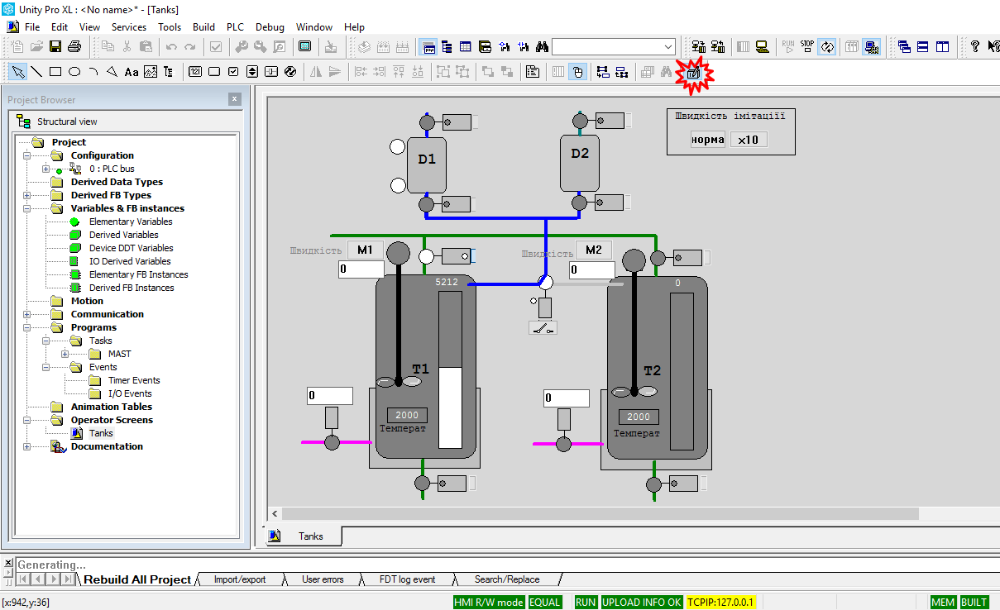

# Навчальний приклад розгортання проекту 

Тут розглядається приклад поступового розгортання проекту в Uinity PRO/Control Expert, який рекомендується робити для кращого розуміння роботи каркасу.  

У прикладі використовується ПЗ [Unity PRO](https://schneider-electric.app.box.com/s/lgd27nur1rin1hs4x822g8lr6tlr2y82/folder/50504496333) , аналогічно можна використовувати [Control Expert](https://schneider-electric.app.box.com/s/lgd27nur1rin1hs4x822g8lr6tlr2y82/folder/101662336138). За наведеними посиланнями знаходяться пробні версії з ключом активації на 60 діб. Після завершення терміну дане ПЗ більше не буде запускатися навіть після перевстановлення. Тому рекомендується встановлювати його на віртуальну машину. Мінімальна версія потрібного [UnityPro_XL_V7.0](https://schneider-electric.app.box.com/s/lgd27nur1rin1hs4x822g8lr6tlr2y82/folder/50505220340) у цій роботі  використовується [Unity PRO 13.1](https://schneider-electric.app.box.com/s/lgd27nur1rin1hs4x822g8lr6tlr2y82/folder/71210166883)

### 1. Підготовка програми імітації об'єкту

####  1.1. Завантаження експортного варіанту проекту з імітацією

- [ ] Завантажте на диск файл `sim_wthout_framework.xef` за [цим посиланням](https://github.com/pupenasan/PACFramework/blob/master/platforms/unitypro/sim_wthout_framework.xef)


Рис.1. Завантаження проекту імітатора з репозиторію

- [ ] Запустіть на виконання середовище UNITY PRO. 
- [ ] Використовуючи меню `File->Open` та вказавши формат `Unity PRO Application Exchange`, відкрийте проект  `sim_wthout_framework.xef` . 
- [ ] Перейдіть в режим імітації ПЛК: `PLC -> Simulation Mode`
- [ ] Зробіть компіляцію проекту `Build -> Rebuild All Project`.
- [ ] Збережіть проект у форматі STU на диску для наступного його використання.
- [ ] З'єднайтеся з імітатором ПЛК: `PLC->Connect`. У результаті повинен запуститися імітатор ПЛК.
- [ ] Завантажте проект в імітатор ПЛК: `PLC->Transfer Project to PLC`
- [ ] Запустіть на виконання програму в імітаторі: `PLC->RUN`. 

#### 1.2. Ознайомлення з імітатором об'єкту керування  

Для швидшої розробки навчального проекту пропонується використовувати заздалегідь підготовлений проект з імітацією установки приготування продукту в ємностях (надалі **установка приготування**). Проект включає операторський екран UNITY PRO для відображення/керування відділеннями (Рис.2).

Технологічна установка приготування складається з наступних елементів (Рис.2):

1) танки Т1 та Т2, в яких готовляться продукти за різними рецептами; танки обв’язані наступними засобами КВПіА:

- запірні клапани набору та зливу, кожний з датчиками кінцевого положення "закритий" та "відкритий";
- регулюючий клапан (0-100%) подачі теплоагента у теплообмінний кожух танку (далі по тексту клапан нагрівання);
- датчик рівня (0-100%) в танку;
- датчик температури в танку (0-100°С);
- привід мішалки танку 

2) дозатори (мірні ємності) D1 та D2, які забезпечують подачу дози компоненту; дозатори обв’язані наступними засобами КВПіА:

- сигналізатор нижнього і верхнього рівнів;

- запірні клапани набору та зливу, кожний з датчиками кінцевого положення "закритий";

3) 3-ходовий клапан перемикання трубопроводу подачі з дозаторів на танки T1 та T2; в нормальному стані положення "на Т1"; має датчики кінцевого положення "Т1" та "Т2".



Рис.2. Зовнішній вигляд програми вікна керування 

#### 1.3. Перевірка роботи імітованого об'єкту 

- [ ] Перейдіть в розділ `Operator Screens->Tanks`
- [ ] Натисніть на вільному місці екрану,  викличте в меню в меню `Services->Enable write variable ` (див.Рис.2)

- [ ] перевірте роботу усіх клапанів:
  - запірних, натискаючи на кнопку біля клапану  
  - регулюючих (подача теплоагента), вказуючи в поле для вводу біля клапану ступінь відкриття у % і натискаючи `Enter`
- [ ] Подивіться на реакцію датчиків положення та імітацію роботи об’єкту керування. Зверніть увагу на те, що деякі клапани мають два датчика положення, а деякі тільки один. 
- [ ] Виділіть усі об'єкти (Ctrl+A), викличте контекстне меню (права кнопка миші) і виберіть пункт `Initialize Animation Table`
- [ ] Подивіться до яких змінних прив'язані об'єкти

#### 1.4. Опис функцій та алгоритму задач керування установкою 

- [ ] Ознайомтеся з наведеним нижче описом функцій та задач керування установкою.

Передбачається що в демонстраційному проекті будуть виконуватися наступні функції.  

1) Виконання задачі приготування відповідно до наведеного нижче опису;

2) У будь який момент часу система має можливість переходу в початковий стан (крок) за допомогою команди "Ініціалізація кроків". 

4) Типові функції передбачені каркасом.

Керування дозаторами та танками розв’язане одне від одного (але координоване), оскільки дозатори можуть бути використані в інших процесах. Дозатори в стані очікування завжди наповнені. 

Керування процесом приготування передбачається за таким алгоритмом (вбудована процедура технологічної комірки):

1) У початковому стані (старті ПЛК) клапани набору та зливу танків Т1 та Т2 закриваються. Закритість клапанів контролюється кінцевими датчиками положення. Після цього система керування установкою приготування переходить в стан очікування.

2) Оператор повинен задати рецепт продукту для приготування в Т1 та Т2. Рецепт включає наступні поля:

- кількість доз компоненту з D1;

- кількість доз компоненту з D2;

- температуру попереднього нагрівання;

- час витримки;

3) Після натискання оператором кнопки "Пуск" відкривається клапан набору танку Т1.

4) Після досягнення рівня 50% паралельно з набором включається дозування компонентів D1 та D2 відповідно до рецепту. 

5) При досягненні рівня 80%, відкривається клапан набору танку Т2.

6) Коли клапан набору Т2 повністю відкрився (по датчику положення "відкритий"), клапан набору Т1 закривається, і паралельно з приготуванням продукту в Т1 йде наповнення і приготування продукту в танку Т2.

7) При досягненні рівня 50% в Т2 паралельно з набором включається дозування компонентів D1 та D2 відповідно до рецепту. Якщо дозатор в цей час використовується при дозуванні Т1, необхідно дочекатися закінчення роботи дозаторів.

8) При досягненні рівня 80%, закривається клапан набору танку Т2.

9) Після закриття клапану набору в танку Т1 (в наступних пунктах для Т2 аналогічно) і закінченні дозування, відкривається повністю клапан подачі теплоагента; 

10) Рідина в танках нагрівається до вказаного в рецепті значення, після чого клапан залишається відкритий на 10% протягом вказаного в рецепті часу;

11) Після витримки відкривається клапан зливу і рідина зливається з танку;

12) Через 5с після досягнення рівня менше ніж 1% клапан зливу закривається;

13) Коли обидва танки Т1 та Т2 порожні, система переходить в початковий стан.

За необхідності передбачається використання Batch Control з можливістю динамічного створення своїх процедур. 

### 2. Розгортання PLCFN та створення програми користувача

У цьому розділі необхідно розгорнути в проекті PLCFN.

#### 2.1. Ознайомлення та завантаження PLCFN

- [ ] Ознайомтеся з призначенням та принципами функціонування  PLCFN за [даним посиланням](../../cm/2_plcfn.md)
- [ ] Завантажте експортний варіант функціонального блоку `plcfn.xdb` за [цим посиланням](plcfn.xdb)
- [ ] Завантажте експортний варіант операторського екрану  

#### 2.2. Імпорт PLCFN та створення змінної

- [ ] Імпортуйте завантажений DFB `plcfn.xdb`


Рис.3. Імпорт DFB

- [ ] Перегляньте, разом з DFB імпортується також структура PLC_CFG
- [ ] Створіть змінну `PLC` типу `PLC_CFG`


Рис.4. Створення змінної PLC

#### 2.2. Створення основної секції

- [ ] Створіть секцію `Main`


Рис.5. Створення секції Main

- [ ] В секцію в Main помістіть виклик DFB `PLCFN` однойменного типу 


Рис.6. Виклик DFB (та його створення) PLC в секції Main.

Зверніть увагу, що автоматично буде створено екземпляр функціонального блоку `PLCFN`.

#### 2.3. Імпорт операторського екрану та перевірка функцій PLCFN

- [ ] Завантажте за [цим](https://github.com/pupenasan/PACFramework/tree/master/platforms/unitypro) посиланням та імпортуйте в проект операторський екран `plc.xcr`


Цей пунтк потребує доповнення по перевірці функцій PLCFN.


### 3. Розгортання рівня каналів

#### 3.1. Імпорт CM LVL0 (каналів) 

- [ ] Завантажте файл експорту екземплярів функціональних блоків `chfns.xsy` за [цим посиланням](https://github.com/pupenasan/PACFramework/blob/master/platforms/unitypro/chfns.xsy)
- [ ] Імпортуйте екземпляри та типи в проект (Variables & FB Instancess -> Import). При імпорті з'явиться вікно  повідомлення про необхідність заміни, в якому треба натиснути `Keep All` (Рис.7) для збереження усіх існуючих в проекті об'єктів (PLC_CFG). 


Рис.7. Вікно підтвердження/відхилення заміни обєктів

#### 3.2 Cтворення змінних каналів 

- [ ] Подивіться уважно конфігурацію наявного обладнання. Визначте скільки дискретних та аналогових входів та виходів доступні в конфігурації. Впишіть ці значення в значення за замовченням змінних `PLC.DICNT`, `PLC.AICNT` , `PLC.DOCNT`, `PLC.AOCNT`: 

 

Рис.8. Налаштування кількості змінних

- [ ] Створіть змінні - масиви відповідних типів для забезпечення роботи каналів з конфігураційними параметрами (CFG) та (HMI)


Рис.10. Змінні для каналів

- [ ] Створіть змінну `CH_BUF` типу `CH_BUF` для роботи з буфером.
- [ ] Створіть змінну `i` типу `INT`

 #### 3.3. Створення та виклик секцій обробки вхідних каналів

- [ ] Створіть підпрограми (SR Section) на мові ST з іменами `dichs` , `aichs`,  `dochs`, `aochs`
- [ ] У секції `main` викличте ці секції. Тепер Ваша програма має наступний вигляд:

```pascal
PLCFN (PLC := PLC);

dichs();
aichs();

dochs();
aochs();
```

- [ ] Створіть секції 
- [ ] У секції  `dichs`  створіть наступний фрагмент програми користувача:

```pascal
FOR i := 1 TO PLC.DICNT DO
    (*на першому циклі ініціалізуємо змінні ID + CLSID*)
    IF PLC.STA_SCN1 THEN
        CHDI[i].ID := INT_TO_UINT(i);
        IF CHDI[i].CLSID = 0 THEN CHDI[i].CLSID := 16#0010;END_IF;
    END_IF;
END_FOR;

CHDIFN (RAW := %i0.1.0,  CHCFG := CHDI[1],  CHHMI := CHDI_HMI[1],  PLCCFG := PLC, CHBUF := CH_BUF);
(*тут має бути виклик обробки інших каналів DI*)
```

- [ ] Проаналізуйте код фрагменту програми. Він складається з 2-х частин. У першій виставляється CLSID за замовченням у тому випадку, якщо він не визначений для конкретної змінної каналу. У 2-й обробляється по одному каналу з кожної змінної. Обробку усіх інших каналів необхідно буде добавити самостійно. 
- [ ] У секції  `aichs`  створіть наступний фрагмент програми користувача:

```pascal
FOR i := 1 TO PLC.AICNT DO
    (*на першому циклі ініціалізуємо змінні ID + CLSID*)
    IF PLC.STA_SCN1 THEN
        CHAI[i].ID := INT_TO_UINT(i);
        IF CHAI[i].CLSID = 0 THEN CHAI[i].CLSID := 16#0030;END_IF;
    END_IF;
END_FOR;

CHAIFN (RAWINT := %IW0.2.0, CHCFG := CHAI[1], CHHMI := CHAI_HMI[1], PLCCFG := PLC, CHBUF := CH_BUF);
(*тут має бути виклик обробки інших каналів AI*)
```

- [ ] Скористайтеся засобами редагування таблиць (наприклад Excel) для формування обробки інших каналів. Для цього, наприклад, можна зробити наступні дії:

- скопіювати в блокнот код, який необхідно "розмножати":


```pascal
CHDIFN (RAW := %i0.1.0,  CHCFG := CHDI[1],  CHHMI := CHDI_HMI[1],  PLCCFG := PLC, CHBUF := CH_BUF);
```

  - поставити знаки табуляції між частинами, які будуть змінними:

```
CHDIFN (RAW := %i	0.1.0	,  CHCFG := CHDI[1],  CHHMI := CHDI_HMI[1],  PLCCFG := PLC, CHBUF := CH_BUF);
```

- скопіювати даний код в електронну таблицю;

- використовуючи вбудовані функції електронних таблиць зробити аналогічні виклики для наступних вхідних каналів, наприклад, як наведено на наступному рисунку

 

Рис.9. Вигляд заповнення електронної таблиці 

- Скопіюйте дані з електронної таблиці в блокнот. За допомогою функцію пошуку та заміни замініть знаки табуляції на порожній символ, тобто видаліть усі знаки табуляції. Текст що вийшов буде вашим фрагментом програми.

### 3.4. Створення та виклик секцій обробки вихідних каналів

- [ ] Аналогічно попередньому пункту в секції `dochs` та `aochs` створіть обробку вихідних каналів 

```pascal
FOR i := 1 TO PLC.DOCNT DO
    (*на першому циклі ініціалізуємо змінні ID + CLSID*)
    IF PLC.STA_SCN1 THEN
        CHDO[i].ID := INT_TO_UINT(i);
        IF CHDO[i].CLSID = 0 THEN CHDO[i].CLSID := 16#0020;END_IF;
    END_IF;
END_FOR;

CHDOFN (CHCFG := CHDO[1],  CHHMI := CHDO_HMI[1],  PLCCFG := PLC, CHBUF := CH_BUF, RAW => %Q0.1.16);
(*тут має бути виклик обробки інших каналів DO*)
```

```pascal
FOR i := 1 TO PLC.AOCNT DO
    (*на першому циклі ініціалізуємо змінні ID + CLSID*)
    IF PLC.STA_SCN1 THEN
        CHAO[i].ID := INT_TO_UINT(i);
        IF CHAO[i].CLSID = 0 THEN CHAO[i].CLSID := 16#0040;END_IF;
    END_IF;
END_FOR;

CHAOFN (CHCFG := CHAO[1], CHHMI := CHAO_HMI[1], PLCCFG := PLC, CHBUF := CH_BUF, RAWINT => %QW0.2.4);
(*тут має бути виклик обробки інших каналів AO*)
```

- [ ] Зробіть тест на помилки проекту (Build -> Analyze) для перевірки коректності проведених дій та виправте помилки

#### 3.5. Створення PLCMAPS

- [ ] завантажте за [цим](https://github.com/pupenasan/PACFramework/tree/master/platforms/unitypro) посиланням та імпортуйте в проект типи `module.xdd` і `submodule.xdd`, при конфліктах типів збережіть ті, що в проекті  
- [ ] Створіть змінну `MODULES` типу `ARRAY[0..3] OF MODULE`, яка буде відповідати за інформацію про модулі
- [ ] Створіть змінну `SUBMODULE` типу `SUBMODULE`, яка буде відповідати за підмодуль, який зараз в буфері
- [ ] Створіть SR секцію с назвою `plcmaps`, яка буде відображати активну інформацію за замовченням. Ця секція не є обов'язковою, так як ті ж параметри можна задати за замовченням для змінних. Вона радше потрібна для того, щоб ініціалізувати змінні за необхідності програмним шляхом.
- [ ] Запишіть в секцію наступний фрагмент програми 

```pascal
(*кількість каналів та модулів*)
PLC.DICNT := 32;
PLC.DOCNT := 32;
PLC.AICNT := 8;
PLC.AOCNT := 4;
PLC.MODULSCNT := 8;

(*завантажити в буфер підмодуль 0 модуля 0*)
MODULES[0].STA.11 := true;
(*0.1-DDM3202K*)
(*типи 1- DICH, 2- DOCH, 3- AICH, 4 – AOCH, 5 - COM*)
MODULES[0].TYPE1 := 16#1200; (*DI+DO*)
(*кількість каналів на кожен Submodule, комбінація в 16-ковому форматі 
- 1 (16#XYZQ) X - для першого субмодуля*)
MODULES[0].CHCNTS := 16#ff00;(*16 + 16*)
MODULES[0].STRTNMB[0] := 1;(*DI*)
MODULES[0].STRTNMB[1] := 1;(*DO*)
MODULES[0].STRTNMB[2] := 0;
MODULES[0].STRTNMB[3] := 0;

(*0.2-AMM0600*)
MODULES[1].TYPE1 := 16#3400;(*AI + AO*) 
MODULES[1].CHCNTS := 16#3100;(*16 + 16*)
MODULES[1].STRTNMB[0] := 1;(*AI*)
MODULES[1].STRTNMB[1] := 1;(*AO*)
MODULES[1].STRTNMB[2] := 0;
MODULES[1].STRTNMB[3] := 0;
```

- [ ] Допишіть секцію кодом з реалізацією відображення каналів ще для 2-х модулів (0.3 та 0.4)

#### 3.6. Обробка Moduls

- [ ] Завантажте за [цим](https://github.com/pupenasan/PACFramework/tree/master/platforms/unitypro) посиланням та імпортуйте в проект SR секцію `moduls.xst`, при конфліктах типів збережіть ті, що в проекті  
- [ ] Модифікуйте програму в секції `main` щоб при старті програми запускалася секція `plcmaps`, а також викликалася секція обробки модулів `moduls`. Секція матиме вигляд: 

```pascal
PLCFN (PLC := PLC);
(*виклик при старті*)
IF PLC.STA_SCN1 THEN
  plcmaps();
END_IF;
inputs();
outputs();
moduls();
```

- [ ] Зробіть компіляцію проекту і завантажте в імітатор ПЛК.

#### 3.7. Розробка операторських екранів

- [ ] Завантажте за [цим](https://github.com/pupenasan/PACFramework/tree/master/platforms/unitypro) посиланням та імпортуйте в проект операторський екран `moduls.xcr`


Рис.10. Зовнішній вигляд операторського екрану для налагодження роботи з каналами на один модуль

- [ ] Цей операторський екран має тільки один модуль. Інші треба доробити самостійно. Для цього рекомендується використовувати XML редактор. Створіть новий операторський екран, куди скопіюйте групу з першим модулем. Зробіть ще три копії поряд. Екран матиме наступний вигляд.


Рис.11. Копія екрану з 4-ма модулями.

- [ ] Зробіть експорт створеного операторського екрану в якусь доступну для редагування папку.
- [ ] Відкрийте файл експорту за допомогою текстового редактору, наприклад Notepad++.

Зміст файлу має формат XML. Враховуючи що кожен модуль на операторському екрані є групою з 9-ти елементів, варто знайти ці групи і візуально відокремити їх переносом рядку. 

- [ ] За допомогою інструментів пошуку знайдіть початок кожної групи, яка ідентифікується як `objectID="2"` та має 9 елементів.  Їх повинно бути 4.


Рис.12. Початок групи для зображення модуля

- [ ] Відділіть початок групи новим рядком, щоб візуально вони відрізнялися.
- [ ] За допомогою інструментів пошуку та заміни, починаючи з групи для 2-го модуля, змініть `MODULES[0]` на вдповідно `MODULES[1]` ...`MODULES[3]` 
- [ ] Збережіть файл. Імпортуйте його в проект.
- [ ] Скопіюйте модулі на сторінку налагодження каналів.
- [ ] Скопіюйте на сторінку налагодження каналів групу що показує статусні біти ПЛК які були імпортовані раніше
- [ ] Видаліть усі зайві операторські екрани.

#### 3.8. Перевірка роботи рівня 1 на операторських екранах

- [ ] Використовуючи операторський екран CM нижнього рівня:
  - [ ] подивіться стан змінних
  - [ ] перевірте роботу режиму форсування для кожного типу каналу (зверніть увагу на статусні біти ПЛК)

Це пункт потребує доповнення.

### 4. Утиліти для автоматизації розгортання

Каркас НЕ передбачає обов'язкове використання утиліт розгортання, але це значно пришвидшує розробку. Тому в даній роботі передбачається використання автоматичних утиліт розгортання [pacframework-tools](https://github.com/pupenasan/pacframework-tools).

#### 4.1. Встановлення та налаштування 

- [ ] Встановіть утиліти, як це описано в [репозиторії](https://github.com/pupenasan/pacframework-tools), скористайтеся рекомендованим скриптом
- [ ] Перейдіть до створеної директорії в домашній папці, створіть там директорію з іменем `source`
- [ ] Відкрийте файл налаштування `config.ini` перевірте чи посилається параметр `pathsource` розділу `[exceltools]` на вказану папку, а `pathxlsfile` на файл  `masterdata.xlsx` якщо ні - виправте і збережіть файлі `config.ini` :

```ini
[exceltools]
pathsource = C:\Users\user\pacframeworktools\source
pathresult = C:\Users\user\pacframeworktools\result
pathlog = C:\Users\user\pacframeworktools\log
pathxlsfile = masterdata.xlsx
```

#### 4.2. Завантаження masterdata.xlsx та ознайомлення зі структурою

Для конфігурування даних для розгортання можна скористатися електронною таблицею з майстерданими. Для `pacframework-tools`  для цього використовується `masterdata.xlsx`, який означується за певним  форматом.  

- [ ] Завантажте файл [masterdata.xlsx](https://docs.google.com/spreadsheets/d/1GvttNOH74X2o9y0fh_qxQCHhfdFszx7m/edit?usp=sharing&ouid=111751208742846482260&rtpof=true&sd=true) в папку `source` яку ви створили в попередньому пункті
- [ ] Відкрийте його для перегляду (якщо немає Excel на комп'ютері - подивіться в онлайні через браузер на гугл-диску)
- [ ] Ознайомтеся зі змістом, скориставшись допомогою за [цим посиланням](https://github.com/pupenasan/pacframework-tools/blob/main/masredataxls.md)

### 5. Розгортання рівня змінних

#### 5.1. Завантаження та імпортування базових типів змінних 

- [ ] Завантажте експортний варіант функціональних блоків (екземпляри і типи) `varfns.xsy` за [цим посиланням](https://github.com/pupenasan/PACFramework/blob/master/platforms/unitypro).
- [ ] Імпортуйте його в проект Unity PRO. Зверніть увагу що при імпорті в повідомленні про заміну тегів в проекті треба буде залишити усе без змін `Keep All` (як на Рис.7).
- [ ] Подивіться які функціональні блоки, типи функціональних блоків, типи змінних які при цьому добавилися. Нові або змінені об'єкти в  Unity PRO виділяються синіми помітками.  
- [ ] Імпортуйте їх в проект Unity PRO
- [ ] Завантажте експортні варіанти операторських екранів `aivar.xcr`, `divar.xcr`, `aovar.xcr`, `dovar.xcr`  за [цим посиланням](https://github.com/pupenasan/PACFramework/blob/master/platforms/unitypro)  і перемістіть їх у робочу папку,  `%Userprofile%\pacframeworktools\source`. Ці експорті варіанти є шаблонами для генерування операторських екранів для проекту з майстерданих. Зверніть увагу на правильність завантаження, як це вказано на рис.1.

#### 5.2. Генерування файлів імпорту 

- [ ] Запустіть командний рядок, якщо він не запущений
- [ ] У командному рядку перейдіть в папку з розгорнутим застосунком pacframework-tools, наприклад  

```
cd C:\pacfwtools
```

- [ ] Викличте команду генерування файлів імпорту з майстерданих

```bash
node C:\pacfwtools\node_modules\pacframework-tools\index seuncreatevars
```

У вікні повинно вивести ряд повідомлень про створення змінних та секцій VARS


Рис.13. Повідомлення про створення змінних та секцій обробки

- [ ] У папці проекту `/reports` також будуть сформовані деякі звіти.

#### 5.3. Імпортування файлів в проект 

- [ ] Поступово імпортуйте 5 секцій, наведених в переліку: спочатку `DIVARS`, потім  `DOVARS`, `AIVARS`, `AOVARS`, `INITVARS`

 

Рис.14. Імпортування секцій

- [ ] Проконтролюйте, що усі 5-ть секцій створені, перевірте які ще об'єкти створилися разом з ними

#### 5.4. Вставлення виклику в проекті

- [ ] Змініть секцію `main` так, щоб нові SR-секції оброблялися у потрібному порядку:

```pascal
PLCFN (PLC := PLC);
(*виклик при старті*)
IF PLC.STA_SCN1 THEN
  plcmaps();
  initvars();(*інціалізація змінних при старті*)
END_IF;
(*обробка входів*)
dichs();
aichs();
divars ();
aivars ();

(*обробка виходів*)
dovars();
aovars();
dochs();
aochs();

moduls();
```

- [ ] Зробіть компіляцію проекту

#### 5.5. Імпортування екранів та тестування

- [ ] Імпортуйте в Unity PRO створені екрани з `%Userprofile%\pacframeworktools\source`
- [ ] Завантажте проекти в імітатор ПЛК
- [ ] Використовуючи операторські екрани протестуйте функції технологічних змінних 

### 6. Розгортання рівня ВМ

#### 6.1. Завантаження та імпортування базових типів виконавчих механізмів

- [ ] Завантажте експортний варіант функціональних блоків `actfns.xsy` за [цим посиланням](https://github.com/pupenasan/PACFramework/blob/master/platforms/unitypro)
- [ ] Імпортуйте його в проект Unity PRO. Зверніть увагу що при імпорті в повідомленні про заміну тегів в проекті треба буде залишити усе без змін `Keep All` (як на Рис.7).
- [ ] Подивіться які функціональні блоки, типи функціональних блоків, типи змінних які при цьому добавилися. Нові або змінені об'єкти в  Unity PRO виділяються синіми помітками.  
- [ ] Імпортуйте їх в проект Unity PRO
- [ ] Завантажте експортні варіанти операторських екранів `vlvd.xcr`, `vlva.xcr`, `drv.xcr`  за [цим посиланням](https://github.com/pupenasan/PACFramework/blob/master/platforms/unitypro)  і перемістіть їх у робочу папку,  `%Userprofile%\pacframeworktools\source`. Ці експортні варіанти є шаблонами для генерування операторських екранів для проекту з майстерданих. Зверніть увагу на правильність завантаження, як це вказано на рис.1.

#### 6.2. Генерування файлів імпорту 

- [ ] Запустіть командний рядок, якщо він не запущений
- [ ] У командному рядку перейдіть в папку з розгорнутим застосунком pacframework-tools, наприклад  

```
cd C:\pacfwtools
```

- [ ] Викличте команду генерування файлів імпорту з майстерданих

```bash
node C:\pacfwtools\node_modules\pacframework-tools\index seuncreateacts
```

У вікні повинно вивести ряд повідомлень про створення змінних та секції actrs

- [ ] У папці проекту `/reports` також будуть сформовані деякі звіти

#### 6.3. Імпортування файлів в проект 

- [ ] послідовно імпортуйте секції `actrs.xst` а потім `resolution.xst` в розділ SR

 

Рис.14. Імпортування секцій

- [ ] проконтролюйте, що секції створені, перевірте, які ще об'єкти створилися разом з ними

#### 6.4. Вставлення виклику в проекті

- [ ] Змініть секцію `main` так, щоб нові SR-секції для обробки виконавчих механізмів оброблялися у потрібному порядку:

```pascal
PLCFN (PLC := PLC);
(*виклик при старті*)
IF PLC.STA_SCN1 THEN
  plcmaps();
  initvars();(*інціалізація змінних при старті*)
END_IF;
(*обробка входів*)
dichs();
aichs();
divars ();
aivars ();

(*обробка виконавчих механізмів*)
resolution();
actrs();

(*обробка виходів*)
dovars();
aovars();
dochs();
aochs();

moduls();
```

- [ ] Зробіть компіляцію проекту

#### 6.5. Імпортування екранів та тестування

- [ ] Імпортуйте в Unity PRO створені екрани з `%Userprofile%\pacframeworktools\source`
- [ ] Завантажте проекти в імітатор ПЛК
- [ ] Використовуючи операторські екрани та/або таблиці анімацій протестуйте функції ВМ типу VLVD: 

1. Завантаження в буфер

2. Переведення в ручний режим

3. Відкриття клапану (стан відкривається)

4. Відкриття клапану (стан відкрився)

5. Закриття клапану (стан закривається)

6. Закриття клапану (стан закрився)

7. Поширення форсування (зафорсуйте кінцевик відкрито)

8. Перевірка аварії не відкрився (зафорсуйте кінцевик відкрито в 0)

9. Скидання аварії не відкрився (дефорсуйте кінцевик відкрито , має скинутись при закритті)

10. Перевірка аварії не закрився (зафорсуйте кінцевик закрито в 0)

11. Скидання аварії не закрився (дефорсуйте кінцевик закрито , має скинутись при відкритті)

12. Перевірка аварії довільного зсуву (в закритому стані інвертуйте кінцевик закрито, у відкритому стані інвертуйте кінцевик відкрито)

13. Скидання аварії довільного зсуву (поверніть кінцевик в початкове положення, скидається в кінцевих положеннях)

14. Перевірка аварії датчика (зімітуйте спрацювання обох кінцевиків одночасно)

15. Скидання аварії датчика (поверніть кінцевик в початкове положення, скидається в кінцевих положеннях)

| №    | Команда з Animation Table (CMD) | Команда з Oparator Screen        | Реакція в ПЛК                                                | Реакція в Oparator Screen        |
| ---- | ------------------------------- | -------------------------------- | ------------------------------------------------------------ | -------------------------------- |
| 1    | 256                             |   | VLVDS.Vnabor_T1.STA_INBUF = 1  ACTBUF.ID= VLVDS.Vnabor_T1.ID |   |
| 2    | 769                             |   | VLVDS.Vnabor_T1.STA_DISP = 1                                 |   |
| 3    | 1                               |   | VLVDS.Vnabor_T1.STA_OPNING= 1                                |   |
| 4    |                                 |                                  | VLVDS.Vnabor_T1.STA_OPNING = 0  VLVDS.Vnabor_T1.STA_OPND = 1 |   |
| 5    | 2                               |   | VLVDS.Vnabor_T1.STA_CLSING= 1                                |   |
| 6    |                                 |                                  | VLVDS.Vnabor_T1.STA_CLSING = 0  VLVDS.Vnabor_T1.STA_CLSD = 1 |   |
| 7    |                                 |                                  | VLVDS.Vnabor_T1.STA_FRC = 1                                  |   |
| 8    | 1                               |  | VLVDS.Vnabor_T1.ALM_ALMOPN=1  VLVDS.Vnabor_T1.ALM_ALM=1      |   |
| 9    | 2                               |                                  | VLVDS.Vnabor_T1.ALM_ALMOPN=0  VLVDS.Vnabor_T1.ALM_ALM=0      |  |
| 10   | 2                               |  | VLVDS.Vnabor_T1.ALM_ALMCLS=1  VLVDS.Vnabor_T1.ALM_ALM=1      |   |
| 11   | 1                               |                                  | VLVDS.Vnabor_T1.ALM_ALMCLS=0  VLVDS.Vnabor_T1.ALM_ALM=0      |  |
| 12   |                                 |                                  | VLVDS.Vnabor_T1.ALM_ALMSHIFT=1  VLVDS.Vnabor_T1.ALM_ALM=1    |   |
| 13   |                                 |                                  | VLVDS.Vnabor_T1.ALM_ALMSHIFT=0  VLVDS.Vnabor_T1.ALM_ALM=0    |                                  |
| 14   |                                 |                                  | VLVDS.Vnabor_T1.ALM_ALMSLNBRK=1  VLVDS.Vnabor_T1.ALM_ALM=1   |   |
| 15   |                                 |                                  | VLVDS.Vnabor_T1.ALM_ALMSLNBRK=0  VLVDS.Vnabor_T1.ALM_ALM=0   |                                  |

