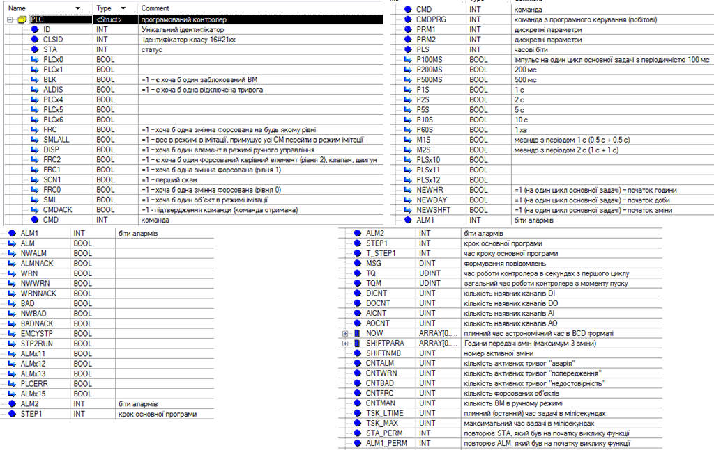

# Структура, змінні та функції PLC

## Структура PLC



## Функціональний блок PLCFN

```pascal
PLC.ID:=1;             (*вСТАНОВЛЕННЯ ІДЕНТИФІКАТОРА*)
PLC.CLSID:=16#2100;    (*вСТАНОВЛЕННЯ класу*)

STA := PLC.STA;        (*зчитування змінних в темпову память*)
ALM1:= PLC.ALM1;
ALM2:= PLC.ALM2;
CMD := PLC.CMD;
CMDPRG := PLC.CMDPRG;

SMLALL:=STA.9;(*x9 - усе в імітації скидується кожен цикл, функція SIMULATION його виставляє*)
FRC2:=STA.10;(*є хоча б один ручний режим ВМ*)
FRC1:=STA.11;
SCN1:=%s21;(*x12 визначення першого циклу*)
FRC0:=STA.13;
SML:=STA.14;
CMDACK:=STA.15; 

(*//------------------------ обробка команд --------------------------------*)
IF CMD<>0 AND NOT CMDACK THEN
    CMDACK:=true;
ELSE 
    CMD:=0;
    CMDACK:=false;
END_IF;
(*------------------------------------------------------------------------ *)

(*--------------------------------- таймерні біти та лічильники*)

if  %s21 then              (*ініціалізація по першому циклу*)
	PLC.TQ:=0;
	CUR:=0; PREV:=0;
end_if;

TM200ms ();       (*формування необхідних міандрів*)
TM500ms ();
CUR.0:=%S5; 
CUR.1:=TM200ms.q;
CUR.2:=TM500ms.q;
CUR.3:=%S6;(*sec*)
CUR.7:=%S7;(*min*)
(*відловлювання імпульсів необхідних часових періодів*)
PLC.PLS.0:=cur.0 and not PREV.0; (*100 мс *)   
PLC.PLS.1:=cur.1 and not PREV.1; (*200 мс*)
PLC.PLS.2:=cur.2 and not PREV.2; (*500 мс*)
PLC.PLS.3 :=cur.3 and not PREV.3; (*1 с*)
PLC.PLS.7 :=cur.7 and not PREV.7; (*1 хв*)
(*підрахунок кількості секунд і хвилин*)
if PLC.PLS.3 then PLC.TQ:=PLC.TQ+1; end_if;  (*загальний час з початку 1-го циклу контролера (в секундах)*)     
IF PLC.TQ>16#7FFF_FFFF THEN PLC.TQ:=16#7FFF_FFFF; END_IF;  
if PLC.PLS.7 then PLC.TQM:=PLC.TQM+1; end_if; (*загальний час роботи ПЛК з моменту пуску (в хвилинах)*)
IF PLC.TQM>16#7FFF_FFFF THEN PLC.TQM:=16#7FFF_FFFF; END_IF;  

(*розрахунок інших часових періодів*)
PLC.PLS.4:=(PLC.TQ mod 2)=0 and PLC.PLS.3;(*2 с*)   
PLC.PLS.5:=(PLC.TQ mod 5)=0 and PLC.PLS.3;(*5 с*)
PLC.PLS.6:=(PLC.TQ mod 10)=0 and PLC.PLS.3;(*10 с*)

(* меандри *)
IF TM500ms.Q THEN PLC.PLS.8:= not PLC.PLS.8; END_IF;  (*меандр з періодом 1 с (0.5 с + 0.5 с)*)
PLC.PLS.9:=%S6;(*меандр з періодом 2 с (1 с + 1 с) *)

(* астрономічний час *)
RRTC_DT (OUT => NOW); (*в DT форматі*)
PLC.NOW := DT_TO_ARINT(NOW); (*у вигляді масиву*)

(* початок години *)
PLC.PLS.13:= (PLC.NOW[1] AND 16#00FF)=0 (*хвилини*) AND PLC.PLS.7 (*один раз за хвилину*);

(* початок доби*)
PLC.PLS.14:= PLC.NOW[1]=0 (*години_хвилини*) AND PLC.PLS.7 (*один раз за хвилину*);

(*початок зміни*)
IF PLC.SHIFTPARA[0]<1 OR PLC.SHIFTPARA[0]>3 then PLC.SHIFTPARA[0]:=2;END_IF;(*коректність кількості змін*)
PLC.PLS.15:=FALSE; (*скидуємо біт початку зміни*)   
FOR i:=1 to PLC.SHIFTPARA[0] DO
  (*хоча б одна з устоавок змін спрацювала*)
   PLC.PLS.15 := PLC.PLS.15 OR (PLC.SHIFTPARA[i]=PLC.NOW[1] (*години хвилин*) AND PLC.PLS.7 (*один раз за хвилину*));  
END_FOR;

(*таймери для тих уставок, на які немає системних меандрів*)
TM200ms (not CUR.1, t#200ms);
TM500ms (not CUR.2, t#200ms);
PREV:=CUR;(*збереження попередніх значень*)

(*----------- визначеня зміна*)
IF PLC.SHIFTPARA[0]>3 OR PLC.SHIFTPARA[0]<2 THEN PLC.SHIFTPARA[0]:=3; END_IF;(*якщо кількість змін >3 або <1 - робимо 3*)
IF PLC.NOW[1]>=PLC.SHIFTPARA[1] AND (PLC.NOW[1]<PLC.SHIFTPARA[2]OR PLC.SHIFTPARA[2]=16#0000) THEN (*1-ша зміна*)
	PLC.SHIFTNMB:=1; 
ELSE (*2-га або 3-тя*)
	IF PLC.SHIFTPARA[0]=2 then (*якщо в 2 зміни*)
		PLC.SHIFTNMB:=2;	
	ELSE (*якщо 3 зміни*)
	  IF PLC.NOW[1]>=PLC.SHIFTPARA[2] and (PLC.NOW[1]<PLC.SHIFTPARA[3] OR PLC.SHIFTPARA[3]=16#0000) THEN 
	     PLC.SHIFTNMB:=2;
	  ELSE
	     PLC.SHIFTNMB:=3;
	  END_IF;
	END_IF;
END_IF;
(*----------- *)

         (*оновлення змінних з темпової памяті*)
STA:=0;
ALM1:=0;
STA.9 := SMLALL; 
(*STA.%X10:=FRC2;*)
(*STA.%X11:=FRC1;*)
STA.12:=SCN1;
(*STA.13:=FRC0;*)
(*STA.%X14:=#SML;*)
STA.15:=CMDACK;

PLC.STA:=STA; 
PLC.ALM1:=ALM1;
PLC.ALM2:=ALM2;
PLC.CMD:=CMD;
PLC.CMDPRG:=CMDPRG;
```

## Секція Main

У секції має викликатися ви 

```pascal
PLCFN (PLC);
IF PLC.SCN1 THEN (*загальні налаштування на першому скані*)
   (*кількість каналів*)	
   PLC.DICNT:=256;
   PLC.DOCNT:=192;
   PLC.AICNT:=112;
   PLC.AOCNT:=56;
END_IF;
```

