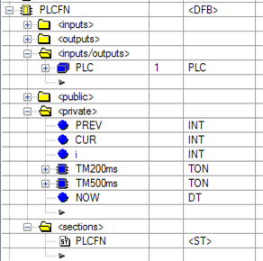

# Клас PLC: програмований контролер Control Expert 

**CLSID=16#21xx**

## Загальний опис

Описані в [загальному описі функціональних вимог](../../cm/2_plcfn.md). 

## Рекомендації щодо використання в HMI

Немає особливих рекомендацій. Описані в [загальних рекомендаціях](../../cm/2_plcfn.md). 

## Функція PLCFN

Реалізований як функціональний блок з одним екземпляром. Посилання на файл експорту [тут](plcfn.xdb) 

### Реалізація інтерфейсу

Реалізований стандартний інтерфейс означений в  [загальних вимогах до інтерфейсу](../../cm/2_plcfn.md)



### Реалізація програми блоку 

```pascal
IF PLC.CMDACK then
   PLC.CMD:=0;
END_IF;
PLC.CMDACK := (PLC.CMD<>0 AND NOT PLC.CMDACK);
PLC.SCN1:=%s21;
IF PLC.SCN1 then (*при першому скані*)
    PLC.ID:=1;             (*Ідентифікатор завжди 1*)
    PLC.CLSID:=16#2100;    (*Клас завжди 16#2100*)
    PLC.TQ:=0;
    CUR:=0; PREV:=0;
end_if;
PLC.STA_PERM := PLC.STA;
PLC.ALM1_PERM := PLC.ALM1;
(*--------------------------------- таймерні біти та лічильники*)
TM200ms (); TM500ms ();
(*плинні значення*)
CUR.0:=%S5; 
CUR.1:=TM200ms.q;
CUR.2:=TM500ms.q;
CUR.3:=%S6;(*sec*)
CUR.7:=%S7;(*min*)
(*відловлювання імпульсів необхідних часових періодів*)
PLC.P100MS:=cur.0 and not PREV.0; (*100 мс *)   
PLC.P200MS:=cur.1 and not PREV.1; (*200 мс*)
PLC.P500MS:=cur.2 and not PREV.2; (*500 мс*)
PLC.P1S :=cur.3 and not PREV.3; (*1 с*)
PLC.P60S :=cur.7 and not PREV.7; (*1 хв*)
(*підрахунок кількості секунд і хвилин*)
if PLC.P1S then PLC.TQ:=PLC.TQ+1; end_if;  (*загальний час з початку 1-го циклу контролера (в секундах)*)     
IF PLC.TQ>16#7FFF_FFFF THEN PLC.TQ:=16#7FFF_FFFF; END_IF;  
if PLC.P60S and not PLC.SCN1 then PLC.TQM:=PLC.TQM+1; end_if; (*загальний час роботи ПЛК з моменту пуску (в хвилинах)*)
IF PLC.TQM>16#7FFF_FFFF THEN PLC.TQM:=16#7FFF_FFFF; END_IF;  

(*розрахунок інших часових періодів*)
PLC.P2S:=(PLC.TQ mod 2)=0 and PLC.PLS.3;(*2 с*)   
PLC.P5S:=(PLC.TQ mod 5)=0 and PLC.PLS.3;(*5 с*)
PLC.P10S:=(PLC.TQ mod 10)=0 and PLC.PLS.3;(*10 с*)

(* меандри *)
IF TM500ms.Q THEN PLC.M1S:= not PLC.M1S; END_IF;  (*меандр з періодом 1 с (0.5 с + 0.5 с)*)
PLC.M2S:=%S6;(*меандр з періодом 2 с (1 с + 1 с) *)

(* астрономічний час *)
RRTC_DT (OUT => NOW); (*в DT форматі*)
PLC.NOW := DT_TO_ARINT(NOW); (*у вигляді масиву*)

(* початок години *)
PLC.NEWHR:= (PLC.NOW[1] AND 16#00FF)=0 (*хвилини*) AND PLC.P60S (*один раз за хвилину*);

(* початок доби*)
PLC.NEWDAY:= PLC.NOW[1]=0 (*години_хвилини*) AND PLC.P60S (*один раз за хвилину*);

(*початок зміни*)
IF PLC.SHIFTPARA[0]<1 OR PLC.SHIFTPARA[0]>3 then PLC.SHIFTPARA[0]:=2;END_IF;(*коректність кількості змін*)
PLC.NEWSHFT:=FALSE; (*скидуємо біт початку зміни*)   
FOR i:=1 to PLC.SHIFTPARA[0] DO
  (*хоча б одна з устоавок змін спрацювала*)
   PLC.NEWSHFT := PLC.NEWSHFT OR (PLC.SHIFTPARA[i]=PLC.NOW[1] (*години хвилин*) AND PLC.P60S (*один раз за хвилину*));  
END_FOR;

(*таймери для тих уставок, на які немає системних меандрів
два рази викликаються для точності
*)
TM200ms (not CUR.1, t#200ms);
TM500ms (not CUR.2, t#500ms);

PREV:=CUR;(*збереження попередніх значень*)

(*----------- визначеня зміни*)
IF PLC.SHIFTPARA[0]>3 OR PLC.SHIFTPARA[0]<2 THEN PLC.SHIFTPARA[0]:=3; END_IF;(*якщо кількість змін >3 або <1 - робимо 3*)
IF PLC.NOW[1]>=PLC.SHIFTPARA[1] AND (PLC.NOW[1]<PLC.SHIFTPARA[2]OR PLC.SHIFTPARA[2]=16#0000) THEN (*1-ша зміна*)
	PLC.SHIFTNMB:=1; 
ELSE (*2-га або 3-тя*)
	IF PLC.SHIFTPARA[0]=2 then (*якщо в 2 зміни*)
		PLC.SHIFTNMB:=2;	
	ELSE (*якщо 3 зміни*)
	  IF PLC.NOW[1]>=PLC.SHIFTPARA[2] and (PLC.NOW[1]<PLC.SHIFTPARA[3] OR PLC.SHIFTPARA[3]=16#0000) THEN 
	     PLC.SHIFTNMB:=2;
	  ELSE
	     PLC.SHIFTNMB:=3;
	  END_IF;
	END_IF;
END_IF;
(*----------- *)

(*цикли*)
PLC.TSK_LTIME :=int_to_uint(%sw30);
PLC.TSK_MAXTIME :=int_to_uint(%sw31);

(*скидання статусів і тривог*)
PLC.BLK :=false; 
PLC.ALDIS :=false;
PLC.FRC :=false;
PLC.SMLALL :=false;
PLC.DISP :=false;
PLC.FRC2 :=false;
PLC.FRC1 :=false;
PLC.FRC0 :=false;
PLC.SML :=false;
PLC.ALM1 :=0;

(*скидання лічильників*)
PLC.CNTALM :=0;
PLC.CNTWRN :=0;
PLC.CNTBAD :=0;
PLC.CNTFRC :=0;
PLC.CNTMAN :=0;
```

### Вимоги щодо використання

Функція має викликатися у першій секції, наприклад в Main: 

```pascal
PLCFN (PLC);
IF PLC.SCN1 THEN (*загальні налаштування на першому скані*)
   (*кількість каналів*)	
   PLC.DICNT:=256;
   PLC.DOCNT:=192;
   PLC.AICNT:=112;
   PLC.AOCNT:=56;
END_IF;
```

## Структура PLC_CFG

- структура співпадає з загальною, прописаною в [загальному описі](../../cm/2_plcfn.md)
- експортний варіант структури [тут](plc.xdd)  
- біти в STA, PLS і ALM1 представлені для зручності через бітове представлення bitrank


## Тестування PLC_FN

Перелік тестів приведений в [розділі тестування PLCFN](../../cm/2_plcfn.md). 