## Апаратурні процедури

У процедурному керуванні згідно ISA-88 технологічна програма представляє собою сукупність процедур які координуючись виконують певну послідовність технологічних дій. Сама верхня процедура (процедура технологічної комірки, procedure) координує роботу процедур нижчого рівня (процедури технологічного вузла, unit procedure) які у свою чергу координують роботу операцій або/та етапів (operation/phase). 

У ПЛК реалізовуються, так звані, апаратурні процедури (equipment procedure), в противагу рецептурним процедурам (recipe procedure), які тільки посилаються на апаратурні або координують роботу вбудованих процедур, які у свою чергу посилаються на апаратурні процедури. Апаратурні процедури в каркасі передбачається реалізовувати як функції. Процедури в стандарті також називають процедурними елементами, щоб посилатися на них як конструктивну одиницю процедур верхнього рівня.

**Функції етапів, процедур технологічних вузлів, операцій, процедур технологічної комірки, повинні викликатися в кожному циклі незалежно тобто без вкладеності і без умов! Якщо процедура нічого не повинна виконувати, передбачено стан простою (IDLE)**

### Організація автомату станів для процедурного елементу

Згідно ISA-88 автомат станів для процедур означується довільно. Однак в рамках стандарту 2010-го року запропоновано 2 автомати станів, у якості прикладів. На рис.1 показаний автомат станів, який сформований комбінацією з цих 2-х. До першого (класичного) варіанту доданий стан \"Запускається\" і \"Завершується\".

На рис.1 введені групи станів `run` , `actve` і  `operate ` які не є окремими станами. Це зроблено для спрощення схеми, щоб показати дію команд, які працюють однаково на будь який стан з групи. 

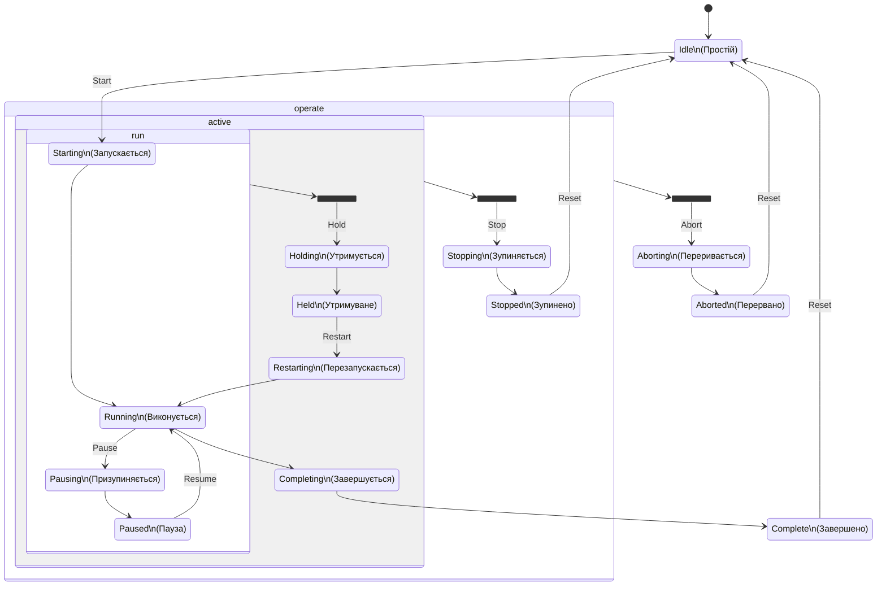

рис.1. Запропонований в каркасі автомат станів процедур.

Проміжні стани потрібні для синхронізації SCADA/HMI та ПЛК, а також між підсистемами (наприклад синхронізуються функції в різних ПЛК). Також проміжні стани дають можливість проводити реєстрацію переходів в журналах та базах даних. Розглянемо тепер цей автомат станів більш детально.

Коли процедурний елемент не виконується він знаходиться в стані ПРОСТІЙ (IDLE). Це пасивний стан, при якому як правило не відбувається ніякого керування. При ініціалізації системи, процедурний елемент переходить саме в цей початковий стан.  Нормальне виконання передбачає послідовний перехід процедури в наступній послідовності станів: 

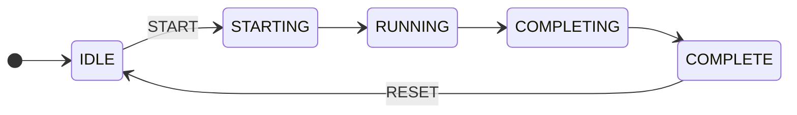

Процедура запускається командою ЗАПУСТИТИ (START), яка наказує процедурному елементу почати виконувати логіку нормального ВИКОНАННЯ (RUNNING). Ця команда виконується лише у тому випадку, коли процедурний елемент знаходиться в стані ПРОСТІЙ (IDLE). Однак перед переходом в стан нормального функціонування, в каркасі передбачено проміжний стан ЗАПУСКАЄТЬСЯ(STARTING), де можна виконати логіку підготовчих робіт. Після виконання усіх необхідних дій відбувається завершення виконання, для чого виконується алгоритм стану COMPLETING (в ISA88 не передбачено). Коли алгоритм  завершення виконано, процедурний елемент переходить в кінцевий стан COMPLETE. Цей стан необхідний для того, щоб процедурний елемент перед наступним запуском отримав команду RESET, що по факту підтверджує верхнім рівнем завершення. Зверніть увагу, що тільки два переходи відбуваються за зовнішніми для процедурного елементу командами, інші відбуваються за внутрішніх умов логіки процедурного елементу або процедурного елементу вищого рівня (наприклад умова переходу в процедурі на мові PFC). Перелік станів в нормальному переході:  

- ПРОСТІЙ (IDLE): Пасивний стан, при якому як правило не відбувається ніякого керування.  Процедурний елемент чекає команди ЗАПУСТИТИ (START), яка викликає перехід в стан ЗАПУСКАЄТЬСЯ(STARTING);
- ЗАПУСКАЄТЬСЯ(STARTING): виконується алгоритм запуску, наприклад підготовчі роботи до переходу в нормальний стан виконання. При спрацюванні внутрішніх умов, наприклад виконанні всіх підготовчих робіт, відбувається перехід в стан ВИКОНУЄТЬСЯ (RUNNING);
- ВИКОНУЄТСЯ (RUNNING): Нормальне функціонування. Тут виконується основний алгоритм керування технологічним процесом. Якщо спрацьовує внутрішня умова завершення, відбувається перехід в стан ЗАВЕРШУЄТЬСЯ (COMPLETING);
- ЗАВЕРШУЄТЬСЯ (COMPLETING): При нормальному функціонуванні виникла умова завершення, у цьому стані виконується алгоритм завершення. Коли спрацьовує внутрішня умова завершення, відбувається перехід в стан ЗАВЕРШЕНО (COMPLETE);
- ЗАВЕРШЕНО (COMPLETE): Нормальне функціонування дійшло до кінцевого стану завершення. Під час цього стану як правило нічого не відбувається з процесом. Процедурний елемент чекає команду СКИНУТИ (RESET), що викличе перехід в стан ПРОСТІЙ (IDLE);

За наявності короткочасних проблем, які потребують спеціальної логіки керування, наприклад пов'язаною з тимчасовою відсутністю сировини, процедурний елемент може перебувати в с стані ПАУЗА (PAUSED). Стандартом та в каркасі передбачено проміжний стан PAUSING, куди переводиться процедурний елемент, якщо прийшла відповідна команда PAUSE. Після проведення проміжних дій, за внутрішньою логікою процедурний елемент переводиться в стан PAUSED. Вихід зі стану PAUSED в RUNNING проводиться за команди RESUME. 

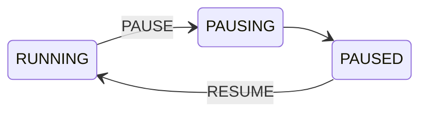

Згідно стандарту:

- ПРИЗУПИНЯЄТЬСЯ (PAUSING): процедурний елемент або апаратурний об’єкт отримав команду ПАУЗА (PAUSE). Це викличе зупинку виконання процедурного елементу на наступному означеному безпечному або стійкому місці в її логіці нормального виконання. Після зупинки відбувається перехід в ПАУЗА (PAUSED);

- ПАУЗА (PAUSED): Після того, як виконання процедурного елементу зупинилося на означеному безпечному місці, стан змінюється в ПАУЗА (PAUSED). Це стан, як правило, використовується для короткострокових зупинок. Запуск команди ВІДНОВИТИ (RESUME) приводить до переходу в стан ВИКОНУЄТСЯ (RUNNING), продовжуючи виконання відразу після означеного місця зупинки;

На відміну від паузи  стан УТРИМУВАНЕ (HELD) передбачений для виконання алгоритмів роботи при довгостроковій зупинці процедурного елементу. Наприклад, якщо необхідно перейти в режим тривалого зберігання продукту, до повторного його оброблення в стані RUNNING. Перехід до проміжного стану HOLDING відбувається з будь якого стану групи `run` за отримання команди HOLD. Вихід зі стану HELD відбувається по команді RESTART через проміжний стан RESTARTING. Алгоритм RESTARTING повинен вивести процедурний елемент до стану RUNNING, тому його алгоритм може бути схожим на алгоритм STARTING. Слід звернути увагу, що перехід в HELD робиться зі всіх станів групи  `run` , у тому числі STARTING. 

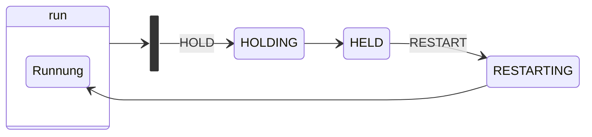

Згідно стандарту:  

- УТРИМУЄТЬСЯ (HOLDING): процедурний елемент отримав команду УТРИМУВАТИ (HOLD) і виконує виконання логіки УТРИМУЄТЬСЯ (HOLDING) для переведення його або апаратурного об'єкту у необхідний стан. Якщо ніякого виконання послідовності не потрібно, то процедурний елемент або апаратурний об’єкт негайно переходить в стан УТРИМУВАНЕ (HELD);

- УТРИМУВАНЕ (HELD): процедурний елемент завершив логіку стану УТРИМУЄТЬСЯ (HOLDING) і був доведений до відомого запланованого стану, який як правило, використовується для довгострокової зупинки. Процедурний елемент або апаратурний об’єкт чекає наступної команди, щоб продовжити;

- ПЕРЕЗАПУСКАЄТЬСЯ (RESTARTING): процедурний елемент отримав команду ПЕРЕЗАПУСТИТИ (RESTART) в той час як знаходився в стані УТРИМУВАНЕ (HELD). Він виконує свою логіку перезапуску, щоб повернутися в стан нормальної роботи;

У стандарті не чітко означено призначення команди STOP, так як вона може бути як штатною так і нештатною. У PACFramework команда STOP передбачається тільки для нештатної зупинки. Для штатної зупинки виконується команда верхньо-рівневого керування, яка переводить процедурний елемент зі стану RUNNING в COMPLETING, і з точки зору стандарту вважається внутрішньою умовою. Нижче про це буде написано детальніше. Фрагмент автомату станів показаний на рисунку:

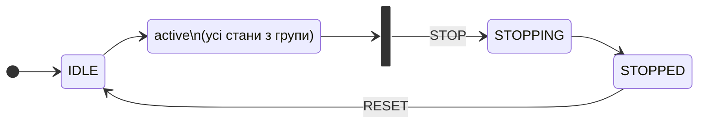

З будь якого стану з групи `active` при відправленні команди STOP відбувається перехід до стану STOPPING, в якому реалізований алгоритм нештатної зупинки. По завершенню алгоритму, процедурний елемент переходить в кінцевий стан STOPPED. Цей стан аналогічно як і COMPLETE необхідний для того, щоб процедурний елемент перед наступним запуском отримав команду RESET, що по факту підтверджує верхнім рівнем завершення виконання процедурного елементу. Згідно стандарту: 

- ЗУПИНЯЄТЬСЯ (STOPPING): процедурний елемент отримав команду СТОП (STOP) і виконується логіка, що виконує нормальну керовану зупинку. Якщо послідовність виконання не потребується, тоді процедурний елемент або апаратурний об’єкт негайно переходить в стан ЗУПИНЕНО (STOPPED);

- ЗУПИНЕНО (STOPPED): процедурний елемент завершив логіку стану ЗУПИНЯЄТЬСЯ (STOPPING) та чекає команди СКИНУТИ (RESET) для переходу в стан ПРОСТІЙ (IDLE);

Окрім нештатної зупинки, в стандарті передбачено швидке переривання виконання за отримання команди ABORT. Можна вважати що це аналогічно швидкій відмові від виконання функціонального елементу, тобто  виходу зі станів функціонування (група станів `operate`) без контролю завершення дій або навіть без будь яких дій. Можна використати це для "Антизависання", наприклад якщо умова завершення нездійснена припустимо зламаний кінцевик клапану (хоч в каркасі є інший механізм виходу з цієї ситуації), або в процесі налагодження виявилося невірна реалізація якогось кроку. Тим не менше стандарт передбачає проміжний стан ABORTING, де можна зробити певні швидкі дії. Після завершення усіх дій ABORTING процедурний елемент переходить в кінцевий стан ABORTED. Цей стан аналогічно як і COMPLETE та STOPPED і  необхідний для того, щоб процедурний елемент перед наступним запуском отримав команду RESET, що по факту підтверджує верхнім рівнем завершення виконання процедурного елементу. 

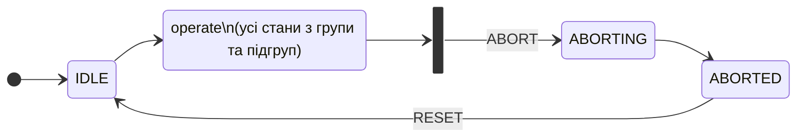

Згідно стандарту:         

- ПЕРЕРИВАЄТЬСЯ (ABORTING): процедурний елемент отримав команду ПЕРЕРВАТИ (ABORT) для виконання логіки ПЕРЕРИВАЄТЬСЯ (ABORTING), що сприяє більш швидкій, але не обов'язково керованій ненормальній зупинці. Якщо послідовне виконання не потрібне, процедурний елемент негайно переходить до стану ПЕРЕРВАНО (ABORTED);

- ПЕРЕРВАНО (ABORTED): процедурний елемент завершив логіку стану ПЕРЕРИВАЄТЬСЯ (ABORTING) і чекає команди СКИНУТИ (RESET) для переходу в ПРОСТІЙ (IDLE).

Згідно стандарту команди:

- ЗАПУСТИТИ (START): ця команда наказує процедурному елементу почати виконувати логіку нормального ВИКОНАННЯ (RUNNING). Ця команда виконується лише у тому випадку, коли процедурний елемент знаходиться в стані ПРОСТІЙ (IDLE);

- ЗУПИНИТИ (STOP): ця команда наказує процедурному елементу виконати логіку ЗУПИНЯЄТЬСЯ (STOPPING). Ця команда виконується лише в тому випадку, коли процедурний елемент знаходиться в станах ВИКОНУЄТСЯ (RUNNING), ПРИЗУПИНЯЄТЬСЯ (PAUSING), ПАУЗА (PAUSED), УТРИМУЄТЬСЯ (HOLDING), УТРИМУВАНЕ (HELD), або ПЕРЕЗАПУСКАЄТЬСЯ (RESTARTING);

-  УТРИМУВАТИ (HOLD): ця команда наказує процедурному елементу виконати логіку УТРИМУЄТЬСЯ (HOLDING). Ця команда виконується лише в тому випадку, коли процедурний елемент знаходиться в станах ВИКОНУЄТСЯ (RUNNING), ПРИЗУПИНЯЄТЬСЯ (PAUSING), ПАУЗА (PAUSED) або ПЕРЕЗАПУСКАЄТЬСЯ (RESTARTING);

- ПЕРЕЗАПУСТИТИ (RESTART): ця команда наказує процедурному елементу виконати логіку ПЕРЕЗАПУСКАЄТЬСЯ (RESTARTING) – безпечного повернення до стану ВИКОНУЄТСЯ (RUNNING). Ця команда виконується лише під час стану процедурного елементу УТРИМУВАНЕ (HELD);

- ПЕРЕРВАТИ (ABORT): ця команда наказує процедурному елементу виконати логіку ПЕРЕРИВАЄТЬСЯ (ABORTING). Команда виконується у будь-якому стані, за винятком ПРОСТІЙ (IDLE), ЗАВЕРШЕНО (COMPLETED), ПЕРЕРИВАЄТЬСЯ (ABORTING) і ПЕРЕРВАНО (ABORTED);

- СКИНУТИ (RESET): ця команда викликає перехід до стану ПРОСТІЙ (IDLE). Вона виконується тільки при станах ЗАВЕРШЕНО (COMPLETE), ПЕРЕРВАНО (ABORTED) та ЗУПИНЕНО (STOPPED);

- ПРИЗУПИНИТИ (PAUSE): ця команда наказує процедурному елементу зробити паузу для наступного запрограмованого переходу в межах його логіки послідовності виконання і чекає команди ВІДНОВИТИ (RESUME), перш ніж продовжити. Ця команда діє тільки в стані ВИКОНУЄТСЯ (RUNNING);

- ВІДНОВИТИ (RESUME): ця команда наказує процедурному елементу, який знаходиться в стані ПАУЗА (PAUSE) із-за команди ПАУЗА (PAUSE) або із-за режиму покрокового виконання, відновити виконання. Ця команда застосовується лише тоді, коли процедурний елемент знаходиться в стані ПАУЗА (PAUSED).

### Змінні в каркасі, що зв'язані з процедурним елементом

З процедурним елементом зв'язано кілька змінних різних типів:

- Структура PROC\_CFG - використовується для зберігання типових конфігурованих даних процедури, контролю та керування з боку програми ПЛК. Може використовуватися також для буферного обміну зі SCADA/HMI. 
- Структура PROC\_HMI використовується для контролю/керування станом процедури з HMI.
- Структура PROC\_CTRL використовується для контролю та керування роботою процедури в програмі ПЛК з процедур того самого або верхнього рівня.
- параметрична змінна, яка конфіугурує та контролює параметри процесу для конкретного процедурного елементу, що пов'язані з рецептом
- змінні вводу/виводу, що є вхідними та вихідними для процедури (як правило різноманітні CM)

Детальніше ці змінні розглянуті нижче.

### Представлення станів в каркасі (STEP1)

Усі стани описані вище представлені в каркасі кількома змінними:

- `PROC_CFG.STEP1 ` - крокове представлення стану, основне місце зберігання. Керується автоматом станів в рушії `PROC_MACH` (описаний нижче)
- поля `PROC_CTRL` з префіксом `STA` - віддзеркалення `PROC_CFG.STEP1` для зручності використання. Змінюються в рушії  `PROC_MACH` (описаний нижче), у інших місцях доступні тільки для читання.
- `PROC_HMI.STEP1` -  копія `PROC_CFG.STEP1 `, доступна в HMI тільки для читання

У таблиці наведені ці стани, а також додаткові згортки станів для зручності використання в реалізації алгоритмів.

| Назва бітового поля в `PROC_CTRL` | Значення STEP1 | Назва стану                                                  | Примітка                                                     |
| --------------------------------- | -------------- | ------------------------------------------------------------ | ------------------------------------------------------------ |
|                                   | 0              | ініціалізація (не є станом)                                  | у інших випадках некоректне значення                         |
| STA_RUNNING                       | 2              | RUNNING                                                      |                                                              |
| STA_IDLE                          | 1              | IDLE                                                         |                                                              |
| STA_RESUMING                      | 15             | RESUMING                                                     | За необхідності перехідного стану PAUSED -> RUNNING. У стандартному рішенні відсутній |
| STA_PAUSING                       | 3              | PAUSING                                                      |                                                              |
| STA_PAUSED                        | 4              | PAUSED                                                       |                                                              |
| STA_HOLDING                       | 5              | HOLDING                                                      |                                                              |
| STA_HELD                          | 6              | HOLD                                                         |                                                              |
| STA_RESTARTING                    | 7              | RESTARTING                                                   |                                                              |
| STA_COMPLETE                      | 8              | COMPLETE                                                     |                                                              |
| STA_STOPPING                      | 9              | STOPPING                                                     |                                                              |
| STA_STOPPED                       | 10             | STOPPED                                                      |                                                              |
| STA_ABORTING                      | 11             | ABORTING                                                     |                                                              |
| STA_ABORTED                       | 12             | ABORTED                                                      |                                                              |
| STA_STARTING                      | 13             | STARTING                                                     |                                                              |
| STA_COMPLETING                    | 14             | COMPLETING                                                   |                                                              |
| STA_NOTWRK                        | -              | будь з яких кінцевих станів = STA_COMPLETE OR STA_STOPPED OR STA_ABORTED OR STA_IDLE |                                                              |
| STA_WRK                           | -              | будь яких з робочих станів = STA_RUNNING OR STA_STARTING OR STA_COMPLETING |                                                              |

### Умови переходу між станами в каркасі

Умови переходу спрацьовують при одній із або комбінації наступних типів подій:

- надсилання команди з верхньорівневого процедурного елементу за зміни стану: якщо процедурний елемент є частиною іншої процедури і її виконання передбачає керування станом цього елементу
- надсилання команди з засобів HMI
- внутрішня логіка процедурного елементу 

Команди верхньорівневого керування та активація умови переходу внутрішньою логікою реалізовані через структурну змінну `PROC_CTRL`. Команди з засобів HMI передаються через поле в типі змінної `PROC_HMI` (тобто `PROC_HMI.CMD`).

Наступні команди в переліку означені в стандарті, і описані вище. В каркасі вони реалізовані як булеві поля структурної змінної, які мають префікс `CMD_` і можуть відправлятися з верхньорівневого процедурного елементу. Для них є аналогічний код команди в `PROC_HMI.CMD`. Пізніше буде описаний типовий підхід в каркасі для мінімізації цих команд (групування).

| Назва команди / поля в `PROC_CTRL` | Значення `PROC_HMI.CMD` | Призначення             |
| ---------------------------------- | ----------------------- | ----------------------- |
| CMD_START                          | 1                       | ЗАПУСТИТИ (START)       |
| CMD_RESUME                         | 2                       | ВІДНОВИТИ (RESUME)      |
| CMD_RESTART                        | 5                       | ПЕРЕЗАПУСТИТИ (RESTART) |
| CMD_PAUSE                          | 3                       | ПРИЗУПИНИТИ (PAUSE)     |
| CMD_HOLD                           | 6                       | УТРИМУВАТИ (HOLD)       |
| CMD_STOP                           | 7                       | ЗУПИНИТИ (STOP)         |
| CMD_ABORT                          | 8                       | ПЕРЕРВАТИ (ABORT)       |
| CMD_RESET                          | 4                       | СКИНУТИ (RESET)         |

Інші умови переходу представлені булевими полями змінної типу `PROC_CTRL` і мають суфіксі `_CMPLT`. Усі  булеві поля крім HL_RUNNING_CMPLT викликані внутрішньою логікою виконання процедурного елементу, тобто змінюються всередині процедурного елементу.  

| Назва поля `PROC_CTRL` | Призначення                                                  | Місце переходу         |
| ---------------------- | ------------------------------------------------------------ | ---------------------- |
| STARTING_CMPLT         | умова переходу на RUNNING виконана                           | STARTING -> RUNNING    |
| HL_RUNNING_CMPLT       | cпрацювала зовнішня (верхньорівнева) умова завершення,  треба опрацьовувати RUNING_CMPLT. HL (HighLevel) потрібна для нормального завершення нижньорівневого процедурного елементу, при спрацюванні умови переходу у верхньорівневій процедурі. | RUNNING -> COMPLETING  |
| RUNING_CMPLT           | процедура завершилася (спрацювала  внутрішня умова завершення) | RUNNING -> COMPLETING  |
| COMPLETING_CMPLT       | умова переходу на COMPLETE виконана                          | COMPLETING -> COMPLETE |
| PAUSING_CMPLT          | умова переходу на PAUSED виконана                            | PAUSING -> PAUSED      |
| RESTARTING_CMPLT       | умова переходу на RUNNING з HOLD  виконана                   | RESTARTING -> RUNNING  |
| RESUMING_CMPLT         | умова переходу на RUNNING з RESUMING виконана. Потрібна тільки при наявності додаткового стану RESUMING. В стандартній версії каркасу не використовується. | RESUMING -> RUNNING    |
| HOLDING_CMPLT          | умова переходу на HOLD з RUNNING  виконана                   | HOLDING -> RUNNING     |
| STOPPING_CMPLT         | умова переходу на STOP виконана                              | STOPPING -> STOPPED    |
| ABORTING_CMPLT         | умова переходу на ABORT виконана                             | ABORTING -> ABORTED    |

Біт `RUNING_CMPLT` призначений для формування внутрішньої умови завершення процедури. При створенні рецептурної процедури на PFC, це створює так званий неявний перехід. Для рушія автомату станів функції `PROC_MACH` (описано нижче) це є зовнішнім сигналом, тому як задається в основній логіці процедурного елементу. 

Біт `HL_RUNNING_CMPLT` призначений для формування зовнішньої умови завершення процедури. Це зовнішня команда від верхнього рівня керування, наприклад рецептурної процедури. Це може задавати явний перехід. У логіці  `PROC_MACH` цей біт не використовується, він обробляється в логіці процедури, а потім скеровує  `RUNING_CMPLT`. Приклад наведено в наступному підрозділі.  


### PROC_CTRL.ENBL та PROC_CTRL.DSBL_COMPLETE

Біт `PROC_CTRL.ENBL` дає можливість заблокувати запуск процедури (з IDLE->Staring), за певних умов. Цей біт може виставлятися як з логіки процедури, так і з логіки верхнього рівня керування, зокрема з використанням базових функцій. Тобто рушій автомату станів процедури не зреагує на команду `CMD_START`, якщо  `PROC_CTRL.ENBL=FALSE`, також будуть проігноровані усі команди з HMI.   

Біт `PROC_CTRL.DSBL_COMPLETE` може використовуватися для утримання завершення виконання `RUNNING` навіть якщо біт  `RUNING_CMPLT` має значення 1. Це необхідно у випадку, якщо перехід треба зробити при `RUNING_CMPLT=TRUE AND  PROC_CTRL.DSBL_COMPLETE=FALSE` .  Даний біт не є стандартним для каркасу і вводиться за необхідності.

Біти `STA_NOTWRK` і `STA_WRK` спрощують контроль за процедурою і використовуються в логіці.

| Атрибут PROC_CTRL | Біт STA | Опис                                                         | Примітка                     |
| ----------------- | ------- | ------------------------------------------------------------ | ---------------------------- |
| ENBL              | 14      | дозвіл на активацію процедури                                | в HMI тільки для читання     |
| DSBL_COMPLETE     | -       | заборона завершення (наприклад за необхідності очікування умови переходу з процедури верхнього рівня) | Не є стандартним для каркасу |

### Кроки (STEP) та часи кроків (T_STEP)

Структурні змінні типу `PROC_CFG` та `PROC_HMI` містять поля кроків та часів кроків.

STEP1 описаний вище і вказує на стан процедурного елементу. Тоді як STEP2 - це крок процедурного елементу. Для зручності налагодження кроки нумеруються наскрізно через всі стани. Таким чином стан можна також визначити за номером кроку. 

T_STEP1 - вказує на час стану RUNNING в мс. в усіх інших проміжних і кінцевих станах час не рахується. При переході в IDLE і HOLDING скидається в 0. 

T_STEP2  -   вказує на час кроку у всіх станах за винятком IDLE, де він = 0. 

| Поле    | Тип   | Призначення                         | Примітка                                                     |
| ------- | ----- | ----------------------------------- | ------------------------------------------------------------ |
| STEP1   | INT   | основне значення стану              |                                                              |
| STEP2   | INT   | крок  всередині стану               | дискретність  кроків по станам 1000 (15 станів – 1000 - 15000) |
| T_STEP1 | UDINT | час виконання процедури в мс        | рахується знаходження тільки в стані Running,  в Paused як правило заморожується, в Holding обнуляється. |
| T_STEP2 | UDINT | час  виконання кроку процедури в мс | в IDLE = 0                                                   |

За необхідності виконання кількох паралельних кроків, варто створювати окремі процедурні елементи, які будуть виконуватися  паралельно. Іншого варіанту каркасом не передбачено.

### Керування та контроль з HMI та режими

Усі стани, режими та тривоги видимі у відповідному вікні керування. Також там доступні команди керування.

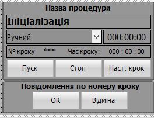

Передбачено що для кожного номеру кроку буде передбачене текстове повідомлення, яке буде виводитися на екран. 

У каркасі передбачені режими керування відповідно до стандарту ISA-88:

- ручний
- автоматичний
- напівавтоматичний

У автоматичному режимі забороняється керувати процедурою з HMI (усі кнопки керування відключені). Інші вимоги до реалізації режимів наразі виходить за рамки PACFramework, так як можуть керуватися зовнішніми рушіями.

У каркасі передбачені такі стандартні тривоги:

- TMAXERR – помилка максимуму часу виконання процедурного елементу, тобто час T_STEP1 більше максимально заданого `PRC_CFG.TMAX`
- TMINERR - помилка мінімуму часу виконання, час T_STEP1 менше мінімально заданого `PRC_CFG.TMIN`
- ALM - загальна тривога пов'язана з процедурним елементом, помилка часу або інша тривога (означується алгоритмом) 

Конкретну тривогу можна визначити за номером кроку (як варіант реалізації). Тобто для конкретної тривоги буде виділений окремий крок. 

Керування передбачає такі кнопки:

- `ПУСК` - реалізує кілька команд в залежності від стану (згортка команд): 
  - CMD_START
  - CMD_RESTART
  - CMD_RESET
  - CMD_RESUME
- `СТОП` - реалізує CMD_STOP
- `ПАУЗА` (за необхідності) - реалізує  CMD_PAUSE
- `УТРИМ.` (за необхідності) - реалізує  CMD_HOLD
- `ПЕРЕРВ.` (за необхідності, обмеження доступу) - реалізує CMD_ABORT

Усі команди необхідно реалізовувати з підтвердженням.

Наступні команди є опційними і дають можливість реалізації ручного керування виконанням процедури. Реалізація їх залежить від проекту і тому не може бути частиною каркасу. Але їх перелік та деяка частина функціональності реалізовані.

- `Наст. крок` (CMD_NEXT) - команда переходу до наступного кроку без очіквуання умови завершення.
- `ОК` (CMD_OK) - підтвердити дію: для ручних операцій або команд підтвердження повідомлення (умова заверешення кроку)
- `ВІДМІНА` (CMD_CANCEL) -  негативне підтвердження (відміна) у випадку ручної операції

Усі команди перед виконанням проходять попередню перевірку на можливість виконання. Для контролю дозволу виконання команд в HMI відправляються статусні біти, що вказують на цей дозвіл. Відповідна кнопка може бути деактивована, якщо немає дозволу на виконання цієї команди. 

### Біти станів та режимів `STA` 

Значення основного стану процедурного елементу вказується в  `STEP1`. Але з процедурою зв'язані інші функціональні елементи. Їх значення компонується в `STA`, тобто `PROC_CFG.STA` та `PROC_HMI.STA`. 

| Назва біту   | Номер біту STA | Призначення                                                  | Примітка                      |
| ------------ | -------------- | ------------------------------------------------------------ | ----------------------------- |
| ENCMD_START  | 0              | =1, дозвіл на команду HMI START                              | керується рушієм PROC_MACH    |
| ENCMD_PAUSE  | 1              | дозвіл на команду HMI PAUSE                                  | керується рушієм PROC_MACH    |
| ENCMD_RESET  | 2              | дозвіл на команду HMI RESET                                  | керується рушієм PROC_MACH    |
| ENCMD_HOLD   | 3              | дозвіл на команду HMI HOLD                                   | керується рушієм PROC_MACH    |
| ENCMD_STOP   | 4              | дозвіл на команду HMI STOP                                   | керується рушієм PROC_MACH    |
| ENCMD_CANCEL | 5              | дозвіл на команду HMI негативне підтвердження (відміна) ручної операції | керується основним алгоритмом |
| ENCMD_NEXT   | 6              | дозвіл на команду HMI перейти до наступного кроку            | керується основним алгоритмом |
| ENCMD_OK     | 7              | дозвіл на команду HMI  підтвердити дію                       | керується основним алгоритмом |
| TMAXERR      | 8              | помилка максимуму часу виконання, час більше максимуму       |                               |
| TMINERR      | 9              | помилка мінімуму часу виконання, час менще мінімуму          |                               |
| ALM          | 10             | наявність помилки процедури                                  |                               |
| SEMI         | 11             | =1 напівавтоматичний режим                                   | AUTO = NOT MAN AND NOT SEMI   |
| INBUF        | 12             | зайнятість буферу                                            |                               |
| MAN          | 13             | =1, ручний режим                                             | AUTO = NOT MAN AND NOT SEMI   |
| ENBL         | 14             | дозвіл на запуск                                             |                               |
| CMD_BUF      | 15             | завантажити в буфер                                          | тільки `PROC_HMI.STA`         |


### Організація функції процедурного елементу

Процедурний елемент реалізовується через функцію, яка повинна викликатися в задачі контролера без умов. Аргументами функції є:

- ID - унікальний ідентифікатор процедури (передається на вхід для зручності читання програми і надійності)
- змінні типу PROC\_CFG
- змінні типу PROC\_HMI 
- змінні типу PROC\_CTRL 
- параметрична змінна PARA
- змінні вводу/виводу IO

Опис змінних наведений вище.

Для спрощення обробки типових команд та автомату станів, в каркасі передбачена функція `PROC_MACH`, яка виконує типові операції. 

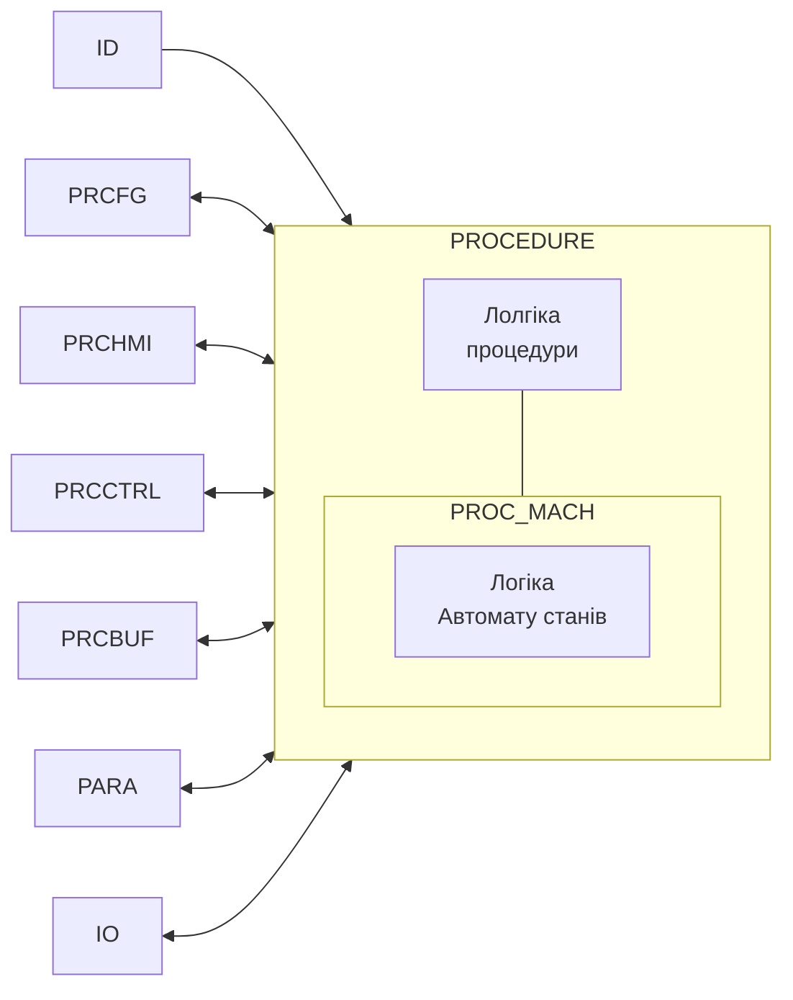

Таким чином програма будь-якої процедури включає в себе наступні частини:

- обробка логіки специфічної для даної процедури
- обробка автомату станів - `PROC_MACH`

### PROC_MACH

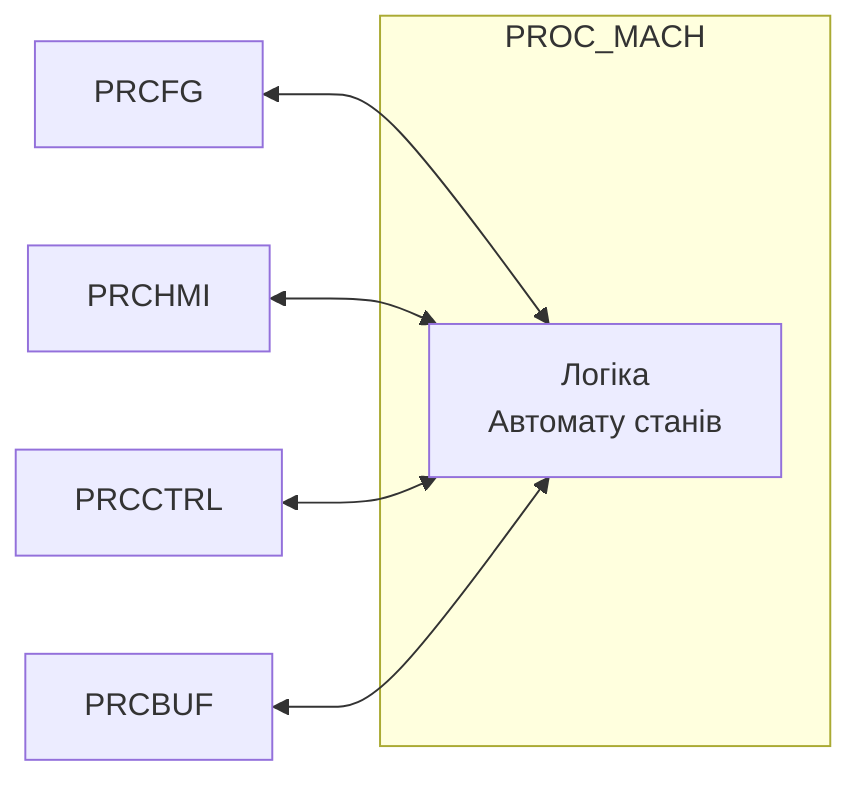

Функція `PROC_MACH` виконує наступні функції:

- забезпечує обробку автомату стану, а саме:
  - обробку команд та перехід на відповідний стан (STEP1)
  - формування `PRCCTRL.STA_`
  - скидання усіх команд (команди проходять тільки на один цикл)
- слідкує за оновленням T_STEP1 та збільшує значення T_STEP1 
- обмежує STEP1, STEP2, T_STEP1 та T_STEP2 в межах діапазону
- блокує недозволені команди
- формує статусні біти для HMI, усі крім ENCMD_CANCEL, ENCMD_NEXT, ENCMD_OK
- керує перемиканням режимів
- керує станом тривог PRCCFG.TMAX (при активному) та PRCCFG.TMIN (при активному) 
- добавляє до загального стану тривог стан мінімуму і максимуму виконання, `ALM = ALM OR PRCCFG.TMAX OR PRCCFG.TMIN`
- деактивування усіх кнопок керування в автоматичному режимі
- роботу з буфером

Загальний автомат станів наведений на рисунку


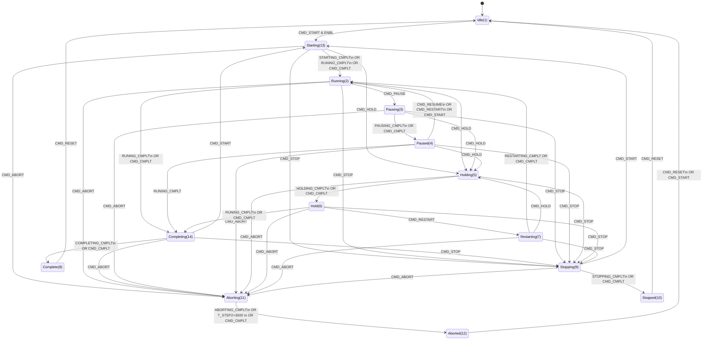

#### RUN

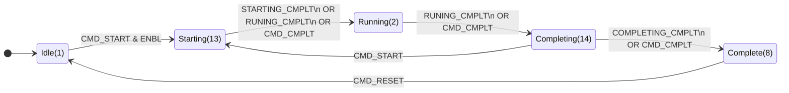

#### PAUSE

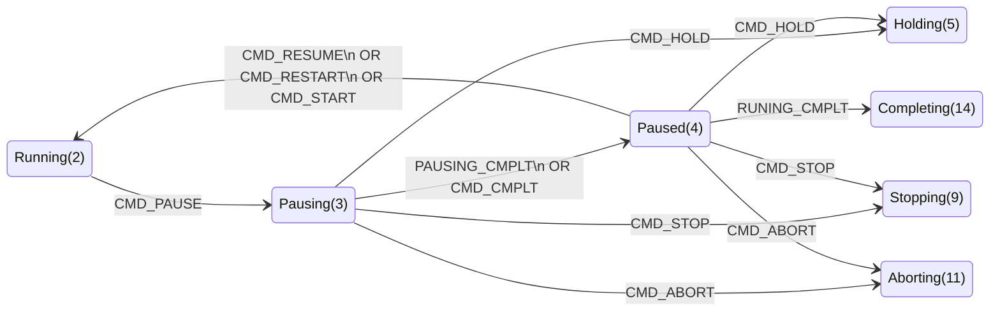

#### HOLD


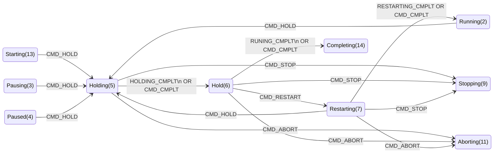

#### STOP

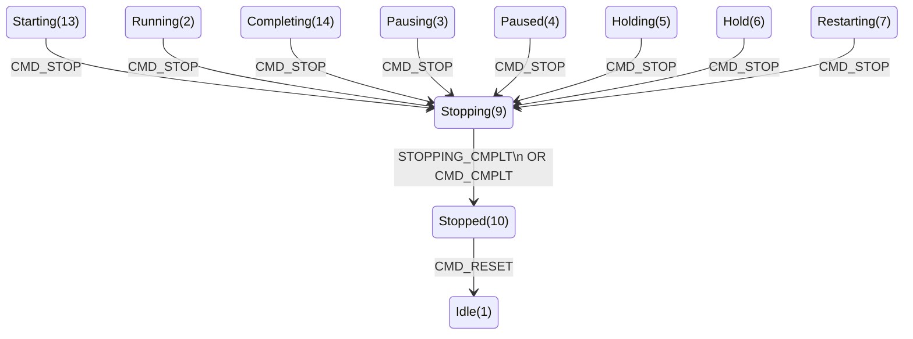


#### ABORT

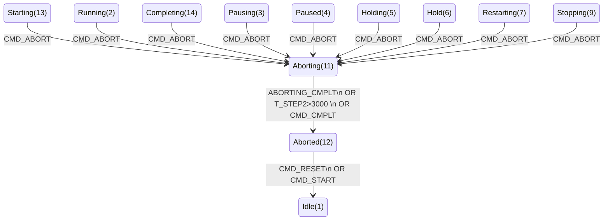


### Змінні

#### PROC_CFG

Головна структура (тип) яка використовується для зберігання конфігурованих даних процедури, контролю та керування з боку програми ПЛК. Може використовуватися також для буферного обміну зі SCADA/HMI. 

| Атрибут | Тип      | Опис                                                         |
| ------- | -------- | ------------------------------------------------------------ |
| ID      | UINT     | ідентифікатор                                                |
| CLSID   | UINT     | CLSID                                                        |
| STA     | UINT/INT | наведений вище                                               |
| CMD     | UINT/INT | Команди (далі числові значення):                             |
|         |          | 1 – START (запустити  процедуру)                             |
|         |          | 2 – RESUME (відновити,  продовжити)                          |
|         |          | 3 – PAUSE (призупинити)                                      |
|         |          | 4 – RESET (скинути)                                          |
|         |          | 5 – RESTART (перезапустити)                                  |
|         |          | 6 – HOLD (утримувати)                                        |
|         |          | 7 – STOP (зупинити  виконання процедури)                     |
|         |          | 8 – ABORT (перервати)                                        |
|         |          | 9 – CMPLT (завершити перехідний стан – для  налагодження)    |
|         |          | 16#A..F - резерв                                             |
|         |          | 16#10 - CMD_NEXT (HMI - перейти до наступного кроку) (16)    |
|         |          | 16#0100 – прочитати  конфігурацію з буферу (256)             |
|         |          | 16#0101 – записати  конфігурацію в буфер (257)               |
|         |          | 16#102 - перевести в автоматичний режим<                     |
|         |          | 16#103 - перевести в ручний режим                            |
|         |          | 16#104 - переключити ручний режим на зворотній               |
|         |          | 16#105 - переключити в напівавтоматичний (програмний) режим  |
|         |          | 16#0200 – перейти до наступного кроку T_STEP2 (пропустити умову переходу) |
|         |          | 16#0300 – команда підтвердження дій CMD_OK                   |
|         |          | 16#0301 - CANCEL (HMI - негативне пітвердження (відміна) ручної операції) |
|         |          | 2000...3000 (16#7D0 - 16#BB8) - перейти на відповідний крок, реалізовується в основній програмі |
| PRM     | INT      | бітові параметри (далі набір бітів)                          |
|         |          | X7 AMAXENBL – активувати тривогу по максимуму часу виконання |
|         |          | X8 AMINENBL – активувати тривогу по мінімуму часу виконання  |
|         |          | X9 HMIMIN – =1 - відображення  часу на ЛМІ в годинах/хвилинах, |
| rez1    | INT      | для вирівнювання                                             |
| STEP1   | INT      | крок стану  (STA повторює STEP1)                             |
| STEP2   | INT      | крок  всередині стану   дискретність  кроків по станам 1000 (15 станів – 1000 - 15000): |
|         |          | 0 –  ініціалізація (тільки при старті ПЛК)                   |
|         |          | 1000  – Idle (очікує)                                        |
|         |          | 13000  – Starting (запускається)                             |
|         |          | 2000  - Running (виконується)                                |
|         |          | 14000-  Completing (завершується)                            |
|         |          | 3000  – Pausing (призупиняється)                             |
|         |          | 4000  – Paused (призупинено)                                 |
|         |          | 5000  – Holding (утримується)                                |
|         |          | 6000  – Hold (утримуване)                                    |
|         |          | 7000  – Restarting (перезапускається)                        |
|         |          | 8000  – Complete (завершено)                                 |
|         |          | 9000  – Stopping (зупиняється)                               |
|         |          | 10000  – Stopped (зупинено)                                  |
|         |          | 11000 – Aborting (переривається)                             |
|         |          | 12000 – Aborted (перервано)                                  |
|         |          | - кроки в станах  робити з дискретністю 10, щоб можна було вставляти додаткові<br /> - для кожного стану, в кроках робити один перший  крок – ініціалізації, в якому робляться дії один раз на цикл |
| T_STEP1 | UDINT    | час  виконання процедури (знаходження в Running) в мс        |
| T_STEP2 | UDINT    | час  виконання кроку процедури в мс                          |
| TMIN    | UDINT    | обмеження  по мінімуму часу виконання, с                     |
| TMAX    | UDINT    | обмеження  по максимуму часу виконання, с                    |

#### PROC_HMI

Структура PROC\_HMI використовується для контролю/керування станом процедури з HMI.

| Атрибут | Тип      | Опис                                                         |
| ------- | -------- | ------------------------------------------------------------ |
| STA     | UINT/INT | Повторює аналогічний в PROC_CFG.STA                          |
| CMD     | UINT/INT | Аналогічно PROC_CFG.CMD                                      |
| STEP1   | INT      | Повторює PROC_CFG.STEP1                                      |
| STEP2   | INT      | Повторює PROC_CFG.STEP2 (опціонально,  якщо необхідно бачити внутрішню структуру для детального журналювання) |
| T_STEP1 | UDINT    | Повторює PROC_CFG.T_STEP1                                    |
| T_STEP2 | UDINT    | Повторює PROC_CFG.T_STEP2                                    |

#### PROC\_CTRL

Структура PROC\_CTRL використовується для контролю та керування роботою процедури в програмі ПЛК з процедур того самого або верхнього рівня.

| Атрибут          | Тип  | Опис                                                         |
| ---------------- | ---- | ------------------------------------------------------------ |
| ENBL             | Bool | IN дозвіл на активацію процедури                             |
| PAUSING_CMPLT    | Bool | IN умова переходу на PAUSED виконана                         |
| RUNING_CMPLT     | Bool | IN процедура завершилася (спрацювала  внутрішня умова завершення). Враховуючи що стандартний автомат станів не передбачає такої команди вона була введена в каркасі для обробки стандартних умов. Самі умови формуються поза функцією PROC_MACH |
| HL_RUNNING_CMPLT | Bool | IN cпрацювала зовнішня умова завершення,  треба опрацьовувати RUNING_CMPLT. HL (HighLevel) потрібна для нормального завершення нижньої процедури, при спрацюванні умови переходу. |
| RESTARTING_CMPLT | Bool | IN умова переходу на RUNNING з HOLD  виконана                |
| RESUMING_CMPLT   | Bool | IN умова переходу на RUNNING з RESUMING виконана             |
| HOLDING_CMPLT    | Bool | IN умова переходу на HOLD з RUNNING  виконана                |
| STOPPING_CMPLT   | Bool | IN умова переходу на STOP виконана                           |
| ABORTING_CMPLT   | Bool | IN умова переходу на ABORT виконана                          |
| STARTING_CMPLT   | Bool | IN умова переходу на RUNNING виконана                        |
| COMPLETING_CMPLT | Bool | IN умова переходу на COMPLETE виконана                       |
| CMD_START        | Bool | IN програмна команда START                                   |
| CMD_RESUME       | Bool | IN програмна команда RESUME                                  |
| CMD_RESTART      | Bool | IN програмна команда RESTART                                 |
| CMD_PAUSE        | Bool | IN програмна команда PAUSE                                   |
| CMD_HOLD         | Bool | IN програмна команда HOLD                                    |
| CMD_STOP         | Bool | IN програмна команда STOP                                    |
| CMD_ABORT        | Bool | IN програмна команда ABORT                                   |
| CMD_RESET        | Bool | IN програмна команда RESET                                   |
| STA_RUNNING      | Bool | OUT стан RUNNING                                             |
| STA_IDLE         | Bool | OUT стан IDLE                                                |
| STA_RESUMING     | Bool | OUT стан RESUMING                                            |
| STA_PAUSING      | Bool | OUT стан PAUSING                                             |
| STA_PAUSED       | Bool | OUT стан PAUSED                                              |
| STA_HOLDING      | Bool | OUT стан HOLDING                                             |
| STA_HOLD         | Bool | OUT стан HOLD                                                |
| STA_RESTARTING   | Bool | OUT стан RESTARTING                                          |
| STA_COMPLETE     | Bool | OUT стан COMPLETE                                            |
| STA_STOPPING     | Bool | OUT стан STOPPING                                            |
| STA_STOPPED      | Bool | OUT стан STOPPED                                             |
| STA_ABORTING     | Bool | OUT стан ABORTING                                            |
| STA_ABORTED      | Bool | OUT стан ABORTED                                             |
| STA_STARTING     | Bool | OUT стан STARTING                                            |
| STA_COMPLETING   | Bool | OUT стан COMPLETING                                          |
| STA_NOTWRK       | Bool | OUT стан будь з яких кінцевих станів = STA_COMPLETE OR STA_STOPPED OR STA_ABORTED OR STA_IDLE |
| STA_WRK          | Bool | OUT стан будь яких з робочих станів = STA_RUNNING OR STA_STARTING OR STA_COMPLETING |
| DSBL_COMPLETE    | Bool | IN заборона завершення (наприклад при  необхідності очікування умови переходу з процедури верхнього рівня) |

### Реалізація процедур 

Нижче наведений приклад заготовки для реалізації процедури. Використовується наскрізна адресація кроків по всім станам, що може спростити відстеження в SCADA/HMI. 

```pascal
(* виставити умову дозволу*)
CTRL.ENBL := FALSE;

(*за необхідності фіксації переходів в БД на перехідних коках ставити затримки*)
(*за необхідності дій в простої, можна вписати в стан*)
IF CTRL.STA_IDLE THEN
    CFG.STEP2 := 0; 
END_IF;
IF CTRL.STA_STARTING THEN
    CASE CFG.STEP2 OF
        13000:
            CFG.STEP2 := 13001;
            CFG.T_STEP2 := 0;
        13001: 
            CTRL.STARTING_CMPLT := TRUE; (*умова штатного завершення STARTING*)
            CFG.T_STEP2 := 0;
        ELSE (*перехід на RUNNING*)
            CFG.STEP2 := 13000;
            CFG.T_STEP2 := 0;
    END_CASE;
    (*умова нормального завершення етапу навіть в STARTING*)
    IF CTRL.HL_RUNNING_CMPLT OR CTRL.RUNING_CMPLT THEN
        CTRL.RUNING_CMPLT := TRUE;
        CFG.STEP2 := 2000;
        CFG.T_STEP2 := 0;
    END_IF;
END_IF;

IF CTRL.STA_RUNNING THEN
    CASE CFG.STEP2 OF
        2000:
            CFG.STEP2 := 2001;
            CFG.T_STEP2 := 0;
        2001: (* основні кроки програми *)  
            ;
        ELSE
            CFG.STEP2 := 2000;
            CFG.T_STEP2 := 0;
    END_CASE;
    
    (*умова нормального завершення етапу*)
    IF CTRL.HL_RUNNING_CMPLT OR CTRL.RUNING_CMPLT THEN
        CTRL.RUNING_CMPLT := TRUE;
        CFG.STEP2 := 14000;
        CFG.T_STEP2 := 0;
    END_IF;
    CTRL.RESTARTING_CMPLT := false;
END_IF;

IF CTRL.STA_COMPLETING THEN
    CASE CFG.STEP2 OF
        14000:
            CFG.STEP2 := 14001;
            CFG.T_STEP2 := 0; (* ініціалізація*)
        14001:
            CTRL.COMPLETING_CMPLT := TRUE;
            CFG.T_STEP2 := 0;
        ELSE
            CFG.STEP2 := 14000;
            CFG.T_STEP2 := 0;
    END_CASE;
END_IF;

IF CTRL.STA_COMPLETE THEN
    CASE CFG.STEP2 OF
        8000:
            CFG.STEP2 := 8001;
            CFG.T_STEP2 := 0; (* ініціалізація*)
        8001:
            IF CFG.T_STEP2 > 5000 THEN
                CTRL.CMD_RESET := TRUE;
            END_IF;
        ELSE
            CFG.STEP2 := 8000;
            CFG.T_STEP2 := 0;
    END_CASE;
END_IF;

IF CTRL.STA_PAUSING THEN
    CASE CFG.STEP2 OF
        3000:
            CFG.STEP2 := 3001;
            CFG.T_STEP2 := 0; (* ініціалізація*)
        3001:
            CTRL.PAUSING_CMPLT := TRUE;
            CFG.T_STEP2 := 0;
        ELSE
            CFG.STEP2 := 3000;
            CFG.T_STEP2 := 0;
    END_CASE;
END_IF;

IF CTRL.STA_PAUSED THEN
    CASE CFG.STEP2 OF
        4000:
            CFG.STEP2 := 4001;
            CFG.T_STEP2 := 0; (* ініціалізація*)
        4001:
            ;
        ELSE
            CFG.STEP2 := 4000;
            CFG.T_STEP2 := 0;
    END_CASE;
END_IF;

IF CTRL.STA_RESTARTING THEN
    CASE CFG.STEP2 OF
        7000:
            CFG.STEP2 := 7001;
            CFG.T_STEP2 := 0; (* ініціалізація*)
        7001:
            CTRL.RESTARTING_CMPLT := TRUE;
            CFG.T_STEP2 := 0;
        ELSE
            CFG.STEP2 := 7000;
            CFG.T_STEP2 := 0;
    END_CASE;
END_IF;

IF CTRL.STA_STOPPING THEN
    CASE CFG.STEP2 OF
        9000:
            CFG.STEP2 := 9001;
            CFG.T_STEP2 := 0; (* ініціалізація*)
        9001:
            CTRL.STOPPING_CMPLT := TRUE;
            CFG.T_STEP2 := 0;
        ELSE
            CFG.STEP2 := 9000;
            CFG.T_STEP2 := 0;
    END_CASE;
END_IF;

IF CTRL.STA_STOPPED THEN
    CASE CFG.STEP2 OF
        10000:
            CFG.STEP2 := 10001;
            CFG.T_STEP2 := 0; (* ініціалізація*)
        10001:
            IF CFG.T_STEP2 > 5000 THEN
                CTRL.CMD_RESET := TRUE;
            END_IF;
        ELSE
            CFG.STEP2 := 10000;
            CFG.T_STEP2 := 0;
    END_CASE;
END_IF;

IF CTRL.STA_HOLDING THEN
    CASE CFG.STEP2 OF
        5000:
            CFG.STEP2 := 5001;
            CFG.T_STEP2 := 0; (* ініціалізація*)
        5001:
            CTRL.HOLDING_CMPLT := TRUE;
            CFG.T_STEP2 := 0;
        ELSE
            CFG.STEP2 := 5000;
            CFG.T_STEP2 := 0;
    END_CASE;
END_IF;

IF CTRL.STA_HELD THEN
    CASE CFG.STEP2 OF
        6000:
            CFG.STEP2 := 6001;
            CFG.T_STEP2 := 0; (* ініціалізація*)
        6001:
            ;
        ELSE
            CFG.STEP2 := 6000;
            CFG.T_STEP2 := 0;
    END_CASE;
END_IF;

IF CTRL.STA_ABORTING THEN
    CASE CFG.STEP2 OF
        11000:
            CFG.STEP2 := 11001;
            CFG.T_STEP2 := 0; (* ініціалізація*)
        11001:
            CTRL.ABORTING_CMPLT := TRUE;
            CFG.T_STEP2 := 0;
        ELSE
            CFG.STEP2 := 11000;
            CFG.T_STEP2 := 0;
    END_CASE;
END_IF;

IF CTRL.STA_ABORTED THEN
    CASE CFG.STEP2 OF
        12000:
            CFG.STEP2 := 12001;
            CFG.T_STEP2 := 0; (* ініціалізація*)
        12001:
            IF CFG.T_STEP2 > 5000 THEN
                CTRL.CMD_RESET := TRUE;
            END_IF;
        ELSE
            CFG.STEP2 := 12000;
            CFG.T_STEP2 := 0;
    END_CASE;
END_IF;

PROC_MACH (ID := ID,
           PRCCFG := CFG,
           PRCHMI := HMI,
           PRCCTRL := CTRL,
           PRCBUF := PRCBUF,
           PLCCFG := PLCCFG);
6#7fff_ffff THEN CFG.T_STEP2:=16#7fff_ffff;END_IF;     
END_IF;
```

Виклик процедур йде бузумовно. Наприклад нижче наведений приклад виклику двох процедур для одного робочого вузла (Unit):

```pascal
PH_EXMPL1 (ID := 1, (* унікальний ідентифікатор процедури*)
           CFG := PHCFG_EXMPL1, 
           HMI := PHHMI_EXMPL1,
           CTRL := PHCTRL_EXMPL1,
           PRCBUF := PRCBUF, (*буферна змінна для налаштування з HMI*)
           PLCCFG := PLC,
			... //далі йдуть параметри специфічні для реалізацї
);
```

