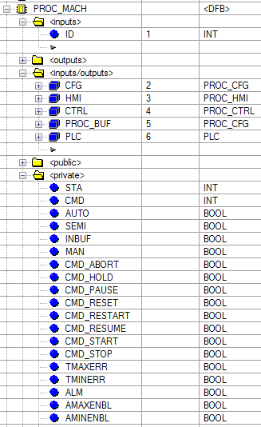

## 4.1. Загальні підходи.

У процедурному керуванні згідно ISA-88 технологічна програма представляє собою сукупність процедур які координуючись виконують певну послідовність технологічних дій. Сама верхня процедура (процедура технологічної комірки, procedure) координує роботу процедур нижчого рівня (процедури технологічного вузла, unit procedure) які у свою чергу координують роботу операцій або/та етапів (operation/phase). Більш детально див.[Основи керування періодичними виробництвами згідно ISA-88](../base/1_2.md).

У ПЛК реалізовуються, так звані, апаратурні процедури (equipment procedure), в противагу рецептурним процедурам (recipe procedure), які тільки посилаються на апаратурні. Апаратурні процедури в каркасі передбачається реалізовувати як функції. 

**Функції етапів, процедур технологічних вузлів, операцій, процедур технологічної комірки, повинні викликатися в кожному циклі незалежно тобто без вкладеності і безумовно! Якщо процедура нічого не повинна виконувати, передбачено стан простою (IDLE)**

### 4.1.1. Організація автомату станів для процедури

Згідно ISA-88 автомат станів для процедур означується довільно. Однак в рамках стандарту 2010-го року запропоновано 2 автомати станів, у якості прикладів. На рис.4.1 показаний автомат станів, який сформований комбінацією з цих 2-х. До першого (класичного) варіанту доданий стан \"Запускається\" і \"Завершується\".


рис.4.1. Запропонований в каркасі автомат станів процедур.

Проміжні стани потрібні для синхронізації SCADA/HMI та ПЛК, а також між підсистемами (наприклад синхронізуються функції в різних ПЛК). Також проміжні стани дають можливість проводити реєстрацію переходів в журналах та базах даних.

#### PROC\_CFG

Головна структура (тип) яка використовується для зберігання конфігурованих даних процедури, контролю та керування з боку програми ПЛК. Може використовуватися також для буферного обміну зі SCADA/HMI. 

| Атрибут | Тип   | Опис                                                         |
| ------- | ----- | ------------------------------------------------------------ |
| ID      | INT   | ідентифікатор  (може вміщувати також CLSID)                  |
| STA     | INT   | **Молодший  байт** відображає стан, як правило  повторює STEP1 (нижче значення) |
|         |       | 0 –  ініціалізація (тільки при старті ПЛК)                   |
|         |       | 1 –  Idle (простій)                                          |
|         |       | 13  – Starting (запускається)                                |
|         |       | 2 -  Running (виконується)                                   |
|         |       | 14 -  Completing (завершується)                              |
|         |       | 3 –  Pausing (призупиняється)                                |
|         |       | 4 –  Paused (призупинено)                                    |
|         |       | 5 –  Holding (утримується)                                   |
|         |       | 6 –  Hold (утримуване)                                       |
|         |       | 7 –  Restarting (перезапускається)                           |
|         |       | 8 –  Complete (завершено)                                    |
|         |       | 9 –  Stopping (зупиняється)                                  |
|         |       | 10  – Stopped (зупинено)                                     |
|         |       | 11 –  Aborting (переривається)                               |
|         |       | 12 –  Aborted (перервано)                                    |
|         |       | 15  – Resuming (відновлюється)                               |
|         |       | **Старший  байт (нижче побітово)**                           |
|         |       | X8  TMAXERR – помилка максимуму часу виконання               |
|         |       | X9  TMINERR – помилка мінімуму часу виконання                |
|         |       | X10  ALM – наявність помилки процедури                       |
|         |       | X11  SEMI - напівавтоматичний                                |
|         |       | X12  INBUF – зайнятість буферу                               |
|         |       | X13  MAN – ручний режим                                      |
|         |       | X14 ENBL – дозвіл на  запуск                                 |
| CMD     | INT   | Команди (далі числові значення):                             |
|         |       | 16#0100 – прочитати  конфігурацію з буферу                   |
|         |       | 16#0101 – записати  конфігурацію в буфер                     |
|         |       | 1 – START (запустити  процедуру)                             |
|         |       | 2 – RESUME (відновити,  продовжити)                          |
|         |       | 3 – PAUSE (призупинити)                                      |
|         |       | 4 – RESET (скинути)                                          |
|         |       | 5 – RESTART (перезапустити)                                  |
|         |       | 6 – HOLD (утримувати)                                        |
|         |       | 7 – STOP (зупинити  виконання процедури)                     |
|         |       | 8 – ABORT (перервати)                                        |
|         |       | 9 – CMPLT (завершити перехідний стан – для  налагодження)    |
|         |       | 16#0200 – перейти до наступного кроку T_STEP2 (пропустити умову переходу) |
|         |       | 16#0300 – команди підтвердження дій                          |
| PRM     | INT   | бітові параметри (далі набір бітів)                          |
|         |       | X7 AMAXENBL – активувати тривогу по максимуму часу виконання |
|         |       | X8 AMINENBL – активувати тривогу по мінімуму часу виконання  |
|         |       | X9 HMIMIN – =1 - відображення  часу на ЛМІ в годинах/хвилинах, |
| STEP1   | INT   | крок стану  (STA повторює STEP1)                             |
| STEP2   | INT   | крок  всередині стану   дискретність  кроків по станам 1000 (15 станів – 1000 - 15000): |
|         |       | 0 –  ініціалізація (тільки при старті ПЛК)                   |
|         |       | 1000  – Idle (очікує)                                        |
|         |       | 13000  – Starting (запускається)                             |
|         |       | 2000  - Running (виконується)                                |
|         |       | 14000-  Completing (завершується)                            |
|         |       | 3000  – Pausing (призупиняється)                             |
|         |       | 4000  – Paused (призупинено)                                 |
|         |       | 5000  – Holding (утримується)                                |
|         |       | 6000  – Hold (утримуване)                                    |
|         |       | 7000  – Restarting (перезапускається)                        |
|         |       | 8000  – Complete (завершено)                                 |
|         |       | 9000  – Stopping (зупиняється)                               |
|         |       | 10000  – Stopped (зупинено)                                  |
|         |       | 11000 – Aborting (переривається)                             |
|         |       | 12000 – Aborted (перервано)                                  |
|         |       | - кроки в станах  робити з дискретністю 10, щоб можна було вставляти додаткові<br /> - для кожного стану, в кроках робити один перший  крок – ініціалізації, в якому робляться дії один раз на цикл |
| T_STEP1 | UDINT | час  виконання процедури (знаходження в Running),  в Paused як правило заморожується, в Holding обнуляється. |
| T_STEP2 | UDINT | час  виконання кроку процедури                               |
| TMIN    | UDINT | обмеження  по мінімуму часу виконання, с                     |
| TMAX    | UDINT | обмеження  по максимуму часу виконання, с                    |
|         |       |                                                              |

#### PROC_HMI

Структура PROC\_HMI використовується для контролю/керування станом процедури з HMI.

| Атрибут | Тип   | Опис                                                         |
| ------- | ----- | ------------------------------------------------------------ |
| STA     | INT   | **Молодший байт** повторює аналогічний в PROC_CFG.STA        |
|         |       | **Старший байт** повторює аналогічний в PROC_CFG.STA, добавляється додатковий біт <br />X15 CMDBUF – завантажити в буфер |
| CMD     | INT   | Аналогічно PROC_CFG.CMD. <br />Для економії тегів, слово команди  може бути відсутнім, тоді керування з ЛМІ буде проводитися через буферну  змінну |
| T_STEP1 | UDINT | Повторює PROC_CFG.T_STEP1    <br />Для економії тегів, час виконання  процедури може бути відсутнім, або бути UINT, тоді  масштабування відображення (с, хв, год) вибирається індивідуально для кожної  процедури. Можна використовувати формат BCD. |
| T_STEP2 | UDINT | Повторює PROC_CFG.T_STEP2<br />Для економії тегів, час виконання  кроку може бути відсутнім, або бути UINT, тоді масштабування відображення (с, хв, год) вибирається  індивідуально для кожної процедури |
| STEP2   | INT   | Повторює PROC_CFG.STEP2 (опціонально,  якщо необхідно бачити внутрішню структуру для детального журналювання) |
| ALM     | INT   | Повторює старший байт PHASE_CFG.STA (опціонально, у випадку якщо HMI має  обмеження на використання масок) |

#### PROC\_CTRL

Структура PROC\_CTRL використовується для контролю та керування роботою процедури в програмі ПЛК з процедур того самого або верхнього рівня.

| Атрибут          | Тип  | Опис                                                         |
| ---------------- | ---- | ------------------------------------------------------------ |
| ENBL             | Bool | IN дозвіл на активацію процедури                             |
| PAUSING_CMPLT    | Bool | IN умова переходу на PAUSED виконана                         |
| RUNING_CMPLT     | Bool | IN процедура завершилася (спрацювала  внутрішня умова завершення). Враховуючи що стандартний автомат станів не передбачає такої команди вона була введена в каркасі для обробки стандартних умов. Самі умови формуються поза функцією PROC_MACH |
| HL_RUNNING_CMPLT | Bool | IN cпрацювала зовнішня умова завершення,  треба опрацьовувати RUNING_CMPLT. HL (HighLevel) потрібна для нормального завершення нижньої процедури, при спрацюванні умови переходу. |
| RESTARTING_CMPLT | Bool | IN умова переходу на RUNNING з HOLD  виконана                |
| RESUMING_CMPLT   | Bool | IN умова переходу на RUNNING з RESUMING виконана             |
| HOLDING_CMPLT    | Bool | IN умова переходу на HOLD з RUNNING  виконана                |
| STOPPING_CMPLT   | Bool | IN умова переходу на STOP виконана                           |
| ABORTING_CMPLT   | Bool | IN умова переходу на ABORT виконана                          |
| STARTING_CMPLT   | Bool | IN умова переходу на RUNNING виконана                        |
| COMPLETING_CMPLT | Bool | IN умова переходу на COMPLETE виконана                       |
| CMD_START        | Bool | IN програмна команда START                                   |
| CMD_RESUME       | Bool | IN програмна команда RESUME                                  |
| CMD_RESTART      | Bool | IN програмна команда RESTART                                 |
| CMD_PAUSE        | Bool | IN програмна команда PAUSE                                   |
| CMD_HOLD         | Bool | IN програмна команда HOLD                                    |
| CMD_STOP         | Bool | IN програмна команда STOP                                    |
| CMD_ABORT        | Bool | IN програмна команда ABORT                                   |
| CMD_RESET        | Bool | IN програмна команда RESET                                   |
| STA_RUNNING      | Bool | OUT стан RUNNING                                             |
| STA_IDLE         | Bool | OUT стан IDLE                                                |
| STA_RESUMING     | Bool | OUT стан RESUMING                                            |
| STA_PAUSING      | Bool | OUT стан PAUSING                                             |
| STA_PAUSED       | Bool | OUT стан PAUSED                                              |
| STA_HOLDING      | Bool | OUT стан HOLDING                                             |
| STA_HOLD         | Bool | OUT стан HOLD                                                |
| STA_RESTARTING   | Bool | OUT стан RESTARTING                                          |
| STA_COMPLETE     | Bool | OUT стан COMPLETE                                            |
| STA_STOPPING     | Bool | OUT стан STOPPING                                            |
| STA_STOPPED      | Bool | OUT стан STOPPED                                             |
| STA_ABORTING     | Bool | OUT стан ABORTING                                            |
| STA_ABORTED      | Bool | OUT стан ABORTED                                             |
| STA_STARTING     | Bool | OUT стан STARTING                                            |
| STA_COMPLETING   | Bool | OUT стан COMPLETING                                          |
| STA_NOTWRK       | Bool | OUT стан будь з яких кінцевих станів = STA_COMPLETE OR STA_STOPPED OR STA_ABORTED OR STA_IDLE |
| STA_WRK          | Bool | OUT стан будь яких з робочих станів = STA_RUNNING OR STA_STARTING OR STA_COMPLETING |
| DSBL_COMPLETE    | Bool | IN заборона завершення (наприклад при  необхідності очікування умови переходу з процедури верхнього рівня) |

Деякі команди та стани, яких немає в стандарті описані нижче.

#### Функція PROC\_MACH


Обробку автоматів станів процедур зручно проводити окремою функцією `PROC_MACH`, яка обробляє команди від HMI або від програми керування і переводить автомат в певний стан відповідно до рис.4.1. Таким чином програма будь-якої процедури включає в себе наступні частини:

- обробка логіки специфічної для даної процедури
- обробка автомату станів - `PROC_MACH`

Стан процедур зберігається у змінних типу `PROC_CFG`. Стан та команди контролюються/керуються з програми через структурну змінну процедури типу `PROC_CTRL`, а з HMI чрез змінну PROC\_HMI. Для конфігурування окремою процедури використовується буферна змінна. Приклад інтерфейсу функції PROC\_MACH показаний нижче.



рис.4.2. Інтерфейс PROC\_MACH.

Нижче наведений фрагмент коду функції для розуміння її призначення. Приклад DFB для Unity PRO доступний в експортному варіанті [за посиланням](proc_mach.xdb).

```pascal
(*------------------- обробка автомату станів процедури
ID
CFG - конфігурування та плинний стан
HMI - для роботи з ЛМІ
CTRL - для спрощення контролю/керування з програми користувача ПЛК
-------------------------------------------------------*)
(* 
--- стани:
0 – ініціалізація (тільки при старті ПЛК) не видимий з HMI
1 – Idle (простій) 
13 – Starting (запускається)
2 - Running (виконується) 
3 - Pausing
14- Completing (завершується)
5 – Holding (утримується)
6 – Hold (утримуване)
7 – Restarting (перезапускається)
8 – Complete (завершено)
9 – Stopping (зупиняється)
10 – Stopped (зупинено)
11 - Aborting
12 - Aborted
--- команди HMI
1 – START (запустити процедуру)
2 – RESUME (відновити, продовжити)  
3 – PAUSE (призупинити)
4 – RESET (скинути)
5 – RESTART (перезапустити)
6 – HOLD (утримувати)
7 – STOP (зупинити виконання процедури)
8 – ABORT (перервати)
*)
CFG.ID:=ID;
(*заглушка від дурака, ID не може = 0*)
IF ID=0 THEN 
    CFG.STA:=0;
    CFG.CMD:=0;
    RETURN; 
END_IF;
(* -> внутрішні змінні*)
STA := CFG.STA;
TMAXERR:=STA.8;
TMINERR:=STA.9;
ALM:=STA.10;
SEMI := STA.11;
INBUF := STA.12; 
MAN := STA.13;
AUTO := NOT MAN AND NOT SEMI;
CMD:=CFG.CMD;
INBUF:=(CFG.ID=PROC_BUF.ID);
(*PRM*)
AMAXENBL:=CFG.PRM.7;
AMINENBL:=CFG.PRM.8;

(*CMD внутрішній з CFG тут не використовується, потрібен тільки для сумісності типів з BUF*)
IF INBUF THEN
    IF PROC_BUF.CMD <> 0 THEN 
        CMD:=PROC_BUF.CMD; 
    ELSE CMD:=HMI.CMD;
    END_IF;
    PROC_BUF.STA:=CFG.STA;	
    PROC_BUF.STEP1:=CFG.STEP1;
    PROC_BUF.STEP2:=CFG.STEP2;        	
    PROC_BUF.T_STEP1:=CFG.T_STEP1;
    PROC_BUF.T_STEP2:=CFG.T_STEP2;	
ELSE
    CMD:=HMI.CMD;
END_IF;

(*у процедурі стандартний обробник команд 
усі інші команди HMI, які тут не описані, повинні бути оброблені раніше, 
ніж викличеться ця функція*)
CASE CMD OF
 16#0100: (*прочитати конфігурацію*)
    PROC_BUF:=CFG;
    PROC_BUF.CMD:=0;  
 16#0101: (*записати конфігурацію*)
    CFG.PRM :=PROC_BUF.PRM;
    CFG.TMAX := PROC_BUF.TMAX;
    CFG.TMIN := PROC_BUF.TMIN;    
END_CASE;
(* джерело команди керування станом може йти з 
HMI - CMD  
або програми - CTRL*)
CMD_ABORT := CTRL.CMD_ABORT OR CMD=8 ;
CMD_HOLD := CTRL.CMD_HOLD OR CMD=6;
CMD_PAUSE := CTRL.CMD_PAUSE OR CMD=3;
CMD_RESET := CTRL.CMD_RESET OR CMD=4 OR CMD=1; (*RESET або START*)
CMD_RESTART := CTRL.CMD_RESTART OR CMD=5 OR CMD=1; (*RESTART або START*)
(*RESUME або RESET або START*)
CMD_RESUME := CTRL.CMD_RESUME OR CTRL.CMD_RESTART OR CMD=2 OR CMD=5 OR CMD=1;
CMD_START := CTRL.CMD_START OR CMD=1;
CMD_STOP := CTRL.CMD_STOP OR CMD=7;

(*автомат станів*)
CASE CFG.STEP1 OF   
    0:(*0 - ініціалізація*)
     CFG.STEP1:=1;   
    1:(*1 – Idle (простій)*)
     CFG.T_STEP1:=0;  TMAXERR:=FALSE; TMINERR:=FALSE; 
     (*може запуститися тільки при дозволу запуску CTRL.ENBL*)
     IF CMD_START AND CTRL.ENBL THEN CFG.STEP1:=13; END_IF;
     CTRL.PAUSING_CMPLT := FALSE; CTRL.RUNING_CMPLT := FALSE;
     CTRL.STARTING_CMPLT := FALSE; CTRL.COMPLETING_CMPLT := FALSE;
     CTRL.HL_RUNNING_CMPLT := FALSE;CTRL.HOLDING_CMPLT := FALSE;
     CTRL.STOPPING_CMPLT := FALSE; CTRL.ABORTING_CMPLT := FALSE;
     CTRL.RESUMING_CMPLT := FALSE; CTRL.RESTARTING_CMPLT := FALSE;
    13:(*13 - Starting*)
     IF CTRL.STARTING_CMPLT OR CTRL.RUNING_CMPLT THEN
        CFG.STEP1:=2;  
     END_IF;
     IF CMD_STOP THEN CFG.STEP1:=9; END_IF;
     IF CMD_ABORT THEN CFG.STEP1:=11; END_IF;
     CTRL.RESTARTING_CMPLT := FALSE;
     CTRL.RESUMING_CMPLT := FALSE;	
    2:(*2 - Running then*) 
     (*завершення йде тільки при дозволі завершення*) 
     IF CTRL.RUNING_CMPLT AND NOT CTRL.DSBL_CMPLT THEN 
        CFG.STEP1:=14;
        IF AMINENBL AND CFG.T_STEP1< CFG.TMIN THEN
            TMINERR:=TRUE;
        END_IF; 
     END_IF;
     IF CMD_PAUSE THEN CFG.STEP1:=3; END_IF;
     IF CMD_HOLD THEN CFG.STEP1:=5; END_IF;
     IF CMD_STOP THEN CFG.STEP1:=9; END_IF;
     IF CMD_ABORT THEN CFG.STEP1:=11; END_IF;
     IF AMAXENBL AND CFG.T_STEP1>= CFG.TMAX THEN
        TMAXERR:=TRUE;
     END_IF;
     CTRL.PAUSING_CMPLT:=false;
     CTRL.RESUMING_CMPLT := FALSE;
     CTRL.RESTARTING_CMPLT := FALSE;
     CTRL.HOLDING_CMPLT:=false;

    14:(*Completing*)
     IF CTRL.COMPLETING_CMPLT THEN
        CFG.STEP1:=8;  
     END_IF;
     IF CMD_STOP THEN CFG.STEP1:=9; END_IF;
     IF CMD_ABORT THEN CFG.STEP1:=11; END_IF;
    3:(*3 – Pausing*)
     IF CTRL.PAUSING_CMPLT THEN CFG.STEP1:=4; END_IF;
     IF CMD_HOLD THEN CFG.STEP1:=5; END_IF;
     IF CMD_STOP THEN CFG.STEP1:=9; END_IF;
     IF CMD_ABORT THEN CFG.STEP1:=11; END_IF;    
    4:(*4 – Paused*)
     IF CMD_RESUME THEN CFG.STEP1:=15; END_IF;
     IF CTRL.RUNING_CMPLT THEN 
           CFG.STEP1 := 14;
     END_IF;
     IF CMD_HOLD THEN CFG.STEP1:=5; END_IF;
     IF CMD_STOP THEN CFG.STEP1:=9; END_IF;
     IF CMD_ABORT THEN CFG.STEP1:=11; END_IF;
    15:(*15 - Resuming*)
     IF CTRL.RESUMING_CMPLT THEN CFG.STEP1:=2; END_IF;
     IF CMD_HOLD THEN CFG.STEP1:=5; END_IF;
     IF CMD_STOP THEN CFG.STEP1:=9; END_IF;
     IF CMD_ABORT THEN CFG.STEP1:=11; END_IF;            
    5:(*5 – Holding*)
     IF CTRL.HOLDING_CMPLT THEN CFG.STEP1:=6; END_IF;
     IF CMD_STOP THEN CFG.STEP1:=9; END_IF;
     IF CMD_ABORT THEN CFG.STEP1:=11; END_IF;            
    6:(*6 – Hold*)
     (*CFG.T_STEP1:=0;*)
     IF CMD_RESTART THEN CFG.STEP1:=7; END_IF;   
     IF CMD_STOP THEN CFG.STEP1:=9; END_IF;
     IF CMD_ABORT THEN CFG.STEP1:=11; END_IF;        
    7:(*7 – Restarting*)
     IF CTRL.RESTARTING_CMPLT THEN CFG.STEP1:=2; END_IF;
     IF CMD_HOLD THEN CFG.STEP1:=5; END_IF;
     IF CMD_STOP THEN CFG.STEP1:=9; END_IF;
     IF CMD_ABORT THEN CFG.STEP1:=11; END_IF;            
    8:(*8 – Complete*)
     IF CMD_RESET THEN CFG.STEP1:=1; END_IF; 
    9:(*9 – Stopping*)
     IF CTRL.STOPPING_CMPLT THEN CFG.STEP1:=10; END_IF;
     IF CMD_ABORT THEN CFG.STEP1:=11; END_IF;        
    10:(*10 – Stopped*)
     IF CMD_RESET THEN CFG.STEP1:=1; END_IF;     
    11:(*11 - Aborting*)
     IF CTRL.ABORTING_CMPLT OR CFG.T_STEP2>2 THEN CFG.STEP1:=12; END_IF;      
    12:(*12 - Aborted*)
     IF CMD_RESET THEN CFG.STEP1:=1; END_IF; 
    ELSE
     CFG.STEP1:=0;
END_CASE;

IF INBUF THEN
    PROC_BUF.STA:=STA;
    PROC_BUF.T_STEP1:=CFG.T_STEP1;
    PROC_BUF.CMD :=0;
END_IF;

CTRL.STA_IDLE:=(CFG.STEP1=1);
CTRL.STA_RUNNING:=(CFG.STEP1=2);
CTRL.STA_PAUSING:=(CFG.STEP1=3);
CTRL.STA_PAUSED:=(CFG.STEP1=4);
CTRL.STA_HOLDING:=(CFG.STEP1=5);
CTRL.STA_HOLD:=(CFG.STEP1=6);
CTRL.STA_RESTARTING:=(CFG.STEP1=7);
CTRL.STA_COMPLETE:=(CFG.STEP1=8);
CTRL.STA_STOPPING:=(CFG.STEP1=9);
CTRL.STA_STOPPED:=(CFG.STEP1=10);
CTRL.STA_ABORTING:=(CFG.STEP1=11);
CTRL.STA_ABORTED:=(CFG.STEP1=12);
CTRL.STA_STARTING:=(CFG.STEP1=13);
CTRL.STA_COMPLETING:=(CFG.STEP1=14);
CTRL.STA_RESUMING:=(CFG.STEP1=15);

CTRL.CMD_ABORT := FALSE;
CTRL.CMD_HOLD := FALSE;
CTRL.CMD_PAUSE := FALSE;
CTRL.CMD_RESET := FALSE;
CTRL.CMD_RESTART := FALSE;
CTRL.CMD_RESUME := FALSE;
CTRL.CMD_START := FALSE;
CTRL.CMD_STOP := FALSE;

ALM:=TMINERR OR TMAXERR;
STA:=STA AND 16#FFF0;
STA:=STA OR CFG.STEP1;
STA.8:=TMAXERR;
STA.9:=TMINERR;
STA.10:=ALM;
STA.11:=SEMI;
STA.12:=INBUF;
STA.13:=MAN;
STA.14:=CTRL.ENBL; 

CFG.CMD:=0; HMI.CMD:=0;
CFG.STA:=STA; HMI.STA :=STA;
HMI.T_STEP1:=CFG.T_STEP1;
HMI.T_STEP2:=CFG.T_STEP2;
HMI.STEP2:=CFG.STEP2;  
(*рахувати час виконання процедури*)
IF PLC.PLS.3 THEN (*кожну секунду, можна вказати по AND NOT стани, в яких не рахувати*) 
    CFG.T_STEP1:=CFG.T_STEP1+1;
    IF CFG.T_STEP1>16#7fffffff THEN CFG.T_STEP1:=16#7fffffff;END_IF;
END_IF;
```

Біт `RUNING_CMPLT` призначений для формування внутрішньої умови завершення процедури. При створенні рецептурної процедури на PFC, це створює так званий неявний перехід. Для функції `PROC_MACH` це є зовнішнім сигналом, тому як задається в основній логіці процедури. 

Біт `HL_RUNNING_CMPLT` призначений для формування зовнішньої умови завершення процедури. Це зовнішня команда від верхнього рівня керування, наприклад рецептурної процедури. Це може задавати явний перехід. У логіці  `PROC_MACH` цей біт не використовується, він обробляється в логіці процедури, а потім скеровує  `RUNING_CMPLT`. Приклад наведено в наступному підрозділі.  


Біт `ENBL` дає можливість заблокувати запуск процедури (з IDLE->Staring), за певних умов. Цей біт може виставлятися як з логіки процедури, так і з логіки верхнього рівня керування, зокрема з використанням базових функцій.

Біт `DSBL_COMPLETE` використовується для утримання завершення виконання `RUNNING` навіть якщо біт  `RUNING_CMPLT` має значення 1. 

Біти `STA_NOTWRK` і `STA_WRK` спрощують контроль за процедурою і використовуються в логіці.


### 4.1.2. Реалізація процедур 

Нижче наведений приклад заготовки для реалізації процедури. Використовується наскрізна адресація кроків по всім станам, що може спростити відстеження в SCADA/HMI. 

```pascal
(*заготовка для процедури*)
(* кроки
0 – ініціалізація (тільки при старті ПЛК)
1000 – Idle (очікує)
13000 – Starting (запускається)
2000 - Running (виконується) 
14000- Completing (завершується)
3000 – Pausing (призупиняється)
4000 – Paused (призупинено)
5000 – Holding (утримується)
6000 – Hold (утримуване)
7000 – Restarting (перезапускається)
8000 – Complete (завершено)
9000 – Stopping (зупиняється)
10000 – Stopped (зупинено)
11000 – Aborting (переривається)
12000 – Aborted (перервано)
*)

IF CTRL.STA_IDLE THEN
    CFG.STEP2:=0; // час кроку 
END_IF;

(*13000 - Starting*)
IF CTRL.STA_STARTING THEN
    CASE CFG.STEP2 OF
        13000:CFG.STEP2:=13010;CFG.T_STEP2:=0;
        13010:(*відбувається перехід на running з затримкою*)
	    if CFG.T_STEP2>=2 then 
	    	CTRL.STARTING_CMPLT:=true;
	    end_if; 
        ELSE
            CFG.STEP2:=13000;CFG.T_STEP2:=0;
    END_CASE;
    (*умова нормального завершення етапу 
    замість CTRL.RUNING_CMPLT по OR ставиться потрібна умова *)
    IF CTRL.HL_RUNNING_CMPLT OR CTRL.RUNING_CMPLT THEN
        CTRL.RUNING_CMPLT:=TRUE;
        CFG.STEP2:=14000;CFG.T_STEP2:=0;
    END_IF; 
END_IF;
(*2000 - RUNNING*)
IF CTRL.STA_RUNNING THEN
    CASE CFG.STEP2 OF
        2000:CFG.STEP2:=2010;CFG.T_STEP2:=0; (*ініціалізація*)
        2010:
	 IF CFG.T_STEP2 >= 2 THEN (*заглушка*)
            CTRL.RUNING_CMPLT:=true;
         END_IF;
        ELSE
         CFG.STEP2:=2000;CFG.T_STEP2:=0; 
    END_CASE;
    (*умова нормального завершення етапу 
    замість CTRL.RUNING_CMPLT по OR ставиться потрібна умова *)
    IF CTRL.HL_RUNNING_CMPLT OR CTRL.RUNING_CMPLT THEN
     	CTRL.RUNING_CMPLT := TRUE;
    END_IF;
END_IF;
(*14000 - Completing *)
IF CTRL.STA_COMPLETING THEN
    CASE CFG.STEP2 OF
        14000: CFG.STEP2 := 14010; CFG.T_STEP2 := 0;
	14010:
            CTRL.COMPLETING_CMPLT := true;
        ELSE
            CFG.STEP2 := 14000; CFG.T_STEP2 := 0;
    END_CASE;
    (*умова нормального завершення процедури*)
END_IF;
(*8000 - COMPLETE *)
IF CTRL.STA_COMPLETE THEN
	CFG.STEP2 := 8000;
	IF CFG.T_STEP2 >= 2 THEN CTRL.CMD_RESET:=TRUE;end_if;(*автоскидання етапу*)
END_IF;

(*7000  - RESTARTING *)
IF CTRL.STA_RESTARTING THEN 
    CASE CFG.STEP2 OF
      	7000: CFG.STEP2 := 7010; CFG.T_STEP2 := 0;    	 
    	7010: IF CFG.T_STEP2 >= 2 THEN CTRL.RESTARTING_CMPLT:=TRUE;end_if;
    ELSE
        CFG.STEP2 := 7000; CFG.T_STEP2 := 0;
    END_CASE;
END_IF;
(*9000  - STOPPING *)
IF CTRL.STA_STOPPING THEN
   CASE CFG.STEP2 OF
        9000: CFG.STEP2 := 9010; CFG.T_STEP2 := 0;
        9010: IF CFG.T_STEP2 >= 2 THEN CTRL.STOPPING_CMPLT:=TRUE;end_if;
   ELSE
       CFG.STEP2 := 9000; CFG.T_STEP2 := 0;
    END_CASE;
END_IF;
(*10000 - STOPPED*)
IF CTRL.STA_STOPPED THEN
    CFG.STEP2 := 10000;
    IF CFG.T_STEP2 >= 2 THEN CTRL.CMD_RESET:=TRUE;end_if;(*автоскидання етапу*)
END_IF;

(*3000 - PAUSING*)
IF CTRL.STA_PAUSING THEN
    CTRL.PAUSING_CMPLT := true;
END_IF;
(*4000 - PAUSED*)
IF CTRL.STA_PAUSED THEN
    CFG.STEP2 := 4000;
END_IF;
(*15000  RESUMING *)
IF CTRL.STA_RESUMING THEN 
    CTRL.RESUMING_CMPLT:=TRUE;
END_IF;

(*обробка автомату станів*)
PROC_MACH(ID:=ID, CFG:=CFG, HMI:=HMI, CTRL:=CTRL, PROC_BUF:=BUF, PLC:=PLC);

(*рахувати час виконання кроку*)
IF PLC.PLS.3 THEN (*кожну секунду*)
    CFG.T_STEP2:=CFG.T_STEP2+1;
    IF CFG.T_STEP2>16#7fff_ffff THEN CFG.T_STEP2:=16#7fff_ffff;END_IF;     
END_IF;
```

Виклик процедур йде бузумовно. Наприклад нижче наведений приклад виклику двох процедур для одного робочого вузла (Unit):

```pascal
// процедура технологічного вузла має префікс PU_
PU_VARKAUTF (ID:=100, // унікальний ідентифікатор процедури 
CFG:=PU_VARKAUTF_CFG, HMI:=PU_VARKAUTF_HMI, CTRL:=PU_VARKAUTF_CTRL,  
FORMULA:=P1_1CRFRML, //параметри формули для даного рецепту
BUF:=PROC_BUF, // буферна змінна для налаштування з HMI
//далі йдуть параметри специфічні для реалізацї
...
);

//етап, phase вузла має префікс PH_
PH_GOTOV    (ID:=101, 
CFG:=PU_VARKAUTF_CFG.GOTOV,   
HMI:=PU_VARKAUTF_HMI.GOTOV,   
CTRL:=PU_VARKAUTF_CTRL.GOTOV,   
FORMULA:=P1_1CRFRML, 
BUF:=PROC_BUF,
//далі йдуть параметри специфічні для реалізацї
...
);
```

У даному прикладі етап `PH_GOTOV` не входить в програму реалізації процедури технологічного вузла `PU_VARKAUTF`, хоч підчиняється їй. Підлеглість реалізується координаційним керуванням, в якому процедура технологічного вузла керує потрібними етапами через команди. Етап за необхідності може бути запущений з HMI.    