## Equipment Procedures

In procedural control according to ISA-88, a process program is a collection of procedures that, when coordinated, execute a certain sequence of technological actions. The top-level procedure (cell procedure) coordinates lower-level procedures (unit procedures), which in turn coordinate the execution of operations and/or phases.

In PLCs, **equipment procedures** are implemented in contrast to **recipe procedures**, which only reference equipment procedures or coordinate embedded procedures that themselves reference equipment procedures. In the framework, equipment procedures are implemented as functions. In the standard, procedures are also referred to as **procedural elements**, allowing them to be referenced as building blocks of higher-level procedures.

**Functions for phases, unit procedures, operations, and cell procedures must be called in every cycle unconditionally and without nesting! If a procedure should perform no actions, an IDLE state is provided.**

### Organization of the state machine for a procedural element

According to ISA-88, the state machine for procedures can be defined arbitrarily. However, the 2010 edition of the standard proposed two example state machines. Figure 1 shows a combined state machine formed from these two, adding “Starting” and “Completing” states to the classic variant.

In Figure 1, groups of states `run`, `active`, and `operate` are introduced; these are not separate states but are used to simplify the diagram, showing commands that act identically on any state within the group.

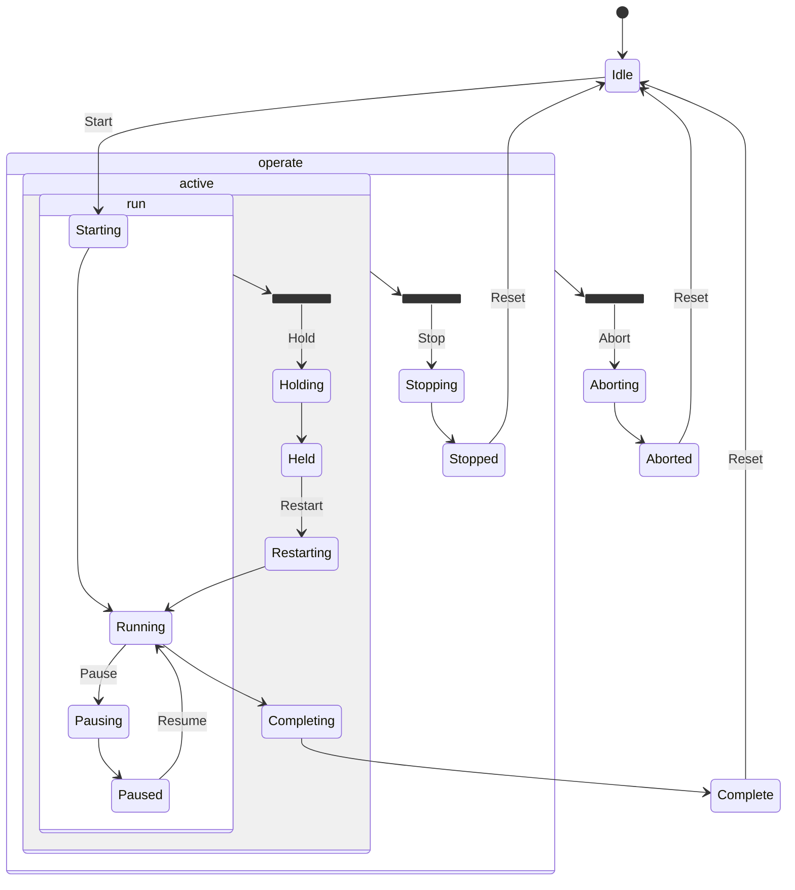

Fig. 1. Proposed state machine for procedures in the framework.

Intermediate states are used for synchronizing SCADA/HMI with the PLC, and also between subsystems (e.g., functions synchronized across different PLCs). They also allow transition logging in journals and databases. Let us now examine this state machine in more detail.

When a procedural element is not executing, it is in the **IDLE** state. This is a passive state in which typically no control actions are performed. Upon system initialization, the procedural element enters this initial state. Normal execution involves the sequential transition through the following states:

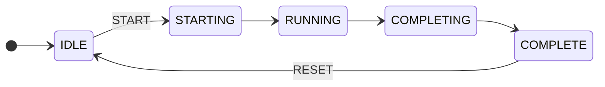

The procedure is started by the **START** command, instructing the procedural element to begin executing the **RUNNING** logic. This command is valid only when the procedural element is in the **IDLE** state. However, before transitioning to the RUNNING state, the framework introduces an intermediate **STARTING** state, where preparatory actions can be performed. After completing these actions, the procedure transitions to **COMPLETING** (a state not originally defined in ISA-88). Upon completing the finalization logic, it transitions to **COMPLETE**. This state is necessary so that before the next execution, the procedural element receives a **RESET** command, confirming completion by the higher-level system.

Note that only two transitions are triggered by external commands to the procedural element; the rest occur based on internal logic of the procedural element or higher-level procedural elements (e.g., transition conditions in PFC). The sequence of states in normal transitions:

- **IDLE**: Passive state, waiting for **START** to transition to **STARTING**.
- **STARTING**: Executes startup/preparatory actions, then transitions to **RUNNING** upon completion.
- **RUNNING**: Executes the main process control logic, transitioning to **COMPLETING** upon an internal completion condition.
- **COMPLETING**: Executes completion logic, then transitions to **COMPLETE** upon an internal condition.
- **COMPLETE**: Awaits a **RESET** command to transition to **IDLE**.

For short-term issues requiring special handling (e.g., temporary material shortage), the procedural element may enter the **PAUSED** state. The standard and the framework provide an intermediate **PAUSING** state, entered upon the **PAUSE** command, followed by an internal transition to **PAUSED**. Exiting **PAUSED** to **RUNNING** occurs via the **RESUME** command.

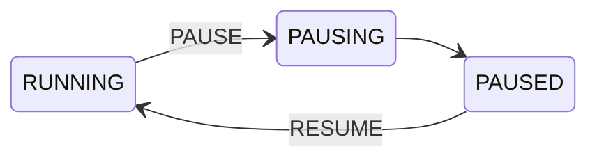

According to the standard:

- **PAUSING**: On receiving the **PAUSE** command, the procedural element halts at the next designated safe or stable point, then transitions to **PAUSED**.
- **PAUSED**: Used for short-term stops; **RESUME** transitions back to **RUNNING**, continuing immediately after the pause point.

Unlike pause, the **HELD** state is for long-term stops (e.g., storage of material before further processing). Transition to **HOLDING** occurs from any state in the `run` group upon the **HOLD** command, then proceeds to **HELD**. Exiting **HELD** occurs via **RESTART** through **RESTARTING**, which transitions back to **RUNNING**.

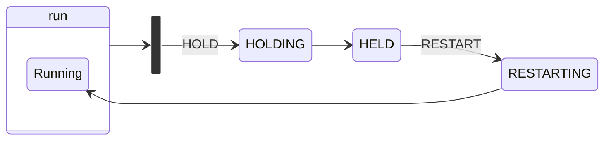

According to the standard:

- **HOLDING**: Executes logic to transition the element to a required state. If no actions are required, transitions immediately to **HELD**.
- **HELD**: Waits for further commands, typically used for long-term holds.
- **RESTARTING**: On **RESTART**, executes restart logic to return to **RUNNING**.

The **STOP** command’s use is ambiguous in the standard but in the PACFramework is intended for **abnormal stops only**. For normal stops, a higher-level command transitions from **RUNNING** to **COMPLETING**, considered an internal condition by the standard. A fragment is shown below:

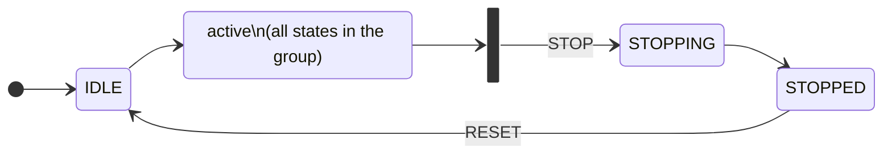

From any `active` state, the **STOP** command transitions to **STOPPING**, performing the abnormal stop logic, then to **STOPPED**, which awaits **RESET** to transition back to **IDLE**.

The standard defines:

- **STOPPING**: Executes controlled stop logic; if none is needed, transitions immediately to **STOPPED**.
- **STOPPED**: Awaits **RESET** to transition to **IDLE**.

For fast interruptions, the **ABORT** command forces a transition from any `operate` state without waiting for completion conditions, acting as an emergency exit (e.g., valve limit switch failure). The standard provides an **ABORTING** state for quick actions before transitioning to **ABORTED**, which, like **COMPLETE** and **STOPPED**, requires a **RESET** before restarting.

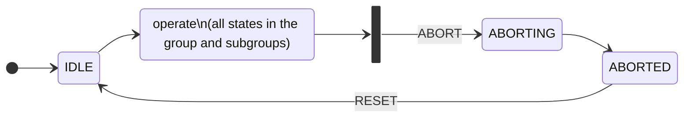

According to the standard:

- **ABORTING**: Executes fast shutdown logic on **ABORT**; transitions immediately to **ABORTED** if none is required.
- **ABORTED**: Awaits **RESET** to transition back to **IDLE**.

According to the standard, command functions are:

- **START**: Starts normal execution (**RUNNING**) from **IDLE**.
- **STOP**: Initiates **STOPPING** from **RUNNING**, **PAUSING**, **PAUSED**, **HOLDING**, **HELD**, or **RESTARTING**.
- **HOLD**: Initiates **HOLDING** from **RUNNING**, **PAUSING**, **PAUSED**, or **RESTARTING**.
- **RESTART**: Initiates **RESTARTING** from **HELD**.
- **ABORT**: Initiates **ABORTING** from any state except **IDLE**, **COMPLETE**, **ABORTING**, and **ABORTED**.
- **RESET**: Transitions to **IDLE** from **COMPLETE**, **ABORTED**, or **STOPPED**.
- **PAUSE**: Initiates pause logic from **RUNNING**, awaiting **RESUME**.
- **RESUME**: Resumes execution from **PAUSED**.

### Variables in the framework associated with a procedural element

Several variables of different types are associated with a procedural element:

- The structure `PROC_CFG` is used to store typical configurable procedure data, control, and management from the PLC program. It may also be used for buffered exchange with SCADA/HMI.
- The structure `PROC_HMI` is used for monitoring/controlling the procedure state from the HMI.
- The structure `PROC_CTRL` is used for controlling and managing the procedure within the PLC program from the same or higher-level procedures.
- A parameter variable that configures and controls process parameters for a specific procedural element, linked to the recipe.
- Input/output variables that serve as inputs and outputs for the procedure (typically various CM signals).

These variables are described in more detail below.

### State representation in the framework (STEP1)

All states described above are represented in the framework by several variables:

- `PROC_CFG.STEP1` – a step-based state representation, the main storage location. It is controlled by the state machine in the `PROC_MACH` engine (described below).
- Fields in `PROC_CTRL` with the `STA` prefix – mirror `PROC_CFG.STEP1` for convenient use. They are modified in the `PROC_MACH` engine and are read-only elsewhere.
- `PROC_HMI.STEP1` – a copy of `PROC_CFG.STEP1`, available as read-only in the HMI.

The table below lists these states and additional state aggregations for convenience in algorithm implementation.

| Field name in `PROC_CTRL` | STEP1 value | State name                                                   | Note                                                         |
| ------------------------- | ----------- | ------------------------------------------------------------ | ------------------------------------------------------------ |
|                           | 0           | initialization (not a state)                                 | in other cases, an invalid value                             |
| STA_RUNNING               | 2           | RUNNING                                                      |                                                              |
| STA_IDLE                  | 1           | IDLE                                                         |                                                              |
| STA_RESUMING              | 15          | RESUMING                                                     | For optional PAUSED -> RUNNING transitional state. Absent in the standard solution |
| STA_PAUSING               | 3           | PAUSING                                                      |                                                              |
| STA_PAUSED                | 4           | PAUSED                                                       |                                                              |
| STA_HOLDING               | 5           | HOLDING                                                      |                                                              |
| STA_HELD                  | 6           | HOLD                                                         |                                                              |
| STA_RESTARTING            | 7           | RESTARTING                                                   |                                                              |
| STA_COMPLETE              | 8           | COMPLETE                                                     |                                                              |
| STA_STOPPING              | 9           | STOPPING                                                     |                                                              |
| STA_STOPPED               | 10          | STOPPED                                                      |                                                              |
| STA_ABORTING              | 11          | ABORTING                                                     |                                                              |
| STA_ABORTED               | 12          | ABORTED                                                      |                                                              |
| STA_STARTING              | 13          | STARTING                                                     |                                                              |
| STA_COMPLETING            | 14          | COMPLETING                                                   |                                                              |
| STA_NOTWRK                | -           | any end states = STA_COMPLETE OR STA_STOPPED OR STA_ABORTED OR STA_IDLE |                                                              |
| STA_WRK                   | -           | any working states = STA_RUNNING OR STA_STARTING OR STA_COMPLETING |                                                              |

### Conditions for state transitions in the framework

Transition conditions are triggered by one or a combination of the following event types:

- A command sent from a higher-level procedural element during state changes: when the procedural element is part of another procedure and its execution involves controlling this element’s state.
- A command sent from the HMI.
- Internal logic within the procedural element.

Higher-level control commands and the triggering of transition conditions by internal logic are implemented via the `PROC_CTRL` structure variable. Commands from the HMI are transmitted via a field in the `PROC_HMI` type (i.e., `PROC_HMI.CMD`).

The following commands defined in the standard and described earlier are implemented in the framework as boolean fields in the structure variable with the `CMD_` prefix and can be sent from higher-level procedural elements. They have equivalent command codes in `PROC_HMI.CMD`. A typical framework approach for minimizing these commands (grouping) will be described later.

| Command/field name in `PROC_CTRL` | Value in `PROC_HMI.CMD` | Purpose |
| --------------------------------- | ----------------------- | ------- |
| CMD_START                         | 1                       | START   |
| CMD_RESUME                        | 2                       | RESUME  |
| CMD_RESTART                       | 5                       | RESTART |
| CMD_PAUSE                         | 3                       | PAUSE   |
| CMD_HOLD                          | 6                       | HOLD    |
| CMD_STOP                          | 7                       | STOP    |
| CMD_ABORT                         | 8                       | ABORT   |
| CMD_RESET                         | 4                       | RESET   |

Other transition conditions are represented by boolean fields in the `PROC_CTRL` type variable with the `_CMPLT` suffix. All boolean fields except `HL_RUNNING_CMPLT` are triggered by the internal execution logic of the procedural element, meaning they are modified inside the procedural element.

| Field name in `PROC_CTRL` | Purpose                                                      | Transition             |
| ------------------------- | ------------------------------------------------------------ | ---------------------- |
| STARTING_CMPLT            | condition for transitioning to RUNNING is met                | STARTING -> RUNNING    |
| HL_RUNNING_CMPLT          | external (high-level) completion condition triggered, must handle RUNING_CMPLT. HL (HighLevel) is needed for proper completion of a lower-level procedural element when a transition condition is triggered in the higher-level procedure. | RUNNING -> COMPLETING  |
| RUNING_CMPLT              | procedure completed (internal completion condition triggered) | RUNNING -> COMPLETING  |
| COMPLETING_CMPLT          | condition for transitioning to COMPLETE is met               | COMPLETING -> COMPLETE |
| PAUSING_CMPLT             | condition for transitioning to PAUSED is met                 | PAUSING -> PAUSED      |
| RESTARTING_CMPLT          | condition for transitioning to RUNNING from HOLD is met      | RESTARTING -> RUNNING  |
| RESUMING_CMPLT            | condition for transitioning to RUNNING from RESUMING is met; needed only if RESUMING state is used. Not used in the standard framework version. | RESUMING -> RUNNING    |
| HOLDING_CMPLT             | condition for transitioning to HOLD from RUNNING is met      | HOLDING -> RUNNING     |
| STOPPING_CMPLT            | condition for transitioning to STOPPED is met                | STOPPING -> STOPPED    |
| ABORTING_CMPLT            | condition for transitioning to ABORTED is met                | ABORTING -> ABORTED    |

The `RUNING_CMPLT` bit is used to form the internal procedure completion condition. When creating a recipe procedure in PFC, this forms an implicit transition. For the state machine engine function `PROC_MACH`, this acts as an external signal since it is set in the procedural element’s main logic.

The `HL_RUNNING_CMPLT` bit is used to form the external procedure completion condition. It is an external command from higher-level control, such as a recipe procedure, and can define an explicit transition. In `PROC_MACH` logic, this bit is not used directly but is processed within the procedure logic, which then sets `RUNING_CMPLT`. An example will be provided in the next subsection.

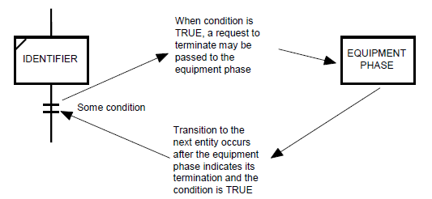

### PROC_CTRL.ENBL and PROC_CTRL.DSBL_COMPLETE

The `PROC_CTRL.ENBL` bit allows blocking the procedure start (from IDLE to Starting) under certain conditions. This bit can be set either by the procedure’s own logic or by higher-level control logic, including via basic functions. The procedure’s state machine engine will not react to the `CMD_START` command if `PROC_CTRL.ENBL=FALSE`, and all HMI commands will also be ignored.

The `PROC_CTRL.DSBL_COMPLETE` bit can be used to hold the procedure in the `RUNNING` state even if the `RUNING_CMPLT` bit is set to 1. This is necessary if the transition should occur only when `RUNING_CMPLT=TRUE AND PROC_CTRL.DSBL_COMPLETE=FALSE`. This bit is not standard in the framework and is added when needed.

The `STA_NOTWRK` and `STA_WRK` bits simplify procedure monitoring and are used in logic.

| PROC_CTRL attribute | STA bit | Description                                                  | Note                          |
| ------------------- | ------- | ------------------------------------------------------------ | ----------------------------- |
| ENBL                | 14      | permission to activate the procedure                         | read-only in HMI              |
| DSBL_COMPLETE       | -       | disable completion (e.g., when waiting for a condition from a higher-level procedure) | not standard in the framework |

### Steps (STEP) and step times (T_STEP)

The structured variables `PROC_CFG` and `PROC_HMI` contain fields for steps and step times.

STEP1, described above, indicates the procedural element’s state. STEP2, by contrast, is the procedural element’s step number. For easier debugging, steps are numbered consecutively across all states, allowing the state to be identified by the step number.

T_STEP1 indicates the time spent in the RUNNING state in ms. In all other intermediate and final states, time is not counted. It resets to 0 upon transition to IDLE and HOLDING.

T_STEP2 indicates the step execution time in ms across all states except IDLE, where it is 0.

| Field   | Type  | Purpose                        | Note                                                         |
| ------- | ----- | ------------------------------ | ------------------------------------------------------------ |
| STEP1   | INT   | main state value               |                                                              |
| STEP2   | INT   | step within the state          | step numbering across states with a granularity of 1000 (15 states = 1000–15000) |
| T_STEP1 | UDINT | procedure execution time in ms | counted only in RUNNING, typically frozen in PAUSED, reset in HOLDING |
| T_STEP2 | UDINT | step execution time in ms      | equals 0 in IDLE                                             |

If multiple parallel steps need to be executed, it is recommended to create separate procedural elements to run in parallel, as the framework does not provide other options.

### Control and monitoring from HMI and modes

#### Appearance

All states, modes, and alarms are visible in the respective control window, where control commands are also available.

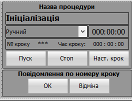

States are highlighted with color (or white shades) and corresponding state text, along with state time.

For steps, the step number, text, and step time are displayed. Each step number is expected to have its own text message displayed on the screen. For automated deployment utilities, it is recommended that these messages be recorded as comments next to the step numbers in the `CASE` structure.

Control buttons execute commands and are shown or hidden depending on modes and states.

#### HMI commands

Control provides the following buttons:

- `START` – executes several commands depending on the state (command aggregation):
  - CMD_START
  - CMD_RESTART
  - CMD_RESET
  - CMD_RESUME
- `STOP` – executes CMD_STOP
- `PAUSE` (if required) – executes CMD_PAUSE
- `HOLD` (if required) – executes CMD_HOLD
- `ABORT` (if required, with access restrictions) – executes CMD_ABORT

All these commands must require confirmation to prevent accidental actions.

The following commands are optional, allowing manual control of procedure execution. Their implementation depends on the project and is therefore not part of the core framework, but they are listed, with some functionality implemented (notably in `PROC_TRANS_A` and `PROC_TRANS_M` functions):

- `Next step` (CMD_NEXT) – transitions to the next step without waiting for completion conditions. It may depend on the selected procedural element control mode.
- `OK` (CMD_OK) – confirms an action, for manual operations or confirmation of messages (step completion condition). It is intended that this button’s visibility is mode-independent and used only for manual procedures.
- `CANCEL` (CMD_CANCEL) – negative confirmation (cancellation) during manual operations. It is intended that this button’s visibility is mode-independent and used only for manual procedures.

All commands undergo a preliminary check before execution. Status bits indicating permission for execution are sent to the HMI, allowing the corresponding buttons to be deactivated if the command is not permitted.

#### Modes

The framework provides procedural element control modes according to ISA-88:

- manual (MAN)
- automatic (AUTO)
- semi-automatic (SEMI)

In automatic mode, state control from the HMI is disabled, and all state control buttons are deactivated. If the procedural element is controlled by a higher-level element, it may first switch the element to automatic mode before starting it, ensuring that it is fully controlled by the higher-level element by default.

Other mode implementation requirements are outside the current scope of PACFramework as they may be managed by external engines (procedure implementation) and can affect step transitions. This should be specified in technical requirements. For example, transitions between steps within a procedural element may operate depending on mode as follows:

1. in automatic mode – only when the condition is met,
    in manual mode – only upon sending `CMD_NEXT`,
    in semi-automatic mode – automatically or upon `CMD_NEXT`; between states upon condition AND `CMD_NEXT`
2. in automatic mode – only when the condition is met,
    in manual mode – when the condition is met OR upon `CMD_NEXT`,
    in semi-automatic mode – upon condition AND `CMD_NEXT`

Mode transitions of a procedural element should be logged in the event journal.

#### Alarms

The framework provides the following standard alarms:

- TMAXERR – maximum procedure execution time error, when T_STEP1 exceeds the maximum `PRC_CFG.TMAX`
- TMINERR – minimum execution time error, when T_STEP1 is less than the minimum `PRC_CFG.TMIN`
- STA_ALM – general alarm related to the procedural element, for time errors or other alarms (defined by the algorithm)

A specific technological alarm defined within a technological procedural element can be identified by the step number (as an implementation option), where a specific step is allocated for a particular alarm.

### State and mode bits `STA`

The main state of a procedural element is indicated by `STEP1`. However, other functional elements associated with the procedure are combined in `STA`, i.e., `PROC_CFG.STA` and `PROC_HMI.STA`.

| Bit name     | STA bit number | Purpose                                                 | Note                          |
| ------------ | -------------- | ------------------------------------------------------- | ----------------------------- |
| ENCMD_START  | 0              | =1, permission for HMI START command                    | managed by PROC_MACH engine   |
| ENCMD_PAUSE  | 1              | permission for HMI PAUSE command                        | managed by PROC_MACH engine   |
| ENCMD_RESET  | 2              | permission for HMI RESET command                        | managed by PROC_MACH engine   |
| ENCMD_HOLD   | 3              | permission for HMI HOLD command                         | managed by PROC_MACH engine   |
| ENCMD_STOP   | 4              | permission for HMI STOP command                         | managed by PROC_MACH engine   |
| ENCMD_CANCEL | 5              | permission for HMI negative confirmation (cancellation) | managed by the main algorithm |
| ENCMD_NEXT   | 6              | permission for HMI to proceed to the next step          | managed by the main algorithm |
| ENCMD_OK     | 7              | permission for HMI to confirm action                    | managed by the main algorithm |
| TMAXERR      | 8              | maximum execution time error, time exceeds maximum      |                               |
| TMINERR      | 9              | minimum execution time error, time below minimum        |                               |
| STA_ALM      | 10             | procedure error present                                 |                               |
| SEMI         | 11             | =1 semi-automatic mode                                  | AUTO = NOT MAN AND NOT SEMI   |
| INBUF        | 12             | buffer occupied                                         |                               |
| MAN          | 13             | =1, manual mode                                         | AUTO = NOT MAN AND NOT SEMI   |
| ENBL         | 14             | permission to start                                     |                               |
| CMD_BUF      | 15             | load into buffer                                        | only `PROC_HMI.STA`           |

### Organization of the procedural element function

A procedural element is implemented as a function that must be called unconditionally in the controller task. The function arguments are:

- ID – a unique identifier of the procedure (passed as input for readability and reliability)
- variables of type `PROC_CFG`
- variables of type `PROC_HMI`
- variables of type `PROC_CTRL`
- the parameter variable `PARA`
- input/output variables `IO`

The variables are described above.

To simplify the handling of typical commands and the state machine, the framework provides the `PROC_MACH` function, which performs standard operations.

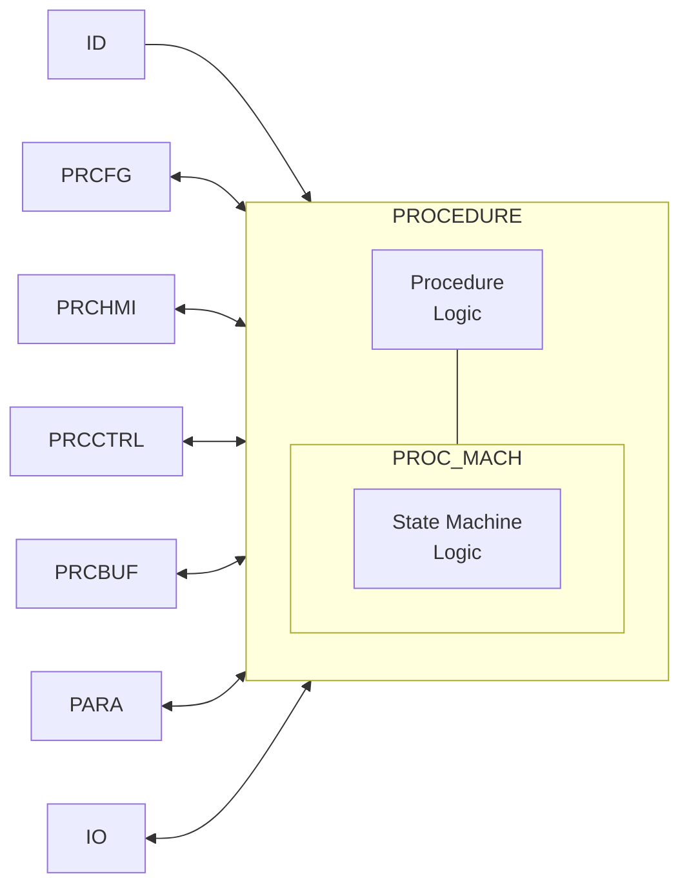

Thus, the program of any procedure includes the following parts:

- processing of procedure-specific logic
- processing of the state machine – `PROC_MACH`

### Variables

#### PROC_CFG

The main structure (type) used for storing configurable procedure data, control, and management from the PLC program. It can also be used for buffered exchange with SCADA/HMI.

### Attributes

| Attribute | Type     | Description                                                  | Note                                   |
| --------- | -------- | ------------------------------------------------------------ | -------------------------------------- |
| ID        | UINT     | identifier                                                   |                                        |
| CLSID     | UINT     | CLSID                                                        |                                        |
| STA       | UINT/INT | as described above                                           |                                        |
| CMD       | UINT/INT | Commands (numeric values below):                             |                                        |
|           |          | 1 – START (start procedure)                                  |                                        |
|           |          | 2 – RESUME (resume, continue)                                |                                        |
|           |          | 3 – PAUSE (pause)                                            |                                        |
|           |          | 4 – RESET (reset)                                            |                                        |
|           |          | 5 – RESTART (restart)                                        |                                        |
|           |          | 6 – HOLD (hold)                                              |                                        |
|           |          | 7 – STOP (stop procedure execution)                          |                                        |
|           |          | 8 – ABORT (abort)                                            |                                        |
|           |          | 9 – CMPLT (complete transition state – for debugging)        |                                        |
|           |          | 16#A..F – reserved                                           |                                        |
|           |          | 16#0100 – read configuration from buffer (256)               |                                        |
|           |          | 16#0101 – write configuration to buffer (257)                |                                        |
|           |          | 16#102 – switch to automatic mode                            |                                        |
|           |          | 16#103 – switch to manual mode                               |                                        |
|           |          | 16#104 – toggle manual mode                                  |                                        |
|           |          | 16#105 – switch to semi-automatic (program) mode             |                                        |
|           |          | 16#0200 – CMD_NEXT (HMI – move to next T_STEP2 step, skip condition); implemented in the procedure’s main program |                                        |
|           |          | 16#0300 – CMD_OK confirmation command; implemented in the procedure’s main program |                                        |
|           |          | 16#0301 – CANCEL (HMI – negative confirmation (cancel) for manual operation); implemented in the procedure’s main program |                                        |
|           |          | 2000...3000 (16#7D0 - 16#BB8) – move to the corresponding step; implemented in the procedure’s main program |                                        |
| PRM       | INT      | bit parameters (bit set described below)                     |                                        |
|           |          | X7 AMAXENBL – activate max execution time alarm              |                                        |
|           |          | X8 AMINENBL – activate min execution time alarm              |                                        |
|           |          | X9 HMIMIN – =1 display time on HMI in hours/minutes          |                                        |
| rez1      | INT      | for alignment                                                |                                        |
| STEP1     | INT      | state step                                                   |                                        |
|           |          | 0 – initialization (PLC start only)                          | pink                                   |
|           |          | 1 – Idle                                                     | transparent                            |
|           |          | 13 – Starting                                                | light gray, circle with triangle       |
|           |          | 2 – Running                                                  | white, circle with triangle            |
|           |          | 14 – Completing                                              | light gray, circle with checkmark      |
|           |          | 3 – Pausing                                                  | light yellow, circle with pause bars   |
|           |          | 4 – Paused                                                   | yellow, circle with pause bars         |
|           |          | 5 – Holding                                                  | light brown, circle with diamond       |
|           |          | 6 – Hold                                                     | brown, circle with diamond             |
|           |          | 7 – Restarting                                               | beige, circle with triangle            |
|           |          | 8 – Complete                                                 | gray, circle with checkmark            |
|           |          | 9 – Stopping                                                 | light red, square within square (stop) |
|           |          | 10 – Stopped                                                 | dark red, square within square (stop)  |
|           |          | 11 – Aborting                                                | pink, diamond                          |
|           |          | 12 – Aborted                                                 | purple, diamond with square            |
| STEP2     | INT      | step within state; step granularity across states is 1000 (15 states = 1000–15000) |                                        |
|           |          | 0 – initialization (PLC start only)                          |                                        |
|           |          | 1000 – Idle                                                  |                                        |
|           |          | 13000 – Starting                                             |                                        |
|           |          | 2000 – Running                                               |                                        |
|           |          | 14000 – Completing                                           |                                        |
|           |          | 3000 – Pausing                                               |                                        |
|           |          | 4000 – Paused                                                |                                        |
|           |          | 5000 – Holding                                               |                                        |
|           |          | 6000 – Hold                                                  |                                        |
|           |          | 7000 – Restarting                                            |                                        |
|           |          | 8000 – Complete                                              |                                        |
|           |          | 9000 – Stopping                                              |                                        |
|           |          | 10000 – Stopped                                              |                                        |
|           |          | 11000 – Aborting                                             |                                        |
|           |          | 12000 – Aborted                                              |                                        |
|           |          | - steps within states should use a granularity of 10 for inserting additional steps - each state should have a first initialization step where actions are executed once per cycle |                                        |
| T_STEP1   | UDINT    | procedure execution time (in Running) in ms                  |                                        |
| T_STEP2   | UDINT    | procedure step execution time in ms                          |                                        |
| TMIN      | UDINT    | minimum execution time limit, s                              |                                        |
| TMAX      | UDINT    | maximum execution time limit, s                              |                                        |

#### PROC_HMI

The `PROC_HMI` structure is used for monitoring and controlling the procedure state from the HMI.

| Attribute | Type     | Description                                              |
| --------- | -------- | -------------------------------------------------------- |
| STA       | UINT/INT | mirrors `PROC_CFG.STA`                                   |
| CMD       | UINT/INT | mirrors `PROC_CFG.CMD`                                   |
| STEP1     | INT      | mirrors `PROC_CFG.STEP1`                                 |
| STEP2     | INT      | mirrors `PROC_CFG.STEP2` (optional for detailed logging) |
| T_STEP1   | UDINT    | mirrors `PROC_CFG.T_STEP1`                               |
| T_STEP2   | UDINT    | mirrors `PROC_CFG.T_STEP2`                               |

#### PROC_CTRL

The `PROC_CTRL` structure is used for controlling and managing the procedure within the PLC program from the same or higher-level procedures.

| Attribute        | Type | Description                                                  |
| ---------------- | ---- | ------------------------------------------------------------ |
| ENBL             | Bool | IN permission to activate the procedure                      |
| PAUSING_CMPLT    | Bool | IN condition to transition to PAUSED is met                  |
| RUNING_CMPLT     | Bool | IN procedure has completed (internal completion condition triggered). As the standard state machine does not define this command, it is included in the framework for standard condition handling. Conditions are generated outside `PROC_MACH`. |
| HL_RUNNING_CMPLT | Bool | IN external completion condition triggered, should handle `RUNING_CMPLT`. HL (HighLevel) is needed for correct lower-level procedure completion upon triggering the transition condition. |
| RESTARTING_CMPLT | Bool | IN condition to transition from HOLD to RUNNING is met       |
| RESUMING_CMPLT   | Bool | IN condition to transition from RESUMING to RUNNING is met   |
| HOLDING_CMPLT    | Bool | IN condition to transition from RUNNING to HOLD is met       |
| STOPPING_CMPLT   | Bool | IN condition to transition to STOPPED is met                 |
| ABORTING_CMPLT   | Bool | IN condition to transition to ABORTED is met                 |
| STARTING_CMPLT   | Bool | IN condition to transition to RUNNING is met                 |
| COMPLETING_CMPLT | Bool | IN condition to transition to COMPLETE is met                |
| CMD_START        | Bool | IN program command START                                     |
| CMD_RESUME       | Bool | IN program command RESUME                                    |
| CMD_RESTART      | Bool | IN program command RESTART                                   |
| CMD_PAUSE        | Bool | IN program command PAUSE                                     |
| CMD_HOLD         | Bool | IN program command HOLD                                      |
| CMD_STOP         | Bool | IN program command STOP                                      |
| CMD_ABORT        | Bool | IN program command ABORT                                     |
| CMD_RESET        | Bool | IN program command RESET                                     |
| STA_RUNNING      | Bool | OUT state RUNNING                                            |
| STA_IDLE         | Bool | OUT state IDLE                                               |
| STA_RESUMING     | Bool | OUT state RESUMING                                           |
| STA_PAUSING      | Bool | OUT state PAUSING                                            |
| STA_PAUSED       | Bool | OUT state PAUSED                                             |
| STA_HOLDING      | Bool | OUT state HOLDING                                            |
| STA_HOLD         | Bool | OUT state HOLD                                               |
| STA_RESTARTING   | Bool | OUT state RESTARTING                                         |
| STA_COMPLETE     | Bool | OUT state COMPLETE                                           |
| STA_STOPPING     | Bool | OUT state STOPPING                                           |
| STA_STOPPED      | Bool | OUT state STOPPED                                            |
| STA_ABORTING     | Bool | OUT state ABORTING                                           |
| STA_ABORTED      | Bool | OUT state ABORTED                                            |
| STA_STARTING     | Bool | OUT state STARTING                                           |
| STA_COMPLETING   | Bool | OUT state COMPLETING                                         |
| STA_NOTWRK       | Bool | OUT any end state = STA_COMPLETE OR STA_STOPPED OR STA_ABORTED OR STA_IDLE |
| STA_WRK          | Bool | OUT any working state = STA_RUNNING OR STA_STARTING OR STA_COMPLETING |
| DSBL_COMPLETE    | Bool | IN disable completion (e.g., when waiting for a condition from a higher-level procedure) |

### Function

#### PROC_MACH

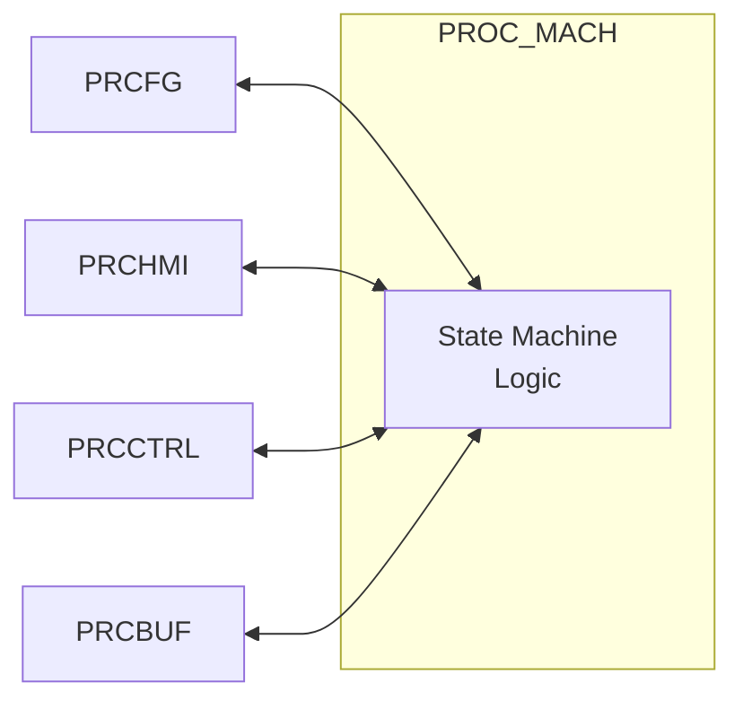

The `PROC_MACH` function performs the following tasks:

- processes the state machine, including:
  - handling commands and transitioning to the appropriate state (STEP1)
  - setting `PRCCTRL.STA_`
  - clearing all commands (commands are active for only one cycle)
- monitors and increments `T_STEP1`
- limits `STEP1`, `STEP2`, `T_STEP1`, and `T_STEP2` within the allowed range
- blocks unauthorized commands
- generates status bits for the HMI, all except ENCMD_CANCEL, ENCMD_NEXT, ENCMD_OK
- manages mode switching
- monitors alarm states for `PRCCFG.TMAX` (if active) and `PRCCFG.TMIN` (if active)
- adds the minimum and maximum execution time alarms to the general alarm state, `ALM = ALM OR PRCCFG.TMAX OR PRCCFG.TMIN`
- deactivates all control buttons in automatic mode
- manages buffer operations

The general state machine is shown in the diagram.

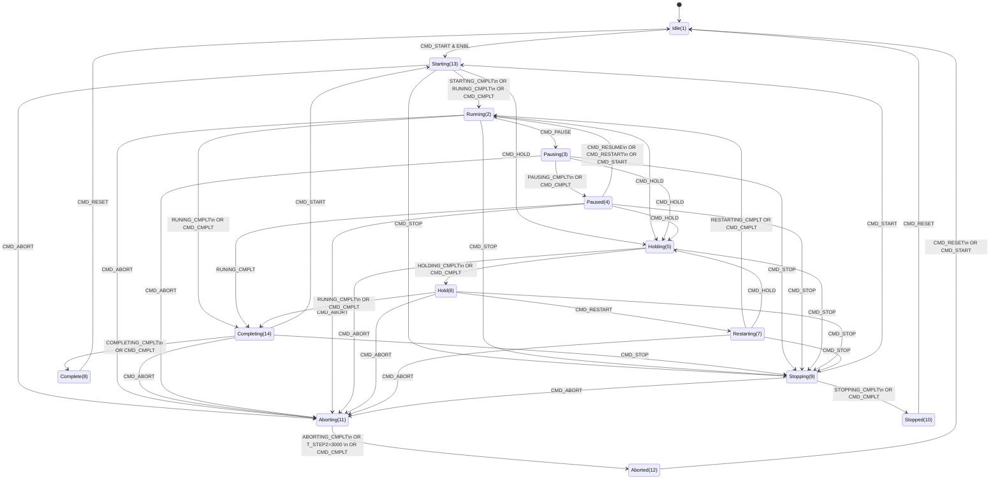

##### RUN

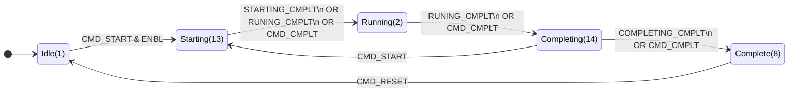

##### PAUSE

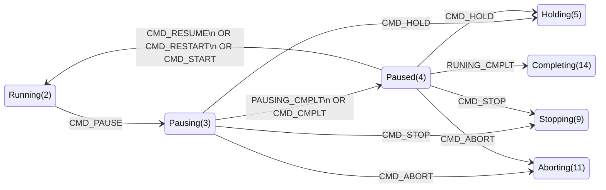

##### HOLD


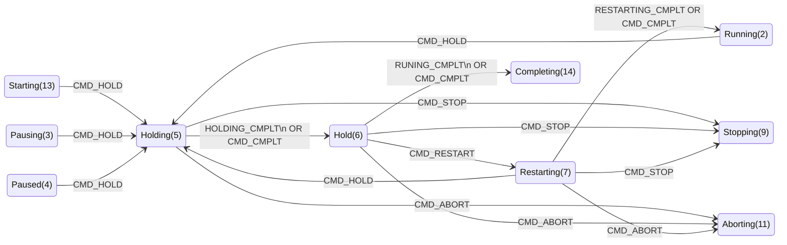

##### STOP

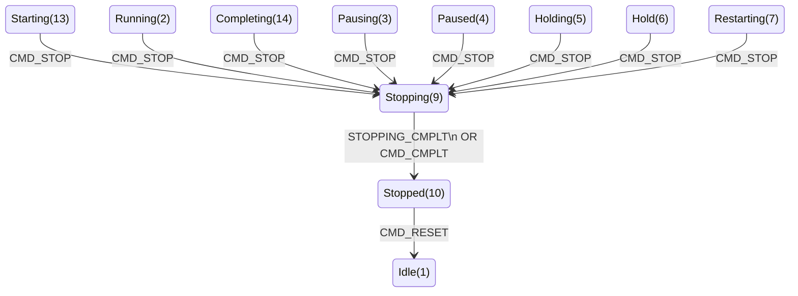


##### ABORT

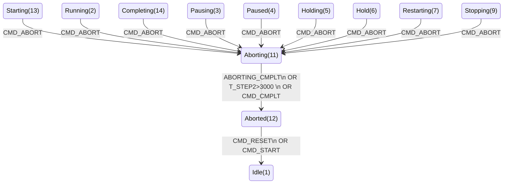

#### PROC_TRANS_A

This function performs a transition when a condition is met in automatic mode and/or upon the `CMD_NEXT` command in manual/semi-automatic mode:

- returns a logical high if the transition is triggered and moves to the step specified in the `TOSTEP` field; if `TOSTEP=1`, it is treated as the condition for state completion
- controls the visibility of the `ENCMD_NEXT` bit depending on the mode
- enables or disables the visibility of the `CMD_OK` and `CMD_CANCEL` buttons

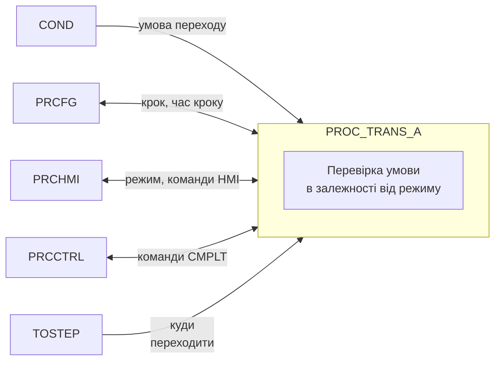

#### PROC_TRANS_M

This function performs transitions for manual procedural elements controlled by commands:

- `OK` (CMD_OK) – confirms an action: for manual operations or message confirmation commands (step completion condition). The button’s visibility is intended to be independent of the procedural element’s execution mode and used exclusively for manual procedures.
- `CANCEL` (CMD_CANCEL) – negative confirmation (cancellation) during manual operations. The button’s visibility is intended to be independent of the procedural element’s execution mode and used exclusively for manual procedures.

The function performs the following:

- enables the visibility of `CMD_OK`
- controls the visibility of `ENCMD_CANCEL` depending on `TOSTEPCANCEL` (`ENCMD_CANCEL = TOSTEPCANCEL > 0`)
- transitions to the step specified in `TOSTEPOK` when the `CMD_OK` command is sent (if `TOSTEPOK=1`, it is treated as a condition for state completion)
- transitions to the step specified in `TOSTEPCANCEL` when the `CMD_CANCEL` command is sent (if `TOSTEPCANCEL=1`, it is treated as a condition for state completion)
- disables the visibility of the `ENCMD_NEXT` bit

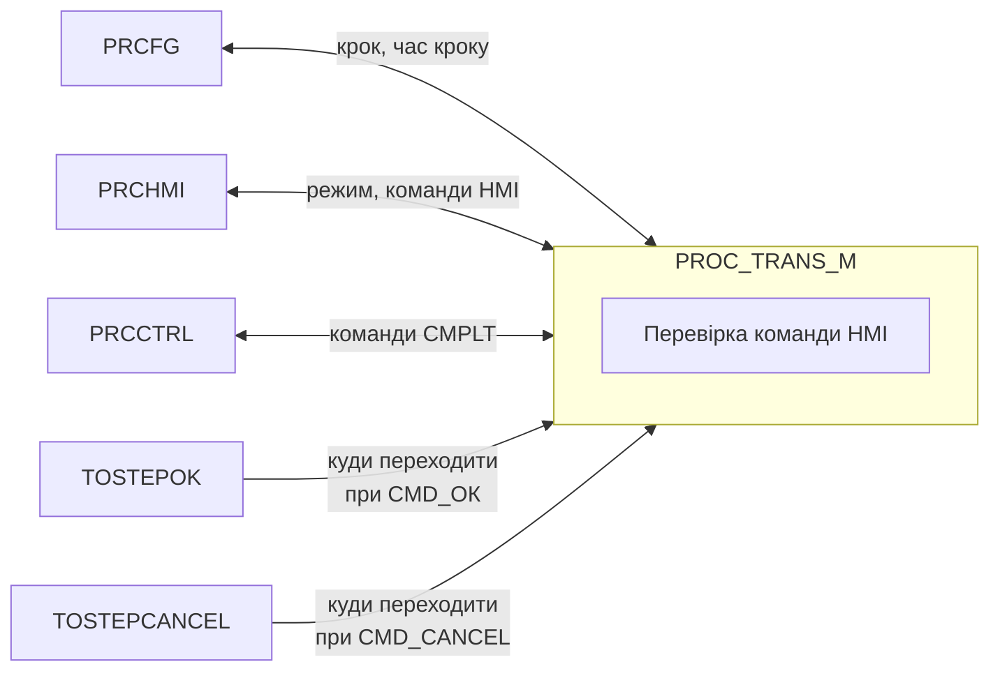

### Procedure Implementation

Below is a template example for implementing a procedure. Cross-state step addressing is used across all states, which can simplify monitoring in SCADA/HMI.

```pascal
(* set the enable condition *)
CTRL.ENBL := FALSE;

(* if logging transitions to the DB is needed, add delays at transition steps *)
(* if idle state actions are needed, they can be added inside the state *)
IF CTRL.STA_IDLE THEN
    CFG.STEP2 := 0;
END_IF;

IF CTRL.STA_STARTING THEN
    CASE CFG.STEP2 OF
        13000:
            CFG.STEP2 := 13001;
            CFG.T_STEP2 := 0;
        13001:
            CTRL.STARTING_CMPLT := TRUE; (* normal completion condition for STARTING *)
            CFG.T_STEP2 := 0;
        ELSE (* transition to RUNNING *)
            CFG.STEP2 := 13000;
            CFG.T_STEP2 := 0;
    END_CASE;
    (* allow normal phase completion even in STARTING *)
    IF CTRL.HL_RUNNING_CMPLT OR CTRL.RUNING_CMPLT THEN
        CTRL.RUNING_CMPLT := TRUE;
        CFG.STEP2 := 2000;
        CFG.T_STEP2 := 0;
    END_IF;
END_IF;

IF CTRL.STA_RUNNING THEN
    CASE CFG.STEP2 OF
        2000:
            CFG.STEP2 := 2001;
            CFG.T_STEP2 := 0;
        2001: (* main program steps *)
            ;
        ELSE
            CFG.STEP2 := 2000;
            CFG.T_STEP2 := 0;
    END_CASE;

    (* normal phase completion condition *)
    IF CTRL.HL_RUNNING_CMPLT OR CTRL.RUNING_CMPLT THEN
        CTRL.RUNING_CMPLT := TRUE;
        CFG.STEP2 := 14000;
        CFG.T_STEP2 := 0;
    END_IF;
    CTRL.RESTARTING_CMPLT := FALSE;
END_IF;

IF CTRL.STA_COMPLETING THEN
    CASE CFG.STEP2 OF
        14000:
            CFG.STEP2 := 14001;
            CFG.T_STEP2 := 0; (* initialization *)
        14001:
            CTRL.COMPLETING_CMPLT := TRUE;
            CFG.T_STEP2 := 0;
        ELSE
            CFG.STEP2 := 14000;
            CFG.T_STEP2 := 0;
    END_CASE;
END_IF;

IF CTRL.STA_COMPLETE THEN
    CASE CFG.STEP2 OF
        8000:
            CFG.STEP2 := 8001;
            CFG.T_STEP2 := 0; (* initialization *)
        8001:
            IF CFG.T_STEP2 > 5000 THEN
                CTRL.CMD_RESET := TRUE;
            END_IF;
        ELSE
            CFG.STEP2 := 8000;
            CFG.T_STEP2 := 0;
    END_CASE;
END_IF;

IF CTRL.STA_PAUSING THEN
    CASE CFG.STEP2 OF
        3000:
            CFG.STEP2 := 3001;
            CFG.T_STEP2 := 0; (* initialization *)
        3001:
            CTRL.PAUSING_CMPLT := TRUE;
            CFG.T_STEP2 := 0;
        ELSE
            CFG.STEP2 := 3000;
            CFG.T_STEP2 := 0;
    END_CASE;
END_IF;

IF CTRL.STA_PAUSED THEN
    CASE CFG.STEP2 OF
        4000:
            CFG.STEP2 := 4001;
            CFG.T_STEP2 := 0; (* initialization *)
        4001:
            ;
        ELSE
            CFG.STEP2 := 4000;
            CFG.T_STEP2 := 0;
    END_CASE;
END_IF;

IF CTRL.STA_RESTARTING THEN
    CASE CFG.STEP2 OF
        7000:
            CFG.STEP2 := 7001;
            CFG.T_STEP2 := 0; (* initialization *)
        7001:
            CTRL.RESTARTING_CMPLT := TRUE;
            CFG.T_STEP2 := 0;
        ELSE
            CFG.STEP2 := 7000;
            CFG.T_STEP2 := 0;
    END_CASE;
END_IF;

IF CTRL.STA_STOPPING THEN
    CASE CFG.STEP2 OF
        9000:
            CFG.STEP2 := 9001;
            CFG.T_STEP2 := 0; (* initialization *)
        9001:
            CTRL.STOPPING_CMPLT := TRUE;
            CFG.T_STEP2 := 0;
        ELSE
            CFG.STEP2 := 9000;
            CFG.T_STEP2 := 0;
    END_CASE;
END_IF;

IF CTRL.STA_STOPPED THEN
    CASE CFG.STEP2 OF
        10000:
            CFG.STEP2 := 10001;
            CFG.T_STEP2 := 0; (* initialization *)
        10001:
            IF CFG.T_STEP2 > 5000 THEN
                CTRL.CMD_RESET := TRUE;
            END_IF;
        ELSE
            CFG.STEP2 := 10000;
            CFG.T_STEP2 := 0;
    END_CASE;
END_IF;

IF CTRL.STA_HOLDING THEN
    CASE CFG.STEP2 OF
        5000:
            CFG.STEP2 := 5001;
            CFG.T_STEP2 := 0; (* initialization *)
        5001:
            CTRL.HOLDING_CMPLT := TRUE;
            CFG.T_STEP2 := 0;
        ELSE
            CFG.STEP2 := 5000;
            CFG.T_STEP2 := 0;
    END_CASE;
END_IF;

IF CTRL.STA_HELD THEN
    CASE CFG.STEP2 OF
        6000:
            CFG.STEP2 := 6001;
            CFG.T_STEP2 := 0; (* initialization *)
        6001:
            ;
        ELSE
            CFG.STEP2 := 6000;
            CFG.T_STEP2 := 0;
    END_CASE;
END_IF;

IF CTRL.STA_ABORTING THEN
    CASE CFG.STEP2 OF
        11000:
            CFG.STEP2 := 11001;
            CFG.T_STEP2 := 0; (* initialization *)
        11001:
            CTRL.ABORTING_CMPLT := TRUE;
            CFG.T_STEP2 := 0;
        ELSE
            CFG.STEP2 := 11000;
            CFG.T_STEP2 := 0;
    END_CASE;
END_IF;

IF CTRL.STA_ABORTED THEN
    CASE CFG.STEP2 OF
        12000:
            CFG.STEP2 := 12001;
            CFG.T_STEP2 := 0; (* initialization *)
        12001:
            IF CFG.T_STEP2 > 5000 THEN
                CTRL.CMD_RESET := TRUE;
            END_IF;
        ELSE
            CFG.STEP2 := 12000;
            CFG.T_STEP2 := 0;
    END_CASE;
END_IF;

PROC_MACH(
    ID := ID,
    PRCCFG := CFG,
    PRCHMI := HMI,
    PRCCTRL := CTRL,
    PRCBUF := PRCBUF,
    PLCCFG := PLCCFG
);

IF CFG.T_STEP2 > 16#7FFF_FFFF THEN
    CFG.T_STEP2 := 16#7FFF_FFFF;
END_IF;
```

Procedure calls are made unconditionally. For example, below is a sample call of two procedures for a single Unit:

```pascal
PH_EXMPL1 (ID := 1, (* unique procedure identifier *)
           CFG := PHCFG_EXMPL1,
           HMI := PHHMI_EXMPL1,
           CTRL := PHCTRL_EXMPL1,
           PRCBUF := PRCBUF, (* buffer variable for configuration from HMI *)
           PLCCFG := PLC,
           ... // further parameters specific to the implementation
);
```
